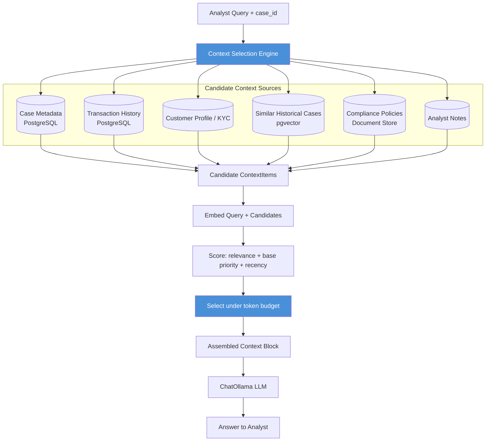

# Pattern 01 — Context Selection

[← Back to index](./README.md) | Next: Pattern 02 — Context Filtering (queued)

---

## 1. Introduce the pattern

**Context Selection** is the process of deciding *which* pieces of available context — out of a much larger pool of candidates — are even worth putting in front of the LLM for a given request.

Think of it as the first gate in a pipeline, not the only gate:

```
All possible context  →  [ SELECTION ]  →  candidate set  →  (filtering, ranking, compression...)  →  final prompt
   (huge, unbounded)                      (smaller, relevant)
```

Before you can filter, rank, compress, or prioritize context, you first need to answer a coarser question: *"Which sources are even relevant to this query, and which specific items from those sources should be candidates at all?"* Context Selection is a **recall-oriented** step — cast a reasonably wide net across relevant sources, and score items so later stages have something meaningful to work with. It is not yet about squeezing things into a token budget (that's Prioritization, Pattern 05) or about scrubbing noise (that's Filtering, Pattern 02).

**Mental model:** Context Selection is like a paralegal pulling the folders that are plausibly relevant to a case from a warehouse of millions of documents, before a senior lawyer decides which pages to actually read.

---

## 2. The problem it solves

Without deliberate context selection, production LLM systems fall into one of two failure modes:

1. **Context dumping** — every available document, log line, and note gets stuffed into the prompt "just in case." This blows the context window, dramatically increases cost and latency, and — critically — **degrades answer quality**. LLMs suffer from the well-documented "lost in the middle" effect: relevant facts buried in a sea of irrelevant text get ignored or hallucinated over.
2. **Context starvation** — engineers overcorrect and only supply the single most obvious source (e.g., "just send the current case record"), and the model quietly ignores highly relevant information sitting in a different table, service, or store that nobody thought to wire up.

Context Selection solves this by making source coverage and item relevance an explicit, scored, engineered step — not an accident of whatever happened to be easiest to fetch.

---

## 3. A realistic enterprise problem (Helios)

**Scenario:** A Helios fraud analyst opens case `CASE-88421` — a flagged $14,200 wire transfer — and asks the copilot:

> *"Why was this transaction flagged, and does this customer's recent behavior match a known fraud pattern?"*

To answer this well, the copilot potentially has access to:

- The case record itself (flag reason, risk score, transaction details)
- The customer's full transaction history (thousands of rows, going back years)
- The customer's KYC/profile data
- Prior notes from other analysts on this customer (some current, some years stale)
- A vector store of ~40,000 historical fraud case summaries
- Current compliance policy documents (dozens of PDFs, mostly irrelevant to this specific case)
- Live tool outputs (sanctions list check, device fingerprint check)

Sending *all* of this to the LLM is impossible (it would be hundreds of thousands of tokens, most of it irrelevant) and sending *only* the case record risks missing the one piece of history that actually explains the pattern — e.g., three similar wire transfers this same customer made last month, or a near-identical fraud ring case from six months ago.

Context Selection is the layer that decides: *for this specific question, on this specific case, which sources should even be queried, and which of the items they return are plausible candidates?*

---

## 4. Architecture / flow diagram



---

## 5. The complete request-to-response flow

1. **Query arrives**: analyst asks a natural-language question tied to a `case_id`.
2. **Source fan-out**: the engine queries every registered context source in parallel (case DB, transaction DB, profile store, vector store, policy store, notes store). Each source returns raw candidate items — this step favors *recall* over precision.
3. **Normalize into `ContextItem`s**: every candidate, regardless of source, is wrapped in a common structure carrying its content, source type, timestamp, and a source-level `base_priority` (e.g., the case record itself is inherently more important than an old note).
4. **Embed & score relevance**: the query and every candidate's content are embedded with a local Ollama embedding model (`nomic-embed-text`); relevance is cosine similarity between query and item vectors.
5. **Compute a final score**: relevance is blended with source priority and a recency-decay factor (a 3-year-old note matters less than a transaction from yesterday, all else equal).
6. **Select under budget**: items are sorted by final score and greedily added to the selection until the token budget for this stage is consumed.
7. **Assemble & prompt**: selected items are formatted into a labeled context block and injected into a prompt template alongside the analyst's query.
8. **LLM call**: `ChatOllama` generates the answer grounded in the selected context.
9. **Response returned** to the analyst, with the option to inspect *which* items were actually selected (crucial for auditability in a fraud/compliance setting).

---

## 6. Why this pattern is appropriate here

- **Multiple heterogeneous sources, wildly different volumes.** Transaction history alone can be thousands of rows; policies are long PDFs. Without an explicit selection layer, someone will eventually hardcode "just fetch the last 20 transactions," which quietly breaks the day a fraud pattern spans transaction #21.
- **Compliance/audit requirement.** In fraud operations, you often need to explain *why* the model said what it said. An explicit, scored selection step gives you a natural audit trail ("these 6 items, with these scores, were shown to the model") — a `context_dump` approach gives you no such trail.
- **Cost and latency control.** Fraud analysts work case queues under time pressure; a copilot that takes 20 seconds because it stuffed 80K tokens into every call is a copilot nobody uses.
- **It composes.** Selection doesn't try to also do filtering, ranking-for-order, or compression — those are separate patterns (02, 04, 05) that operate on the output of this stage. Keeping Selection focused on *recall + coarse scoring* keeps each pattern simple and testable in isolation.

**Trade-off to be aware of:** pure embedding-similarity relevance can miss context that's relevant for structural reasons rather than semantic ones (e.g., "the case record for this exact case_id" is always relevant, regardless of similarity score). That's why `base_priority` exists as a source-level floor — Pattern 05 (Prioritization) will build on this further.

---

## 7. Production-quality Python implementation

```python
"""
helios_context_selection.py

Pattern 01 — Context Selection
Helios Fraud Investigation Copilot

Selects a relevance-scored, budget-constrained set of context items from
multiple heterogeneous sources (case DB, transaction history, customer
profile, similar historical cases, compliance policy, analyst notes)
before handing them to an LLM.

Requirements:
    pip install "langchain-core>=0.3.60" "langchain-ollama>=0.3.0" "numpy>=1.26"

Assumes a local Ollama server (`ollama serve`) with:
    ollama pull llama3.1
    ollama pull nomic-embed-text
"""

from __future__ import annotations

import logging
from dataclasses import dataclass, field
from datetime import datetime, timedelta
from enum import Enum

import numpy as np
from langchain_core.messages import BaseMessage
from langchain_core.prompts import ChatPromptTemplate
from langchain_ollama import ChatOllama, OllamaEmbeddings

logging.basicConfig(level=logging.INFO, format="%(asctime)s | %(levelname)s | %(message)s")
logger = logging.getLogger("helios.context_selection")


# --------------------------------------------------------------------------- #
# Domain model
# --------------------------------------------------------------------------- #

class ContextSourceType(str, Enum):
    CASE_METADATA = "case_metadata"
    TRANSACTION_HISTORY = "transaction_history"
    CUSTOMER_PROFILE = "customer_profile"
    SIMILAR_CASES = "similar_cases"
    COMPLIANCE_POLICY = "compliance_policy"
    ANALYST_NOTES = "analyst_notes"


# Source-level base priority: how important is this source type "by default",
# independent of query relevance. The case record itself is structurally
# critical; a compliance policy is only useful if it happens to be relevant.
SOURCE_BASE_PRIORITY: dict[ContextSourceType, float] = {
    ContextSourceType.CASE_METADATA: 1.0,
    ContextSourceType.TRANSACTION_HISTORY: 0.75,
    ContextSourceType.CUSTOMER_PROFILE: 0.65,
    ContextSourceType.SIMILAR_CASES: 0.55,
    ContextSourceType.ANALYST_NOTES: 0.5,
    ContextSourceType.COMPLIANCE_POLICY: 0.4,
}


def estimate_tokens(text: str) -> int:
    """Cheap, dependency-free token estimate (~4 chars/token for English)."""
    return max(1, len(text) // 4)


def recency_weight(ts: datetime, half_life_days: float = 45.0, now: datetime | None = None) -> float:
    """Exponential decay: recent items score close to 1.0, old items decay toward 0."""
    now = now or datetime.utcnow()
    age_days = max(0.0, (now - ts).total_seconds() / 86400)
    return 0.5 ** (age_days / half_life_days)


def cosine_similarity(a: np.ndarray, b: np.ndarray) -> float:
    denom = (np.linalg.norm(a) * np.linalg.norm(b)) + 1e-8
    return float(np.dot(a, b) / denom)


@dataclass
class ContextItem:
    source: ContextSourceType
    content: str
    timestamp: datetime
    item_id: str
    relevance_score: float = 0.0
    token_count: int = field(default=0)

    def __post_init__(self) -> None:
        if self.token_count == 0:
            self.token_count = estimate_tokens(self.content)

    @property
    def base_priority(self) -> float:
        return SOURCE_BASE_PRIORITY[self.source]

    def final_score(self, now: datetime | None = None) -> float:
        """Blend semantic relevance, source importance, and recency."""
        recency = recency_weight(self.timestamp, now=now)
        return (0.55 * self.relevance_score) + (0.30 * self.base_priority) + (0.15 * recency)


# --------------------------------------------------------------------------- #
# Context Selector
# --------------------------------------------------------------------------- #

class ContextSelector:
    """
    Scores candidate ContextItems against a query using embedding similarity,
    blends in source priority + recency, then greedily selects items under a
    hard token budget (highest score first).
    """

    def __init__(self, embed_model: str = "nomic-embed-text", token_budget: int = 3000) -> None:
        self.embeddings = OllamaEmbeddings(model=embed_model)
        self.token_budget = token_budget

    def _score_relevance(self, query: str, items: list[ContextItem]) -> None:
        if not items:
            return
        query_vec = np.array(self.embeddings.embed_query(query))
        doc_vecs = self.embeddings.embed_documents([item.content for item in items])
        for item, vec in zip(items, doc_vecs):
            item.relevance_score = cosine_similarity(query_vec, np.array(vec))

    def select(
        self,
        query: str,
        candidates: list[ContextItem],
        *,
        force_include: set[str] | None = None,
    ) -> list[ContextItem]:
        """
        Returns the subset of `candidates` to carry forward, sorted by
        descending final_score, constrained to self.token_budget.

        `force_include` is a set of item_ids that are always kept regardless
        of score (e.g., the case record for the case currently being
        investigated) — this is the "structural relevance" escape hatch
        mentioned in section 6 above.
        """
        if not candidates:
            logger.warning("No candidate context items supplied.")
            return []

        force_include = force_include or set()
        self._score_relevance(query, candidates)

        forced = [c for c in candidates if c.item_id in force_include]
        scoreable = [c for c in candidates if c.item_id not in force_include]
        ranked = sorted(scoreable, key=lambda i: i.final_score(), reverse=True)

        selected: list[ContextItem] = []
        budget_used = 0

        for item in forced:
            selected.append(item)
            budget_used += item.token_count

        for item in ranked:
            if budget_used + item.token_count > self.token_budget:
                continue
            selected.append(item)
            budget_used += item.token_count

        logger.info(
            "Selected %d/%d candidates | %d/%d tokens used",
            len(selected), len(candidates), budget_used, self.token_budget,
        )
        return sorted(selected, key=lambda i: i.final_score(), reverse=True)


# --------------------------------------------------------------------------- #
# Mock source fan-out (in production: real DB / vector store / API calls)
# --------------------------------------------------------------------------- #

def fetch_case_metadata(case_id: str) -> list[ContextItem]:
    return [
        ContextItem(
            source=ContextSourceType.CASE_METADATA,
            content=(
                f"Case {case_id}: Wire transfer of $14,200 from customer ACC-55210 to "
                "external beneficiary in a jurisdiction flagged as high-risk. "
                "Flag reason: transaction amount 6.8x above customer's 90-day average, "
                "combined with a new beneficiary added 40 minutes before the transfer."
            ),
            timestamp=datetime.utcnow() - timedelta(hours=2),
            item_id=f"{case_id}-meta",
        )
    ]


def fetch_transaction_history(customer_id: str) -> list[ContextItem]:
    raw = [
        ("2 days ago", "Wire transfer $1,200 to existing, verified domestic beneficiary."),
        ("18 days ago", "Wire transfer $9,800 to a newly added beneficiary in the same high-risk jurisdiction as CASE-88421 — flagged, later cleared after manual review."),
        ("40 days ago", "ATM withdrawal $400, home branch, ordinary pattern."),
        ("95 days ago", "Wire transfer $2,000, existing domestic beneficiary."),
    ]
    now = datetime.utcnow()
    return [
        ContextItem(
            source=ContextSourceType.TRANSACTION_HISTORY,
            content=f"Customer {customer_id} — {age} — {desc}",
            timestamp=now - timedelta(days=int(age.split()[0])) if age.split()[0].isdigit() else now,
            item_id=f"{customer_id}-txn-{i}",
        )
        for i, (age, desc) in enumerate(raw)
    ]


def fetch_customer_profile(customer_id: str) -> list[ContextItem]:
    return [
        ContextItem(
            source=ContextSourceType.CUSTOMER_PROFILE,
            content=(
                f"Customer {customer_id}: retail banking customer for 6 years, "
                "no prior confirmed fraud, KYC tier standard, recently updated "
                "contact phone number 12 days ago."
            ),
            timestamp=datetime.utcnow() - timedelta(days=12),
            item_id=f"{customer_id}-profile",
        )
    ]


def fetch_similar_historical_cases() -> list[ContextItem]:
    return [
        ContextItem(
            source=ContextSourceType.SIMILAR_CASES,
            content=(
                "CASE-71190 (5 months ago): confirmed account-takeover fraud. Pattern: "
                "new beneficiary added shortly before an outsized wire transfer to the "
                "same high-risk jurisdiction; phone number on file had also been changed "
                "days earlier. Funds were recovered after 48-hour hold."
            ),
            timestamp=datetime.utcnow() - timedelta(days=150),
            item_id="similar-71190",
        ),
        ContextItem(
            source=ContextSourceType.SIMILAR_CASES,
            content=(
                "CASE-52011 (11 months ago): false positive. Large wire was a legitimate "
                "property purchase; customer had pre-notified the branch."
            ),
            timestamp=datetime.utcnow() - timedelta(days=330),
            item_id="similar-52011",
        ),
    ]


def fetch_compliance_policies() -> list[ContextItem]:
    return [
        ContextItem(
            source=ContextSourceType.COMPLIANCE_POLICY,
            content=(
                "Policy FR-14: Wire transfers exceeding 5x a customer's 90-day rolling "
                "average, combined with a beneficiary added within 24 hours prior, "
                "require a mandatory 48-hour hold and secondary analyst review before release."
            ),
            timestamp=datetime.utcnow() - timedelta(days=60),
            item_id="policy-fr14",
        ),
        ContextItem(
            source=ContextSourceType.COMPLIANCE_POLICY,
            content="Policy HR-02: Employee expense reimbursements over $500 require director approval.",
            timestamp=datetime.utcnow() - timedelta(days=200),
            item_id="policy-hr02",
        ),
    ]


def fetch_analyst_notes(customer_id: str) -> list[ContextItem]:
    return [
        ContextItem(
            source=ContextSourceType.ANALYST_NOTES,
            content=(
                f"Note on {customer_id}, 18 days ago: reviewed prior high-risk-jurisdiction "
                "wire, customer confirmed intent by phone, cleared as legitimate business payment."
            ),
            timestamp=datetime.utcnow() - timedelta(days=18),
            item_id=f"{customer_id}-note-1",
        )
    ]


def gather_all_candidates(case_id: str, customer_id: str) -> list[ContextItem]:
    """Fan out to every registered source. In production this runs concurrently
    (e.g. asyncio.gather over async DB/API clients) rather than sequentially."""
    candidates: list[ContextItem] = []
    candidates += fetch_case_metadata(case_id)
    candidates += fetch_transaction_history(customer_id)
    candidates += fetch_customer_profile(customer_id)
    candidates += fetch_similar_historical_cases()
    candidates += fetch_compliance_policies()
    candidates += fetch_analyst_notes(customer_id)
    return candidates


# --------------------------------------------------------------------------- #
# Pipeline: selection -> prompt assembly -> LLM call
# --------------------------------------------------------------------------- #

SYSTEM_PROMPT = """You are the Helios Fraud Investigation Copilot. You help fraud analysts
understand why a transaction was flagged and whether it matches known fraud patterns.

Rules:
- Base your answer ONLY on the CONTEXT provided below. Do not invent facts.
- Cite which context item (by its bracketed source tag) supports each claim.
- If the context is insufficient to answer confidently, say so explicitly.
- Be concise and analyst-facing: assume the reader is a trained fraud analyst, not a customer."""


class HeliosContextSelectionPipeline:
    def __init__(self, llm_model: str = "llama3.1", token_budget: int = 3000) -> None:
        self.llm = ChatOllama(model=llm_model, temperature=0.1)
        self.selector = ContextSelector(token_budget=token_budget)
        self.prompt = ChatPromptTemplate.from_messages(
            [
                ("system", SYSTEM_PROMPT),
                ("human", "Analyst question: {query}\n\n--- SELECTED CONTEXT ---\n{context}"),
            ]
        )

    @staticmethod
    def _format_context(items: list[ContextItem]) -> str:
        lines = []
        for item in items:
            lines.append(f"[{item.source.value} | score={item.final_score():.2f}] {item.content}")
        return "\n\n".join(lines)

    def run(self, query: str, case_id: str, customer_id: str) -> dict:
        candidates = gather_all_candidates(case_id, customer_id)
        selected = self.selector.select(
            query,
            candidates,
            force_include={f"{case_id}-meta"},  # the case record is always structurally relevant
        )
        context_block = self._format_context(selected)

        chain = self.prompt | self.llm
        response: BaseMessage = chain.invoke({"query": query, "context": context_block})

        return {
            "answer": response.content,
            "selected_items": [(i.source.value, i.item_id, round(i.final_score(), 3)) for i in selected],
            "candidates_considered": len(candidates),
            "candidates_selected": len(selected),
        }


# --------------------------------------------------------------------------- #
# Example run
# --------------------------------------------------------------------------- #

if __name__ == "__main__":
    pipeline = HeliosContextSelectionPipeline(token_budget=3000)

    result = pipeline.run(
        query="Why was this transaction flagged, and does this customer's recent behavior match a known fraud pattern?",
        case_id="CASE-88421",
        customer_id="ACC-55210",
    )

    print("\n=== SELECTED CONTEXT (source, item_id, final_score) ===")
    for source, item_id, score in result["selected_items"]:
        print(f"  {source:<22} {item_id:<20} {score}")

    print(f"\nConsidered {result['candidates_considered']} candidates, "
          f"selected {result['candidates_selected']} under budget.\n")

    print("=== COPILOT ANSWER ===")
    print(result["answer"])
```

### Notes on running this yourself

- Swap `llama3.1` / `nomic-embed-text` for any other Ollama-hosted models — the pipeline is model-agnostic.
- `force_include` is the pragmatic fix for the trade-off called out in section 6: some context (like "the record for the exact case being investigated") should never be at the mercy of a similarity score.
- In a real Helios deployment, `gather_all_candidates` would be `async` and hit Postgres, pgvector, and internal APIs concurrently via `asyncio.gather`, with per-source timeouts so one slow source doesn't stall the whole selection step.
- The printed `final_score` per item gives you the audit trail mentioned earlier — this is what you'd log for compliance review of "what did the model see when it answered this."

---

**Next up:** Pattern 02 — Context Filtering, where we take the selected set from this pattern and strip out noise, redundant phrasing, and sensitive data that shouldn't reach the model or the analyst-facing log.
