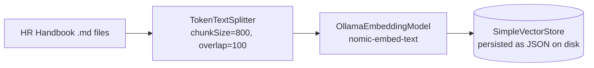
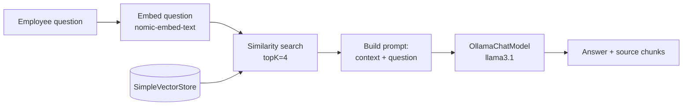

# Pattern 1: Basic RAG

[← Back to index](README.md)

## 1. What is Basic RAG?

Retrieval-Augmented Generation (RAG) is a technique where, instead of asking an LLM to
answer purely from what it memorized during training, you first **fetch relevant
information from your own data**, and then hand that information to the LLM along with
the question. The LLM's job shrinks from "know everything" to "read this and answer."

**Basic RAG** is the simplest possible version of this idea:

1. Take a pile of documents.
2. Chop them into small chunks and store each chunk's meaning as a vector (embedding).
3. When a question comes in, embed the question too, and find the chunks whose vectors
   are closest to it (i.e. "most similar in meaning").
4. Stuff those chunks into the LLM's prompt as context.
5. Ask the LLM to answer *using only that context*.

That's it — one retrieval step, one generation step, no loops, no re-ranking, no query
rewriting. It's the "hello world" of RAG, and almost every other pattern in this series
is a refinement or extension of this basic loop.

## 2. What problem does it solve?

LLMs have three structural weaknesses that Basic RAG directly addresses:

- **Stale knowledge.** A model trained months ago has no idea about your company's
  policy that changed last week, or a product that launched yesterday.
- **No access to private data.** A general-purpose model was never trained on your
  internal HR handbook, your contracts, or your internal wiki — it simply can't know
  facts it never saw.
- **Hallucination under uncertainty.** When an LLM doesn't know something, it tends to
  confidently make something up rather than say "I don't know."

Basic RAG solves all three by grounding every answer in retrieved, verifiable text: the
model isn't guessing from memory, it's reading a document you handed it seconds ago.

## 3. Realistic production scenario

**Company:** a 2,000-employee company with an internal HR knowledge base (leave policy,
expense policy, remote-work policy, parental leave, etc.) stored as text/markdown
documents.

**Problem:** Employees currently email HR with basic policy questions ("How many paid
sick days do I get?", "What's the reimbursement limit for a work laptop?"), and HR
spends hours per week answering repetitive questions that are already written down
somewhere in the handbook.

**Goal:** Build an internal **"Ask HR" assistant** that employees can query in plain
English, which answers strictly based on the official handbook — not from the model's
general/pretrained knowledge of "typical" HR policy.

This is a perfect Basic-RAG use case: a bounded set of documents, factual lookup
questions, and a strong requirement for answers to be traceable back to a source.

## 4. Architecture / flow diagram

**Indexing time** (done once, or whenever the handbook changes):



**Query time** (every time an employee asks a question):



## 5. Request-to-response walkthrough

1. **Ingestion (offline step):** The HR handbook files are loaded, split into ~800
   character chunks with 100 characters of overlap, embedded, and written to a
   `SimpleVectorStore` that is saved to disk as JSON.
2. **User asks:** *"How many paid sick days do new employees get in their first year?"*
3. **Embed the query:** The same embedding model turns this question into a vector.
4. **Similarity search:** The vector store compares that vector against every stored
   chunk vector and returns the 4 closest chunks.
5. **Prompt assembly:** A `PromptTemplate` inserts those 4 chunks as `context` and the
   original question as `question`, with an instruction to answer only from the context
   and say "I don't know" if the answer isn't there.
6. **Generation:** `ChatClient` (backed by `OllamaChatModel`) reads the prompt and
   produces a grounded answer.
7. **Response returned** to the employee, along with the source chunk text so they can
   verify it themselves.

## 6. Why this pattern is appropriate here

- The handbook is small and static enough that a single retrieval pass reliably finds
  the right section.
- Questions are typically single-fact lookups, which is exactly what similarity search
  over short chunks is good at.
- Grounding + "say I don't know" instructions directly address hallucination risk.
- It's cheap and fast: one embedding call, one vector search, one LLM call per question.

**When Basic RAG is *not* enough:** if questions span multiple documents, need
multi-step reasoning, or the corpus is large and noisy — that's when you'd reach for
Advanced RAG, Modular RAG, Hybrid Search, Re-Ranking, etc. (later patterns in this
series).

## 7. Production-quality implementation (Java / Spring AI)

**`pom.xml` additions** (on top of the series-wide baseline in the README):

```xml
<dependency>
    <groupId>org.springframework.ai</groupId>
    <artifactId>spring-ai-ollama</artifactId>
</dependency>
```

```java
package com.acme.rag.basic;

import org.springframework.ai.chat.client.ChatClient;
import org.springframework.ai.chat.prompt.PromptTemplate;
import org.springframework.ai.document.Document;
import org.springframework.ai.ollama.OllamaChatModel;
import org.springframework.ai.ollama.OllamaEmbeddingModel;
import org.springframework.ai.ollama.api.OllamaApi;
import org.springframework.ai.ollama.api.OllamaOptions;
import org.springframework.ai.transformer.splitter.TokenTextSplitter;
import org.springframework.ai.vectorstore.SearchRequest;
import org.springframework.ai.vectorstore.SimpleVectorStore;
import org.springframework.ai.vectorstore.VectorStore;

import java.io.IOException;
import java.io.UncheckedIOException;
import java.nio.file.Files;
import java.nio.file.Path;
import java.util.List;
import java.util.Map;
import java.util.stream.Collectors;

/**
 * Basic RAG -- "Ask HR" assistant.
 *
 * A minimal, production-shaped Retrieval-Augmented Generation pipeline using
 * a local Ollama model via Spring AI, with a SimpleVectorStore persisted to disk.
 *
 * Prereqs:
 *   ollama pull llama3.1
 *   ollama pull nomic-embed-text
 *   ollama serve
 */
public final class AskHrBasicRagApp {

    /** Central place for every tunable knob -- never hard-code these inline. */
    record RagConfig(
            String embeddingModel,
            String llmModel,
            double llmTemperature,
            int chunkSize,
            int chunkOverlap,
            int topK,
            Path persistPath) {

        static RagConfig defaults() {
            return new RagConfig(
                    "nomic-embed-text",
                    "llama3.1",
                    0.0,
                    800,
                    100,
                    4,
                    Path.of("./vectorstore_hr_handbook.json"));
        }
    }

    /** Owns ingestion: load -> split -> embed -> persist. */
    static final class HrHandbookIndex {

        private final RagConfig config;
        private final OllamaEmbeddingModel embeddingModel;

        HrHandbookIndex(RagConfig config, OllamaEmbeddingModel embeddingModel) {
            this.config = config;
            this.embeddingModel = embeddingModel;
        }

        /**
         * If a persisted store already exists on disk, load it (fast path, what
         * happens on every normal app startup). Otherwise ingest from sourceDir.
         */
        VectorStore buildOrLoad(Path sourceDir) {
            SimpleVectorStore store = SimpleVectorStore.builder(embeddingModel).build();

            if (Files.exists(config.persistPath())) {
                store.load(config.persistPath().toFile());
                System.out.println("Loaded existing index from " + config.persistPath());
                return store;
            }

            if (sourceDir == null) {
                throw new IllegalStateException(
                        "No existing index found and no sourceDir provided to build one.");
            }

            System.out.println("No existing index found. Ingesting documents from " + sourceDir + " ...");
            List<Document> chunks = loadAndSplit(sourceDir);
            store.add(chunks);
            store.save(config.persistPath().toFile());
            System.out.println("Indexed " + chunks.size() + " chunks from " + sourceDir);
            return store;
        }

        private List<Document> loadAndSplit(Path sourceDir) {
            List<Document> rawDocs;
            try (var files = Files.list(sourceDir)) {
                rawDocs = files
                        .filter(p -> p.toString().endsWith(".md"))
                        .sorted()
                        .map(this::readAsDocument)
                        .collect(Collectors.toList());
            } catch (IOException e) {
                throw new UncheckedIOException(e);
            }

            if (rawDocs.isEmpty()) {
                throw new IllegalStateException("No .md files found in " + sourceDir);
            }

            TokenTextSplitter splitter = new TokenTextSplitter(
                    config.chunkSize(), config.chunkOverlap(), 5, 10000, true);
            return splitter.apply(rawDocs);
        }

        private Document readAsDocument(Path path) {
            try {
                String text = Files.readString(path);
                return new Document(text, Map.of("source", path.getFileName().toString()));
            } catch (IOException e) {
                throw new UncheckedIOException(e);
            }
        }
    }

    /** Owns query time: embed question -> retrieve -> prompt -> generate. */
    static final class AskHrAssistant {

        private static final String SYSTEM_PROMPT = """
                You are the Ask HR assistant for Acme Corp. Answer the employee's question
                using ONLY the context below, which is pulled directly from the official HR
                handbook. Do not use any outside knowledge of "typical" HR policy.

                If the answer is not contained in the context, respond exactly with:
                "I don't have that information in the handbook -- please contact HR directly."

                Always be concise and cite the policy section name if it's visible in the context.

                Context:
                {context}
                """;

        private final VectorStore vectorStore;
        private final RagConfig config;
        private final ChatClient chatClient;
        private final PromptTemplate promptTemplate;

        AskHrAssistant(VectorStore vectorStore, RagConfig config, OllamaChatModel chatModel) {
            this.vectorStore = vectorStore;
            this.config = config;
            this.chatClient = ChatClient.create(chatModel);
            this.promptTemplate = new PromptTemplate(SYSTEM_PROMPT);
        }

        record AskResult(String answer, List<SourceExcerpt> sources) {}
        record SourceExcerpt(String source, String excerpt) {}

        AskResult ask(String question) {
            if (question == null || question.isBlank()) {
                throw new IllegalArgumentException("Question must not be empty.");
            }

            List<Document> retrieved;
            String answer;
            try {
                retrieved = vectorStore.similaritySearch(
                        SearchRequest.builder().query(question).topK(config.topK()).build());

                String context = formatDocs(retrieved);
                String systemMessage = promptTemplate.render(Map.of("context", context));

                answer = chatClient.prompt()
                        .system(systemMessage)
                        .user(question)
                        .call()
                        .content();
            } catch (Exception ex) {
                System.err.println("Failed to answer question: " + question + " -- " + ex);
                return new AskResult(
                        "Sorry, something went wrong answering that question. Please try again.",
                        List.of());
            }

            List<SourceExcerpt> sources = retrieved.stream()
                    .map(d -> new SourceExcerpt(
                            String.valueOf(d.getMetadata().getOrDefault("source", "unknown")),
                            d.getText().length() > 200 ? d.getText().substring(0, 200) : d.getText()))
                    .collect(Collectors.toList());

            return new AskResult(answer, sources);
        }

        private static String formatDocs(List<Document> docs) {
            return docs.stream()
                    .map(d -> "[Source: " + d.getMetadata().getOrDefault("source", "unknown") + "]\n"
                            + d.getText())
                    .collect(Collectors.joining("\n\n---\n\n"));
        }
    }

    private static void writeSampleHandbook(Path dir) throws IOException {
        Files.createDirectories(dir);
        Files.writeString(dir.resolve("leave_policy.md"), """
                ## Sick Leave Policy
                New employees accrue 6 paid sick days during their first year of employment.
                After one year, employees accrue 10 paid sick days per calendar year.

                ## Parental Leave Policy
                Employees are entitled to 16 weeks of paid parental leave after 12 months of
                continuous employment.
                """);
        Files.writeString(dir.resolve("expense_policy.md"), """
                ## Equipment Reimbursement
                Employees may be reimbursed up to $1,500 for a work laptop every 3 years,
                subject to manager approval.
                """);
    }

    public static void main(String[] args) throws IOException {
        RagConfig config = RagConfig.defaults();

        OllamaApi ollamaApi = OllamaApi.builder().baseUrl("http://localhost:11434").build();

        OllamaEmbeddingModel embeddingModel = OllamaEmbeddingModel.builder()
                .ollamaApi(ollamaApi)
                .defaultOptions(OllamaOptions.builder().model(config.embeddingModel()).build())
                .build();

        OllamaChatModel chatModel = OllamaChatModel.builder()
                .ollamaApi(ollamaApi)
                .defaultOptions(OllamaOptions.builder()
                        .model(config.llmModel())
                        .temperature(config.llmTemperature())
                        .build())
                .build();

        Path sampleDir = Path.of("./sample_hr_docs");
        writeSampleHandbook(sampleDir);

        HrHandbookIndex index = new HrHandbookIndex(config, embeddingModel);
        VectorStore store = index.buildOrLoad(sampleDir);

        AskHrAssistant assistant = new AskHrAssistant(store, config, chatModel);

        List<String> questions = List.of(
                "How many paid sick days do new employees get in their first year?",
                "What's the reimbursement limit for a work laptop?",
                "How many vacation days do I get?" // not in the handbook -> should decline
        );

        for (String q : questions) {
            AskHrAssistant.AskResult result = assistant.ask(q);
            System.out.println("\nQ: " + q);
            System.out.println("A: " + result.answer());
            for (AskHrAssistant.SourceExcerpt src : result.sources()) {
                System.out.println("   source: " + src.source() + " -> " + src.excerpt());
            }
        }
    }
}
```

### Key production details worth noting

- **Idempotent indexing:** `buildOrLoad` checks whether a persisted `SimpleVectorStore`
  JSON file already exists before re-ingesting, so restarting the app doesn't
  re-embed everything.
- **`temperature=0.0`** for the LLM — for factual policy lookups you want
  reproducibility, not creativity.
- **Explicit "I don't know" instruction** in the system prompt is the single most
  important line in this whole pipeline for hallucination control.
- **Sources returned alongside the answer** so the caller (a Slack bot, web UI, etc.)
  can show "based on: leave_policy.md" — essential for trust in an HR/compliance
  context.
- **`RagConfig` as a record** rather than scattered magic numbers, so chunk size,
  `topK`, and model names are tunable in one place.
- **In a real Spring Boot app**, `OllamaChatModel`, `OllamaEmbeddingModel`, and the
  `VectorStore` would typically be Spring-managed `@Bean`s (Spring AI's
  auto-configuration wires most of this for you from `application.yml` when you use
  the `spring-ai-starter-model-ollama` starter) rather than constructed manually in
  `main` — manual construction is used here to keep the example a single runnable
  file, matching the standalone-script style used in earlier patterns.

---
[← Back to index](README.md)
