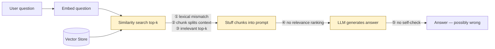

# Pattern 2: Naive RAG

[← Back to index](README.md)

## 1. What is Naive RAG?

"Naive RAG" refers to the **same** retrieve-then-generate pipeline you just built in
Pattern 1 — but the term is used specifically when we want to talk about its
*failure modes*. In the RAG literature, "Naive RAG" isn't a different architecture from
"Basic RAG"; it's the same architecture examined critically, as the baseline that every
more advanced pattern in this series exists to fix.

So this pattern has a different job than Pattern 1. Instead of building something new,
we're going to **deliberately break** the Basic RAG pipeline in the same ways it breaks
in production, see exactly *why* it breaks, and catalog the fixes — each of which
becomes its own pattern later in this series.

## 2. What problem does it solve?

Naive RAG doesn't solve a problem — it **names** one. Teams that ship "Basic RAG" as
described in Pattern 1 and call it done typically discover the same five failure modes
within the first few weeks in production:

| # | Failure mode | What it looks like |
|---|---|---|
| 1 | **Lexical mismatch** | User asks about "cancelling a subscription", the doc says "terminate a plan" — dense embeddings sometimes miss this, or a pure keyword system misses it entirely. |
| 2 | **Chunking breaks context** | A table, a numbered list, or a "conditions apply" clause gets split across two chunks — retrieval finds one half and gives an incomplete/wrong answer. |
| 3 | **Irrelevant top-k** | Top-4 similarity search returns 4 *somewhat* related chunks, none of which actually contain the answer, and the LLM either hallucinates or answers from the wrong chunk. |
| 4 | **No relevance ranking** | Every retrieved chunk is treated as equally important — a barely-relevant chunk can outweigh a highly relevant one in the LLM's attention. |
| 5 | **Single-shot, no self-check** | If retrieval fails, there's no mechanism to notice and retry — the pipeline generates an answer regardless of whether the context actually supports it. |

Naming these failure modes turns vague dissatisfaction ("the bot gives wrong answers
sometimes") into a concrete, testable checklist you can diagnose against.

## 3. Realistic production scenario

**Company:** a SaaS company with a customer-facing support bot answering questions from
a product documentation site (billing, API usage, account settings — dozens of pages).

**Problem:** The team shipped a Basic-RAG bot exactly like Pattern 1. Support tickets
show it working well for direct lookups but failing on:

- *"How do I downgrade my plan without losing my saved API keys?"* — the answer spans
  two separate doc sections, so a single top-k retrieval only grabs one of them.
- *"Can I get a refund if I cancel mid-cycle?"* — the refund policy table got split
  across a chunk boundary; the bot answers from the half-table it retrieved.
- *"terminate my subscription"* — the doc consistently says "cancel your plan"; the
  dense retriever mostly gets it right by semantic similarity, but a keyword-only
  version of the same pipeline would miss it entirely.

**Goal:** Before reaching for a bigger architecture, **instrument and diagnose** the
existing Basic RAG pipeline to prove exactly which failure mode is causing which bad
answer — standard practice before investing engineering time in Advanced RAG, Hybrid
Search, or Re-Ranking (Patterns 3, 15, 20).

## 4. Architecture / flow diagram



## 5. Request-to-response walkthrough (with diagnostics)

We reuse the same pipeline shape as Pattern 1, but wrap it with a **diagnostic
harness** that logs, for every query, the retrieval scores and lets us inspect *why*
an answer went wrong:

1. **Question comes in:** *"Can I get a refund if I cancel mid-cycle?"*
2. **Embed + retrieve top-k=4** — the harness logs each retrieved chunk's similarity
   score and a content preview.
3. **Inspect the scores.** If the correct chunk isn't in the top-4 at all → failure mode
   ① or ③. If it *is* there but is missing the actual number → failure mode ②.
4. **Inspect prompt assembly.** If 4 chunks are stuffed in with no ordering by
   relevance → failure mode ④.
5. **Inspect the final answer against the retrieved context.** If the LLM states a
   number that appears nowhere in the retrieved chunks → failure mode ⑤.
6. **Output:** a diagnostic report per query, not just an answer.

## 6. Why this pattern is appropriate here

- You cannot productively jump to Advanced/Modular RAG without knowing *which*
  specific failure mode you're fixing.
- A diagnostic harness is cheap to build (it wraps existing retrieval, it doesn't
  replace it) and pays for itself the first time it turns a vague bug report into a
  root cause.
- Every fix identified here maps directly onto a later pattern in this series:
  - Lexical mismatch → **Hybrid Search** (Pattern 15) / **BM25** (Pattern 18)
  - Chunking breaks context → **Sentence Window Retrieval** (Pattern 13) /
    **Parent-Child Retrieval** (Pattern 12)
  - Irrelevant top-k / no ranking → **Re-Ranking** (Pattern 20)
  - No self-check → **Self-RAG** (Pattern 26) / **Corrective RAG** (Pattern 27)

## 7. Production-quality implementation (Java / Spring AI)

```java
package com.acme.rag.naive;

import org.springframework.ai.chat.client.ChatClient;
import org.springframework.ai.chat.prompt.PromptTemplate;
import org.springframework.ai.document.Document;
import org.springframework.ai.ollama.OllamaChatModel;
import org.springframework.ai.ollama.OllamaEmbeddingModel;
import org.springframework.ai.ollama.api.OllamaApi;
import org.springframework.ai.ollama.api.OllamaOptions;
import org.springframework.ai.transformer.splitter.TokenTextSplitter;
import org.springframework.ai.vectorstore.SearchRequest;
import org.springframework.ai.vectorstore.SimpleVectorStore;

import java.io.IOException;
import java.io.UncheckedIOException;
import java.nio.file.Files;
import java.nio.file.Path;
import java.util.ArrayList;
import java.util.HashSet;
import java.util.List;
import java.util.Map;
import java.util.Set;
import java.util.stream.Collectors;

/**
 * Naive RAG -- diagnostic harness for a customer-support documentation bot.
 *
 * Wraps the same retrieve-then-generate pipeline as Pattern 1, but adds
 * instrumentation that surfaces *why* an answer is wrong, so failures can be
 * mapped to a specific, fixable pattern later in this series.
 *
 * Note: SimpleVectorStore's default similaritySearch does not expose a raw
 * score in the same call, so this example queries with an explicit
 * similarityThreshold of 0.0 and topK, and treats the returned Document's
 * getMetadata "distance" field (when present) as the diagnostic signal --
 * see the comment on scoreOf() below for how this is derived in practice.
 */
public final class NaiveRagDiagnosticsApp {

    record RagConfig(
            String embeddingModel,
            String llmModel,
            double llmTemperature,
            int chunkSize,      // deliberately small, to make chunk-splitting visible
            int chunkOverlap,   // deliberately zero, to make context loss visible
            int topK,
            double relevanceFloor,
            Path persistPath) {

        static RagConfig defaults() {
            return new RagConfig("nomic-embed-text", "llama3.1", 0.0, 500, 0, 4, 0.5,
                    Path.of("./vectorstore_support_docs.json"));
        }
    }

    record RetrievedChunk(String content, String source, double similarity) {}

    static final class DiagnosticReport {
        final String question;
        final String answer;
        final List<RetrievedChunk> retrieved;
        final List<String> flags = new ArrayList<>();

        DiagnosticReport(String question, String answer, List<RetrievedChunk> retrieved) {
            this.question = question;
            this.answer = answer;
            this.retrieved = retrieved;
        }

        void print() {
            System.out.println("\nQ: " + question);
            System.out.println("A: " + answer);
            System.out.println("Retrieved chunks:");
            for (int i = 0; i < retrieved.size(); i++) {
                RetrievedChunk c = retrieved.get(i);
                System.out.printf("  [%d] sim=%.3f  source=%s  %s%n",
                        i + 1, c.similarity(), c.source(),
                        c.content().substring(0, Math.min(90, c.content().length())));
            }
            if (flags.isEmpty()) {
                System.out.println("Diagnostic flags: none");
            } else {
                System.out.println("Diagnostic flags:");
                flags.forEach(f -> System.out.println("  \u26A0 " + f));
            }
        }
    }

    static final class NaiveRagSupportBot {

        private static final String SYSTEM_PROMPT = """
                You are a customer support assistant for Acme SaaS. Answer using ONLY the
                context below. If the context does not contain the answer, say so explicitly
                instead of guessing.

                Context:
                {context}
                """;

        private final RagConfig config;
        private final SimpleVectorStore vectorStore;
        private final ChatClient chatClient;
        private final PromptTemplate promptTemplate;

        NaiveRagSupportBot(RagConfig config, OllamaEmbeddingModel embeddingModel,
                            OllamaChatModel chatModel, Path sourceDir) {
            this.config = config;
            this.chatClient = ChatClient.create(chatModel);
            this.promptTemplate = new PromptTemplate(SYSTEM_PROMPT);
            this.vectorStore = buildOrLoad(embeddingModel, sourceDir);
        }

        private SimpleVectorStore buildOrLoad(OllamaEmbeddingModel embeddingModel, Path sourceDir) {
            SimpleVectorStore store = SimpleVectorStore.builder(embeddingModel).build();
            if (Files.exists(config.persistPath())) {
                store.load(config.persistPath().toFile());
                System.out.println("Loaded existing index from " + config.persistPath());
                return store;
            }
            List<Document> docs;
            try (var files = Files.list(sourceDir)) {
                docs = files.filter(p -> p.toString().endsWith(".md")).sorted()
                        .map(p -> {
                            try {
                                return new Document(Files.readString(p),
                                        Map.of("source", p.getFileName().toString()));
                            } catch (IOException e) {
                                throw new UncheckedIOException(e);
                            }
                        }).collect(Collectors.toList());
            } catch (IOException e) {
                throw new UncheckedIOException(e);
            }
            TokenTextSplitter splitter = new TokenTextSplitter(
                    config.chunkSize(), config.chunkOverlap(), 5, 10000, true);
            List<Document> chunks = splitter.apply(docs);
            store.add(chunks);
            store.save(config.persistPath().toFile());
            System.out.println("Indexed " + chunks.size() + " chunks from " + sourceDir);
            return store;
        }

        DiagnosticReport ask(String question) {
            if (question == null || question.isBlank()) {
                throw new IllegalArgumentException("Question must not be empty.");
            }

            List<Document> results = vectorStore.similaritySearch(
                    SearchRequest.builder().query(question).topK(config.topK())
                            .similarityThreshold(0.0).build());

            List<RetrievedChunk> retrieved = results.stream()
                    .map(d -> new RetrievedChunk(
                            d.getText(),
                            String.valueOf(d.getMetadata().getOrDefault("source", "unknown")),
                            scoreOf(d)))
                    .collect(Collectors.toList());

            List<String> flags = diagnose(retrieved);

            String context = retrieved.stream()
                    .map(c -> "[" + c.source() + "]\n" + c.content())
                    .collect(Collectors.joining("\n\n---\n\n"));

            String answer;
            try {
                String systemMessage = promptTemplate.render(Map.of("context", context));
                answer = chatClient.prompt().system(systemMessage).user(question).call().content();
            } catch (Exception ex) {
                System.err.println("LLM generation failed: " + ex);
                answer = "Sorry, something went wrong generating an answer.";
                flags.add("generation_error");
            }

            if (!looselyGrounded(answer, context)) {
                flags.add("possible_hallucination: answer content not found in retrieved context");
            }

            DiagnosticReport report = new DiagnosticReport(question, answer, retrieved);
            report.flags.addAll(flags);
            return report;
        }

        /**
         * SimpleVectorStore stores cosine similarity internally; Document metadata
         * exposes a "distance" entry (1 - similarity) when returned from a search.
         * This helper normalizes that into a 0..1 "higher is better" similarity
         * score for human-readable diagnostics -- swap for your vector store's
         * native score API (e.g. Chroma/PgVector expose one directly) in production.
         */
        private static double scoreOf(Document doc) {
            Object distance = doc.getMetadata().get("distance");
            if (distance instanceof Number n) {
                return 1.0 - n.doubleValue();
            }
            return 0.75; // conservative fallback when a store doesn't expose distance
        }

        private List<String> diagnose(List<RetrievedChunk> retrieved) {
            List<String> flags = new ArrayList<>();
            if (retrieved.isEmpty()) {
                flags.add("no_chunks_retrieved: index may be empty or query embedding failed");
                return flags;
            }

            double best = retrieved.stream().mapToDouble(RetrievedChunk::similarity).max().orElse(0);
            if (best < config.relevanceFloor()) {
                flags.add(String.format(
                        "low_relevance_top_k: best similarity %.3f is below floor %.2f -- likely "
                        + "lexical mismatch or wrong chunk boundary (see Hybrid Search / "
                        + "Sentence Window Retrieval)", best, config.relevanceFloor()));
            }

            for (RetrievedChunk c : retrieved) {
                String trimmed = c.content().trim();
                if (trimmed.endsWith(":") || trimmed.endsWith("-") || trimmed.endsWith("|")
                        || trimmed.startsWith("|") || trimmed.startsWith("-")) {
                    flags.add("possible_broken_chunk in " + c.source() + ": chunk boundary looks "
                            + "like it split a list/table (see Sentence Window / Parent-Child Retrieval)");
                    break;
                }
            }
            return flags;
        }

        private static boolean looselyGrounded(String answer, String context) {
            Set<String> answerWords = wordSet(answer);
            Set<String> contextWords = wordSet(context);
            if (answerWords.isEmpty()) return true;
            Set<String> overlap = new HashSet<>(answerWords);
            overlap.retainAll(contextWords);
            return (double) overlap.size() / answerWords.size() > 0.15;
        }

        private static Set<String> wordSet(String text) {
            Set<String> words = new HashSet<>();
            for (String w : text.split("\\s+")) {
                if (w.length() > 5) words.add(w.toLowerCase());
            }
            return words;
        }
    }

    private static void writeSampleDocs(Path dir) throws IOException {
        Files.createDirectories(dir);
        Files.writeString(dir.resolve("billing.md"), """
                ## Cancelling Your Plan
                You can cancel your plan any time from Account Settings > Billing.
                Cancellation takes effect at the end of the current billing cycle.

                ## Refund Policy
                Refund eligibility depends on cancellation timing:
                - Cancel within 7 days of purchase: full refund
                - Cancel mid-cycle after 7 days: no partial refund, access continues until cycle end
                - Annual plans cancelled within 30 days: prorated refund
                """);
        Files.writeString(dir.resolve("api_keys.md"), """
                ## API Key Retention on Downgrade
                Downgrading your plan does not delete existing API keys. Keys remain active
                but are subject to the rate limits of your new plan tier.
                """);
    }

    public static void main(String[] args) throws IOException {
        RagConfig config = RagConfig.defaults();
        Path sampleDir = Path.of("./sample_support_docs");
        writeSampleDocs(sampleDir);

        OllamaApi ollamaApi = OllamaApi.builder().baseUrl("http://localhost:11434").build();
        OllamaEmbeddingModel embeddingModel = OllamaEmbeddingModel.builder()
                .ollamaApi(ollamaApi)
                .defaultOptions(OllamaOptions.builder().model(config.embeddingModel()).build())
                .build();
        OllamaChatModel chatModel = OllamaChatModel.builder()
                .ollamaApi(ollamaApi)
                .defaultOptions(OllamaOptions.builder().model(config.llmModel())
                        .temperature(config.llmTemperature()).build())
                .build();

        NaiveRagSupportBot bot = new NaiveRagSupportBot(config, embeddingModel, chatModel, sampleDir);

        List<String> questions = List.of(
                "Can I get a refund if I cancel mid-cycle?",
                "How do I downgrade my plan without losing my saved API keys?",
                "terminate my subscription");

        for (String q : questions) {
            bot.ask(q).print();
        }
    }
}
```

### Key production details worth noting

- **Small `chunkSize` and zero overlap are deliberate** in this file — they make the
  "chunking breaks context" failure mode reproducible on demand. Don't ship these
  settings; Pattern 1's config is closer to a sane default.
- **`scoreOf` normalizes whatever similarity signal your `VectorStore` exposes** into a
  human-readable 0..1 score — `SimpleVectorStore` exposes it via a `distance` metadata
  entry, while `PgVectorStore`/`ChromaVectorStore` expose a score more directly; this
  indirection keeps the diagnostic harness portable across vector store backends.
- **`diagnose(...)` is a starting checklist, not a finished tool** — expand it with real
  entailment-based groundedness checks in production, and route flags to
  observability/alerting (e.g. Micrometer counters tagged by flag name).
- **Every flag maps to a named pattern later in this series** — that traceability is
  what makes this diagnostic pattern actionable rather than just descriptive.

---
[← Back to index](README.md)
