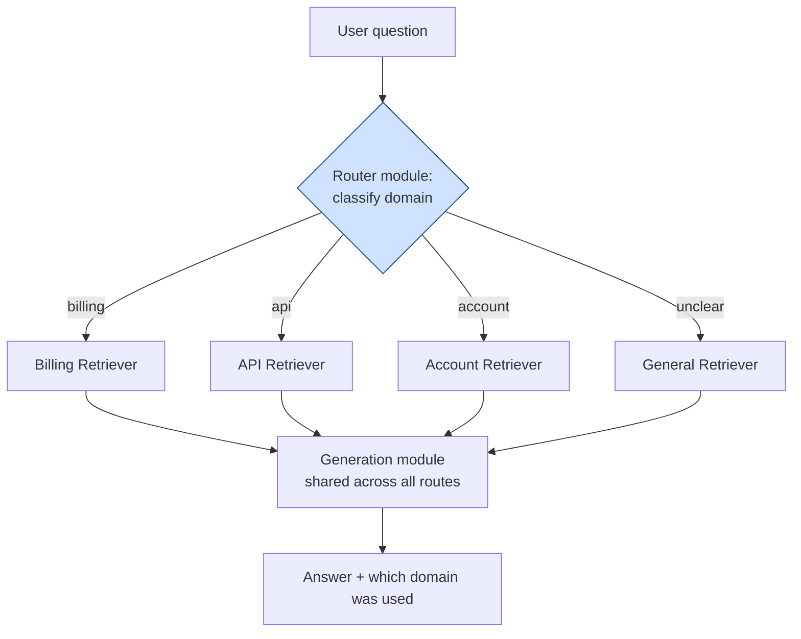

# Pattern 4: Modular RAG

[← Back to index](README.md)

## 1. What is Modular RAG?

Basic RAG is a fixed line: retrieve, then generate. Advanced RAG (Pattern 3) added
three more fixed stations to that line — but it's *still* one fixed sequence that runs
the same way for every question.

**Modular RAG** takes the idea further: instead of a hard-coded sequence of steps, you
build a set of **independent, swappable modules** (query rewriting, routing, multiple
retrievers, re-ranking, generation, verification) and a **control layer** that decides,
per request, which modules to run and in what order. The pipeline becomes a graph
instead of a line — some questions might skip query rewriting entirely, others might
route to a completely different retriever, others might loop back and retry.

In this series we implement the control layer as a small, explicit **Java state-graph
runner** — a `Map<String, Node>` of named steps plus a router function that decides the
next step from the current state, which is exactly what a graph with conditional edges
needs, without pulling in a specific external orchestration framework.

## 2. What problem does it solve?

Advanced RAG's fixed pipeline has a hidden cost: **every question pays for every
stage**, whether it needs it or not.

- A simple, well-phrased question doesn't need query rewriting — but Advanced RAG
  rewrites it anyway, adding latency.
- A question about billing shouldn't be searched against the API-reference index, and
  vice versa — but a single fixed retriever searches one undifferentiated index for
  everything.
- Some questions need multiple retrieval rounds; a fixed one-shot pipeline can't adapt.

Modular RAG solves this by making the pipeline **composable and conditional**: each
module does one job, and a router decides which modules a given request actually needs.

## 3. Realistic production scenario

**Company:** the same SaaS company, but its documentation has grown into three genuinely
different domains, each better served by its own retriever:

- **Billing docs** — plans, pricing, refunds, invoices.
- **API reference docs** — endpoints, rate limits, authentication, error codes.
- **Account/security docs** — 2FA, SSO, password resets, permissions.

**Problem:** a single shared vector index across all three domains causes cross-domain
noise — a billing question sometimes retrieves API-reference chunks that happen to share
vocabulary, diluting the context.

**Goal:** build a Modular RAG system with:
1. A **router module** that classifies each incoming question into billing / api /
   account (or "general" if unclear).
2. **Three separate retriever modules**, one per domain, each backed by its own
   `SimpleVectorStore`.
3. A shared **generation module** that all routes converge on.
4. The whole thing wired together as an explicit Java graph, so adding a fourth domain
   later means adding one node and one routing rule.

## 4. Architecture / flow diagram



## 5. Request-to-response walkthrough

1. **User asks:** *"What's the rate limit for the /invoices endpoint?"*
2. **Router module runs first.** A small LLM call classifies the question's domain:
   here, `api`.
3. **Graph routes to the API retriever module.** Only the `api_docs` vector store is
   searched — billing and account stores aren't touched at all.
4. **Generation module runs** using the API-domain chunks as context.
5. **Answer returned**, tagged with `domainUsed: "api"` for observability.
6. **A different question** ("How do refunds work for annual plans?") would route to
   `billing` instead, hit a completely different, smaller, less noisy index.
7. **An ambiguous question** falls through to the `general` route, which searches
   across all domains as a fallback.

## 6. Why this pattern is appropriate here

- **Each retriever module stays small and clean.** A billing-only index never has to
  compete against API-reference vocabulary for relevance.
- **The system is easy to extend.** Adding a "Legal/Compliance docs" domain later means:
  build one more retriever module, add one more routing branch, done.
- **Per-request cost stays proportional to need.**
- **The explicit graph runner is the natural fit** because the control flow here is
  genuinely conditional — different from Advanced RAG's fixed sequence.
- **When this is *not* enough:** if a single question needs facts merged from multiple
  domains, you need Multi-Hop RAG (Pattern 23) or Agentic RAG (Pattern 25), layered on
  top of this same modular foundation.

## 7. Production-quality implementation (Java / Spring AI)

```java
package com.acme.rag.modular;

import org.springframework.ai.chat.client.ChatClient;
import org.springframework.ai.chat.prompt.PromptTemplate;
import org.springframework.ai.document.Document;
import org.springframework.ai.ollama.OllamaChatModel;
import org.springframework.ai.ollama.OllamaEmbeddingModel;
import org.springframework.ai.ollama.api.OllamaApi;
import org.springframework.ai.ollama.api.OllamaOptions;
import org.springframework.ai.transformer.splitter.TokenTextSplitter;
import org.springframework.ai.vectorstore.SearchRequest;
import org.springframework.ai.vectorstore.SimpleVectorStore;

import java.io.IOException;
import java.io.UncheckedIOException;
import java.nio.file.Files;
import java.nio.file.Path;
import java.util.EnumMap;
import java.util.List;
import java.util.Map;
import java.util.Set;
import java.util.stream.Collectors;

/**
 * Modular RAG -- domain-routed retrieval for a multi-domain support bot.
 *
 * A small explicit graph (route -> retrieve -> generate) where a router node
 * classifies each question, then dispatches to a domain-specific retriever
 * module before converging on a shared generation module.
 */
public final class ModularRagApp {

    enum Domain { BILLING, API, ACCOUNT, GENERAL }

    record RagConfig(
            String embeddingModel, String llmModel, double llmTemperature,
            int chunkSize, int chunkOverlap, int topK, Path persistRoot) {

        static RagConfig defaults() {
            return new RagConfig("nomic-embed-text", "llama3.1", 0.0, 600, 80, 4,
                    Path.of("./vectorstore_modular"));
        }
    }

    /** Mutable state that flows through the graph's nodes. */
    static final class GraphState {
        String question;
        Domain domain;
        List<Document> retrieved;
        String answer;
    }

    /** One SimpleVectorStore per domain, built from that domain's docs only. */
    static final class DomainIndex {
        private final SimpleVectorStore store;
        private final int topK;

        DomainIndex(RagConfig config, Domain domain, Path sourceDir, OllamaEmbeddingModel embeddingModel) {
            this.topK = config.topK();
            this.store = SimpleVectorStore.builder(embeddingModel).build();
            Path persistPath = config.persistRoot().resolve(domain.name().toLowerCase() + ".json");

            if (Files.exists(persistPath)) {
                store.load(persistPath.toFile());
                System.out.println("[" + domain + "] Loaded existing index from " + persistPath);
                return;
            }

            List<Document> docs;
            try {
                Files.createDirectories(persistPath.getParent());
                try (var files = Files.list(sourceDir)) {
                    docs = files.filter(p -> p.toString().endsWith(".md")).sorted()
                            .map(p -> {
                                try {
                                    return new Document(Files.readString(p),
                                            Map.of("source", p.getFileName().toString(), "domain", domain.name()));
                                } catch (IOException e) { throw new UncheckedIOException(e); }
                            }).collect(Collectors.toList());
                }
            } catch (IOException e) { throw new UncheckedIOException(e); }

            TokenTextSplitter splitter = new TokenTextSplitter(
                    config.chunkSize(), config.chunkOverlap(), 5, 10000, true);
            List<Document> chunks = splitter.apply(docs);
            store.add(chunks);
            store.save(persistPath.toFile());
            System.out.println("[" + domain + "] Indexed " + chunks.size() + " chunks from " + sourceDir);
        }

        List<Document> retrieve(String question) {
            return store.similaritySearch(SearchRequest.builder().query(question).topK(topK).build());
        }
    }

    /** Owns the graph: router node -> domain retriever node -> shared generator node. */
    static final class ModularRagBot {
        private static final String ROUTER_SYSTEM = """
                Classify the user's support question into exactly one category:
                'billing' (plans, pricing, refunds, invoices),
                'api' (endpoints, rate limits, authentication, error codes),
                'account' (2FA, SSO, password resets, permissions), or
                'general' (unclear, or spans multiple categories).
                Respond with ONLY the single category word, lowercase.
                """;
        private static final String GEN_SYSTEM = """
                You are a customer support assistant. Answer using ONLY the context below.
                If the context does not contain the answer, say so explicitly.

                Context:
                {context}
                """;

        private final ChatClient chatClient;
        private final Map<Domain, DomainIndex> indexes = new EnumMap<>(Domain.class);
        private final PromptTemplate genPromptTemplate = new PromptTemplate(GEN_SYSTEM);

        ModularRagBot(RagConfig config, OllamaEmbeddingModel embeddingModel, OllamaChatModel chatModel,
                      Map<Domain, Path> domainSourceDirs) {
            this.chatClient = ChatClient.create(chatModel);
            for (Domain domain : Domain.values()) {
                indexes.put(domain, new DomainIndex(config, domain, domainSourceDirs.get(domain), embeddingModel));
            }
        }

        // --- Graph nodes -----------------------------------------------------

        private void routeNode(GraphState state) {
            String raw = chatClient.prompt().system(ROUTER_SYSTEM).user(state.question)
                    .call().content().trim().toLowerCase();
            Domain domain = switch (raw) {
                case "billing" -> Domain.BILLING;
                case "api" -> Domain.API;
                case "account" -> Domain.ACCOUNT;
                default -> Domain.GENERAL;
            };
            System.out.println("Routed question to domain=" + domain + " (raw classifier output=" + raw + ")");
            state.domain = domain;
        }

        private void retrieveNode(GraphState state) {
            state.retrieved = indexes.get(state.domain).retrieve(state.question);
        }

        private void generateNode(GraphState state) {
            String context = state.retrieved.stream()
                    .map(d -> "[" + d.getMetadata().getOrDefault("source", "unknown") + "]\n" + d.getText())
                    .collect(Collectors.joining("\n\n---\n\n"));
            String systemMessage = genPromptTemplate.render(Map.of("context", context));
            state.answer = chatClient.prompt().system(systemMessage).user(state.question).call().content();
        }

        // --- Graph runner: route -> retrieve -> generate ----------------------

        record AskResult(String answer, Domain domain, List<String> sources) {}

        AskResult ask(String question) {
            if (question == null || question.isBlank()) {
                throw new IllegalArgumentException("Question must not be empty.");
            }
            GraphState state = new GraphState();
            state.question = question;

            try {
                routeNode(state);
                retrieveNode(state);
                generateNode(state);
            } catch (Exception ex) {
                System.err.println("Graph execution failed: " + ex);
                return new AskResult("Sorry, something went wrong.", Domain.GENERAL, List.of());
            }

            List<String> sources = state.retrieved.stream()
                    .map(d -> String.valueOf(d.getMetadata().getOrDefault("source", "unknown")))
                    .collect(Collectors.toList());
            return new AskResult(state.answer, state.domain, sources);
        }
    }

    private static Map<Domain, Path> writeSampleDocs(Path root) throws IOException {
        Map<Domain, Path> dirs = Map.of(
                Domain.BILLING, root.resolve("billing"),
                Domain.API, root.resolve("api"),
                Domain.ACCOUNT, root.resolve("account"),
                Domain.GENERAL, root.resolve("general"));
        for (Path d : dirs.values()) Files.createDirectories(d);

        Files.writeString(dirs.get(Domain.BILLING).resolve("refunds.md"),
                "## Refund Policy\nAnnual plans cancelled within 30 days receive a prorated refund.\n");
        Files.writeString(dirs.get(Domain.API).resolve("rate_limits.md"),
                "## Rate Limits\nThe /invoices endpoint is limited to 60 requests per minute on the "
                + "Pro plan and 600 requests per minute on the Enterprise plan.\n");
        Files.writeString(dirs.get(Domain.ACCOUNT).resolve("twofa.md"),
                "## Two-Factor Authentication\nEnable 2FA from Account Settings > Security using an "
                + "authenticator app such as Google Authenticator or Authy.\n");
        Files.writeString(dirs.get(Domain.GENERAL).resolve("overview.md"),
                "## Plan Changes\nYou can change your plan at any time from Account Settings > Billing. "
                + "Changing plans may affect your API rate limits and does not require re-authentication.\n");
        return dirs;
    }

    public static void main(String[] args) throws IOException {
        RagConfig config = RagConfig.defaults();
        Map<Domain, Path> dirs = writeSampleDocs(Path.of("./sample_modular_docs"));

        OllamaApi ollamaApi = OllamaApi.builder().baseUrl("http://localhost:11434").build();
        OllamaEmbeddingModel embeddingModel = OllamaEmbeddingModel.builder()
                .ollamaApi(ollamaApi)
                .defaultOptions(OllamaOptions.builder().model(config.embeddingModel()).build())
                .build();
        OllamaChatModel chatModel = OllamaChatModel.builder()
                .ollamaApi(ollamaApi)
                .defaultOptions(OllamaOptions.builder().model(config.llmModel())
                        .temperature(config.llmTemperature()).build())
                .build();

        ModularRagBot bot = new ModularRagBot(config, embeddingModel, chatModel, dirs);

        List<String> questions = List.of(
                "What's the rate limit for the /invoices endpoint?",
                "How do refunds work for annual plans?",
                "How do I set up two-factor authentication?",
                "How do I change my plan?"); // deliberately ambiguous -> should route to GENERAL

        for (String q : questions) {
            ModularRagBot.AskResult result = bot.ask(q);
            System.out.println("\nQ: " + q);
            System.out.println("  domain: " + result.domain() + "  sources: " + result.sources());
            System.out.println("A: " + result.answer());
        }
    }
}
```

### Key production details worth noting

- **Router output is validated against a fixed `Domain` enum** via the `switch`
  expression's `default -> Domain.GENERAL` branch, rather than trusted blindly — an LLM
  classifier can occasionally return unexpected text, and falling back to `GENERAL` is a
  safe default rather than crashing or mis-routing.
- **`domain` is returned alongside the answer** for observability — log this (e.g. as a
  Micrometer tag) to track routing accuracy over time.
- **Each `DomainIndex` is fully independent** (separate `SimpleVectorStore`, separate
  persisted JSON file) — this is what actually eliminates cross-domain noise.
- **The graph is intentionally simple here** (route → retrieve → generate, no loops), a
  plain sequence of node calls with a mutable `GraphState` — to isolate the
  "modular/composable" idea cleanly. Conditional loops, retries, and multi-module
  fan-out are introduced in later patterns (Agentic RAG, Self-RAG, Corrective RAG) that
  build on this same node/state approach, growing it into a real loop with a
  `while`-style runner once nodes need to revisit earlier steps.

---
[← Back to index](README.md)
