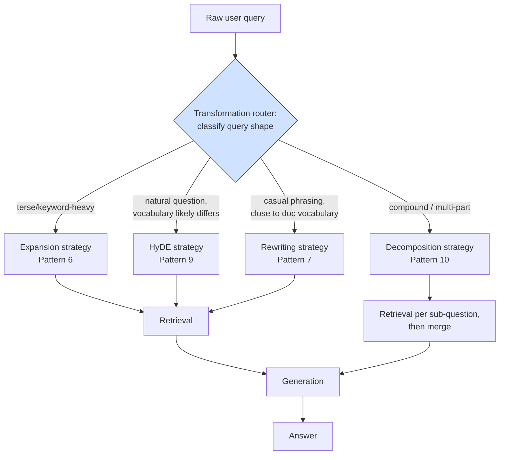

# Pattern 5: Query Transformation

[← Back to index](README.md)

## 1. What is Query Transformation?

Query Transformation is the **umbrella concept** for a family of techniques that all do
the same fundamental thing: **modify the user's raw question before it's used for
retrieval**, instead of embedding it verbatim.

Pattern 3 (Advanced RAG) already used one specific transformation — rewriting — as a
single fixed step. This pattern zooms out and treats query transformation as its own
**pluggable module** with several interchangeable strategies:

| Strategy | What it does | Deep-dive pattern |
|---|---|---|
| **Rewriting** | Reformulate phrasing/vocabulary to match the corpus | Pattern 7 |
| **Expansion** | Add synonyms/related terms to widen the search | Pattern 6 |
| **Multi-Query** | Generate several differently-phrased versions of the same question, retrieve for each, merge results | Pattern 8 |
| **HyDE** | Generate a *hypothetical answer* and embed that instead of the question | Pattern 9 |
| **Decomposition** | Split one complex question into several simpler sub-questions | Pattern 10 |

This pattern's job is to show the **selection logic** — given an incoming query, which
transformation strategy should run, and why. Patterns 6–10 each go deep on one
strategy; this pattern is the router that decides between them.

## 2. What problem does it solve?

Real user queries fail retrieval in several *different* ways, and no single fixed
transformation fixes all of them:

- **Vocabulary mismatch** → needs rewriting.
- **Too narrow a query** (only one phrasing tried) → needs expansion or multi-query.
- **Underspecified / vague queries** → often better served by HyDE, since imagining a
  plausible answer forces specificity that synonym-based expansion can't.
- **Compound questions** → need decomposition into sub-questions.

Applying the wrong transformation wastes an LLM call and doesn't fix the actual
retrieval gap. Query Transformation as a pattern is about **diagnosing the query type
first**, then dispatching to the specific technique suited to it.

## 3. Realistic production scenario

**Company:** an internal engineering knowledge base search tool — runbooks,
architecture decision records (ADRs), incident postmortems, and onboarding guides.

**Problem:** engineers type very different kinds of queries into the same box:

- *"k8s pod crashloop"* — terse, keyword-style, jargon-heavy → benefits from
  **expansion**.
- *"why did we choose Postgres over DynamoDB for the billing service"* — a natural
  question whose exact phrasing likely doesn't match the ADR's title/wording →
  benefits from **HyDE** or **rewriting**.
- *"what's our incident process and who do I page for a database outage"* — two
  questions in one → benefits from **decomposition**.

**Goal:** build a query transformation **router module** that classifies the incoming
query's shape and picks the right transformation strategy.

## 4. Architecture / flow diagram



## 5. Request-to-response walkthrough

1. **Query comes in:** *"k8s pod crashloop"*.
2. **Router classifies the query shape.** An LLM call labels it: short, keyword-heavy,
   few or no function words → classified as `terse`.
3. **Dispatch to the Expansion strategy** — related technical terms are added to widen
   the search net.
4. **Retrieval runs** using the expanded query.
5. **Generation runs** using whatever was retrieved.
6. **A different query — *"why did we choose Postgres over DynamoDB for billing"*** —
   gets classified as `vocab_mismatch_likely`, dispatching to **HyDE** instead.
7. **A compound query** gets classified as `compound`, dispatches to **Decomposition**,
   which splits it into sub-questions, retrieves for each, and merges the results.

## 6. Why this pattern is appropriate here

- **Different failure modes need different fixes** — there's no single "best" query
  transformation, only the best one *for a given query shape*.
- **Cost discipline.** Running all four strategies on every query would multiply LLM
  calls for no benefit on queries that only needed one of them.
- **This pattern is a hub, not a leaf.** Its whole value is in correctly routing to
  Patterns 6–10.
- **When this is *not* enough:** if the router frequently misclassifies queries, that's
  often a sign you need **Multi-Query RAG** (Pattern 8) as your default/fallback
  strategy instead — more robust at higher cost.

## 7. Production-quality implementation (Java / Spring AI)

```java
package com.acme.rag.querytransform;

import org.springframework.ai.chat.client.ChatClient;
import org.springframework.ai.chat.prompt.PromptTemplate;
import org.springframework.ai.document.Document;
import org.springframework.ai.ollama.OllamaChatModel;
import org.springframework.ai.ollama.OllamaEmbeddingModel;
import org.springframework.ai.ollama.api.OllamaApi;
import org.springframework.ai.ollama.api.OllamaOptions;
import org.springframework.ai.transformer.splitter.TokenTextSplitter;
import org.springframework.ai.vectorstore.SearchRequest;
import org.springframework.ai.vectorstore.SimpleVectorStore;

import java.io.IOException;
import java.io.UncheckedIOException;
import java.nio.file.Files;
import java.nio.file.Path;
import java.util.ArrayList;
import java.util.LinkedHashSet;
import java.util.List;
import java.util.Map;
import java.util.Set;
import java.util.stream.Collectors;

/**
 * Query Transformation -- router that selects a transformation strategy per query.
 *
 * Classifies each incoming query's "shape" and dispatches to one of four
 * transformation strategies (expansion, HyDE, rewriting, decomposition) before
 * retrieval runs. Each strategy is a minimal illustrative version here; the
 * full version of each lives in its own pattern (6-10) later in this series.
 */
public final class QueryTransformationApp {

    enum QueryShape { TERSE, VOCAB_MISMATCH_LIKELY, CASUAL_CLOSE_TO_DOCS, COMPOUND }

    record RagConfig(
            String embeddingModel, String llmModel, double llmTemperature,
            int chunkSize, int chunkOverlap, int topK, Path persistPath) {

        static RagConfig defaults() {
            return new RagConfig("nomic-embed-text", "llama3.1", 0.0, 600, 80, 4,
                    Path.of("./vectorstore_eng_kb.json"));
        }
    }

    static final class QueryShapeRouter {
        private static final String SYSTEM = """
                Classify the shape of this search query into exactly one category:
                - 'terse': short, keyword-style, jargon-heavy, few or no natural-language
                  connecting words (e.g. 'k8s pod crashloop')
                - 'vocab_mismatch_likely': a fluent natural-language question whose wording
                  probably differs a lot from how the answer is documented
                - 'casual_close_to_docs': a fluent question using vocabulary likely close to
                  how it's documented
                - 'compound': contains two or more distinct questions joined together
                Respond with ONLY the category name, exactly as written above.
                """;
        private final ChatClient chatClient;

        QueryShapeRouter(ChatClient chatClient) { this.chatClient = chatClient; }

        QueryShape classify(String query) {
            String raw = chatClient.prompt().system(SYSTEM).user(query)
                    .call().content().trim().toLowerCase();
            QueryShape shape = switch (raw) {
                case "terse" -> QueryShape.TERSE;
                case "vocab_mismatch_likely" -> QueryShape.VOCAB_MISMATCH_LIKELY;
                case "compound" -> QueryShape.COMPOUND;
                default -> QueryShape.CASUAL_CLOSE_TO_DOCS;
            };
            System.out.println("Classified query shape: " + query + " -> " + shape);
            return shape;
        }
    }

    /**
     * Minimal illustrative implementations of each transformation strategy.
     * Full production versions live in Patterns 6 (Expansion), 7 (Rewriting),
     * 9 (HyDE), and 10 (Decomposition).
     */
    static final class TransformationStrategies {
        private static final String EXPAND_SYSTEM = """
                Given a terse technical query, list 3-5 related technical terms or
                synonyms that might appear in documentation about this topic.
                Respond as a single comma-separated line, nothing else.
                """;
        private static final String HYDE_SYSTEM = """
                Write a short (2-3 sentence) hypothetical answer to this question, as if
                it were an excerpt from an internal architecture decision record or
                engineering doc. It doesn't need to be factually correct -- it only needs
                to sound like real documentation.
                """;
        private static final String REWRITE_SYSTEM = """
                Rewrite this into a concise search query using formal technical
                terminology. Respond with ONLY the rewritten query.
                """;
        private static final String DECOMPOSE_SYSTEM = """
                Split this compound question into 2-4 independent sub-questions, one per
                line, no numbering, no extra text.
                """;

        private final ChatClient chatClient;

        TransformationStrategies(ChatClient chatClient) { this.chatClient = chatClient; }

        String expand(String query) {
            String terms = chatClient.prompt().system(EXPAND_SYSTEM).user(query).call().content().trim();
            return query + " " + terms;
        }

        String hyde(String query) {
            return chatClient.prompt().system(HYDE_SYSTEM).user(query).call().content().trim();
        }

        String rewrite(String query) {
            return chatClient.prompt().system(REWRITE_SYSTEM).user(query).call().content().trim();
        }

        List<String> decompose(String query) {
            String raw = chatClient.prompt().system(DECOMPOSE_SYSTEM).user(query).call().content();
            List<String> subQuestions = new ArrayList<>();
            for (String line : raw.split("\\R")) {
                String trimmed = line.strip().replaceAll("^[-\u2022\\s]+", "");
                if (!trimmed.isEmpty()) subQuestions.add(trimmed);
            }
            return subQuestions;
        }
    }

    static final class QueryTransformationEngKb {
        private static final String GEN_SYSTEM = """
                You are an internal engineering search assistant. Answer using ONLY the
                context below. If the context is insufficient, say so.

                Context:
                {context}
                """;

        private final RagConfig config;
        private final SimpleVectorStore vectorStore;
        private final ChatClient chatClient;
        private final QueryShapeRouter router;
        private final TransformationStrategies strategies;
        private final PromptTemplate genPromptTemplate = new PromptTemplate(GEN_SYSTEM);

        QueryTransformationEngKb(RagConfig config, OllamaEmbeddingModel embeddingModel,
                                  OllamaChatModel chatModel, Path sourceDir) {
            this.config = config;
            this.chatClient = ChatClient.create(chatModel);
            this.router = new QueryShapeRouter(chatClient);
            this.strategies = new TransformationStrategies(chatClient);
            this.vectorStore = buildOrLoad(embeddingModel, sourceDir);
        }

        private SimpleVectorStore buildOrLoad(OllamaEmbeddingModel embeddingModel, Path sourceDir) {
            SimpleVectorStore store = SimpleVectorStore.builder(embeddingModel).build();
            if (Files.exists(config.persistPath())) {
                store.load(config.persistPath().toFile());
                return store;
            }
            List<Document> docs;
            try (var files = Files.list(sourceDir)) {
                docs = files.filter(p -> p.toString().endsWith(".md")).sorted()
                        .map(p -> {
                            try {
                                return new Document(Files.readString(p),
                                        Map.of("source", p.getFileName().toString()));
                            } catch (IOException e) { throw new UncheckedIOException(e); }
                        }).collect(Collectors.toList());
            } catch (IOException e) { throw new UncheckedIOException(e); }
            TokenTextSplitter splitter = new TokenTextSplitter(
                    config.chunkSize(), config.chunkOverlap(), 5, 10000, true);
            List<Document> chunks = splitter.apply(docs);
            store.add(chunks);
            store.save(config.persistPath().toFile());
            return store;
        }

        private List<Document> retrieve(String searchText) {
            return vectorStore.similaritySearch(
                    SearchRequest.builder().query(searchText).topK(config.topK()).build());
        }

        record AskResult(String answer, QueryShape shape, Object transformationUsed, List<String> sources) {}

        AskResult ask(String question) {
            if (question == null || question.isBlank()) {
                throw new IllegalArgumentException("Question must not be empty.");
            }

            QueryShape shape = router.classify(question);
            List<Document> retrieved = new ArrayList<>();
            Object transformDebug;

            try {
                switch (shape) {
                    case TERSE -> {
                        String searchText = strategies.expand(question);
                        transformDebug = searchText;
                        retrieved.addAll(retrieve(searchText));
                    }
                    case VOCAB_MISMATCH_LIKELY -> {
                        String hypothetical = strategies.hyde(question);
                        transformDebug = hypothetical;
                        retrieved.addAll(retrieve(hypothetical));
                    }
                    case COMPOUND -> {
                        List<String> subQuestions = strategies.decompose(question);
                        transformDebug = subQuestions;
                        Set<String> seenKeys = new LinkedHashSet<>();
                        for (String subQ : subQuestions) {
                            for (Document doc : retrieve(subQ)) {
                                String key = doc.getMetadata().getOrDefault("source", "?")
                                        + "|" + doc.getText().substring(0, Math.min(50, doc.getText().length()));
                                if (seenKeys.add(key)) retrieved.add(doc);
                            }
                        }
                    }
                    default -> { // CASUAL_CLOSE_TO_DOCS
                        String searchText = strategies.rewrite(question);
                        transformDebug = searchText;
                        retrieved.addAll(retrieve(searchText));
                    }
                }
            } catch (Exception ex) {
                System.err.println("Transformation/retrieval failed: " + ex);
                transformDebug = "<error>";
                retrieved.addAll(retrieve(question)); // fall back to raw query
            }

            String context = retrieved.stream()
                    .map(d -> "[" + d.getMetadata().getOrDefault("source", "unknown") + "]\n" + d.getText())
                    .collect(Collectors.joining("\n\n---\n\n"));

            String answer;
            try {
                String systemMessage = genPromptTemplate.render(Map.of("context", context));
                answer = chatClient.prompt().system(systemMessage).user(question).call().content();
            } catch (Exception ex) {
                System.err.println("Generation failed: " + ex);
                answer = "Sorry, something went wrong answering that question.";
            }

            List<String> sources = retrieved.stream()
                    .map(d -> String.valueOf(d.getMetadata().getOrDefault("source", "unknown")))
                    .collect(Collectors.toList());

            return new AskResult(answer, shape, transformDebug, sources);
        }
    }

    private static void writeSampleDocs(Path dir) throws IOException {
        Files.createDirectories(dir);
        Files.writeString(dir.resolve("runbook_k8s.md"), """
                ## Diagnosing CrashLoopBackOff
                When a pod enters CrashLoopBackOff, check container restart counts and
                liveness probe failures with `kubectl describe pod`. Common causes: failing
                health checks, OOMKilled events, or missing config maps.
                """);
        Files.writeString(dir.resolve("adr_014.md"), """
                ## ADR-014: Billing Service Datastore Selection
                We selected PostgreSQL over DynamoDB for the billing service due to the need
                for multi-row ACID transactions across invoice line items, which DynamoDB's
                single-item transaction model does not support as naturally.
                """);
        Files.writeString(dir.resolve("incident_process.md"), """
                ## Incident Response Process
                All incidents are declared in #incidents and tracked in the incident tracker.
                Severity 1 incidents require an incident commander within 5 minutes.

                ## On-Call Escalation
                Database outages should be paged to the Data Platform on-call rotation via
                PagerDuty, escalation policy 'db-platform-primary'.
                """);
    }

    public static void main(String[] args) throws IOException {
        RagConfig config = RagConfig.defaults();
        Path sampleDir = Path.of("./sample_eng_kb");
        writeSampleDocs(sampleDir);

        OllamaApi ollamaApi = OllamaApi.builder().baseUrl("http://localhost:11434").build();
        OllamaEmbeddingModel embeddingModel = OllamaEmbeddingModel.builder()
                .ollamaApi(ollamaApi)
                .defaultOptions(OllamaOptions.builder().model(config.embeddingModel()).build())
                .build();
        OllamaChatModel chatModel = OllamaChatModel.builder()
                .ollamaApi(ollamaApi)
                .defaultOptions(OllamaOptions.builder().model(config.llmModel())
                        .temperature(config.llmTemperature()).build())
                .build();

        QueryTransformationEngKb bot = new QueryTransformationEngKb(config, embeddingModel, chatModel, sampleDir);

        List<String> questions = List.of(
                "k8s pod crashloop",
                "why did we choose Postgres over DynamoDB for billing",
                "what's our incident process and who do I page for a database outage");

        for (String q : questions) {
            QueryTransformationEngKb.AskResult result = bot.ask(q);
            System.out.println("\nQ: " + q);
            System.out.println("  shape: " + result.shape());
            System.out.println("  transformation: " + result.transformationUsed());
            System.out.println("  sources: " + result.sources());
            System.out.println("A: " + result.answer());
        }
    }
}
```

### Key production details worth noting

- **The router itself is a single, cheap LLM call**, and every strategy after it is
  gated behind that one classification — this keeps total cost proportional to query
  ambiguity instead of running all strategies always.
- **Graceful fallback:** if a transformation step throws, the pipeline falls back to
  retrieving with the raw, untransformed query.
- **For latency-critical systems**, shape classification can often be replaced with a
  cheap heuristic instead of an LLM call — e.g. token count and presence of
  question-words is a decent zero-cost proxy for `TERSE` vs. fluent.
- **Decomposition returns a list, so `transformationUsed` and `sources` are naturally
  richer for compound queries** — deduplication by `source + first 50 chars` (via a
  `LinkedHashSet<String>` of composite keys) avoids showing the same chunk twice if two
  sub-questions happen to retrieve it.

---
[← Back to index](README.md)
