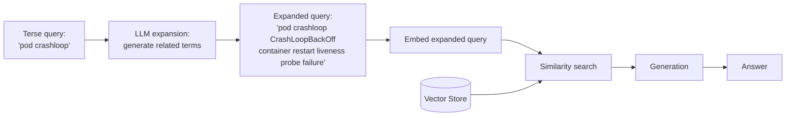

# Pattern 6: Query Expansion

[← Back to index](README.md)

## 1. What is Query Expansion?

Query Expansion takes a short, terse query and **adds related terms to it** before
retrieval — synonyms, abbreviations spelled out, closely related technical vocabulary —
so the search casts a wider net than the original wording alone would.

Where rewriting (Pattern 7) *replaces* the query's phrasing, expansion *adds to* it:
the original terms stay, and extra terms are appended, so both the literal keywords and
their semantic neighbors contribute to the retrieval.

## 2. What problem does it solve?

Short, jargon-heavy queries — the kind engineers actually type — often use exactly one
of several possible ways to describe a problem. A doc chunk might say
"CrashLoopBackOff" while the user typed "crashloop"; a doc might say "OOMKilled" while
the user typed "pod dying." A single embedding of the literal 3-word query sometimes
just doesn't land close enough to the chunk that uses different (but related) words.
Expansion widens the query's vocabulary footprint so that overlap is more likely,
without discarding the user's original terms (which might themselves be exactly what's
in the docs).

## 3. Realistic production scenario

**Company:** the same internal engineering knowledge base from Pattern 5.

**Problem:** on-call engineers under time pressure type minimal queries —
*"pod crashloop"*, *"503 upstream"*, *"disk full ec2"* — that don't always share
vocabulary with the runbook prose, which tends to be written more formally
("CrashLoopBackOff", "upstream connect error", "EBS volume at capacity").

**Goal:** before retrieval, expand each terse query with 3-5 closely related technical
terms generated by the LLM, then retrieve using the expanded (original + added terms)
query.

## 4. Architecture / flow diagram



## 5. Request-to-response walkthrough

1. **Query comes in:** *"pod crashloop"*.
2. **Expansion call:** the LLM is prompted to list 3-5 related technical terms —
   returns e.g. `CrashLoopBackOff, container restart, liveness probe failure, OOMKilled`.
3. **Expanded query built:** original query + generated terms are concatenated into one
   search string.
4. **Retrieval runs** against this expanded string — now the embedding vector reflects
   both the original terms and the doc-style vocabulary, increasing the chance of
   overlapping with the runbook's actual phrasing.
5. **Generation proceeds** as normal using the retrieved chunks.
6. **Answer returned**, along with the expanded query used, for debuggability.

## 6. Why this pattern is appropriate here

- **Cheap and additive.** One extra LLM call, and it never discards the user's original
  terms — if the user's exact wording was already correct, expansion doesn't hurt it,
  it only adds more surface area.
- **Particularly effective for jargon-heavy domains** (infra/ops, medical, legal) where
  a small, fixed vocabulary of synonymous terms genuinely exists and an LLM is good at
  recalling it.
- **When this is *not* enough:** if the mismatch is about *sentence structure and
  intent* rather than missing vocabulary (a full question phrased very differently from
  how the doc states it), rewriting (Pattern 7) or HyDE (Pattern 9) usually work better,
  since expansion only adds words, it doesn't restructure the query.

## 7. Production-quality implementation (Java / Spring AI)

```java
package com.acme.rag.expansion;

import org.springframework.ai.chat.client.ChatClient;
import org.springframework.ai.chat.prompt.PromptTemplate;
import org.springframework.ai.document.Document;
import org.springframework.ai.ollama.OllamaChatModel;
import org.springframework.ai.ollama.OllamaEmbeddingModel;
import org.springframework.ai.ollama.api.OllamaApi;
import org.springframework.ai.ollama.api.OllamaOptions;
import org.springframework.ai.transformer.splitter.TokenTextSplitter;
import org.springframework.ai.vectorstore.SearchRequest;
import org.springframework.ai.vectorstore.SimpleVectorStore;

import java.io.IOException;
import java.io.UncheckedIOException;
import java.nio.file.Files;
import java.nio.file.Path;
import java.util.List;
import java.util.Map;
import java.util.stream.Collectors;

/**
 * Query Expansion -- widen a terse query with related technical terms before retrieval.
 */
public final class QueryExpansionApp {

    record RagConfig(
            String embeddingModel, String llmModel, double llmTemperature,
            int chunkSize, int chunkOverlap, int topK, Path persistPath) {

        static RagConfig defaults() {
            return new RagConfig("nomic-embed-text", "llama3.1", 0.0, 600, 80, 4,
                    Path.of("./vectorstore_eng_kb_expansion.json"));
        }
    }

    static final class QueryExpander {
        private static final String SYSTEM = """
                Given a terse technical query, list 3-5 related technical terms, synonyms,
                or full forms of abbreviations that might appear in documentation about
                this topic. Respond as a single comma-separated line, nothing else.
                """;
        private final ChatClient chatClient;

        QueryExpander(ChatClient chatClient) { this.chatClient = chatClient; }

        String expand(String query) {
            try {
                String terms = chatClient.prompt().system(SYSTEM).user(query).call().content().trim();
                return terms.isEmpty() ? query : query + " " + terms;
            } catch (Exception ex) {
                System.err.println("Expansion failed, falling back to original query: " + ex);
                return query;
            }
        }
    }

    static final class QueryExpansionEngKb {
        private static final String GEN_SYSTEM = """
                You are an internal engineering search assistant. Answer using ONLY the
                context below. If the context is insufficient, say so.

                Context:
                {context}
                """;

        private final RagConfig config;
        private final SimpleVectorStore vectorStore;
        private final ChatClient chatClient;
        private final QueryExpander expander;
        private final PromptTemplate genPromptTemplate = new PromptTemplate(GEN_SYSTEM);

        QueryExpansionEngKb(RagConfig config, OllamaEmbeddingModel embeddingModel,
                             OllamaChatModel chatModel, Path sourceDir) {
            this.config = config;
            this.chatClient = ChatClient.create(chatModel);
            this.expander = new QueryExpander(chatClient);
            this.vectorStore = buildOrLoad(embeddingModel, sourceDir);
        }

        private SimpleVectorStore buildOrLoad(OllamaEmbeddingModel embeddingModel, Path sourceDir) {
            SimpleVectorStore store = SimpleVectorStore.builder(embeddingModel).build();
            if (Files.exists(config.persistPath())) {
                store.load(config.persistPath().toFile());
                return store;
            }
            List<Document> docs;
            try (var files = Files.list(sourceDir)) {
                docs = files.filter(p -> p.toString().endsWith(".md")).sorted()
                        .map(p -> {
                            try {
                                return new Document(Files.readString(p),
                                        Map.of("source", p.getFileName().toString()));
                            } catch (IOException e) { throw new UncheckedIOException(e); }
                        }).collect(Collectors.toList());
            } catch (IOException e) { throw new UncheckedIOException(e); }
            TokenTextSplitter splitter = new TokenTextSplitter(
                    config.chunkSize(), config.chunkOverlap(), 5, 10000, true);
            List<Document> chunks = splitter.apply(docs);
            store.add(chunks);
            store.save(config.persistPath().toFile());
            return store;
        }

        record AskResult(String answer, String expandedQuery, List<String> sources) {}

        AskResult ask(String question) {
            if (question == null || question.isBlank()) {
                throw new IllegalArgumentException("Question must not be empty.");
            }

            String expandedQuery = expander.expand(question);
            System.out.println("Expanded query: " + question + " -> " + expandedQuery);

            List<Document> retrieved;
            try {
                retrieved = vectorStore.similaritySearch(
                        SearchRequest.builder().query(expandedQuery).topK(config.topK()).build());
            } catch (Exception ex) {
                System.err.println("Retrieval failed: " + ex);
                retrieved = List.of();
            }

            String context = retrieved.stream()
                    .map(d -> "[" + d.getMetadata().getOrDefault("source", "unknown") + "]\n" + d.getText())
                    .collect(Collectors.joining("\n\n---\n\n"));

            String answer;
            try {
                String systemMessage = genPromptTemplate.render(Map.of("context", context));
                answer = chatClient.prompt().system(systemMessage).user(question).call().content();
            } catch (Exception ex) {
                System.err.println("Generation failed: " + ex);
                answer = "Sorry, something went wrong answering that question.";
            }

            List<String> sources = retrieved.stream()
                    .map(d -> String.valueOf(d.getMetadata().getOrDefault("source", "unknown")))
                    .collect(Collectors.toList());

            return new AskResult(answer, expandedQuery, sources);
        }
    }

    private static void writeSampleDocs(Path dir) throws IOException {
        Files.createDirectories(dir);
        Files.writeString(dir.resolve("runbook_k8s.md"), """
                ## Diagnosing CrashLoopBackOff
                When a pod enters CrashLoopBackOff, check container restart counts and
                liveness probe failures with `kubectl describe pod`. Common causes: failing
                health checks, OOMKilled events, or missing config maps.
                """);
        Files.writeString(dir.resolve("runbook_gateway.md"), """
                ## Diagnosing Upstream Connect Errors
                A 503 with 'upstream connect error' in the gateway logs usually indicates
                the backend service is unreachable or exceeded its connection timeout.
                """);
        Files.writeString(dir.resolve("runbook_ec2.md"), """
                ## Diagnosing EBS Volume At Capacity
                When an EC2 instance's root or data volume reaches capacity, disk-full
                errors appear in application logs. Extend the EBS volume or clean up logs.
                """);
    }

    public static void main(String[] args) throws IOException {
        RagConfig config = RagConfig.defaults();
        Path sampleDir = Path.of("./sample_eng_kb_expansion");
        writeSampleDocs(sampleDir);

        OllamaApi ollamaApi = OllamaApi.builder().baseUrl("http://localhost:11434").build();
        OllamaEmbeddingModel embeddingModel = OllamaEmbeddingModel.builder()
                .ollamaApi(ollamaApi)
                .defaultOptions(OllamaOptions.builder().model(config.embeddingModel()).build())
                .build();
        OllamaChatModel chatModel = OllamaChatModel.builder()
                .ollamaApi(ollamaApi)
                .defaultOptions(OllamaOptions.builder().model(config.llmModel())
                        .temperature(config.llmTemperature()).build())
                .build();

        QueryExpansionEngKb bot = new QueryExpansionEngKb(config, embeddingModel, chatModel, sampleDir);

        List<String> questions = List.of(
                "pod crashloop",
                "503 upstream",
                "disk full ec2");

        for (String q : questions) {
            QueryExpansionEngKb.AskResult result = bot.ask(q);
            System.out.println("\nQ: " + q);
            System.out.println("  expanded: " + result.expandedQuery());
            System.out.println("  sources: " + result.sources());
            System.out.println("A: " + result.answer());
        }
    }
}
```

### Key production details worth noting

- **Expansion appends, never replaces.** The original query text is always kept as a
  prefix, so a lucky exact match on the user's own wording is never lost.
- **Graceful fallback:** if the expansion LLM call fails, the pipeline retrieves with
  the unexpanded query rather than failing the whole request.
- **Cheap to cache.** Because expansion depends only on the query text (not on
  retrieval results), expanded queries for common terse phrases (e.g. "pod crashloop")
  are excellent candidates for an application-level cache, cutting the extra LLM call
  to zero on repeat queries.
- **Debuggability:** returning `expandedQuery` alongside the answer makes it trivial to
  spot-check whether expansion is actually adding useful terms or just noise.

---
[← Back to index](README.md)
