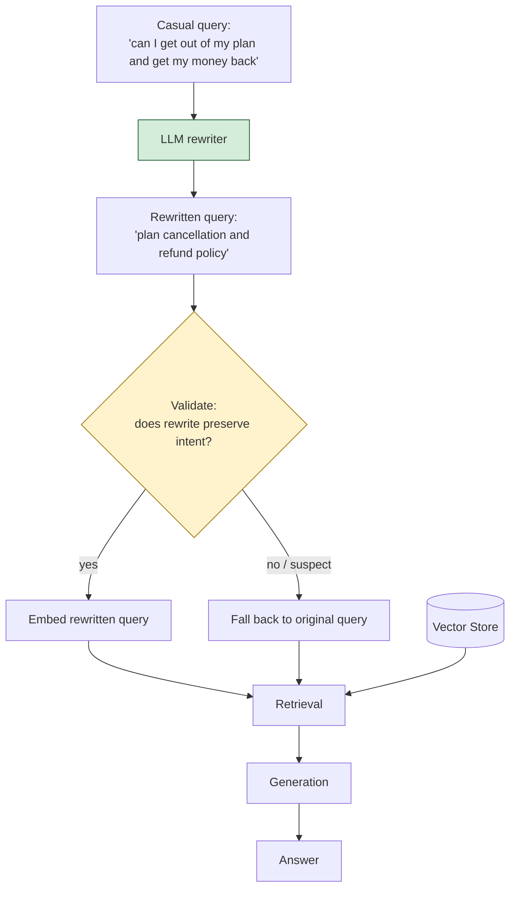

# Pattern 7: Query Rewriting

[← Back to index](README.md)

## 1. What is Query Rewriting?

Query Rewriting takes the user's original question and **restates it entirely** in
different words — usually shifting casual, ambiguous, or conversational phrasing into
clean, formal, doc-aligned search terms. Unlike Expansion (Pattern 6), which *adds*
terms while keeping the original, Rewriting *replaces* the query outright with a new
one better suited for retrieval.

This is the same technique used as a single fixed step inside Advanced RAG (Pattern 3);
here we treat it as its own standalone, deeply-configurable module — including handling
edge cases like conversational context, over-rewriting, and rewrite validation.

## 2. What problem does it solve?

Users don't write the way documentation is written. They write the way they'd ask a
colleague:

- *"can I get out of my plan and get my money back"* → doc says "Cancellation and
  Refund Policy"
- *"is there a way to see what broke last night"* → doc says "Incident History and
  Postmortems"
- *"my api keeps saying too many requests"* → doc says "Rate Limiting and 429
  Responses"

None of these are vocabulary-mismatch problems solvable by *adding* synonyms (Pattern
6) — the whole sentence structure and register is different from how the answer is
documented. Rewriting fixes this by having the LLM restate the *intent* of the question
using the vocabulary and phrasing conventions of formal documentation.

## 3. Realistic production scenario

**Company:** the SaaS support bot from Patterns 2-3, now handling a wider range of
customer phrasing styles as usage grows (external customers write far more casually
than internal engineers).

**Problem:** casual phrasing like *"can I get out of my plan and get my money back"*
retrieves poorly against formally-written docs, even though the *intent* — cancellation
+ refund — is completely clear to a human reading it.

**Goal:** add a rewriting stage that:
1. Reformulates casual questions into clean, doc-style search queries.
2. **Validates the rewrite** doesn't drift from the original intent (a real risk with
   LLM rewriting — it can "improve" a query into a different question).
3. Falls back to the original query if the rewrite looks suspect.

## 4. Architecture / flow diagram



## 5. Request-to-response walkthrough

1. **User asks:** *"can I get out of my plan and get my money back"*.
2. **Rewrite call:** the LLM restates this as a formal search query, e.g.
   *"plan cancellation and refund policy"*.
3. **Validation step:** a second, cheap check (keyword-overlap heuristic, or a small
   LLM judge call) confirms the rewrite still concerns cancellation + refund — not, say,
   drifted into "billing dispute" or "chargeback," which would be a subtly different
   topic.
4. **If valid:** retrieval proceeds with the rewritten query.
5. **If invalid/suspect:** retrieval falls back to the original raw query — a rewrite
   that changes the question's meaning is worse than no rewrite at all.
6. **Generation and answer** proceed as normal.
7. **Both the original and rewritten query are logged**, so a human reviewing bot
   transcripts can audit whether rewriting is helping or hurting for a given class of
   question.

## 6. Why this pattern is appropriate here

- **Directly targets register/structure mismatch**, which Expansion (Pattern 6) cannot
  fix since it only adds words rather than restructuring the sentence.
- **The validation step is what separates a production-grade rewriter from a naive
  one.** An unchecked LLM rewrite can silently drift the query's meaning, and because
  the rewritten query — not the original — drives retrieval, a bad rewrite is worse
  than no rewrite: it confidently searches for the wrong thing.
- **Cheap and general-purpose** across almost any customer-facing RAG system, which is
  why it was the single fix baked directly into Advanced RAG (Pattern 3).
- **When this is *not* enough:** if the user's query contains genuinely new information
  not inferable from a single rewrite (e.g. it depends on earlier turns in a
  conversation), you need Conversational RAG (Pattern 29) to fold in conversation
  history before rewriting.

## 7. Production-quality implementation (Java / Spring AI)

```java
package com.acme.rag.rewriting;

import org.springframework.ai.chat.client.ChatClient;
import org.springframework.ai.chat.prompt.PromptTemplate;
import org.springframework.ai.document.Document;
import org.springframework.ai.ollama.OllamaChatModel;
import org.springframework.ai.ollama.OllamaEmbeddingModel;
import org.springframework.ai.ollama.api.OllamaApi;
import org.springframework.ai.ollama.api.OllamaOptions;
import org.springframework.ai.transformer.splitter.TokenTextSplitter;
import org.springframework.ai.vectorstore.SearchRequest;
import org.springframework.ai.vectorstore.SimpleVectorStore;

import java.io.IOException;
import java.io.UncheckedIOException;
import java.nio.file.Files;
import java.nio.file.Path;
import java.util.HashSet;
import java.util.List;
import java.util.Map;
import java.util.Set;
import java.util.stream.Collectors;

/**
 * Query Rewriting -- reformulate casual questions into doc-aligned search
 * queries, with an intent-preservation validation step and safe fallback.
 */
public final class QueryRewritingApp {

    record RagConfig(
            String embeddingModel, String llmModel, double llmTemperature,
            int chunkSize, int chunkOverlap, int topK,
            double minIntentOverlap, Path persistPath) {

        static RagConfig defaults() {
            return new RagConfig("nomic-embed-text", "llama3.1", 0.0, 700, 100, 4, 0.2,
                    Path.of("./vectorstore_support_docs_rewrite.json"));
        }
    }

    static final class QueryRewriter {
        private static final String REWRITE_SYSTEM = """
                Rewrite the user's question into a short, formal search query using the
                vocabulary of official product documentation. Preserve the user's intent
                exactly -- do not answer the question, do not add new topics.
                Return ONLY the rewritten query, nothing else.
                """;
        private final ChatClient chatClient;

        QueryRewriter(ChatClient chatClient) { this.chatClient = chatClient; }

        String rewrite(String question) {
            try {
                String rewritten = chatClient.prompt().system(REWRITE_SYSTEM).user(question)
                        .call().content().trim();
                return rewritten.isEmpty() ? question : rewritten;
            } catch (Exception ex) {
                System.err.println("Rewrite failed, falling back to original: " + ex);
                return question;
            }
        }
    }

    /**
     * Validates that a rewrite preserved the original question's intent, using a
     * cheap word-overlap heuristic. In a higher-stakes production system, swap
     * this for a small LLM-as-judge call ("does query B still ask about the same
     * thing as query A? yes/no") for more reliable drift detection.
     */
    static final class RewriteValidator {
        private final double minOverlap;

        RewriteValidator(double minOverlap) { this.minOverlap = minOverlap; }

        boolean preservesIntent(String original, String rewritten) {
            Set<String> originalWords = significantWords(original);
            Set<String> rewrittenWords = significantWords(rewritten);
            if (originalWords.isEmpty()) return true;

            Set<String> overlap = new HashSet<>(originalWords);
            overlap.retainAll(rewrittenWords);
            double overlapRatio = (double) overlap.size() / originalWords.size();

            // A rewrite is trusted if there's meaningful lexical overlap OR it's
            // clearly just a formalization (rewritten query is short and non-empty).
            boolean trusted = overlapRatio >= minOverlap || rewrittenWords.size() <= 8;
            if (!trusted) {
                System.out.println("Rewrite validation failed: overlap=" + overlapRatio
                        + " original=" + original + " rewritten=" + rewritten);
            }
            return trusted;
        }

        private static Set<String> significantWords(String text) {
            Set<String> words = new HashSet<>();
            for (String w : text.toLowerCase().split("\\W+")) {
                if (w.length() > 3) words.add(w);
            }
            return words;
        }
    }

    static final class QueryRewritingSupportBot {
        private static final String GEN_SYSTEM = """
                You are a customer support assistant for Acme SaaS. Answer using ONLY the
                context below. If the context does not contain the answer, say so explicitly.

                Context:
                {context}
                """;

        private final RagConfig config;
        private final SimpleVectorStore vectorStore;
        private final ChatClient chatClient;
        private final QueryRewriter rewriter;
        private final RewriteValidator validator;
        private final PromptTemplate genPromptTemplate = new PromptTemplate(GEN_SYSTEM);

        QueryRewritingSupportBot(RagConfig config, OllamaEmbeddingModel embeddingModel,
                                  OllamaChatModel chatModel, Path sourceDir) {
            this.config = config;
            this.chatClient = ChatClient.create(chatModel);
            this.rewriter = new QueryRewriter(chatClient);
            this.validator = new RewriteValidator(config.minIntentOverlap());
            this.vectorStore = buildOrLoad(embeddingModel, sourceDir);
        }

        private SimpleVectorStore buildOrLoad(OllamaEmbeddingModel embeddingModel, Path sourceDir) {
            SimpleVectorStore store = SimpleVectorStore.builder(embeddingModel).build();
            if (Files.exists(config.persistPath())) {
                store.load(config.persistPath().toFile());
                return store;
            }
            List<Document> docs;
            try (var files = Files.list(sourceDir)) {
                docs = files.filter(p -> p.toString().endsWith(".md")).sorted()
                        .map(p -> {
                            try {
                                return new Document(Files.readString(p),
                                        Map.of("source", p.getFileName().toString()));
                            } catch (IOException e) { throw new UncheckedIOException(e); }
                        }).collect(Collectors.toList());
            } catch (IOException e) { throw new UncheckedIOException(e); }
            TokenTextSplitter splitter = new TokenTextSplitter(
                    config.chunkSize(), config.chunkOverlap(), 5, 10000, true);
            List<Document> chunks = splitter.apply(docs);
            store.add(chunks);
            store.save(config.persistPath().toFile());
            return store;
        }

        record AskResult(String answer, String searchQuery, boolean rewriteUsed, List<String> sources) {}

        AskResult ask(String question) {
            if (question == null || question.isBlank()) {
                throw new IllegalArgumentException("Question must not be empty.");
            }

            String rewritten = rewriter.rewrite(question);
            boolean useRewrite = !rewritten.equals(question) && validator.preservesIntent(question, rewritten);
            String searchQuery = useRewrite ? rewritten : question;

            System.out.println("Query: " + question + " | rewritten: " + rewritten
                    + " | using: " + (useRewrite ? "rewrite" : "original"));

            List<Document> retrieved;
            try {
                retrieved = vectorStore.similaritySearch(
                        SearchRequest.builder().query(searchQuery).topK(config.topK()).build());
            } catch (Exception ex) {
                System.err.println("Retrieval failed: " + ex);
                retrieved = List.of();
            }

            String context = retrieved.stream()
                    .map(d -> "[" + d.getMetadata().getOrDefault("source", "unknown") + "]\n" + d.getText())
                    .collect(Collectors.joining("\n\n---\n\n"));

            String answer;
            try {
                String systemMessage = genPromptTemplate.render(Map.of("context", context));
                answer = chatClient.prompt().system(systemMessage).user(question).call().content();
            } catch (Exception ex) {
                System.err.println("Generation failed: " + ex);
                answer = "Sorry, something went wrong answering that question.";
            }

            List<String> sources = retrieved.stream()
                    .map(d -> String.valueOf(d.getMetadata().getOrDefault("source", "unknown")))
                    .collect(Collectors.toList());

            return new AskResult(answer, searchQuery, useRewrite, sources);
        }
    }

    private static void writeSampleDocs(Path dir) throws IOException {
        Files.createDirectories(dir);
        Files.writeString(dir.resolve("cancellation.md"), """
                ## Plan Cancellation and Refund Policy
                Cancel your plan any time from Account Settings > Billing. Refunds are
                issued in full within 7 days of purchase; after that, access continues
                until the end of the current billing cycle with no partial refund.
                """);
        Files.writeString(dir.resolve("incidents.md"), """
                ## Incident History and Postmortems
                Past incidents and their postmortems are published on our status page,
                including root cause and remediation steps for each.
                """);
        Files.writeString(dir.resolve("rate_limiting.md"), """
                ## Rate Limiting and 429 Responses
                API requests exceeding your plan's rate limit receive a 429 response.
                Limits reset every 60 seconds; see plan tiers for exact thresholds.
                """);
    }

    public static void main(String[] args) throws IOException {
        RagConfig config = RagConfig.defaults();
        Path sampleDir = Path.of("./sample_support_docs_rewrite");
        writeSampleDocs(sampleDir);

        OllamaApi ollamaApi = OllamaApi.builder().baseUrl("http://localhost:11434").build();
        OllamaEmbeddingModel embeddingModel = OllamaEmbeddingModel.builder()
                .ollamaApi(ollamaApi)
                .defaultOptions(OllamaOptions.builder().model(config.embeddingModel()).build())
                .build();
        OllamaChatModel chatModel = OllamaChatModel.builder()
                .ollamaApi(ollamaApi)
                .defaultOptions(OllamaOptions.builder().model(config.llmModel())
                        .temperature(config.llmTemperature()).build())
                .build();

        QueryRewritingSupportBot bot = new QueryRewritingSupportBot(config, embeddingModel, chatModel, sampleDir);

        List<String> questions = List.of(
                "can I get out of my plan and get my money back",
                "is there a way to see what broke last night",
                "my api keeps saying too many requests");

        for (String q : questions) {
            QueryRewritingSupportBot.AskResult result = bot.ask(q);
            System.out.println("\nQ: " + q);
            System.out.println("  search query used: " + result.searchQuery()
                    + " (rewrite used: " + result.rewriteUsed() + ")");
            System.out.println("  sources: " + result.sources());
            System.out.println("A: " + result.answer());
        }
    }
}
```

### Key production details worth noting

- **Validation before trust.** `RewriteValidator.preservesIntent` is a deliberately
  simple heuristic here (word overlap, or a short enough rewrite) — it exists to make
  the point that rewrites should never be trusted unconditionally; swap in an
  LLM-as-judge call for higher-stakes domains (legal, medical, financial support).
- **The final generation call always uses the original question**, never the rewritten
  one — the rewrite is purely a retrieval aid, never shown to the user or used to frame
  the answer.
- **Both queries are logged** (`searchQuery` + `rewriteUsed` in the result) so rewrite
  quality can be audited over time, e.g. by sampling transcripts where `rewriteUsed` is
  `false` to see how often validation is (correctly or incorrectly) rejecting rewrites.
- **Graceful fallback at two levels**: if the rewrite call itself fails, the original
  question is used; if the rewrite succeeds but fails validation, the original question
  is also used. Rewriting can only help retrieval here, never actively hurt it.

---
[← Back to index](README.md)
