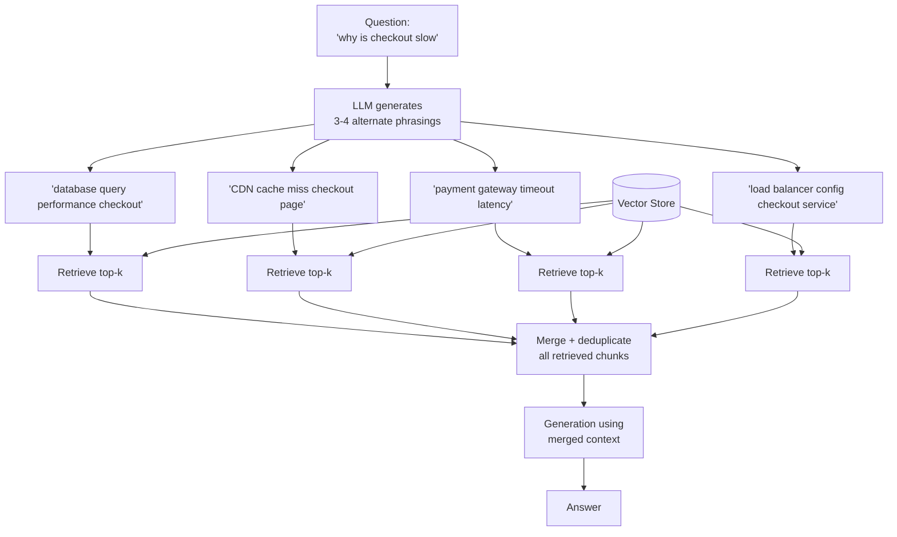

# Pattern 8: Multi-Query RAG

[← Back to index](README.md)

## 1. What is Multi-Query RAG?

Multi-Query RAG generates **several differently-phrased versions** of the same
question, retrieves chunks for *each* version independently, and then merges all the
results into one deduplicated candidate pool before generation.

Where Rewriting (Pattern 7) bets on a single "best" reformulation and Expansion
(Pattern 6) bets on one widened query, Multi-Query RAG hedges: instead of picking one
transformation and hoping it's right, it tries several angles at once and lets the
union of their results cover the gaps any single one would miss.

## 2. What problem does it solve?

Every single-query strategy has a failure mode: rewriting can drift or pick the wrong
formal phrasing; expansion can add irrelevant terms that dilute the embedding; the
original query might just be ambiguous enough that *no single* reformulation reliably
retrieves the right chunk. Multi-Query RAG solves this by **not betting on one
reformulation being correct** — it generates several candidate phrasings representing
different plausible interpretations or angles on the question, retrieves for all of
them, and merges. If even one of the several phrasings retrieves the right chunk, the
final candidate pool has it.

This trades extra retrieval cost (N embedding calls + N vector searches instead of 1)
for meaningfully higher recall on ambiguous or hard-to-phrase questions.

## 3. Realistic production scenario

**Company:** the internal engineering knowledge base from Patterns 5-6.

**Problem:** some incident-related questions are genuinely ambiguous in how they should
be searched — *"why is checkout slow"* could match a database performance runbook, a
CDN/caching doc, a payment-gateway timeout postmortem, or a load-balancer config guide.
No single rewritten or expanded query reliably covers all the plausible root causes an
engineer might actually need.

**Goal:** for questions flagged as open-ended/diagnostic (as opposed to a lookup with
one clear answer), generate 3-4 differently-angled search queries, retrieve for each,
merge and deduplicate the results, and let the LLM synthesize an answer that can
reference multiple possible causes if the context supports it.

## 4. Architecture / flow diagram



## 5. Request-to-response walkthrough

1. **Question comes in:** *"why is checkout slow"*.
2. **Query generation:** the LLM is prompted to produce 3-4 differently-angled search
   queries covering plausible root causes — not just paraphrases of the same idea, but
   genuinely different hypotheses.
3. **Parallel-ish retrieval:** each of the 3-4 queries is embedded and searched
   independently against the same vector store, returning its own top-k candidates.
4. **Merge and deduplicate:** all retrieved chunks are combined into one pool; exact or
   near-duplicate chunks (the same chunk retrieved by two different queries) are
   collapsed to one entry.
5. **Generation:** the LLM receives the full merged context — potentially spanning
   database, CDN, payment-gateway, and load-balancer docs — and synthesizes an answer
   that may cite multiple plausible causes, or narrow to the most likely one if the
   context makes that clear.
6. **Answer returned**, along with all sub-queries used and every source touched, for
   observability.

## 6. Why this pattern is appropriate here

- **Directly addresses genuinely ambiguous questions** where no single query
  reformulation is "the" correct one — this is a different problem from vocabulary
  mismatch (Rewriting) or narrow phrasing (Expansion), and needs a different fix.
  covers multiple hypotheses at once, which single-query strategies structurally
  cannot.
- **Higher recall at the cost of more retrieval calls** — a deliberate, explicit
  trade-off. This pattern should be reserved for queries where the extra cost is
  justified (e.g. gated behind a classifier, as in Pattern 5's router, rather than run
  on every query).
- **When this is *not* enough:** if the different angles need to be reasoned about
  *sequentially* rather than merged in parallel (e.g. checking database performance
  first, and only checking the CDN if that comes back clean), you need Multi-Hop RAG
  (Pattern 23) instead, which chains retrieval steps rather than fanning them out.

## 7. Production-quality implementation (Java / Spring AI)

```java
package com.acme.rag.multiquery;

import org.springframework.ai.chat.client.ChatClient;
import org.springframework.ai.chat.prompt.PromptTemplate;
import org.springframework.ai.document.Document;
import org.springframework.ai.ollama.OllamaChatModel;
import org.springframework.ai.ollama.OllamaEmbeddingModel;
import org.springframework.ai.ollama.api.OllamaApi;
import org.springframework.ai.ollama.api.OllamaOptions;
import org.springframework.ai.transformer.splitter.TokenTextSplitter;
import org.springframework.ai.vectorstore.SearchRequest;
import org.springframework.ai.vectorstore.SimpleVectorStore;

import java.io.IOException;
import java.io.UncheckedIOException;
import java.nio.file.Files;
import java.nio.file.Path;
import java.util.ArrayList;
import java.util.LinkedHashMap;
import java.util.List;
import java.util.Map;
import java.util.concurrent.CompletableFuture;
import java.util.stream.Collectors;

/**
 * Multi-Query RAG -- generate several alternate phrasings of a question,
 * retrieve for each independently, merge and deduplicate the results.
 */
public final class MultiQueryRagApp {

    record RagConfig(
            String embeddingModel, String llmModel, double llmTemperature,
            int chunkSize, int chunkOverlap, int topKPerQuery, int numAlternates,
            Path persistPath) {

        static RagConfig defaults() {
            return new RagConfig("nomic-embed-text", "llama3.1", 0.0, 600, 80, 3, 4,
                    Path.of("./vectorstore_eng_kb_multiquery.json"));
        }
    }

    static final class MultiQueryGenerator {
        private static final String SYSTEM = """
                Generate {numAlternates} differently-angled search queries for
                investigating this question, each covering a distinct plausible root
                cause or interpretation (not just paraphrases of each other). One query
                per line, no numbering, no extra text.
                """;
        private final ChatClient chatClient;
        private final int numAlternates;

        MultiQueryGenerator(ChatClient chatClient, int numAlternates) {
            this.chatClient = chatClient;
            this.numAlternates = numAlternates;
        }

        List<String> generate(String question) {
            String system = SYSTEM.replace("{numAlternates}", String.valueOf(numAlternates));
            try {
                String raw = chatClient.prompt().system(system).user(question).call().content();
                List<String> queries = new ArrayList<>();
                for (String line : raw.split("\\R")) {
                    String trimmed = line.strip().replaceAll("^[-\u2022\\d.\\s]+", "");
                    if (!trimmed.isEmpty()) queries.add(trimmed);
                }
                return queries.isEmpty() ? List.of(question) : queries;
            } catch (Exception ex) {
                System.err.println("Multi-query generation failed, falling back to single query: " + ex);
                return List.of(question);
            }
        }
    }

    static final class MultiQueryEngKb {
        private static final String GEN_SYSTEM = """
                You are an internal engineering search assistant. The context below was
                gathered from several different search angles on the same question --
                it may span multiple plausible causes. Answer using ONLY the context,
                citing which cause each part of your answer comes from. If the context
                is insufficient, say so.

                Context:
                {context}
                """;

        private final RagConfig config;
        private final SimpleVectorStore vectorStore;
        private final ChatClient chatClient;
        private final MultiQueryGenerator generator;
        private final PromptTemplate genPromptTemplate = new PromptTemplate(GEN_SYSTEM);

        MultiQueryEngKb(RagConfig config, OllamaEmbeddingModel embeddingModel,
                         OllamaChatModel chatModel, Path sourceDir) {
            this.config = config;
            this.chatClient = ChatClient.create(chatModel);
            this.generator = new MultiQueryGenerator(chatClient, config.numAlternates());
            this.vectorStore = buildOrLoad(embeddingModel, sourceDir);
        }

        private SimpleVectorStore buildOrLoad(OllamaEmbeddingModel embeddingModel, Path sourceDir) {
            SimpleVectorStore store = SimpleVectorStore.builder(embeddingModel).build();
            if (Files.exists(config.persistPath())) {
                store.load(config.persistPath().toFile());
                return store;
            }
            List<Document> docs;
            try (var files = Files.list(sourceDir)) {
                docs = files.filter(p -> p.toString().endsWith(".md")).sorted()
                        .map(p -> {
                            try {
                                return new Document(Files.readString(p),
                                        Map.of("source", p.getFileName().toString()));
                            } catch (IOException e) { throw new UncheckedIOException(e); }
                        }).collect(Collectors.toList());
            } catch (IOException e) { throw new UncheckedIOException(e); }
            TokenTextSplitter splitter = new TokenTextSplitter(
                    config.chunkSize(), config.chunkOverlap(), 5, 10000, true);
            List<Document> chunks = splitter.apply(docs);
            store.add(chunks);
            store.save(config.persistPath().toFile());
            return store;
        }

        record AskResult(String answer, List<String> subQueries, List<String> sources) {}

        AskResult ask(String question) {
            if (question == null || question.isBlank()) {
                throw new IllegalArgumentException("Question must not be empty.");
            }

            List<String> subQueries = generator.generate(question);
            System.out.println("Multi-query angles: " + subQueries);

            // Retrieve for each angle concurrently -- retrieval is I/O-bound
            // (embedding call + vector search), so parallelizing across angles
            // keeps end-to-end latency close to that of a single retrieval.
            List<CompletableFuture<List<Document>>> futures = subQueries.stream()
                    .map(q -> CompletableFuture.supplyAsync(() -> retrieve(q)))
                    .collect(Collectors.toList());

            // LinkedHashMap preserves first-seen order while deduplicating by a
            // composite key of source + a content prefix.
            Map<String, Document> merged = new LinkedHashMap<>();
            for (CompletableFuture<List<Document>> future : futures) {
                for (Document doc : future.join()) {
                    String key = doc.getMetadata().getOrDefault("source", "?")
                            + "|" + doc.getText().substring(0, Math.min(60, doc.getText().length()));
                    merged.putIfAbsent(key, doc);
                }
            }

            List<Document> mergedDocs = new ArrayList<>(merged.values());
            String context = mergedDocs.stream()
                    .map(d -> "[" + d.getMetadata().getOrDefault("source", "unknown") + "]\n" + d.getText())
                    .collect(Collectors.joining("\n\n---\n\n"));

            String answer;
            try {
                String systemMessage = genPromptTemplate.render(Map.of("context", context));
                answer = chatClient.prompt().system(systemMessage).user(question).call().content();
            } catch (Exception ex) {
                System.err.println("Generation failed: " + ex);
                answer = "Sorry, something went wrong answering that question.";
            }

            List<String> sources = mergedDocs.stream()
                    .map(d -> String.valueOf(d.getMetadata().getOrDefault("source", "unknown")))
                    .collect(Collectors.toList());

            return new AskResult(answer, subQueries, sources);
        }

        private List<Document> retrieve(String query) {
            try {
                return vectorStore.similaritySearch(
                        SearchRequest.builder().query(query).topK(config.topKPerQuery()).build());
            } catch (Exception ex) {
                System.err.println("Retrieval failed for sub-query '" + query + "': " + ex);
                return List.of();
            }
        }
    }

    private static void writeSampleDocs(Path dir) throws IOException {
        Files.createDirectories(dir);
        Files.writeString(dir.resolve("db_performance.md"), """
                ## Database Query Performance for Checkout
                Slow checkout can be caused by missing indexes on the orders table or
                lock contention during inventory decrement. Check slow query logs first.
                """);
        Files.writeString(dir.resolve("cdn_caching.md"), """
                ## CDN Cache Behavior for Checkout Pages
                Checkout pages are marked no-cache by design, but a misconfigured CDN
                rule can cause cache misses on static assets, adding latency.
                """);
        Files.writeString(dir.resolve("payment_gateway.md"), """
                ## Payment Gateway Timeout Handling
                The payment gateway has a 10s timeout. Elevated latency on the gateway's
                side directly adds to perceived checkout slowness; check gateway status.
                """);
        Files.writeString(dir.resolve("load_balancer.md"), """
                ## Load Balancer Configuration for Checkout Service
                The checkout service is scaled behind a load balancer with health checks
                every 5s. Misconfigured health checks can route traffic to slow instances.
                """);
    }

    public static void main(String[] args) throws IOException {
        RagConfig config = RagConfig.defaults();
        Path sampleDir = Path.of("./sample_eng_kb_multiquery");
        writeSampleDocs(sampleDir);

        OllamaApi ollamaApi = OllamaApi.builder().baseUrl("http://localhost:11434").build();
        OllamaEmbeddingModel embeddingModel = OllamaEmbeddingModel.builder()
                .ollamaApi(ollamaApi)
                .defaultOptions(OllamaOptions.builder().model(config.embeddingModel()).build())
                .build();
        OllamaChatModel chatModel = OllamaChatModel.builder()
                .ollamaApi(ollamaApi)
                .defaultOptions(OllamaOptions.builder().model(config.llmModel())
                        .temperature(config.llmTemperature()).build())
                .build();

        MultiQueryEngKb bot = new MultiQueryEngKb(config, embeddingModel, chatModel, sampleDir);

        MultiQueryEngKb.AskResult result = bot.ask("why is checkout slow");
        System.out.println("\nQ: why is checkout slow");
        System.out.println("  sub-queries: " + result.subQueries());
        System.out.println("  sources: " + result.sources());
        System.out.println("A: " + result.answer());
    }
}
```

### Key production details worth noting

- **Parallel retrieval via `CompletableFuture`** keeps latency close to a single
  retrieval round-trip instead of N sequential ones — important since this pattern's
  main cost is the multiplied number of retrieval calls.
  Note: `OllamaEmbeddingModel` calls are thread-safe for concurrent use from multiple
  futures against the same `SimpleVectorStore` instance for reads.
- **Deduplication by `source + content prefix`** (a `LinkedHashMap` keyed on a
  composite string) avoids showing the same chunk twice when two different angled
  queries happen to retrieve it — this is a common and expected outcome for closely
  related sub-queries.
- **The generation prompt explicitly asks the LLM to cite which cause each part of the
  answer comes from** — this makes the "possibly several causes" nature of the merged
  context visible in the answer, instead of the LLM arbitrarily picking one.
- **Gate this pattern behind a query-shape classifier** (as introduced in Pattern 5)
  rather than running it on every question — it's the right tool specifically for
  open-ended/diagnostic questions, not routine lookups, given its higher per-query cost.

---
[← Back to index](README.md)
