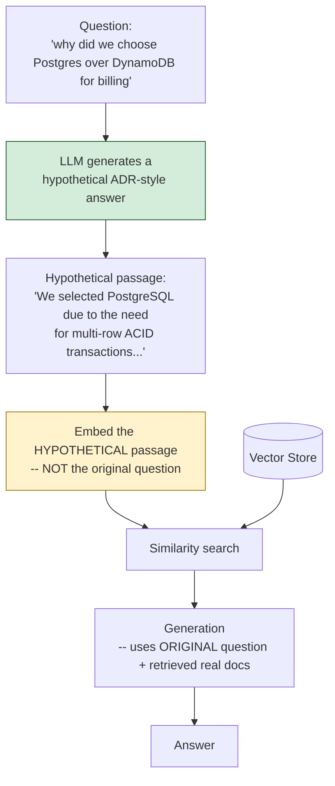

# Pattern 9: HyDE (Hypothetical Document Embeddings)

[← Back to index](README.md)

## 1. What is HyDE?

HyDE stands for **Hypothetical Document Embeddings**. Instead of embedding the user's
*question* and searching for chunks similar to it, HyDE asks the LLM to first **write a
short hypothetical answer** to the question — as if it were an excerpt from the actual
documentation — and then embeds *that hypothetical answer* to search the vector store.

The insight: a question and its answer are often phrased very differently ("why did we
pick X over Y" vs. a formal ADR passage explaining a tradeoff), but a *plausible-sounding
answer*, even a fabricated one, tends to be phrased much more like the real answer than
the question itself. Documents are more similar to other documents (in style and
vocabulary) than a question is to a document.

## 2. What problem does it solve?

Rewriting (Pattern 7) and Expansion (Pattern 6) both still operate on the *question's*
side of the vocabulary gap — they try to guess what words the doc might use. HyDE takes
a different approach: generate something that already looks like the doc, then search
with that. This is especially effective when:

- The question is **abstract or conceptual** rather than keyword-based (e.g. "why did
  we choose Postgres over DynamoDB" vs. "Postgres DynamoDB").
- The corpus consists of **prose-heavy documents** (ADRs, postmortems, whitepapers)
  where the answer's phrasing is genuinely unpredictable from the question alone, so no
  fixed synonym list (Expansion) or single rewrite (Rewriting) reliably captures it.
- Rewriting keeps producing rewrites that are *still* too question-shaped — HyDE
  sidesteps that by generating something answer-shaped instead.

## 3. Realistic production scenario

**Company:** the internal engineering knowledge base, focusing specifically on its ADR
(Architecture Decision Record) collection — dense, formally-written prose documents
explaining past technical decisions.

**Problem:** questions like *"why did we choose Postgres over DynamoDB for billing"* or
*"what made us pick gRPC instead of REST for internal services"* retrieve inconsistently
under both rewriting and expansion, because ADR prose doesn't share obvious keyword
overlap with how engineers phrase these questions conversationally — the reasoning in
an ADR ("multi-row ACID transaction requirements") is several inferential steps away
from the question's own wording ("why did we choose X over Y").

**Goal:** for ADR-style questions, generate a short hypothetical ADR excerpt answering
the question, embed that instead of the question, and retrieve against it.

## 4. Architecture / flow diagram



## 5. Request-to-response walkthrough

1. **User asks:** *"why did we choose Postgres over DynamoDB for billing"*.
2. **Hypothetical generation:** the LLM is prompted to write a short (2-3 sentence)
   passage *as if it were an excerpt from the real ADR* answering this question. It
   doesn't need to be factually correct — it only needs to sound like real
   documentation, using the vocabulary and register such a document would use.
3. **Embed the hypothetical, not the question.** This is the crux of HyDE: the
   embedding vector used for retrieval comes from the fabricated passage, which is
   stylistically much closer to the real ADR than the original question was.
4. **Retrieval runs** against this hypothetical-passage embedding, finding real ADR
   chunks whose phrasing resembles the generated hypothetical one.
5. **Generation uses the original question** (not the hypothetical) paired with the
   *real* retrieved chunks — the hypothetical passage was purely a retrieval aid and is
   discarded before generation, never shown to the user, and never treated as a source
   of truth.
6. **Answer returned**, grounded in the real ADR content, along with the hypothetical
   passage used for retrieval (useful for debugging retrieval quality, not shown to
   end users).

## 6. Why this pattern is appropriate here

- **Directly targets the question-to-document stylistic gap**, which is a different
  problem from vocabulary mismatch (Rewriting) or narrow phrasing (Expansion) — HyDE
  works even when there's no shared keyword at all between question and answer, because
  it searches in "document style space" rather than "question style space."
- **The hypothetical never needs to be factually correct** — this is a subtle but
  important property: HyDE isn't trying to answer the question, only to *sound like*
  the kind of document that would. A confidently wrong hypothetical passage can still
  retrieve the right real document, because retrieval only cares about embedding
  similarity, not truth.
- **Critical safety property:** the hypothetical passage must **never** leak into the
  final answer or be treated as a citable source — it's a fabrication by construction.
  Generation must always be grounded in the real retrieved chunks.
- **When this is *not* enough:** for terse, keyword-heavy queries (Pattern 6's use
  case), generating a fake full passage is overkill and slower than simple expansion;
  HyDE earns its extra LLM call specifically on prose-heavy, conceptual questions.

## 7. Production-quality implementation (Java / Spring AI)

```java
package com.acme.rag.hyde;

import org.springframework.ai.chat.client.ChatClient;
import org.springframework.ai.chat.prompt.PromptTemplate;
import org.springframework.ai.document.Document;
import org.springframework.ai.ollama.OllamaChatModel;
import org.springframework.ai.ollama.OllamaEmbeddingModel;
import org.springframework.ai.ollama.api.OllamaApi;
import org.springframework.ai.ollama.api.OllamaOptions;
import org.springframework.ai.transformer.splitter.TokenTextSplitter;
import org.springframework.ai.vectorstore.SearchRequest;
import org.springframework.ai.vectorstore.SimpleVectorStore;

import java.io.IOException;
import java.io.UncheckedIOException;
import java.nio.file.Files;
import java.nio.file.Path;
import java.util.List;
import java.util.Map;
import java.util.stream.Collectors;

/**
 * HyDE (Hypothetical Document Embeddings) -- generate a fake but plausible
 * answer passage, embed THAT for retrieval instead of the raw question, then
 * generate the real answer from the real retrieved documents.
 */
public final class HydeApp {

    record RagConfig(
            String embeddingModel, String llmModel, double llmTemperature,
            int chunkSize, int chunkOverlap, int topK, Path persistPath) {

        static RagConfig defaults() {
            return new RagConfig("nomic-embed-text", "llama3.1", 0.0, 700, 100, 4,
                    Path.of("./vectorstore_adrs_hyde.json"));
        }
    }

    static final class HypotheticalDocumentGenerator {
        private static final String SYSTEM = """
                Write a short (2-3 sentence) hypothetical passage answering this question,
                as if it were an excerpt from a real internal architecture decision record
                (ADR). It does NOT need to be factually correct -- it only needs to sound
                like real ADR prose, using the vocabulary and register such a document
                would use. Respond with ONLY the passage, nothing else.
                """;
        private final ChatClient chatClient;

        HypotheticalDocumentGenerator(ChatClient chatClient) { this.chatClient = chatClient; }

        String generate(String question) {
            try {
                String passage = chatClient.prompt().system(SYSTEM).user(question)
                        .call().content().trim();
                return passage.isEmpty() ? question : passage;
            } catch (Exception ex) {
                System.err.println("HyDE generation failed, falling back to original question: " + ex);
                return question;
            }
        }
    }

    static final class HydeAdrSearch {
        private static final String GEN_SYSTEM = """
                You are an internal engineering search assistant specializing in
                architecture decisions. Answer using ONLY the context below, which is
                real ADR content. If the context does not contain the answer, say so
                explicitly -- do not rely on general knowledge of "typical" architecture
                decisions.

                Context:
                {context}
                """;

        private final RagConfig config;
        private final SimpleVectorStore vectorStore;
        private final ChatClient chatClient;
        private final HypotheticalDocumentGenerator hydeGenerator;
        private final PromptTemplate genPromptTemplate = new PromptTemplate(GEN_SYSTEM);

        HydeAdrSearch(RagConfig config, OllamaEmbeddingModel embeddingModel,
                      OllamaChatModel chatModel, Path sourceDir) {
            this.config = config;
            this.chatClient = ChatClient.create(chatModel);
            this.hydeGenerator = new HypotheticalDocumentGenerator(chatClient);
            this.vectorStore = buildOrLoad(embeddingModel, sourceDir);
        }

        private SimpleVectorStore buildOrLoad(OllamaEmbeddingModel embeddingModel, Path sourceDir) {
            SimpleVectorStore store = SimpleVectorStore.builder(embeddingModel).build();
            if (Files.exists(config.persistPath())) {
                store.load(config.persistPath().toFile());
                return store;
            }
            List<Document> docs;
            try (var files = Files.list(sourceDir)) {
                docs = files.filter(p -> p.toString().endsWith(".md")).sorted()
                        .map(p -> {
                            try {
                                return new Document(Files.readString(p),
                                        Map.of("source", p.getFileName().toString()));
                            } catch (IOException e) { throw new UncheckedIOException(e); }
                        }).collect(Collectors.toList());
            } catch (IOException e) { throw new UncheckedIOException(e); }
            TokenTextSplitter splitter = new TokenTextSplitter(
                    config.chunkSize(), config.chunkOverlap(), 5, 10000, true);
            List<Document> chunks = splitter.apply(docs);
            store.add(chunks);
            store.save(config.persistPath().toFile());
            return store;
        }

        record AskResult(String answer, String hypotheticalPassage, List<String> sources) {}

        AskResult ask(String question) {
            if (question == null || question.isBlank()) {
                throw new IllegalArgumentException("Question must not be empty.");
            }

            String hypothetical = hydeGenerator.generate(question);
            System.out.println("HyDE hypothetical passage: " + hypothetical);

            List<Document> retrieved;
            try {
                // Critical: embed the HYPOTHETICAL passage, not the original question.
                retrieved = vectorStore.similaritySearch(
                        SearchRequest.builder().query(hypothetical).topK(config.topK()).build());
            } catch (Exception ex) {
                System.err.println("Retrieval failed: " + ex);
                retrieved = List.of();
            }

            String context = retrieved.stream()
                    .map(d -> "[" + d.getMetadata().getOrDefault("source", "unknown") + "]\n" + d.getText())
                    .collect(Collectors.joining("\n\n---\n\n"));

            String answer;
            try {
                String systemMessage = genPromptTemplate.render(Map.of("context", context));
                // Critical: generation uses the ORIGINAL question, never the fabricated
                // hypothetical passage -- the hypothetical is retrieval-only.
                answer = chatClient.prompt().system(systemMessage).user(question).call().content();
            } catch (Exception ex) {
                System.err.println("Generation failed: " + ex);
                answer = "Sorry, something went wrong answering that question.";
            }

            List<String> sources = retrieved.stream()
                    .map(d -> String.valueOf(d.getMetadata().getOrDefault("source", "unknown")))
                    .collect(Collectors.toList());

            return new AskResult(answer, hypothetical, sources);
        }
    }

    private static void writeSampleDocs(Path dir) throws IOException {
        Files.createDirectories(dir);
        Files.writeString(dir.resolve("adr_014.md"), """
                ## ADR-014: Billing Service Datastore Selection
                We selected PostgreSQL over DynamoDB for the billing service due to the
                need for multi-row ACID transactions across invoice line items, which
                DynamoDB's single-item transaction model does not support as naturally.
                """);
        Files.writeString(dir.resolve("adr_022.md"), """
                ## ADR-022: Internal Service Communication Protocol
                We adopted gRPC over REST for internal service-to-service calls, driven
                primarily by the need for strongly-typed contracts via Protocol Buffers
                and lower serialization overhead under high request volume.
                """);
    }

    public static void main(String[] args) throws IOException {
        RagConfig config = RagConfig.defaults();
        Path sampleDir = Path.of("./sample_adrs_hyde");
        writeSampleDocs(sampleDir);

        OllamaApi ollamaApi = OllamaApi.builder().baseUrl("http://localhost:11434").build();
        OllamaEmbeddingModel embeddingModel = OllamaEmbeddingModel.builder()
                .ollamaApi(ollamaApi)
                .defaultOptions(OllamaOptions.builder().model(config.embeddingModel()).build())
                .build();
        OllamaChatModel chatModel = OllamaChatModel.builder()
                .ollamaApi(ollamaApi)
                .defaultOptions(OllamaOptions.builder().model(config.llmModel())
                        .temperature(config.llmTemperature()).build())
                .build();

        HydeAdrSearch bot = new HydeAdrSearch(config, embeddingModel, chatModel, sampleDir);

        List<String> questions = List.of(
                "why did we choose Postgres over DynamoDB for billing",
                "what made us pick gRPC instead of REST for internal services");

        for (String q : questions) {
            HydeAdrSearch.AskResult result = bot.ask(q);
            System.out.println("\nQ: " + q);
            System.out.println("  sources: " + result.sources());
            System.out.println("A: " + result.answer());
        }
    }
}
```

### Key production details worth noting

- **Two separate uses of the question are strictly kept apart**: the hypothetical
  passage (fabricated) drives *retrieval only*; the original question drives
  *generation only*, paired with the *real* retrieved chunks. Never let the fabricated
  passage leak into the final prompt as if it were a real source — that would silently
  reintroduce the exact hallucination risk RAG exists to prevent.
- **Graceful fallback:** if hypothetical generation fails, retrieval falls back to
  embedding the raw question directly — degraded HyDE behavior, not a broken pipeline.
- **HyDE costs one extra LLM call per query** (to generate the hypothetical) compared
  to Basic RAG — reserve it for query types (via the Pattern 5 router) where this cost
  is justified: prose-heavy, conceptual questions, not terse keyword lookups.
- **The hypothetical passage is logged but never surfaced to the end user** — it's
  useful purely as a debugging/observability artifact to understand *why* certain
  chunks were retrieved.

---
[← Back to index](README.md)
