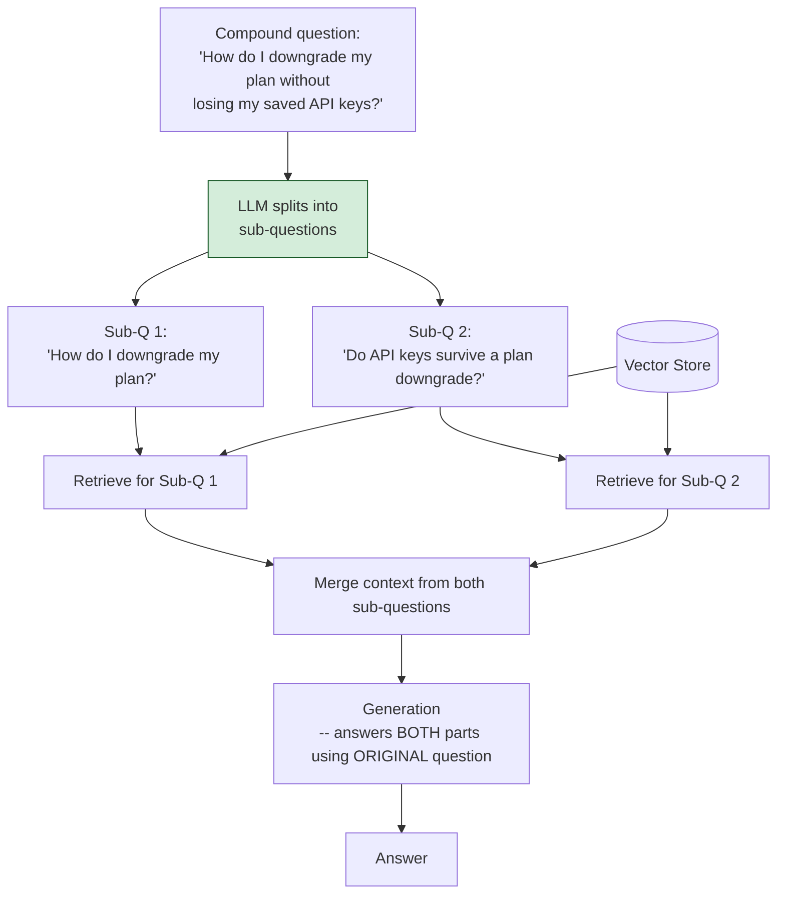

# Pattern 10: Query Decomposition

[← Back to index](README.md)

## 1. What is Query Decomposition?

Query Decomposition splits **one compound question into several independent
sub-questions**, retrieves separately for each sub-question, and then gives the LLM all
the sub-answers' context together so it can compose a single answer that actually
addresses every part of what was asked.

This is different from Multi-Query RAG (Pattern 8): Multi-Query generates several
*alternate phrasings of the same question* to hedge against ambiguity; Decomposition
splits a question that is **genuinely asking multiple distinct things** into its
component parts, because a single retrieval pass — no matter how well-phrased — can
only reliably surface chunks for one topic at a time.

## 2. What problem does it solve?

Compound questions are extremely common in real usage and are the one query shape that
*no single-query strategy* can fully solve, because the answer genuinely requires facts
from more than one place in the corpus:

- *"What's our incident process and who do I page for a database outage?"* — two
  distinct topics (process docs, on-call escalation docs).
- *"What's the difference between the Pro and Enterprise plans, and which one includes
  SSO?"* — a comparison plus a specific feature lookup.
- *"How do I downgrade my plan without losing my saved API keys?"* — this was the
  original motivating example from Pattern 2's Naive RAG failure catalogue.

A single retrieval pass against the whole compound question tends to retrieve chunks
biased toward whichever sub-topic dominates the embedding (usually the first or most
prominent clause), silently dropping the other part of the question. Decomposition
fixes this structurally by giving each sub-question its own dedicated retrieval pass.

## 3. Realistic production scenario

**Company:** the SaaS support bot, revisiting the exact failure case first flagged back
in Pattern 2's Naive RAG diagnostics: *"How do I downgrade my plan without losing my
saved API keys?"*, where the answer spans the billing docs (how to downgrade) and the
API docs (whether keys survive a downgrade).

**Goal:** detect compound questions, split them into independent sub-questions, run
retrieval for each sub-question separately, and merge all retrieved context so the
final answer addresses both parts — closing the loop on a failure mode identified all
the way back in Pattern 2.

## 4. Architecture / flow diagram



## 5. Request-to-response walkthrough

1. **User asks:** *"How do I downgrade my plan without losing my saved API keys?"*
2. **Compound detection + decomposition:** the LLM is prompted to split the question
   into independent sub-questions — here, "How do I downgrade my plan?" and "Do API
   keys survive a plan downgrade?" A question that turns out *not* to be compound
   returns a single sub-question (itself), so this stage degrades gracefully into a
   normal single-query pipeline when there's nothing to split.
3. **Independent retrieval per sub-question:** each sub-question is embedded and
   searched separately, so the billing docs section on downgrading and the API docs
   section on key retention are *both* reliably retrieved — neither has to "win" a
   shared top-k the way it would under a single combined query.
4. **Merge context:** all retrieved chunks from every sub-question are combined into
   one context block, tagged by which sub-question retrieved them (useful for
   debugging and for the LLM to reason about which facts answer which part).
5. **Generation:** the LLM answers using the *original* compound question (never the
   sub-questions) so the final answer is phrased naturally and addresses both parts in
   one coherent response, rather than reading like two disconnected answers stapled
   together.
6. **Answer returned**, along with the sub-questions used and every source touched.

## 6. Why this pattern is appropriate here

- **This is the structural fix for the exact failure mode identified in Pattern 2**
  (`"How do I downgrade my plan without losing my saved API keys?"` retrieving only one
  of the two relevant doc sections) — closing a loop that's been open since the
  beginning of this series.
- **Retrieval per sub-question means no topic has to compete with another for a shared
  top-k budget** — this is a fundamentally different fix from re-ranking (Pattern 20),
  which improves *which* chunks are kept from one retrieval, not *how many independent
  retrievals* happen.
- **Graceful degradation:** a genuinely simple, non-compound question decomposes into a
  single "sub-question" that equals the original — so this stage is safe to run
  unconditionally as a first step, or gated behind the Pattern 5 router as a `compound`
  branch, without penalizing simple questions with unnecessary complexity.
- **When this is *not* enough:** if answering the second sub-question depends on the
  *answer* to the first (not just its own independent retrieval — e.g. "what's the
  timeout for the service that handles our highest-traffic endpoint" requires first
  finding which service that is, then looking up its timeout), you need Multi-Hop RAG
  (Pattern 23), which chains retrieval steps sequentially rather than fanning them out
  in parallel.

## 7. Production-quality implementation (Java / Spring AI)

```java
package com.acme.rag.decomposition;

import org.springframework.ai.chat.client.ChatClient;
import org.springframework.ai.chat.prompt.PromptTemplate;
import org.springframework.ai.document.Document;
import org.springframework.ai.ollama.OllamaChatModel;
import org.springframework.ai.ollama.OllamaEmbeddingModel;
import org.springframework.ai.ollama.api.OllamaApi;
import org.springframework.ai.ollama.api.OllamaOptions;
import org.springframework.ai.transformer.splitter.TokenTextSplitter;
import org.springframework.ai.vectorstore.SearchRequest;
import org.springframework.ai.vectorstore.SimpleVectorStore;

import java.io.IOException;
import java.io.UncheckedIOException;
import java.nio.file.Files;
import java.nio.file.Path;
import java.util.ArrayList;
import java.util.LinkedHashMap;
import java.util.List;
import java.util.Map;
import java.util.concurrent.CompletableFuture;
import java.util.stream.Collectors;

/**
 * Query Decomposition -- split a compound question into independent
 * sub-questions, retrieve separately for each, merge context, then answer
 * the ORIGINAL compound question using the combined context.
 */
public final class QueryDecompositionApp {

    record RagConfig(
            String embeddingModel, String llmModel, double llmTemperature,
            int chunkSize, int chunkOverlap, int topKPerSubQuestion, Path persistPath) {

        static RagConfig defaults() {
            return new RagConfig("nomic-embed-text", "llama3.1", 0.0, 700, 100, 3,
                    Path.of("./vectorstore_support_docs_decomp.json"));
        }
    }

    static final class QueryDecomposer {
        private static final String SYSTEM = """
                If this question asks about more than one distinct topic, split it into
                independent sub-questions, one per line, no numbering, no extra text.
                If it is already a single, simple question, respond with the question
                unchanged as the only line.
                """;
        private final ChatClient chatClient;

        QueryDecomposer(ChatClient chatClient) { this.chatClient = chatClient; }

        List<String> decompose(String question) {
            try {
                String raw = chatClient.prompt().system(SYSTEM).user(question).call().content();
                List<String> subQuestions = new ArrayList<>();
                for (String line : raw.split("\\R")) {
                    String trimmed = line.strip().replaceAll("^[-\u2022\\d.\\s]+", "");
                    if (!trimmed.isEmpty()) subQuestions.add(trimmed);
                }
                return subQuestions.isEmpty() ? List.of(question) : subQuestions;
            } catch (Exception ex) {
                System.err.println("Decomposition failed, falling back to single question: " + ex);
                return List.of(question);
            }
        }
    }

    static final class QueryDecompositionSupportBot {
        private static final String GEN_SYSTEM = """
                You are a customer support assistant for Acme SaaS. The context below was
                gathered by answering several sub-questions related to the user's actual
                question -- use it to address every part of what the user asked, in one
                coherent answer. Answer using ONLY the context. If part of the question
                isn't covered by the context, say so explicitly for that part.

                Context:
                {context}
                """;

        private final RagConfig config;
        private final SimpleVectorStore vectorStore;
        private final ChatClient chatClient;
        private final QueryDecomposer decomposer;
        private final PromptTemplate genPromptTemplate = new PromptTemplate(GEN_SYSTEM);

        QueryDecompositionSupportBot(RagConfig config, OllamaEmbeddingModel embeddingModel,
                                      OllamaChatModel chatModel, Path sourceDir) {
            this.config = config;
            this.chatClient = ChatClient.create(chatModel);
            this.decomposer = new QueryDecomposer(chatClient);
            this.vectorStore = buildOrLoad(embeddingModel, sourceDir);
        }

        private SimpleVectorStore buildOrLoad(OllamaEmbeddingModel embeddingModel, Path sourceDir) {
            SimpleVectorStore store = SimpleVectorStore.builder(embeddingModel).build();
            if (Files.exists(config.persistPath())) {
                store.load(config.persistPath().toFile());
                return store;
            }
            List<Document> docs;
            try (var files = Files.list(sourceDir)) {
                docs = files.filter(p -> p.toString().endsWith(".md")).sorted()
                        .map(p -> {
                            try {
                                return new Document(Files.readString(p),
                                        Map.of("source", p.getFileName().toString()));
                            } catch (IOException e) { throw new UncheckedIOException(e); }
                        }).collect(Collectors.toList());
            } catch (IOException e) { throw new UncheckedIOException(e); }
            TokenTextSplitter splitter = new TokenTextSplitter(
                    config.chunkSize(), config.chunkOverlap(), 5, 10000, true);
            List<Document> chunks = splitter.apply(docs);
            store.add(chunks);
            store.save(config.persistPath().toFile());
            return store;
        }

        record AskResult(String answer, List<String> subQuestions, List<String> sources) {}

        AskResult ask(String question) {
            if (question == null || question.isBlank()) {
                throw new IllegalArgumentException("Question must not be empty.");
            }

            List<String> subQuestions = decomposer.decompose(question);
            System.out.println("Sub-questions: " + subQuestions);

            List<CompletableFuture<List<Document>>> futures = subQuestions.stream()
                    .map(sq -> CompletableFuture.supplyAsync(() -> retrieve(sq)))
                    .collect(Collectors.toList());

            Map<String, Document> merged = new LinkedHashMap<>();
            for (CompletableFuture<List<Document>> future : futures) {
                for (Document doc : future.join()) {
                    String key = doc.getMetadata().getOrDefault("source", "?")
                            + "|" + doc.getText().substring(0, Math.min(60, doc.getText().length()));
                    merged.putIfAbsent(key, doc);
                }
            }

            List<Document> mergedDocs = new ArrayList<>(merged.values());
            String context = mergedDocs.stream()
                    .map(d -> "[" + d.getMetadata().getOrDefault("source", "unknown") + "]\n" + d.getText())
                    .collect(Collectors.joining("\n\n---\n\n"));

            String answer;
            try {
                String systemMessage = genPromptTemplate.render(Map.of("context", context));
                answer = chatClient.prompt().system(systemMessage).user(question).call().content();
            } catch (Exception ex) {
                System.err.println("Generation failed: " + ex);
                answer = "Sorry, something went wrong answering that question.";
            }

            List<String> sources = mergedDocs.stream()
                    .map(d -> String.valueOf(d.getMetadata().getOrDefault("source", "unknown")))
                    .collect(Collectors.toList());

            return new AskResult(answer, subQuestions, sources);
        }

        private List<Document> retrieve(String subQuestion) {
            try {
                return vectorStore.similaritySearch(
                        SearchRequest.builder().query(subQuestion).topK(config.topKPerSubQuestion()).build());
            } catch (Exception ex) {
                System.err.println("Retrieval failed for sub-question '" + subQuestion + "': " + ex);
                return List.of();
            }
        }
    }

    private static void writeSampleDocs(Path dir) throws IOException {
        Files.createDirectories(dir);
        Files.writeString(dir.resolve("billing.md"), """
                ## Downgrading Your Plan
                To downgrade your plan, go to Account Settings > Billing > Change Plan and
                select a lower tier. The change takes effect at the start of your next
                billing cycle.
                """);
        Files.writeString(dir.resolve("api_keys.md"), """
                ## API Key Retention on Downgrade
                Downgrading your plan does not delete existing API keys. Keys remain active
                but are subject to the rate limits of your new plan tier.
                """);
        Files.writeString(dir.resolve("incident_process.md"), """
                ## Incident Response Process
                All incidents are declared in #incidents and tracked in the incident tracker.

                ## On-Call Escalation
                Database outages should be paged to the Data Platform on-call rotation via
                PagerDuty, escalation policy 'db-platform-primary'.
                """);
    }

    public static void main(String[] args) throws IOException {
        RagConfig config = RagConfig.defaults();
        Path sampleDir = Path.of("./sample_support_docs_decomp");
        writeSampleDocs(sampleDir);

        OllamaApi ollamaApi = OllamaApi.builder().baseUrl("http://localhost:11434").build();
        OllamaEmbeddingModel embeddingModel = OllamaEmbeddingModel.builder()
                .ollamaApi(ollamaApi)
                .defaultOptions(OllamaOptions.builder().model(config.embeddingModel()).build())
                .build();
        OllamaChatModel chatModel = OllamaChatModel.builder()
                .ollamaApi(ollamaApi)
                .defaultOptions(OllamaOptions.builder().model(config.llmModel())
                        .temperature(config.llmTemperature()).build())
                .build();

        QueryDecompositionSupportBot bot =
                new QueryDecompositionSupportBot(config, embeddingModel, chatModel, sampleDir);

        List<String> questions = List.of(
                "How do I downgrade my plan without losing my saved API keys?",
                "what's our incident process and who do I page for a database outage",
                "How do I reset my password?"); // simple, non-compound control case

        for (String q : questions) {
            QueryDecompositionSupportBot.AskResult result = bot.ask(q);
            System.out.println("\nQ: " + q);
            System.out.println("  sub-questions: " + result.subQuestions());
            System.out.println("  sources: " + result.sources());
            System.out.println("A: " + result.answer());
        }
    }
}
```

### Key production details worth noting

- **Decomposition degrades gracefully for simple questions**: the prompt explicitly
  instructs the LLM to return the question unchanged as a single line when it isn't
  compound, so this stage is safe to run unconditionally without penalizing simple
  lookups with unnecessary complexity — the "How do I reset my password?" control case
  in `main` demonstrates this.
- **Parallel retrieval across sub-questions** (via `CompletableFuture`, same technique
  as Pattern 8) keeps latency close to a single retrieval round-trip even when the
  question splits into several parts.
- **Generation always uses the original compound question**, never the sub-questions
  directly — this keeps the final answer phrased as one coherent response rather than
  reading like disconnected sub-answers concatenated together.
- **This pattern and Multi-Query RAG (Pattern 8) share almost the same code shape**
  (LLM generates several queries → parallel retrieve → merge → generate) but solve
  different problems: Multi-Query hedges against *ambiguity* in a single-topic
  question; Decomposition handles a question that is *structurally* asking about
  multiple topics. Recognizing which one a given query needs is exactly the job of the
  Pattern 5 router.

---
[← Back to index](README.md)
