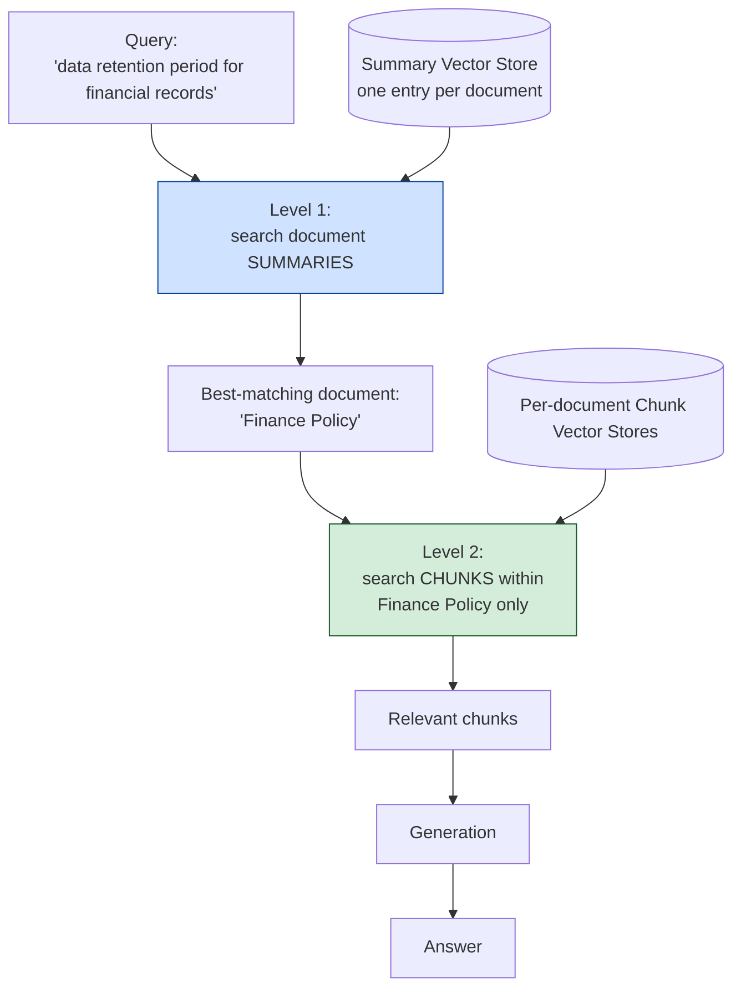

# Pattern 11: Recursive Retrieval

[← Back to index](README.md)

## 1. What is Recursive Retrieval?

Recursive Retrieval organizes the corpus into a **hierarchy** — top-level document/
section summaries, then chunks within each section — and retrieves in stages: first
find the *right section* by searching only summaries, then search *within just that
section's chunks* for the specific answer. Each stage narrows the search space before
the next, recursively, instead of searching the entire flat chunk collection in one
shot.

Think of it like using a book's table of contents before flipping to a specific page,
rather than reading every page to find one sentence.

## 2. What problem does it solve?

A flat index over a *large* corpus (hundreds of documents, tens of thousands of chunks)
has two structural problems:

- **Needle-in-haystack dilution.** With enough chunks, several *unrelated* documents
  can contain chunks that are superficially similar to a query, competing with the
  actually-relevant chunk for a spot in the top-k.
- **Wasted embedding-space precision.** A flat search treats a chunk from an unrelated
  100-page manual and a chunk from the exactly-relevant 2-page policy with equal
  standing — there's no way to first rule out whole documents that aren't relevant at
  all before comparing at the fine-grained chunk level.

Recursive Retrieval fixes this by adding a coarse filtering stage: first identify the
*document or section* most likely to contain the answer (searching against short,
information-dense summaries, where a wrong summary rarely looks deceptively similar),
then do the expensive detailed search only within that narrowed set.

## 3. Realistic production scenario

**Company:** the same company from Pattern 1, but scaled up — instead of a small HR
handbook, this is now a large **compliance and policy corpus**: dozens of full policy
documents (data retention, security, procurement, HR, legal, finance), each tens of
pages long, totaling thousands of chunks.

**Problem:** a flat top-k search for *"what's our data retention period for financial
records"* sometimes surfaces chunks from the Security policy (which also mentions "data
retention" in an access-logs context) ahead of the actually-relevant Finance policy
chunk, because both use similar vocabulary.

**Goal:** build a two-level recursive index: one summary per policy document (short,
LLM-generated abstracts), and the full chunk-level index *scoped per document*.
Retrieval first finds the most relevant document(s) via the summary index, then
searches only within that document's own chunk index.

## 4. Architecture / flow diagram



## 5. Request-to-response walkthrough

1. **Query comes in:** *"what's our data retention period for financial records"*.
2. **Level 1 — summary search:** the query is embedded and compared only against the
   small summary index (one short LLM-generated abstract per document — maybe a dozen
   entries total, not thousands of chunks). The Finance Policy summary
   ("covers invoicing, financial record retention, audit requirements...") scores
   highest.
3. **Narrow to that document.** The system now knows to search *only* within the
   Finance Policy's own chunk-level index — the Security policy's chunks are never even
   considered, regardless of superficial vocabulary overlap.
4. **Level 2 — chunk search:** within the Finance Policy's chunks only, a normal
   top-k similarity search finds the specific paragraph stating the retention period.
5. **Generation** proceeds using only these narrowly-scoped, highly relevant chunks.
6. **Answer returned**, along with which document was selected at Level 1 — useful for
   verifying the coarse routing decision was correct.

## 6. Why this pattern is appropriate here

- **Summaries are short and semantically distinct by design** (each covers one whole
  document's topic), so Level 1 search is both cheap and much less prone to the
  vocabulary-overlap confusion that plagues flat search over thousands of chunks from
  many different documents.
- **Scales gracefully as the corpus grows.** Adding a new 50-page policy document adds
  one new summary entry to Level 1 and one new isolated chunk index — it does not
  increase noise in the existing per-document chunk searches at all.
- **Distinct from Modular RAG's domain routing (Pattern 4):** Modular RAG routes by a
  small, fixed set of *known* domains classified by an LLM; Recursive Retrieval routes
  by *embedding similarity against summaries*, which scales to hundreds of documents
  without needing a hand-maintained classification scheme, and can recurse through
  multiple levels (book → chapter → section → paragraph) rather than a flat one-level
  domain split.
- **When this is *not* enough:** if the right answer requires combining facts *from
  more than one document* (e.g. comparing retention periods across two policies), a
  single Level-1 selection that commits to one document is too rigid — that's better
  served by Multi-Hop RAG (Pattern 23) or by retrieving the top few documents at Level 1
  instead of just one (a simple, effective tweak to this same pattern).

## 7. Production-quality implementation (Java / Spring AI)

```java
package com.acme.rag.recursive;

import org.springframework.ai.chat.client.ChatClient;
import org.springframework.ai.chat.prompt.PromptTemplate;
import org.springframework.ai.document.Document;
import org.springframework.ai.ollama.OllamaChatModel;
import org.springframework.ai.ollama.OllamaEmbeddingModel;
import org.springframework.ai.ollama.api.OllamaApi;
import org.springframework.ai.ollama.api.OllamaOptions;
import org.springframework.ai.transformer.splitter.TokenTextSplitter;
import org.springframework.ai.vectorstore.SearchRequest;
import org.springframework.ai.vectorstore.SimpleVectorStore;

import java.io.IOException;
import java.io.UncheckedIOException;
import java.nio.file.Files;
import java.nio.file.Path;
import java.util.HashMap;
import java.util.List;
import java.util.Map;
import java.util.stream.Collectors;

/**
 * Recursive Retrieval -- two-level index: search short document summaries
 * first (Level 1), then search chunks ONLY within the winning document's own
 * chunk index (Level 2).
 */
public final class RecursiveRetrievalApp {

    record RagConfig(
            String embeddingModel, String llmModel, double llmTemperature,
            int chunkSize, int chunkOverlap, int topDocumentsAtLevel1, int topKAtLevel2,
            Path persistRoot) {

        static RagConfig defaults() {
            return new RagConfig("nomic-embed-text", "llama3.1", 0.0, 500, 60, 1, 4,
                    Path.of("./vectorstore_compliance_corpus"));
        }
    }

    /** Generates a short abstract for a whole document, used as the Level 1 index entry. */
    static final class SummaryGenerator {
        private static final String SYSTEM = """
                Write a 1-2 sentence abstract of this policy document, describing what
                topics and questions it would be relevant for answering. Respond with
                ONLY the abstract.
                """;
        private final ChatClient chatClient;

        SummaryGenerator(ChatClient chatClient) { this.chatClient = chatClient; }

        String summarize(String documentText, String documentName) {
            try {
                // Truncate for the summarization prompt to keep it fast; a real system
                // would summarize section-by-section for very long documents.
                String excerpt = documentText.length() > 3000 ? documentText.substring(0, 3000) : documentText;
                return chatClient.prompt().system(SYSTEM).user(excerpt).call().content().trim();
            } catch (Exception ex) {
                System.err.println("Summary generation failed for " + documentName + ": " + ex);
                return documentName; // fall back to the filename as a weak summary
            }
        }
    }

    /** Owns the two-level index: one summary store, and one chunk store per document. */
    static final class RecursiveIndex {
        private final RagConfig config;
        private final SimpleVectorStore summaryStore;
        private final Map<String, SimpleVectorStore> chunkStoresByDocument = new HashMap<>();

        RecursiveIndex(RagConfig config, OllamaEmbeddingModel embeddingModel,
                        SummaryGenerator summaryGenerator, Path sourceDir) {
            this.config = config;
            this.summaryStore = SimpleVectorStore.builder(embeddingModel).build();

            Path summaryPersistPath = config.persistRoot().resolve("summaries.json");
            if (Files.exists(summaryPersistPath)) {
                summaryStore.load(summaryPersistPath.toFile());
                loadChunkStores(embeddingModel, sourceDir);
                System.out.println("Loaded existing recursive index.");
                return;
            }

            buildFromScratch(embeddingModel, summaryGenerator, sourceDir, summaryPersistPath);
        }

        private void buildFromScratch(OllamaEmbeddingModel embeddingModel, SummaryGenerator summaryGenerator,
                                       Path sourceDir, Path summaryPersistPath) {
            List<Path> files;
            try (var stream = Files.list(sourceDir)) {
                files = stream.filter(p -> p.toString().endsWith(".md")).sorted().collect(Collectors.toList());
            } catch (IOException e) { throw new UncheckedIOException(e); }

            TokenTextSplitter splitter = new TokenTextSplitter(
                    config.chunkSize(), config.chunkOverlap(), 5, 10000, true);

            for (Path file : files) {
                String documentName = file.getFileName().toString();
                String fullText;
                try {
                    fullText = Files.readString(file);
                } catch (IOException e) { throw new UncheckedIOException(e); }

                // Level 1: one summary entry per document.
                String summary = summaryGenerator.summarize(fullText, documentName);
                summaryStore.add(List.of(new Document(summary, Map.of("document", documentName))));
                System.out.println("[" + documentName + "] summary: " + summary);

                // Level 2: this document's own isolated chunk store.
                SimpleVectorStore chunkStore = SimpleVectorStore.builder(embeddingModel).build();
                Document wholeDoc = new Document(fullText, Map.of("source", documentName));
                List<Document> chunks = splitter.apply(List.of(wholeDoc));
                chunkStore.add(chunks);
                chunkStoresByDocument.put(documentName, chunkStore);

                Path chunkPersistPath = config.persistRoot().resolve(documentName + ".chunks.json");
                try {
                    Files.createDirectories(chunkPersistPath.getParent());
                } catch (IOException e) { throw new UncheckedIOException(e); }
                chunkStore.save(chunkPersistPath.toFile());
            }

            try {
                Files.createDirectories(summaryPersistPath.getParent());
            } catch (IOException e) { throw new UncheckedIOException(e); }
            summaryStore.save(summaryPersistPath.toFile());
        }

        private void loadChunkStores(OllamaEmbeddingModel embeddingModel, Path sourceDir) {
            try (var stream = Files.list(sourceDir)) {
                for (Path file : stream.filter(p -> p.toString().endsWith(".md")).sorted().toList()) {
                    String documentName = file.getFileName().toString();
                    SimpleVectorStore chunkStore = SimpleVectorStore.builder(embeddingModel).build();
                    Path chunkPersistPath = config.persistRoot().resolve(documentName + ".chunks.json");
                    chunkStore.load(chunkPersistPath.toFile());
                    chunkStoresByDocument.put(documentName, chunkStore);
                }
            } catch (IOException e) { throw new UncheckedIOException(e); }
        }

        /** Level 1: which document(s) best match this query, by summary similarity. */
        List<String> findCandidateDocuments(String query) {
            List<Document> topSummaries = summaryStore.similaritySearch(
                    SearchRequest.builder().query(query).topK(config.topDocumentsAtLevel1()).build());
            return topSummaries.stream()
                    .map(d -> String.valueOf(d.getMetadata().get("document")))
                    .collect(Collectors.toList());
        }

        /** Level 2: search only within the given document's own chunk store. */
        List<Document> searchWithinDocument(String documentName, String query) {
            SimpleVectorStore chunkStore = chunkStoresByDocument.get(documentName);
            if (chunkStore == null) return List.of();
            return chunkStore.similaritySearch(
                    SearchRequest.builder().query(query).topK(config.topKAtLevel2()).build());
        }
    }

    static final class RecursiveRetrievalBot {
        private static final String GEN_SYSTEM = """
                You are a compliance policy assistant. Answer using ONLY the context
                below. If the context does not contain the answer, say so explicitly.

                Context:
                {context}
                """;

        private final RecursiveIndex index;
        private final ChatClient chatClient;
        private final PromptTemplate genPromptTemplate = new PromptTemplate(GEN_SYSTEM);

        RecursiveRetrievalBot(RecursiveIndex index, ChatClient chatClient) {
            this.index = index;
            this.chatClient = chatClient;
        }

        record AskResult(String answer, List<String> documentsSelected, List<String> sources) {}

        AskResult ask(String question) {
            if (question == null || question.isBlank()) {
                throw new IllegalArgumentException("Question must not be empty.");
            }

            List<String> candidateDocuments = index.findCandidateDocuments(question);
            System.out.println("Level 1 selected document(s): " + candidateDocuments);

            List<Document> retrieved = candidateDocuments.stream()
                    .flatMap(doc -> index.searchWithinDocument(doc, question).stream())
                    .collect(Collectors.toList());

            String context = retrieved.stream()
                    .map(d -> "[" + d.getMetadata().getOrDefault("source", "unknown") + "]\n" + d.getText())
                    .collect(Collectors.joining("\n\n---\n\n"));

            String answer;
            try {
                String systemMessage = genPromptTemplate.render(Map.of("context", context));
                answer = chatClient.prompt().system(systemMessage).user(question).call().content();
            } catch (Exception ex) {
                System.err.println("Generation failed: " + ex);
                answer = "Sorry, something went wrong answering that question.";
            }

            List<String> sources = retrieved.stream()
                    .map(d -> String.valueOf(d.getMetadata().getOrDefault("source", "unknown")))
                    .collect(Collectors.toList());

            return new AskResult(answer, candidateDocuments, sources);
        }
    }

    private static void writeSampleDocs(Path dir) throws IOException {
        Files.createDirectories(dir);
        Files.writeString(dir.resolve("finance_policy.md"), """
                # Finance Policy
                ## Financial Record Retention
                All financial records, including invoices and audit logs, must be
                retained for a minimum of 7 years to comply with tax reporting
                requirements.
                ## Invoicing
                Invoices must be issued within 5 business days of service delivery.
                """);
        Files.writeString(dir.resolve("security_policy.md"), """
                # Security Policy
                ## Access Log Data Retention
                Access logs and authentication records are retained for 1 year for
                security auditing purposes, then automatically purged.
                ## Password Requirements
                All passwords must be at least 12 characters and rotated every 90 days.
                """);
        Files.writeString(dir.resolve("hr_policy.md"), """
                # HR Policy
                ## Sick Leave
                New employees accrue 6 paid sick days during their first year.
                ## Data Retention for Employee Records
                Employee records are retained for 3 years after termination.
                """);
    }

    public static void main(String[] args) throws IOException {
        RagConfig config = RagConfig.defaults();
        Path sampleDir = Path.of("./sample_compliance_corpus");
        writeSampleDocs(sampleDir);

        OllamaApi ollamaApi = OllamaApi.builder().baseUrl("http://localhost:11434").build();
        OllamaEmbeddingModel embeddingModel = OllamaEmbeddingModel.builder()
                .ollamaApi(ollamaApi)
                .defaultOptions(OllamaOptions.builder().model(config.embeddingModel()).build())
                .build();
        OllamaChatModel chatModel = OllamaChatModel.builder()
                .ollamaApi(ollamaApi)
                .defaultOptions(OllamaOptions.builder().model(config.llmModel())
                        .temperature(config.llmTemperature()).build())
                .build();
        ChatClient chatClient = ChatClient.create(chatModel);

        RecursiveIndex index = new RecursiveIndex(
                config, embeddingModel, new SummaryGenerator(chatClient), sampleDir);
        RecursiveRetrievalBot bot = new RecursiveRetrievalBot(index, chatClient);

        List<String> questions = List.of(
                "what's our data retention period for financial records",
                "how long do we keep access logs");

        for (String q : questions) {
            RecursiveRetrievalBot.AskResult result = bot.ask(q);
            System.out.println("\nQ: " + q);
            System.out.println("  document(s) selected: " + result.documentsSelected());
            System.out.println("  sources: " + result.sources());
            System.out.println("A: " + result.answer());
        }
    }
}
```

### Key production details worth noting

- **Two vector stores per document family**: one shared summary store (Level 1,
  small) and one isolated chunk store per document (Level 2, only ever searched when
  its parent summary wins) — this isolation is what actually prevents cross-document
  vocabulary bleed, the same underlying idea as Modular RAG's per-domain stores
  (Pattern 4), but built from embedding similarity over generated summaries instead of
  a hand-classified domain list.
- **`topDocumentsAtLevel1` defaults to 1** but is trivially widened to top-2 or top-3
  when a question might span multiple documents — a cheap way to trade some precision
  for recall without needing a full Multi-Hop architecture.
- **Summary generation happens once at index time**, not per query — the extra LLM
  call cost is paid during ingestion, not during every user request.
- **Graceful degradation:** if a document's chunk store is somehow missing, that
  document contributes nothing to `retrieved` rather than throwing — a partial answer
  from the documents that *did* resolve beats a hard failure.

---
[← Back to index](README.md)
