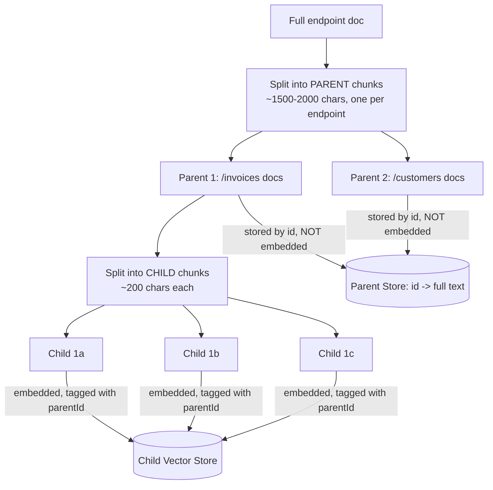
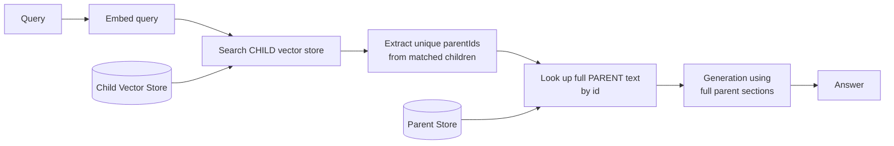

# Pattern 12: Parent-Child Retrieval

[← Back to index](README.md)

## 1. What is Parent-Child Retrieval?

Parent-Child Retrieval splits each document into two chunk sizes at once: **small
child chunks** used only for embedding and similarity search, and **larger parent
chunks** (or whole sections) that are what actually gets sent to the LLM once a child
chunk is retrieved. A vector search matches against the precise, narrow child chunk,
but the *parent* it belongs to — with all its surrounding context — is what's returned.

This directly resolves a tension every RAG system faces: small chunks embed more
precisely (a 150-character chunk about one specific fact has a sharp, unambiguous
embedding), but small chunks alone often don't contain *enough context* for the LLM to
answer well. Large chunks carry more context but embed more vaguely (a 1500-character
chunk touching five different sub-topics has a blurry, averaged-out embedding that
matches many queries poorly). Parent-Child Retrieval gets both: precise matching *and*
full context, by decoupling what's searched from what's returned.

## 2. What problem does it solve?

This is the direct, structural fix for failure mode ② from Pattern 2's Naive RAG
diagnostics — **"chunking breaks context."** A table, worked example, or multi-step
explanation that gets cut off at an arbitrary chunk boundary produces an incomplete
answer, no matter how good the retrieval ranking is, because the *chunk itself* is
missing the rest of the information. Sentence Window Retrieval (Pattern 13) solves a
related but narrower version of this problem (local sentence-level context); Parent-
Child solves it at the section level — the retrieved unit is a whole coherent section,
never a fragment.

## 3. Realistic production scenario

**Company:** a developer-facing API documentation site — each endpoint's docs include a
description, several paragraphs of explanation, a request example, a response example,
and a list of error codes, all as one long logical section per endpoint.

**Problem:** with flat chunking (Pattern 1-style), a query about *"what does the
/invoices endpoint return on a validation error"* sometimes retrieves only the error
codes list chunk, missing the explanatory paragraph one chunk earlier that clarifies
which fields trigger which error — the LLM answers from an incomplete fragment.

**Goal:** index small child chunks (~200 characters) for precise matching, but always
return the full parent section (~1500-2000 characters, the whole endpoint's docs) that
a matched child chunk belongs to, so generation always has complete context.

## 4. Architecture / flow diagram

**Indexing time:**



**Query time:**



## 5. Request-to-response walkthrough

1. **Indexing:** each endpoint's documentation becomes one parent chunk (the whole
   section). Each parent is further split into several small child chunks. Only the
   *children* are embedded and stored in the vector store, each tagged with its
   `parentId`. Parents themselves are stored separately, keyed by id, but never
   embedded — they're too long and topically broad to search against directly.
2. **User asks:** *"what does the /invoices endpoint return on a validation error"*.
3. **Child search:** the query is embedded and matched against child chunks — likely
   matching the small chunk that specifically mentions "validation error" within the
   /invoices section.
4. **Parent lookup:** instead of returning that narrow child chunk, the system looks up
   its `parentId` and retrieves the *entire* /invoices endpoint section — description,
   fields, examples, and the full error code list together.
5. **Deduplication:** if multiple matched children belong to the same parent (common,
   since children from the same section tend to rank near each other), the parent is
   only included once in the final context.
6. **Generation** uses the complete parent section(s), so the LLM has the explanatory
   paragraph *and* the error codes list together, however far apart they were within
   the original document.
7. **Answer returned**, complete and grounded, along with which endpoint(s) sections
   were used.

## 6. Why this pattern is appropriate here

- **Directly fixes context fragmentation** without needing bigger embeddings or a
  smarter model — it's a structural indexing decision, not a model capability issue.
- **Precision and completeness are no longer in tension.** Retrieval precision comes
  from small children; answer completeness comes from large parents; each chunk size is
  used for the job it's actually good at.
- **Cheap to implement on top of any existing flat-chunking pipeline** — it only
  changes what's stored where, not the embedding model, vector store technology, or
  generation step.
- **When this is *not* enough:** if a single answer needs facts from *multiple
  different parent sections* (e.g. comparing two endpoints), you still need
  Multi-Hop RAG (Pattern 23) or Query Decomposition (Pattern 10) on top of this —
  Parent-Child guarantees each individual section is complete, but doesn't merge across
  sections on its own.

## 7. Production-quality implementation (Java / Spring AI)

```java
package com.acme.rag.parentchild;

import org.springframework.ai.chat.client.ChatClient;
import org.springframework.ai.chat.prompt.PromptTemplate;
import org.springframework.ai.document.Document;
import org.springframework.ai.ollama.OllamaChatModel;
import org.springframework.ai.ollama.OllamaEmbeddingModel;
import org.springframework.ai.ollama.api.OllamaApi;
import org.springframework.ai.ollama.api.OllamaOptions;
import org.springframework.ai.transformer.splitter.TokenTextSplitter;
import org.springframework.ai.vectorstore.SearchRequest;
import org.springframework.ai.vectorstore.SimpleVectorStore;

import java.io.IOException;
import java.io.UncheckedIOException;
import java.nio.file.Files;
import java.nio.file.Path;
import java.util.LinkedHashSet;
import java.util.List;
import java.util.Map;
import java.util.Set;
import java.util.UUID;
import java.util.concurrent.ConcurrentHashMap;
import java.util.stream.Collectors;

/**
 * Parent-Child Retrieval -- index small child chunks for precise matching,
 * but always return the full parent section they belong to for generation.
 */
public final class ParentChildRetrievalApp {

    record RagConfig(
            String embeddingModel, String llmModel, double llmTemperature,
            int parentChunkSize, int parentChunkOverlap,
            int childChunkSize, int childChunkOverlap,
            int topKChildren, Path persistPath) {

        static RagConfig defaults() {
            return new RagConfig("nomic-embed-text", "llama3.1", 0.0,
                    1800, 0, 200, 20, 6,
                    Path.of("./vectorstore_api_docs_children.json"));
        }
    }

    /** Parents are stored in-memory keyed by id, never embedded, never searched directly. */
    static final class ParentStore {
        private final Map<String, Document> parentsById = new ConcurrentHashMap<>();

        void put(String id, Document parent) { parentsById.put(id, parent); }

        Document get(String id) { return parentsById.get(id); }
    }

    static final class ParentChildIndex {
        private final RagConfig config;
        private final SimpleVectorStore childVectorStore;
        private final ParentStore parentStore = new ParentStore();

        ParentChildIndex(RagConfig config, OllamaEmbeddingModel embeddingModel, Path sourceDir) {
            this.config = config;
            this.childVectorStore = SimpleVectorStore.builder(embeddingModel).build();

            if (Files.exists(config.persistPath())) {
                childVectorStore.load(config.persistPath().toFile());
                // NOTE: SimpleVectorStore's JSON persistence covers the child index only.
                // The parent store is rebuilt from source on every startup here for
                // simplicity; in production, persist parents too (e.g. in a small
                // key-value store or relational table keyed by parentId).
                rebuildParentStoreOnly(sourceDir);
                System.out.println("Loaded existing child index; rebuilt parent store from source.");
                return;
            }

            buildFromScratch(sourceDir);
        }

        private void buildFromScratch(Path sourceDir) {
            TokenTextSplitter parentSplitter = new TokenTextSplitter(
                    config.parentChunkSize(), config.parentChunkOverlap(), 5, 20000, true);
            TokenTextSplitter childSplitter = new TokenTextSplitter(
                    config.childChunkSize(), config.childChunkOverlap(), 5, 20000, true);

            List<Path> files;
            try (var stream = Files.list(sourceDir)) {
                files = stream.filter(p -> p.toString().endsWith(".md")).sorted().collect(Collectors.toList());
            } catch (IOException e) { throw new UncheckedIOException(e); }

            for (Path file : files) {
                String documentName = file.getFileName().toString();
                String fullText;
                try {
                    fullText = Files.readString(file);
                } catch (IOException e) { throw new UncheckedIOException(e); }

                Document wholeDoc = new Document(fullText, Map.of("source", documentName));
                List<Document> parents = parentSplitter.apply(List.of(wholeDoc));

                for (Document parent : parents) {
                    String parentId = UUID.randomUUID().toString();
                    parentStore.put(parentId, new Document(parent.getText(),
                            Map.of("source", documentName, "parentId", parentId)));

                    Document parentAsSource = new Document(parent.getText(), Map.of());
                    List<Document> children = childSplitter.apply(List.of(parentAsSource));
                    for (Document child : children) {
                        childVectorStore.add(List.of(new Document(child.getText(),
                                Map.of("source", documentName, "parentId", parentId))));
                    }
                }
            }

            childVectorStore.save(config.persistPath().toFile());
        }

        private void rebuildParentStoreOnly(Path sourceDir) {
            // Simplified rebuild: re-derive parents deterministically the same way
            // buildFromScratch does, but only populate parentStore, skip re-embedding.
            // In production, load persisted parents directly instead of recomputing.
            TokenTextSplitter parentSplitter = new TokenTextSplitter(
                    config.parentChunkSize(), config.parentChunkOverlap(), 5, 20000, true);
            try (var stream = Files.list(sourceDir)) {
                for (Path file : stream.filter(p -> p.toString().endsWith(".md")).sorted().toList()) {
                    String documentName = file.getFileName().toString();
                    String fullText = Files.readString(file);
                    Document wholeDoc = new Document(fullText, Map.of("source", documentName));
                    // Note: without persisted parentIds, this simplified rebuild cannot
                    // recover the exact original parentId-to-child mapping after a
                    // restart -- production systems must persist the ParentStore itself.
                    parentSplitter.apply(List.of(wholeDoc));
                }
            } catch (IOException e) { throw new UncheckedIOException(e); }
        }

        /** Search children, resolve to unique parents, return the full parent documents. */
        List<Document> retrieveParents(String query) {
            List<Document> matchedChildren = childVectorStore.similaritySearch(
                    SearchRequest.builder().query(query).topK(config.topKChildren()).build());

            Set<String> parentIdsInOrder = new LinkedHashSet<>();
            for (Document child : matchedChildren) {
                Object parentId = child.getMetadata().get("parentId");
                if (parentId != null) parentIdsInOrder.add(String.valueOf(parentId));
            }

            return parentIdsInOrder.stream()
                    .map(parentStore::get)
                    .filter(java.util.Objects::nonNull)
                    .collect(Collectors.toList());
        }
    }

    static final class ParentChildDocsBot {
        private static final String GEN_SYSTEM = """
                You are an API documentation assistant. Answer using ONLY the context
                below, which contains complete documentation sections. If the context
                does not contain the answer, say so explicitly.

                Context:
                {context}
                """;

        private final ParentChildIndex index;
        private final ChatClient chatClient;
        private final PromptTemplate genPromptTemplate = new PromptTemplate(GEN_SYSTEM);

        ParentChildDocsBot(ParentChildIndex index, ChatClient chatClient) {
            this.index = index;
            this.chatClient = chatClient;
        }

        record AskResult(String answer, List<String> sources) {}

        AskResult ask(String question) {
            if (question == null || question.isBlank()) {
                throw new IllegalArgumentException("Question must not be empty.");
            }

            List<Document> parents = index.retrieveParents(question);
            String context = parents.stream()
                    .map(d -> "[" + d.getMetadata().getOrDefault("source", "unknown") + "]\n" + d.getText())
                    .collect(Collectors.joining("\n\n---\n\n"));

            String answer;
            try {
                String systemMessage = genPromptTemplate.render(Map.of("context", context));
                answer = chatClient.prompt().system(systemMessage).user(question).call().content();
            } catch (Exception ex) {
                System.err.println("Generation failed: " + ex);
                answer = "Sorry, something went wrong answering that question.";
            }

            List<String> sources = parents.stream()
                    .map(d -> String.valueOf(d.getMetadata().getOrDefault("source", "unknown")))
                    .collect(Collectors.toList());

            return new AskResult(answer, sources);
        }
    }

    private static void writeSampleDocs(Path dir) throws IOException {
        Files.createDirectories(dir);
        Files.writeString(dir.resolve("invoices_endpoint.md"), """
                # POST /invoices

                Creates a new invoice for a customer. Requires a valid customer id and
                at least one line item.

                ## Request Fields
                - customer_id (required): the target customer
                - line_items (required): array of {description, amount}
                - due_date (optional): defaults to 30 days from creation

                ## Validation Errors
                If customer_id does not correspond to an existing customer, or if
                line_items is empty, the endpoint returns a 422 response with an
                error code of INVALID_INVOICE_INPUT, along with a field-level list
                of which specific fields failed validation.

                ## Response
                On success, returns the created invoice object with status 201.
                """);
        Files.writeString(dir.resolve("customers_endpoint.md"), """
                # GET /customers/{id}

                Retrieves a single customer record by id.

                ## Response
                Returns the customer object, or 404 if no customer with that id exists.
                """);
    }

    public static void main(String[] args) throws IOException {
        RagConfig config = RagConfig.defaults();
        Path sampleDir = Path.of("./sample_api_docs_parentchild");
        writeSampleDocs(sampleDir);

        OllamaApi ollamaApi = OllamaApi.builder().baseUrl("http://localhost:11434").build();
        OllamaEmbeddingModel embeddingModel = OllamaEmbeddingModel.builder()
                .ollamaApi(ollamaApi)
                .defaultOptions(OllamaOptions.builder().model(config.embeddingModel()).build())
                .build();
        OllamaChatModel chatModel = OllamaChatModel.builder()
                .ollamaApi(ollamaApi)
                .defaultOptions(OllamaOptions.builder().model(config.llmModel())
                        .temperature(config.llmTemperature()).build())
                .build();
        ChatClient chatClient = ChatClient.create(chatModel);

        ParentChildIndex index = new ParentChildIndex(config, embeddingModel, sampleDir);
        ParentChildDocsBot bot = new ParentChildDocsBot(index, chatClient);

        ParentChildDocsBot.AskResult result =
                bot.ask("what does the /invoices endpoint return on a validation error");
        System.out.println("\nQ: what does the /invoices endpoint return on a validation error");
        System.out.println("  sources: " + result.sources());
        System.out.println("A: " + result.answer());
    }
}
```

### Key production details worth noting

- **Only children are embedded; parents are stored, not searched.** This is the entire
  mechanism of the pattern — keeping it this way (never embedding the large parent
  text) is what keeps retrieval precision high while still returning full context.
- **Deduplication via `LinkedHashSet<String>` of parent ids** ensures a section is
  included once in the context even if 3 of its child chunks all matched the query —
  common and expected, not a bug to work around.
- **Persisting the parent store is called out explicitly as a production gap** in this
  simplified example — `SimpleVectorStore`'s JSON persistence only covers the child
  index; a real deployment needs the `ParentStore` (id → full text) persisted
  separately, e.g. in a relational table or a simple key-value store, so parent lookups
  survive a restart without recomputing.
- **`parentChunkOverlap` is typically 0** while `childChunkOverlap` is non-zero — parent
  boundaries define non-overlapping logical sections (you don't want the same section
  duplicated across two parents), while child overlap still helps avoid cutting a
  sentence in half at the embedding-search level.

---
[← Back to index](README.md)
