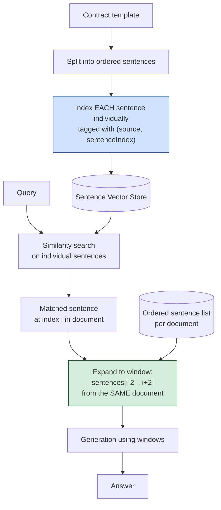

# Pattern 13: Sentence Window Retrieval

[← Back to index](README.md)

## 1. What is Sentence Window Retrieval?

Sentence Window Retrieval indexes documents at the **finest possible granularity —
individual sentences** — for maximum retrieval precision, but at generation time
expands each matched sentence into a **window** of the N sentences immediately before
and after it in the original document, so the LLM sees local context instead of one
sentence in isolation.

This is Parent-Child Retrieval (Pattern 12) taken to its logical extreme: instead of a
fixed parent *section*, the "parent" here is a dynamically-sized sliding window
centered on the exact sentence that matched — the most precise unit of retrieval
paired with just enough surrounding context to make that sentence interpretable.

## 2. What problem does it solve?

Single sentences are often *individually* the sharpest possible unit for embedding
similarity — a sentence about one specific fact has a tight, unambiguous embedding. But
a single sentence pulled completely out of context can be actively misleading:

- *"This exclusion does not apply if written notice was provided in advance."* — sounds
  like a rule, but is meaningless without knowing *which* exclusion the preceding
  sentence was describing.
- *"The limit is $50,000."* — a limit on what? The answer is in the sentence before it.

Chunk-level retrieval (Patterns 1-12) avoids this by keeping several sentences
together in one chunk, but that reintroduces the precision-vs-context tension Pattern
12 addressed at the section level. Sentence Window Retrieval resolves it at finer
granularity: search matches on the single most relevant sentence (maximum precision),
then the *window* — not the chunk boundary — determines how much surrounding context
is included, which can be tuned independently of how the document was originally
chunked.

## 3. Realistic production scenario

**Company:** an internal legal team's contract clause search tool — a library of
standard contract templates and negotiated clause variants, where lawyers search for
specific clause language ("what's our standard limitation of liability cap").

**Problem:** legal clauses are dense with qualifiers, exceptions, and cross-references
("unless", "except as provided in Section 4.2", "provided that") that only make sense
alongside the 1-2 sentences immediately before or after them. A fixed chunk boundary
sometimes splits a qualifying clause from the rule it qualifies; a whole-paragraph
chunk sometimes buries the one relevant sentence among unrelated boilerplate, hurting
retrieval precision.

**Goal:** index every sentence individually for sharp retrieval, but return a
window of ±2 sentences around each match, so a retrieved clause always comes with
its immediate qualifiers intact.

## 4. Architecture / flow diagram



## 5. Request-to-response walkthrough

1. **Indexing:** each contract template is split into individual sentences, kept in an
   ordered list per document. Every sentence is embedded and stored individually,
   tagged with its document and position (`sentenceIndex`) within that document.
2. **User asks:** *"what's our standard limitation of liability cap"*.
3. **Sentence-level search:** the query matches most closely against a single sentence
   like *"Liability under this agreement shall not exceed $50,000 in aggregate."*
4. **Window expansion:** the system looks up that sentence's document and index, then
   pulls the 2 sentences before and 2 sentences after from the *same document's*
   ordered sentence list — likely surfacing the preceding sentence that defines what
   "this agreement" refers to, and a following sentence stating an exception for gross
   negligence.
5. **Window merging:** if two matched sentences from the same document are close
   together, their windows are merged into one continuous span rather than duplicated.
6. **Generation** uses the expanded windows, so the LLM sees the liability cap *and*
   its surrounding qualifiers together, exactly as a lawyer reading the clause in
   context would.
7. **Answer returned**, grounded in the full local context, not an isolated sentence.

## 6. Why this pattern is appropriate here

- **Maximizes retrieval precision** — nothing embeds more sharply than a single
  sentence, so this pattern gets the best possible matching signal at the search step.
- **Context size is decoupled from chunking decisions entirely.** The window size (±2
  sentences, or ±5, or asymmetric) is a runtime parameter, tunable per query type or
  domain, independent of how documents were originally split for other purposes.
- **Ideal for dense, qualifier-heavy prose** (legal, medical, regulatory text) where
  the *precise* sentence matters most for matching, but isolated sentences are
  routinely misleading without their immediate neighbors.
- **When this is *not* enough:** if the necessary context spans a much larger unit than
  a handful of sentences — e.g. an entire multi-paragraph clause with several
  interdependent conditions — Parent-Child Retrieval (Pattern 12) with a full-section
  parent is a better fit; Sentence Window trades window size for precision and works
  best when a few sentences of context genuinely suffice.

## 7. Production-quality implementation (Java / Spring AI)

```java
package com.acme.rag.sentencewindow;

import org.springframework.ai.chat.client.ChatClient;
import org.springframework.ai.chat.prompt.PromptTemplate;
import org.springframework.ai.document.Document;
import org.springframework.ai.ollama.OllamaChatModel;
import org.springframework.ai.ollama.OllamaEmbeddingModel;
import org.springframework.ai.ollama.api.OllamaApi;
import org.springframework.ai.ollama.api.OllamaOptions;
import org.springframework.ai.vectorstore.SearchRequest;
import org.springframework.ai.vectorstore.SimpleVectorStore;

import java.io.IOException;
import java.io.UncheckedIOException;
import java.nio.file.Files;
import java.nio.file.Path;
import java.util.ArrayList;
import java.util.HashMap;
import java.util.List;
import java.util.Map;
import java.util.TreeSet;
import java.util.regex.Pattern;
import java.util.stream.Collectors;

/**
 * Sentence Window Retrieval -- index individual sentences for maximum
 * retrieval precision, then expand each match into a window of surrounding
 * sentences from the same document before generation.
 */
public final class SentenceWindowRetrievalApp {

    record RagConfig(
            String embeddingModel, String llmModel, double llmTemperature,
            int topKSentences, int windowSize, Path persistPath) {

        static RagConfig defaults() {
            return new RagConfig("nomic-embed-text", "llama3.1", 0.0, 5, 2,
                    Path.of("./vectorstore_contracts_sentences.json"));
        }
    }

    /** Very simple sentence splitter: splits on '.', '?', '!' followed by whitespace + capital. */
    static final class SentenceSplitter {
        private static final Pattern BOUNDARY = Pattern.compile("(?<=[.?!])\\s+(?=[A-Z(])");

        List<String> split(String text) {
            List<String> sentences = new ArrayList<>();
            for (String s : BOUNDARY.split(text.replaceAll("\\s+", " ").trim())) {
                String trimmed = s.trim();
                if (!trimmed.isEmpty()) sentences.add(trimmed);
            }
            return sentences;
        }
    }

    static final class SentenceWindowIndex {
        private final RagConfig config;
        private final SimpleVectorStore sentenceVectorStore;
        private final Map<String, List<String>> sentencesByDocument = new HashMap<>();

        SentenceWindowIndex(RagConfig config, OllamaEmbeddingModel embeddingModel, Path sourceDir) {
            this.config = config;
            this.sentenceVectorStore = SimpleVectorStore.builder(embeddingModel).build();

            if (Files.exists(config.persistPath())) {
                sentenceVectorStore.load(config.persistPath().toFile());
                rebuildSentenceLists(sourceDir);
                System.out.println("Loaded existing sentence index.");
                return;
            }

            buildFromScratch(sourceDir);
        }

        private void buildFromScratch(Path sourceDir) {
            SentenceSplitter splitter = new SentenceSplitter();
            List<Path> files;
            try (var stream = Files.list(sourceDir)) {
                files = stream.filter(p -> p.toString().endsWith(".md")).sorted().collect(Collectors.toList());
            } catch (IOException e) { throw new UncheckedIOException(e); }

            for (Path file : files) {
                String documentName = file.getFileName().toString();
                String text;
                try {
                    text = Files.readString(file);
                } catch (IOException e) { throw new UncheckedIOException(e); }

                List<String> sentences = splitter.split(text);
                sentencesByDocument.put(documentName, sentences);

                List<Document> sentenceDocs = new ArrayList<>();
                for (int i = 0; i < sentences.size(); i++) {
                    sentenceDocs.add(new Document(sentences.get(i),
                            Map.of("source", documentName, "sentenceIndex", i)));
                }
                sentenceVectorStore.add(sentenceDocs);
            }

            sentenceVectorStore.save(config.persistPath().toFile());
        }

        private void rebuildSentenceLists(Path sourceDir) {
            // As with Parent-Child (Pattern 12), a production system should persist
            // sentencesByDocument directly rather than recomputing it on restart.
            SentenceSplitter splitter = new SentenceSplitter();
            try (var stream = Files.list(sourceDir)) {
                for (Path file : stream.filter(p -> p.toString().endsWith(".md")).sorted().toList()) {
                    String documentName = file.getFileName().toString();
                    String text = Files.readString(file);
                    sentencesByDocument.put(documentName, splitter.split(text));
                }
            } catch (IOException e) { throw new UncheckedIOException(e); }
        }

        record Window(String source, int startIndex, int endIndex, String text) {}

        /** Search sentences, then expand each match into a window and merge overlaps. */
        List<Window> retrieveWindows(String query) {
            List<Document> matchedSentences = sentenceVectorStore.similaritySearch(
                    SearchRequest.builder().query(query).topK(config.topKSentences()).build());

            // Group raw window spans by document first.
            Map<String, TreeSet<int[]>> spansByDocument = new HashMap<>();
            for (Document sentenceDoc : matchedSentences) {
                String source = String.valueOf(sentenceDoc.getMetadata().get("source"));
                int index = ((Number) sentenceDoc.getMetadata().get("sentenceIndex")).intValue();
                List<String> allSentences = sentencesByDocument.getOrDefault(source, List.of());

                int start = Math.max(0, index - config.windowSize());
                int end = Math.min(allSentences.size() - 1, index + config.windowSize());

                spansByDocument
                        .computeIfAbsent(source, k -> new TreeSet<>((a, b) -> a[0] != b[0] ? a[0] - b[0] : a[1] - b[1]))
                        .add(new int[]{start, end});
            }

            List<Window> windows = new ArrayList<>();
            for (var entry : spansByDocument.entrySet()) {
                String source = entry.getKey();
                List<String> allSentences = sentencesByDocument.getOrDefault(source, List.of());
                int[] merged = null;

                for (int[] span : entry.getValue()) {
                    if (merged == null) {
                        merged = span;
                    } else if (span[0] <= merged[1] + 1) {
                        // Overlapping or adjacent -> extend the current merged window.
                        merged[1] = Math.max(merged[1], span[1]);
                    } else {
                        windows.add(buildWindow(source, merged, allSentences));
                        merged = span;
                    }
                }
                if (merged != null) {
                    windows.add(buildWindow(source, merged, allSentences));
                }
            }
            return windows;
        }

        private Window buildWindow(String source, int[] span, List<String> allSentences) {
            String text = String.join(" ", allSentences.subList(span[0], span[1] + 1));
            return new Window(source, span[0], span[1], text);
        }
    }

    static final class SentenceWindowClauseBot {
        private static final String GEN_SYSTEM = """
                You are a contract clause search assistant. Answer using ONLY the
                context below, which contains clause text with surrounding context.
                If the context does not contain the answer, say so explicitly.

                Context:
                {context}
                """;

        private final SentenceWindowIndex index;
        private final ChatClient chatClient;
        private final PromptTemplate genPromptTemplate = new PromptTemplate(GEN_SYSTEM);

        SentenceWindowClauseBot(SentenceWindowIndex index, ChatClient chatClient) {
            this.index = index;
            this.chatClient = chatClient;
        }

        record AskResult(String answer, List<String> sources) {}

        AskResult ask(String question) {
            if (question == null || question.isBlank()) {
                throw new IllegalArgumentException("Question must not be empty.");
            }

            List<SentenceWindowIndex.Window> windows = index.retrieveWindows(question);
            String context = windows.stream()
                    .map(w -> "[" + w.source() + ", sentences " + w.startIndex() + "-" + w.endIndex() + "]\n" + w.text())
                    .collect(Collectors.joining("\n\n---\n\n"));

            String answer;
            try {
                String systemMessage = genPromptTemplate.render(Map.of("context", context));
                answer = chatClient.prompt().system(systemMessage).user(question).call().content();
            } catch (Exception ex) {
                System.err.println("Generation failed: " + ex);
                answer = "Sorry, something went wrong answering that question.";
            }

            List<String> sources = windows.stream().map(SentenceWindowIndex.Window::source)
                    .distinct().collect(Collectors.toList());

            return new AskResult(answer, sources);
        }
    }

    private static void writeSampleDocs(Path dir) throws IOException {
        Files.createDirectories(dir);
        Files.writeString(dir.resolve("standard_msa.md"),
                "This agreement governs the provision of services between the parties. "
                + "All liability arising under this agreement is subject to the limitations "
                + "described below. Liability under this agreement shall not exceed $50,000 "
                + "in aggregate. This limitation does not apply in cases of gross negligence "
                + "or willful misconduct by either party. Either party may terminate this "
                + "agreement with 30 days written notice.");
    }

    public static void main(String[] args) throws IOException {
        RagConfig config = RagConfig.defaults();
        Path sampleDir = Path.of("./sample_contracts_sentencewindow");
        writeSampleDocs(sampleDir);

        OllamaApi ollamaApi = OllamaApi.builder().baseUrl("http://localhost:11434").build();
        OllamaEmbeddingModel embeddingModel = OllamaEmbeddingModel.builder()
                .ollamaApi(ollamaApi)
                .defaultOptions(OllamaOptions.builder().model(config.embeddingModel()).build())
                .build();
        OllamaChatModel chatModel = OllamaChatModel.builder()
                .ollamaApi(ollamaApi)
                .defaultOptions(OllamaOptions.builder().model(config.llmModel())
                        .temperature(config.llmTemperature()).build())
                .build();
        ChatClient chatClient = ChatClient.create(chatModel);

        SentenceWindowIndex index = new SentenceWindowIndex(config, embeddingModel, sampleDir);
        SentenceWindowClauseBot bot = new SentenceWindowClauseBot(index, chatClient);

        SentenceWindowClauseBot.AskResult result = bot.ask("what's our standard limitation of liability cap");
        System.out.println("\nQ: what's our standard limitation of liability cap");
        System.out.println("  sources: " + result.sources());
        System.out.println("A: " + result.answer());
    }
}
```

### Key production details worth noting

- **Overlapping/adjacent windows are merged** via the `TreeSet<int[]>` span-merging
  logic — if two matched sentences from the same document are within `windowSize` of
  each other, they collapse into one continuous span instead of duplicating text in the
  context (checked with `span[0] <= merged[1] + 1`, i.e. adjacent or overlapping spans
  merge).
- **`windowSize` is a pure runtime parameter**, decoupled entirely from how the
  document was chunked for indexing — this is the core structural advantage over
  Parent-Child Retrieval's fixed parent boundaries, at the cost of needing the ordered
  sentence list kept alongside the vector store.
- **The sentence splitter here is intentionally simple** (regex on sentence-ending
  punctuation followed by a capital letter) — production systems handling messy real-
  world text (abbreviations like "e.g.", decimal numbers, bullet lists) should use a
  proper NLP sentence tokenizer instead.
- **Persisting `sentencesByDocument` is called out as a production gap**, same as
  Parent-Child Retrieval's parent store — `SimpleVectorStore`'s JSON persistence only
  covers the embedded sentence index, not the ordered sentence lists needed for
  windowing after a restart.

---
[← Back to index](README.md)
