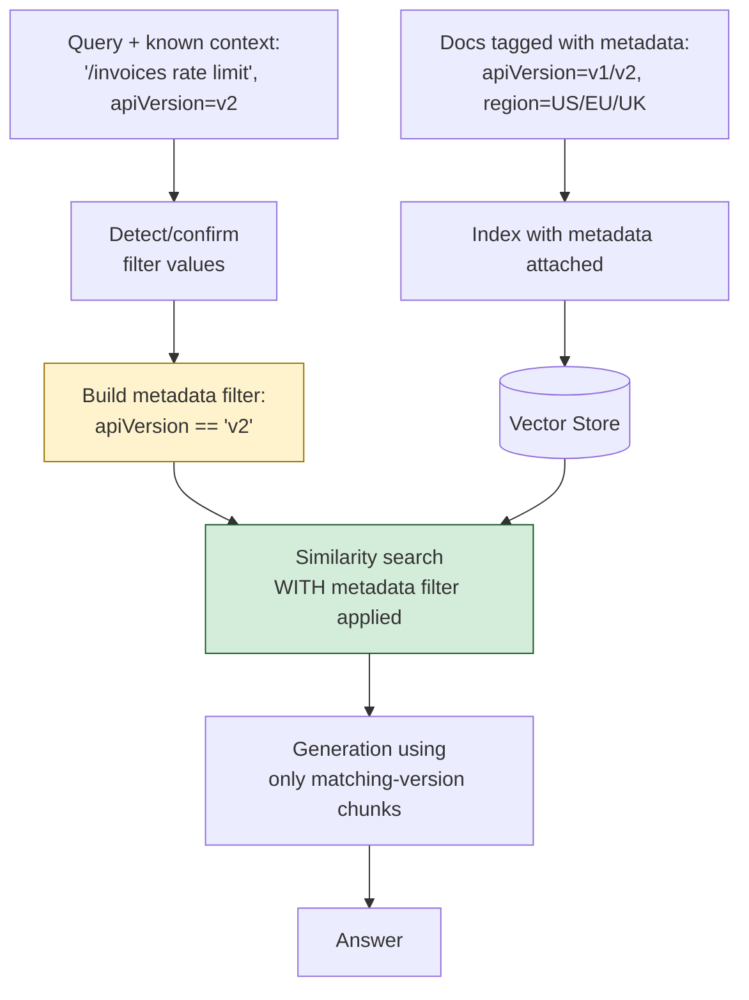

# Pattern 14: Metadata Filtering

[← Back to index](README.md)

## 1. What is Metadata Filtering?

Metadata Filtering attaches **structured attributes** to each chunk at indexing time —
things like product version, region, document type, or date — and then narrows the
vector search to only chunks matching specific metadata values *before or alongside*
the similarity search, instead of searching the entire index and hoping semantic
similarity alone picks the right variant.

This solves a category of problem that pure embedding similarity structurally cannot:
when the *same question* has *different correct answers* depending on context that
isn't really about semantic meaning at all — it's a categorical fact (which version,
which region, which product tier) that should hard-filter the search space, not just
nudge the ranking.

## 2. What problem does it solve?

Some corpora contain multiple, genuinely different, equally-relevant-looking answers to
the same phrased question:

- *"What's the rate limit for the /invoices endpoint?"* — the answer is different for
  API v1 vs v2, and both versions' docs use nearly identical wording, so embedding
  similarity alone can't reliably distinguish them.
- *"What's the return policy?"* — different for US, EU, and UK customers, again with
  highly similar phrasing across all three regional documents.

Without filtering, a flat search might retrieve the v1 rate limit chunk for a v2
question purely because it's marginally "more similar" in wording — a wrong answer
that's confidently, plausibly wrong, which is worse than an obviously wrong one because
nothing about the retrieved chunk looks out of place. Metadata Filtering makes this
categorically impossible: if the query is known to be about v2, v1 chunks are excluded
from the candidate pool entirely, not just ranked lower.

## 3. Realistic production scenario

**Company:** the SaaS support bot, now serving a product with two live API versions
(v1, legacy; v2, current) and three regional policy variants (US, EU, UK) for
billing/returns.

**Problem:** a flat index over all versions and regions occasionally answers a v2
question with v1 rate limits, or an EU customer's return question with US policy terms
— both high-stakes mistakes (a wrong rate limit breaks integrations; a wrong return
policy is a compliance/legal problem, especially for EU consumer protection rules).

**Goal:** tag every chunk with `apiVersion` and/or `region` metadata at indexing time.
At query time, detect which version/region the question concerns (from explicit
mention, or a known customer context passed in) and apply a metadata filter so
retrieval only ever considers chunks from the correct variant.

## 4. Architecture / flow diagram



## 5. Request-to-response walkthrough

1. **Indexing:** every documentation chunk is tagged with metadata fields —
   `apiVersion` (`"v1"` or `"v2"`) for API docs, `region` (`"US"`, `"EU"`, or `"UK"`)
   for policy docs — alongside the usual `source` field.
2. **User asks (with known context):** *"What's the rate limit for the /invoices
   endpoint?"*, and the calling application already knows this customer is on API v2
   (e.g. from their account settings, passed in as a parameter — not inferred from the
   question text, which is the more reliable production pattern).
3. **Filter construction:** a metadata filter expression `apiVersion == "v2"` is built
   from the known context.
4. **Filtered similarity search:** the vector store's search is constrained to *only*
   chunks matching that filter — v1 chunks are structurally excluded from
   consideration, regardless of how similar their wording might be.
5. **Generation** proceeds using only the correctly-scoped chunks.
6. **Answer returned**, guaranteed version-correct by construction, not by hoping
   semantic ranking got it right.
7. **A fallback case:** if the calling application *doesn't* know the customer's
   version/region, the question itself is classified (LLM call, same technique as
   Pattern 5's router) to infer the likely filter value, with a "please specify" reply
   if it genuinely can't be determined either way — silently guessing wrong here is
   worse than asking.

## 6. Why this pattern is appropriate here

- **This is a categorical correctness guarantee, not a ranking improvement.** Every
  other retrieval pattern in this series (re-ranking, hybrid search, sentence windows)
  improves *which* chunks rank highest within a search; metadata filtering changes
  *which chunks are even eligible* to be found — the right tool specifically when
  "wrong version" is a hard error, not a matter of degree.
- **Known context should come from the application, not query text, whenever
  possible.** A logged-in customer's account already knows their region and API
  version — passing that in directly as a filter is strictly more reliable than
  inferring it from question phrasing, and should always be preferred when available.
- **Composable with every other pattern in this series.** Filtering narrows the
  candidate pool; re-ranking, hybrid search, and window expansion all still operate
  normally *within* that narrowed pool — metadata filtering is a pre-stage, not a
  replacement for the rest of the pipeline.
- **When this is *not* enough:** if the "correct" variant itself is ambiguous or the
  user is asking to *compare* variants ("what changed between v1 and v2 rate limits"),
  a hard filter to one version would be wrong — that's better handled by retrieving
  both variants explicitly (e.g. two filtered searches, one per version) and letting
  generation compare them, similar in spirit to Query Decomposition (Pattern 10).

## 7. Production-quality implementation (Java / Spring AI)

```java
package com.acme.rag.metadata;

import org.springframework.ai.chat.client.ChatClient;
import org.springframework.ai.chat.prompt.PromptTemplate;
import org.springframework.ai.document.Document;
import org.springframework.ai.ollama.OllamaChatModel;
import org.springframework.ai.ollama.OllamaEmbeddingModel;
import org.springframework.ai.ollama.api.OllamaApi;
import org.springframework.ai.ollama.api.OllamaOptions;
import org.springframework.ai.transformer.splitter.TokenTextSplitter;
import org.springframework.ai.vectorstore.SearchRequest;
import org.springframework.ai.vectorstore.SimpleVectorStore;
import org.springframework.ai.vectorstore.filter.Filter;
import org.springframework.ai.vectorstore.filter.FilterExpressionBuilder;

import java.io.IOException;
import java.io.UncheckedIOException;
import java.nio.file.Files;
import java.nio.file.Path;
import java.util.List;
import java.util.Map;
import java.util.Optional;
import java.util.stream.Collectors;

/**
 * Metadata Filtering -- attach structured metadata (apiVersion, region) to
 * chunks at index time, then hard-filter the vector search to the correct
 * variant before applying semantic similarity.
 */
public final class MetadataFilteringApp {

    record RagConfig(
            String embeddingModel, String llmModel, double llmTemperature,
            int chunkSize, int chunkOverlap, int topK, Path persistPath) {

        static RagConfig defaults() {
            return new RagConfig("nomic-embed-text", "llama3.1", 0.0, 500, 60, 4,
                    Path.of("./vectorstore_support_docs_metadata.json"));
        }
    }

    /** Known customer/request context -- ideally supplied by the calling application,
     *  not inferred from the question text, whenever it's available. */
    record RequestContext(Optional<String> apiVersion, Optional<String> region) {
        static RequestContext unknown() { return new RequestContext(Optional.empty(), Optional.empty()); }
    }

    static final class MetadataFilterSupportBot {
        private static final String GEN_SYSTEM = """
                You are a customer support assistant for Acme SaaS. Answer using ONLY the
                context below, which has already been scoped to the correct API version
                and/or region for this customer. If the context does not contain the
                answer, say so explicitly.

                Context:
                {context}
                """;

        private final RagConfig config;
        private final SimpleVectorStore vectorStore;
        private final ChatClient chatClient;
        private final PromptTemplate genPromptTemplate = new PromptTemplate(GEN_SYSTEM);

        MetadataFilterSupportBot(RagConfig config, OllamaEmbeddingModel embeddingModel,
                                  OllamaChatModel chatModel, Path sourceDir) {
            this.config = config;
            this.chatClient = ChatClient.create(chatModel);
            this.vectorStore = buildOrLoad(embeddingModel, sourceDir);
        }

        private SimpleVectorStore buildOrLoad(OllamaEmbeddingModel embeddingModel, Path sourceDir) {
            SimpleVectorStore store = SimpleVectorStore.builder(embeddingModel).build();
            if (Files.exists(config.persistPath())) {
                store.load(config.persistPath().toFile());
                return store;
            }

            TokenTextSplitter splitter = new TokenTextSplitter(
                    config.chunkSize(), config.chunkOverlap(), 5, 10000, true);

            // Each source file's own front-matter-style header lines define its
            // metadata; a real system would use a structured CMS/database instead
            // of parsing metadata out of markdown files.
            List<Path> files;
            try (var stream = Files.list(sourceDir)) {
                files = stream.filter(p -> p.toString().endsWith(".md")).sorted().collect(Collectors.toList());
            } catch (IOException e) { throw new UncheckedIOException(e); }

            for (Path file : files) {
                DocWithMetadata parsed = parseDocWithMetadata(file);
                Document wholeDoc = new Document(parsed.body(), parsed.metadata());
                List<Document> chunks = splitter.apply(List.of(wholeDoc));
                store.add(chunks);
            }

            store.save(config.persistPath().toFile());
            return store;
        }

        record DocWithMetadata(String body, Map<String, Object> metadata) {}

        /** Parses simple "key: value" header lines at the top of a file into metadata. */
        private DocWithMetadata parseDocWithMetadata(Path file) {
            String text;
            try {
                text = Files.readString(file);
            } catch (IOException e) { throw new UncheckedIOException(e); }

            Map<String, Object> metadata = new java.util.HashMap<>();
            metadata.put("source", file.getFileName().toString());

            String[] lines = text.split("\\R", -1);
            int bodyStart = 0;
            for (int i = 0; i < lines.length; i++) {
                if (lines[i].matches("^[a-zA-Z_]+:\\s*.+$")) {
                    String[] parts = lines[i].split(":", 2);
                    metadata.put(parts[0].trim(), parts[1].trim());
                    bodyStart = i + 1;
                } else if (!lines[i].isBlank()) {
                    break;
                }
            }
            String body = String.join("\n", java.util.Arrays.asList(lines).subList(bodyStart, lines.length));
            return new DocWithMetadata(body, metadata);
        }

        record AskResult(String answer, String filterUsed, List<String> sources) {}

        AskResult ask(String question, RequestContext context) {
            if (question == null || question.isBlank()) {
                throw new IllegalArgumentException("Question must not be empty.");
            }

            FilterExpressionBuilder b = new FilterExpressionBuilder();
            Filter.Expression filter = buildFilter(b, context);

            SearchRequest.Builder searchBuilder = SearchRequest.builder()
                    .query(question)
                    .topK(config.topK());
            if (filter != null) {
                searchBuilder.filterExpression(filter);
            }

            List<Document> retrieved;
            try {
                retrieved = vectorStore.similaritySearch(searchBuilder.build());
            } catch (Exception ex) {
                System.err.println("Filtered retrieval failed: " + ex);
                retrieved = List.of();
            }

            String contextText = retrieved.stream()
                    .map(d -> "[" + d.getMetadata().getOrDefault("source", "unknown") + "]\n" + d.getText())
                    .collect(Collectors.joining("\n\n---\n\n"));

            String answer;
            try {
                String systemMessage = genPromptTemplate.render(Map.of("context", contextText));
                answer = chatClient.prompt().system(systemMessage).user(question).call().content();
            } catch (Exception ex) {
                System.err.println("Generation failed: " + ex);
                answer = "Sorry, something went wrong answering that question.";
            }

            List<String> sources = retrieved.stream()
                    .map(d -> String.valueOf(d.getMetadata().getOrDefault("source", "unknown")))
                    .collect(Collectors.toList());

            String filterDescription = describeFilter(context);
            return new AskResult(answer, filterDescription, sources);
        }

        private Filter.Expression buildFilter(FilterExpressionBuilder b, RequestContext context) {
            List<Filter.Expression> clauses = new java.util.ArrayList<>();
            context.apiVersion().ifPresent(v -> clauses.add(b.eq("apiVersion", v).build()));
            context.region().ifPresent(r -> clauses.add(b.eq("region", r).build()));

            if (clauses.isEmpty()) return null;
            if (clauses.size() == 1) return clauses.get(0);
            return b.and(clauses.get(0), clauses.get(1)).build();
        }

        private String describeFilter(RequestContext context) {
            List<String> parts = new java.util.ArrayList<>();
            context.apiVersion().ifPresent(v -> parts.add("apiVersion=" + v));
            context.region().ifPresent(r -> parts.add("region=" + r));
            return parts.isEmpty() ? "(none)" : String.join(", ", parts);
        }
    }

    private static void writeSampleDocs(Path dir) throws IOException {
        Files.createDirectories(dir);
        Files.writeString(dir.resolve("rate_limits_v1.md"), """
                apiVersion: v1
                docType: api-reference

                ## Rate Limits (v1, legacy)
                The /invoices endpoint is limited to 30 requests per minute on all plans
                in API v1.
                """);
        Files.writeString(dir.resolve("rate_limits_v2.md"), """
                apiVersion: v2
                docType: api-reference

                ## Rate Limits (v2, current)
                The /invoices endpoint is limited to 60 requests per minute on the Pro
                plan and 600 requests per minute on the Enterprise plan in API v2.
                """);
        Files.writeString(dir.resolve("returns_us.md"), """
                region: US
                docType: policy

                ## Return Policy (US)
                US customers may request a refund within 30 days of purchase for any
                reason.
                """);
        Files.writeString(dir.resolve("returns_eu.md"), """
                region: EU
                docType: policy

                ## Return Policy (EU)
                EU customers have a statutory 14-day right of withdrawal under EU
                consumer protection law, in addition to any additional refund terms.
                """);
    }

    public static void main(String[] args) throws IOException {
        RagConfig config = RagConfig.defaults();
        Path sampleDir = Path.of("./sample_support_docs_metadata");
        writeSampleDocs(sampleDir);

        OllamaApi ollamaApi = OllamaApi.builder().baseUrl("http://localhost:11434").build();
        OllamaEmbeddingModel embeddingModel = OllamaEmbeddingModel.builder()
                .ollamaApi(ollamaApi)
                .defaultOptions(OllamaOptions.builder().model(config.embeddingModel()).build())
                .build();
        OllamaChatModel chatModel = OllamaChatModel.builder()
                .ollamaApi(ollamaApi)
                .defaultOptions(OllamaOptions.builder().model(config.llmModel())
                        .temperature(config.llmTemperature()).build())
                .build();

        MetadataFilterSupportBot bot = new MetadataFilterSupportBot(config, embeddingModel, chatModel, sampleDir);

        // Simulates the calling application already knowing the customer's context.
        MetadataFilterSupportBot.AskResult v2Result = bot.ask(
                "What's the rate limit for the /invoices endpoint?",
                new RequestContext(Optional.of("v2"), Optional.empty()));
        System.out.println("\nQ: rate limit (apiVersion=v2)");
        System.out.println("  filter used: " + v2Result.filterUsed());
        System.out.println("  sources: " + v2Result.sources());
        System.out.println("A: " + v2Result.answer());

        MetadataFilterSupportBot.AskResult euResult = bot.ask(
                "What's the return policy?",
                new RequestContext(Optional.empty(), Optional.of("EU")));
        System.out.println("\nQ: return policy (region=EU)");
        System.out.println("  filter used: " + euResult.filterUsed());
        System.out.println("  sources: " + euResult.sources());
        System.out.println("A: " + euResult.answer());
    }
}
```

### Key production details worth noting

- **`RequestContext` is passed in by the caller, not inferred from the question by
  default** — this reflects the production best practice called out in section 6:
  known account context (a logged-in customer's region/plan) is strictly more reliable
  than guessing from phrasing. A text-based fallback classifier (same shape as Pattern
  5's router) can populate `RequestContext` when the application genuinely doesn't know.
- **`FilterExpressionBuilder` composes filters declaratively** (`eq`, `and`, `or`, etc.)
  — Spring AI translates this into whatever native filter syntax the underlying vector
  store supports (metadata JSON filtering for `SimpleVectorStore`, SQL `WHERE` clauses
  for `PgVectorStore`, etc.), so the same filter-building code is portable across vector
  store backends.
- **Metadata is parsed from simple header lines in this example** purely to keep the
  sample self-contained — a real system would source `apiVersion`/`region` from a CMS,
  a database column, or a structured ingestion pipeline, not by regex-parsing markdown.
- **Filtering is a pre-stage that composes with everything else** — nothing here
  prevents also applying re-ranking (Pattern 20) or sentence windowing (Pattern 13)
  *within* the already-filtered candidate pool; this pattern only narrows what's
  eligible, it doesn't replace the rest of the retrieval pipeline.

---
[← Back to index](README.md)
