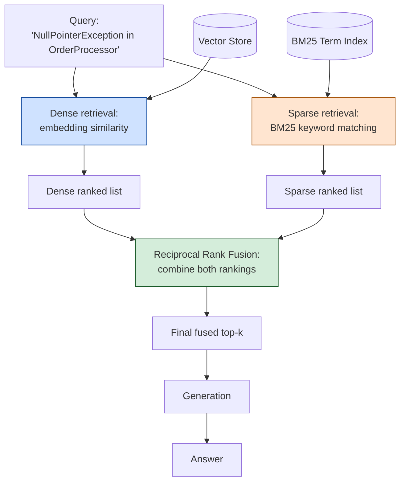

# Pattern 15: Hybrid Search

[← Back to index](README.md)

## 1. What is Hybrid Search?

Hybrid Search runs **two fundamentally different retrieval methods in parallel** —
dense retrieval (embedding similarity, semantic) and sparse retrieval (keyword-based,
lexical — classically BM25) — against the same query, then **fuses their two ranked
result lists** into one combined ranking, typically via Reciprocal Rank Fusion (RRF).

Dense and sparse retrieval have complementary, near-opposite failure modes: dense
embeddings excel at *meaning* ("how do I cancel" matches "terminate your subscription")
but can be weak on exact tokens (a specific error code, a SKU, an acronym might not
embed distinctly); sparse/keyword search excels at *exact terms* but has zero notion of
synonymy or paraphrase. Running both and fusing the results gets the strengths of each
without needing to predict in advance which one a given query needs.

## 2. What problem does it solve?

This is the direct structural fix for failure mode ① from Pattern 2's Naive RAG
diagnostics — **lexical mismatch** — but from the *retrieval* side rather than the
*query* side. Query Expansion (Pattern 6) and Rewriting (Pattern 7) both try to fix
lexical mismatch by transforming the query to better match dense embeddings; Hybrid
Search instead adds an entirely separate retrieval mechanism (exact keyword matching)
that doesn't depend on embeddings being close at all.

This matters most for queries containing **exact identifiers** — error codes, exception
class names, product SKUs, API parameter names — where dense embeddings routinely
underperform: `"NullPointerException"` and `"IllegalStateException"` might embed
close together (both are exception names, semantically similar as a *category*), but a
keyword search for the exact string `"NullPointerException"` will never confuse the two.

## 3. Realistic production scenario

**Company:** the internal engineering knowledge base, now handling on-call queries that
frequently include exact technical identifiers — stack trace exception names, specific
error codes, exact config key names — alongside conceptual questions.

**Problem:** a query like *"NullPointerException in OrderProcessor"* sometimes retrieves
runbooks about *other* exceptions that happen to be semantically close (also
Java exceptions, also in similarly-named classes) ahead of the runbook that actually
mentions `NullPointerException` verbatim, because dense embeddings blur exact identifier
distinctions that matter enormously to an engineer debugging a specific stack trace.

**Goal:** run both a dense (embedding) search and a sparse (BM25 keyword) search for
every query, fuse the two ranked lists via Reciprocal Rank Fusion, and use the fused
ranking for the final candidate pool — so an exact identifier match from BM25 can
surface a chunk that dense search alone would have ranked too low.

## 4. Architecture / flow diagram



## 5. Request-to-response walkthrough

1. **Query comes in:** *"NullPointerException in OrderProcessor"*.
2. **Dense retrieval runs:** the query is embedded and compared against all chunk
   embeddings, returning a ranked list based on semantic similarity — this list may
   contain relevant-but-not-exact chunks about related error-handling runbooks.
3. **Sparse (BM25) retrieval runs independently:** the query is tokenized
   (`NullPointerException`, `OrderProcessor`) and scored against every chunk using
   term-frequency statistics — this list ranks highly any chunk containing those exact
   tokens verbatim, regardless of overall semantic framing.
4. **Reciprocal Rank Fusion:** each chunk's final fused score is the sum of
   `1 / (k + rank)` across both lists (using a small constant `k`, typically 60, that
   dampens the impact of any single very-high rank) — a chunk that ranks highly in
   *either* list contributes meaningfully to the fused score, and a chunk ranking
   highly in *both* dominates the final ranking.
5. **Final ranking sorted by fused score**, top-k taken as the candidate pool.
6. **Generation** proceeds using the fused top-k chunks.
7. **Answer returned**, now reliably grounded in the chunk that verbatim-mentions
   `NullPointerException`, even if dense similarity alone would have ranked it 6th.

## 6. Why this pattern is appropriate here

- **Directly solves exact-identifier retrieval**, which is a structurally different
  problem from conceptual/semantic retrieval — no amount of query rewriting or
  expansion reliably fixes a dense embedding model's blurriness on specific tokens; you
  need a retrieval mechanism (BM25) that doesn't depend on embeddings at all.
- **RRF requires no score calibration between the two methods.** Dense cosine
  similarity and BM25 scores are on completely different, incompatible scales — RRF
  sidesteps this entirely by fusing on *rank position*, not raw score, which is what
  makes it the standard, robust choice for combining heterogeneous rankers.
- **Composable with everything upstream and downstream** — query transformation
  (Patterns 5-10) still improves what's searched; metadata filtering (Pattern 14) still
  narrows the pool first; re-ranking (Pattern 20) can still run on the fused results
  for an even sharper final cut.
- **When this is *not* enough:** if the corpus is dominated by highly technical,
  identifier-heavy content specifically (e.g. a codebase-search tool, not prose docs),
  it can be worth weighting the sparse side more heavily than the standard equal-weight
  RRF formula — a tunable extension of this same pattern, not a different one.

## 7. Production-quality implementation (Java / Spring AI)

```java
package com.acme.rag.hybrid;

import org.springframework.ai.chat.client.ChatClient;
import org.springframework.ai.chat.prompt.PromptTemplate;
import org.springframework.ai.document.Document;
import org.springframework.ai.ollama.OllamaChatModel;
import org.springframework.ai.ollama.OllamaEmbeddingModel;
import org.springframework.ai.ollama.api.OllamaApi;
import org.springframework.ai.ollama.api.OllamaOptions;
import org.springframework.ai.transformer.splitter.TokenTextSplitter;
import org.springframework.ai.vectorstore.SearchRequest;
import org.springframework.ai.vectorstore.SimpleVectorStore;

import java.io.IOException;
import java.io.UncheckedIOException;
import java.nio.file.Files;
import java.nio.file.Path;
import java.util.*;
import java.util.stream.Collectors;

/**
 * Hybrid Search -- run dense (embedding) and sparse (BM25 keyword) retrieval
 * in parallel, then fuse the two ranked lists via Reciprocal Rank Fusion.
 */
public final class HybridSearchApp {

    record RagConfig(
            String embeddingModel, String llmModel, double llmTemperature,
            int chunkSize, int chunkOverlap,
            int denseTopK, int sparseTopK, int fusedTopK,
            double rrfK, Path persistPath) {

        static RagConfig defaults() {
            return new RagConfig("nomic-embed-text", "llama3.1", 0.0, 500, 60,
                    10, 10, 4, 60.0, Path.of("./vectorstore_eng_kb_hybrid.json"));
        }
    }

    /**
     * A minimal in-memory BM25 index. Production systems would typically use a
     * real search engine (Elasticsearch/OpenSearch, or Lucene directly) for the
     * sparse side; this hand-rolled version keeps the example dependency-free
     * and makes the BM25 mechanics explicit.
     */
    static final class Bm25Index {
        private static final double K1 = 1.5;
        private static final double B = 0.75;

        private final List<Document> documents = new ArrayList<>();
        private final List<Map<String, Integer>> termFrequencies = new ArrayList<>();
        private final Map<String, Integer> documentFrequency = new HashMap<>();
        private double averageDocLength = 0;

        void index(List<Document> docs) {
            for (Document doc : docs) {
                List<String> tokens = tokenize(doc.getText());
                Map<String, Integer> tf = new HashMap<>();
                for (String token : tokens) tf.merge(token, 1, Integer::sum);

                documents.add(doc);
                termFrequencies.add(tf);
                for (String uniqueTerm : tf.keySet()) {
                    documentFrequency.merge(uniqueTerm, 1, Integer::sum);
                }
            }
            averageDocLength = termFrequencies.stream()
                    .mapToInt(tf -> tf.values().stream().mapToInt(Integer::intValue).sum())
                    .average().orElse(0);
        }

        List<Map.Entry<Document, Double>> search(String query, int topK) {
            List<String> queryTerms = tokenize(query);
            int n = documents.size();

            List<Map.Entry<Document, Double>> scored = new ArrayList<>();
            for (int i = 0; i < documents.size(); i++) {
                Map<String, Integer> tf = termFrequencies.get(i);
                int docLength = tf.values().stream().mapToInt(Integer::intValue).sum();
                double score = 0;

                for (String term : queryTerms) {
                    int freq = tf.getOrDefault(term, 0);
                    if (freq == 0) continue;
                    int df = documentFrequency.getOrDefault(term, 0);
                    double idf = Math.log(1 + (n - df + 0.5) / (df + 0.5));
                    double numerator = freq * (K1 + 1);
                    double denominator = freq + K1 * (1 - B + B * (docLength / averageDocLength));
                    score += idf * (numerator / denominator);
                }
                if (score > 0) scored.add(Map.entry(documents.get(i), score));
            }

            scored.sort((a, b) -> Double.compare(b.getValue(), a.getValue()));
            return scored.subList(0, Math.min(topK, scored.size()));
        }

        private static List<String> tokenize(String text) {
            return Arrays.stream(text.toLowerCase().split("[^a-z0-9]+"))
                    .filter(t -> !t.isBlank())
                    .collect(Collectors.toList());
        }
    }

    /** Reciprocal Rank Fusion: combine two ranked lists into one, by rank position only. */
    static final class ReciprocalRankFusion {
        private final double k;

        ReciprocalRankFusion(double k) { this.k = k; }

        List<Document> fuse(List<Document> denseRanked, List<Document> sparseRanked, int finalTopK) {
            Map<String, Double> fusedScores = new HashMap<>();
            Map<String, Document> byKey = new HashMap<>();

            addRankContributions(denseRanked, fusedScores, byKey);
            addRankContributions(sparseRanked, fusedScores, byKey);

            return fusedScores.entrySet().stream()
                    .sorted((a, b) -> Double.compare(b.getValue(), a.getValue()))
                    .limit(finalTopK)
                    .map(e -> byKey.get(e.getKey()))
                    .collect(Collectors.toList());
        }

        private void addRankContributions(List<Document> ranked, Map<String, Double> fusedScores,
                                           Map<String, Document> byKey) {
            for (int rank = 0; rank < ranked.size(); rank++) {
                Document doc = ranked.get(rank);
                String key = documentKey(doc);
                byKey.put(key, doc);
                fusedScores.merge(key, 1.0 / (k + rank + 1), Double::sum);
            }
        }

        private static String documentKey(Document doc) {
            return doc.getMetadata().getOrDefault("source", "?")
                    + "|" + doc.getText().substring(0, Math.min(60, doc.getText().length()));
        }
    }

    static final class HybridSearchEngKb {
        private static final String GEN_SYSTEM = """
                You are an internal engineering search assistant. Answer using ONLY the
                context below. If the context is insufficient, say so.

                Context:
                {context}
                """;

        private final RagConfig config;
        private final SimpleVectorStore denseIndex;
        private final Bm25Index sparseIndex = new Bm25Index();
        private final ReciprocalRankFusion fusion;
        private final ChatClient chatClient;
        private final PromptTemplate genPromptTemplate = new PromptTemplate(GEN_SYSTEM);

        HybridSearchEngKb(RagConfig config, OllamaEmbeddingModel embeddingModel,
                           OllamaChatModel chatModel, Path sourceDir) {
            this.config = config;
            this.chatClient = ChatClient.create(chatModel);
            this.fusion = new ReciprocalRankFusion(config.rrfK());
            this.denseIndex = buildDenseOrLoad(embeddingModel, sourceDir);
        }

        private SimpleVectorStore buildDenseOrLoad(OllamaEmbeddingModel embeddingModel, Path sourceDir) {
            SimpleVectorStore store = SimpleVectorStore.builder(embeddingModel).build();
            List<Document> allChunks = loadAndChunk(sourceDir);

            if (Files.exists(config.persistPath())) {
                store.load(config.persistPath().toFile());
            } else {
                store.add(allChunks);
                store.save(config.persistPath().toFile());
            }

            // BM25 is cheap to rebuild in-memory on every startup (no embeddings
            // involved), unlike the dense index which is persisted to avoid
            // re-embedding.
            sparseIndex.index(allChunks);
            return store;
        }

        private List<Document> loadAndChunk(Path sourceDir) {
            TokenTextSplitter splitter = new TokenTextSplitter(
                    config.chunkSize(), config.chunkOverlap(), 5, 10000, true);
            List<Document> docs;
            try (var files = Files.list(sourceDir)) {
                docs = files.filter(p -> p.toString().endsWith(".md")).sorted()
                        .map(p -> {
                            try {
                                return new Document(Files.readString(p),
                                        Map.of("source", p.getFileName().toString()));
                            } catch (IOException e) { throw new UncheckedIOException(e); }
                        }).collect(Collectors.toList());
            } catch (IOException e) { throw new UncheckedIOException(e); }
            return splitter.apply(docs);
        }

        record AskResult(String answer, List<String> sources) {}

        AskResult ask(String question) {
            if (question == null || question.isBlank()) {
                throw new IllegalArgumentException("Question must not be empty.");
            }

            List<Document> denseResults = denseIndex.similaritySearch(
                    SearchRequest.builder().query(question).topK(config.denseTopK()).build());
            List<Document> sparseResults = sparseIndex.search(question, config.sparseTopK())
                    .stream().map(Map.Entry::getKey).collect(Collectors.toList());

            List<Document> fused = fusion.fuse(denseResults, sparseResults, config.fusedTopK());

            String context = fused.stream()
                    .map(d -> "[" + d.getMetadata().getOrDefault("source", "unknown") + "]\n" + d.getText())
                    .collect(Collectors.joining("\n\n---\n\n"));

            String answer;
            try {
                String systemMessage = genPromptTemplate.render(Map.of("context", context));
                answer = chatClient.prompt().system(systemMessage).user(question).call().content();
            } catch (Exception ex) {
                System.err.println("Generation failed: " + ex);
                answer = "Sorry, something went wrong answering that question.";
            }

            List<String> sources = fused.stream()
                    .map(d -> String.valueOf(d.getMetadata().getOrDefault("source", "unknown")))
                    .collect(Collectors.toList());

            return new AskResult(answer, sources);
        }
    }

    private static void writeSampleDocs(Path dir) throws IOException {
        Files.createDirectories(dir);
        Files.writeString(dir.resolve("npe_orderprocessor.md"), """
                ## Handling NullPointerException in OrderProcessor
                A NullPointerException in OrderProcessor.applyDiscount() is typically
                caused by a missing customer loyalty tier lookup. Ensure the customer
                record is fully loaded before calling applyDiscount.
                """);
        Files.writeString(dir.resolve("general_exceptions.md"), """
                ## General Exception Handling Guidelines
                All service-layer exceptions should extend our base ServiceException
                class and include a correlation id for tracing. Avoid catching generic
                RuntimeException without rethrowing a more specific type.
                """);
        Files.writeString(dir.resolve("illegalstate_paymentservice.md"), """
                ## IllegalStateException in PaymentService
                An IllegalStateException in PaymentService.charge() indicates the
                payment session was already finalized before charge() was called.
                """);
    }

    public static void main(String[] args) throws IOException {
        RagConfig config = RagConfig.defaults();
        Path sampleDir = Path.of("./sample_eng_kb_hybrid");
        writeSampleDocs(sampleDir);

        OllamaApi ollamaApi = OllamaApi.builder().baseUrl("http://localhost:11434").build();
        OllamaEmbeddingModel embeddingModel = OllamaEmbeddingModel.builder()
                .ollamaApi(ollamaApi)
                .defaultOptions(OllamaOptions.builder().model(config.embeddingModel()).build())
                .build();
        OllamaChatModel chatModel = OllamaChatModel.builder()
                .ollamaApi(ollamaApi)
                .defaultOptions(OllamaOptions.builder().model(config.llmModel())
                        .temperature(config.llmTemperature()).build())
                .build();

        HybridSearchEngKb bot = new HybridSearchEngKb(config, embeddingModel, chatModel, sampleDir);

        HybridSearchEngKb.AskResult result = bot.ask("NullPointerException in OrderProcessor");
        System.out.println("\nQ: NullPointerException in OrderProcessor");
        System.out.println("  sources: " + result.sources());
        System.out.println("A: " + result.answer());
    }
}
```

### Key production details worth noting

- **RRF fuses by rank position, never by raw score** — this is deliberate and is the
  whole reason RRF is the standard fusion technique: cosine similarity (roughly 0-1)
  and BM25 scores (unbounded, corpus-dependent) are not on comparable scales, so
  averaging or summing raw scores would silently let whichever method happens to
  produce larger numbers dominate.
- **`documentKey` deduplicates the same chunk across both lists** — if a chunk appears
  in both the dense and sparse top-k, its RRF contributions from each list are summed
  (via `merge(key, ..., Double::sum)`), correctly and intentionally boosting chunks
  that both methods agree on.
- **The BM25 index is cheap to rebuild on every startup** since it involves no
  embedding calls — only the dense `SimpleVectorStore` needs to be persisted and
  reloaded to avoid re-embedding costs; the sparse index re-tokenizes from the same
  already-chunked documents in milliseconds.
- **This hand-rolled `Bm25Index` is illustrative** — for production workloads at scale,
  a real search engine (Elasticsearch, OpenSearch, or Apache Lucene directly) handles
  BM25 far more efficiently and with proper index persistence; the RRF fusion logic
  here is unchanged regardless of which BM25 implementation supplies the sparse
  ranked list.

---
[← Back to index](README.md)
