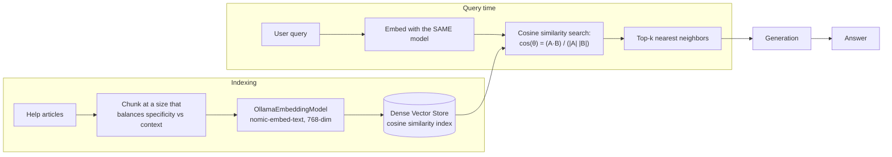

# Pattern 16: Dense Retrieval

[← Back to index](README.md)

## 1. What is Dense Retrieval?

Dense Retrieval is the embedding-based search mechanism that's been running quietly
underneath nearly every pattern so far — this pattern is the first to treat it as a
standalone subject and go deep on the choices that actually determine its quality:
**which embedding model, which similarity metric, and how those interact with chunk
size and domain vocabulary.**

"Dense" refers to the vector representation: every dimension of the embedding carries
some signal (as opposed to "sparse" vectors like BM25/TF-IDF, covered in Patterns 17-18,
where most dimensions are zero and only a few exact-term dimensions are non-zero). A
dense embedding model maps text into a fixed-size vector (e.g. 768 or 1024 dimensions)
such that texts with similar *meaning* — not necessarily similar *wording* — end up
close together in that vector space.

## 2. What problem does it solve?

Dense retrieval is what makes RAG's core promise possible in the first place: finding
relevant text by *meaning* rather than by exact keyword overlap. Without it, "how do I
cancel" would never match a document that only ever says "terminate your plan" — that's
the fundamental capability every other retrieval pattern in this series either relies
on (query transformation), complements (hybrid search's sparse half), or refines
(re-ranking, filtering). Getting the dense retrieval layer itself right — model choice,
similarity metric, and how chunking interacts with it — is foundational, and getting it
wrong quietly degrades every pattern built on top of it.

## 3. Realistic production scenario

**Company:** a customer-facing help center for a consumer product, where users type
genuinely varied, paraphrase-heavy natural language queries ("my order never arrived",
"I think I got charged twice", "can I change what's in my order after I already paid")
against a FAQ/help-article corpus. There are few exact identifiers here (unlike
Pattern 15's error-code-heavy engineering corpus) — nearly every query benefits from
semantic matching, and dense retrieval alone, tuned well, is often sufficient without
needing to add a sparse/BM25 layer at all.

**Goal:** choose and configure the dense retrieval layer deliberately:
1. Pick an embedding model sized appropriately for the corpus and latency budget.
2. Choose the right similarity metric (cosine similarity is the standard default for
   most sentence-embedding models, including `nomic-embed-text`).
3. Understand how chunk size affects embedding quality — too large and the embedding
   blurs multiple topics together; too small and it loses necessary context (this is
   exactly the tension Parent-Child and Sentence Window retrieval, Patterns 12-13,
   exist to resolve).

## 4. Architecture / flow diagram



## 5. Request-to-response walkthrough

1. **Model selection (a one-time architectural decision):** `nomic-embed-text` is
   chosen for this corpus — a strong general-purpose embedding model that runs locally
   via Ollama with no external API dependency, appropriate for a help-center corpus
   that isn't dominated by narrow technical jargon.
2. **Chunking decision:** help articles are chunked at a size that keeps one FAQ
   entry's question-and-answer pair together (rather than splitting the answer from its
   question), since a mismatch here would blur the embedding regardless of which model
   is used.
3. **User asks:** *"can I change what's in my order after I already paid"*.
4. **Query embedding:** the same `nomic-embed-text` model embeds the query into the
   same 768-dimensional space the corpus was indexed in — **using a different model for
   query-time embedding than indexing-time is a critical, easy-to-make mistake**: the
   two vector spaces are not compatible, and similarity scores become meaningless.
5. **Cosine similarity search:** each stored chunk's embedding is compared to the query
   embedding via cosine similarity (the angle between the two vectors, ignoring
   magnitude) — the standard metric for sentence-embedding models, since these models
   are typically trained/normalized with cosine similarity as the training objective.
6. **Top-k retrieved and used for generation**, same as every earlier pattern — this
   pattern's contribution is entirely in making the choices *behind* that retrieval
   call deliberate rather than default.

## 6. Why this pattern is appropriate here

- **This corpus is a strong fit for dense-only retrieval**: consumer-facing natural
  language, few exact identifiers, high paraphrase variance — exactly where dense
  embeddings' semantic matching earns its cost without needing BM25's exact-term
  strength (contrast with Pattern 15's engineering-KB scenario, which specifically
  needed hybrid search because of its exact-identifier-heavy queries).
- **Using the same embedding model at index time and query time is non-negotiable** —
  this deserves emphasis because it's a common, silent production bug: swapping
  embedding models (e.g. upgrading `nomic-embed-text` to a newer version) without
  re-embedding the entire corpus leaves the vector store's existing vectors in a
  different, incompatible space from new query vectors.
- **Cosine similarity is the correct default metric** for the vast majority of modern
  sentence embedding models, `nomic-embed-text` included — it measures directional
  similarity, which matches how these models are trained, rather than raw Euclidean
  distance, which is sensitive to vector magnitude in ways that don't correspond to
  semantic similarity.
- **When this is *not* enough:** corpora with exact identifiers (Pattern 15), corpora
  requiring the categorical narrowing metadata provides (Pattern 14), or corpora large
  enough to need coarse-to-fine routing (Pattern 11) all need dense retrieval
  *augmented* with something else — dense retrieval alone is the right foundation, not
  always the complete answer.

## 7. Production-quality implementation (Java / Spring AI)

```java
package com.acme.rag.dense;

import org.springframework.ai.chat.client.ChatClient;
import org.springframework.ai.chat.prompt.PromptTemplate;
import org.springframework.ai.document.Document;
import org.springframework.ai.ollama.OllamaChatModel;
import org.springframework.ai.ollama.OllamaEmbeddingModel;
import org.springframework.ai.ollama.api.OllamaApi;
import org.springframework.ai.ollama.api.OllamaOptions;
import org.springframework.ai.transformer.splitter.TokenTextSplitter;
import org.springframework.ai.vectorstore.SearchRequest;
import org.springframework.ai.vectorstore.SimpleVectorStore;

import java.io.IOException;
import java.io.UncheckedIOException;
import java.nio.file.Files;
import java.nio.file.Path;
import java.util.List;
import java.util.Map;
import java.util.stream.Collectors;

/**
 * Dense Retrieval -- a deliberately configured embedding-based search layer,
 * with the embedding-model-consistency and similarity-metric choices made
 * explicit rather than left as unexamined defaults.
 */
public final class DenseRetrievalApp {

    record RagConfig(
            // The embedding model used MUST be identical at index time and query
            // time -- this is enforced structurally here by having exactly one
            // OllamaEmbeddingModel instance shared by both the indexer and the
            // query path, rather than two separately configured instances that
            // could silently drift out of sync.
            String embeddingModel,
            String llmModel,
            double llmTemperature,
            int chunkSize,
            int chunkOverlap,
            int topK,
            double similarityThreshold, // below this cosine similarity, treat as "no match"
            Path persistPath) {

        static RagConfig defaults() {
            return new RagConfig("nomic-embed-text", "llama3.1", 0.0, 600, 80, 4, 0.35,
                    Path.of("./vectorstore_help_center_dense.json"));
        }
    }

    static final class DenseRetrievalHelpBot {
        private static final String GEN_SYSTEM = """
                You are a customer help assistant. Answer using ONLY the context below.
                If the context does not contain the answer, say so explicitly.

                Context:
                {context}
                """;

        private final RagConfig config;
        private final SimpleVectorStore vectorStore;
        private final ChatClient chatClient;
        private final PromptTemplate genPromptTemplate = new PromptTemplate(GEN_SYSTEM);

        DenseRetrievalHelpBot(RagConfig config, OllamaEmbeddingModel embeddingModel,
                               OllamaChatModel chatModel, Path sourceDir) {
            this.config = config;
            this.chatClient = ChatClient.create(chatModel);
            // The SAME embeddingModel instance is used here for indexing as will be
            // used implicitly by vectorStore.similaritySearch(...) at query time --
            // SimpleVectorStore holds a reference to it internally, guaranteeing
            // index-time and query-time embeddings always come from one model.
            this.vectorStore = buildOrLoad(embeddingModel, sourceDir);
        }

        private SimpleVectorStore buildOrLoad(OllamaEmbeddingModel embeddingModel, Path sourceDir) {
            SimpleVectorStore store = SimpleVectorStore.builder(embeddingModel).build();
            if (Files.exists(config.persistPath())) {
                store.load(config.persistPath().toFile());
                return store;
            }
            List<Document> docs;
            try (var files = Files.list(sourceDir)) {
                docs = files.filter(p -> p.toString().endsWith(".md")).sorted()
                        .map(p -> {
                            try {
                                return new Document(Files.readString(p),
                                        Map.of("source", p.getFileName().toString()));
                            } catch (IOException e) { throw new UncheckedIOException(e); }
                        }).collect(Collectors.toList());
            } catch (IOException e) { throw new UncheckedIOException(e); }
            TokenTextSplitter splitter = new TokenTextSplitter(
                    config.chunkSize(), config.chunkOverlap(), 5, 10000, true);
            List<Document> chunks = splitter.apply(docs);
            store.add(chunks);
            store.save(config.persistPath().toFile());
            return store;
        }

        record AskResult(String answer, boolean matchedAboveThreshold, List<String> sources) {}

        AskResult ask(String question) {
            if (question == null || question.isBlank()) {
                throw new IllegalArgumentException("Question must not be empty.");
            }

            // similarityThreshold applies cosine-similarity-based filtering directly
            // in the search request -- results below the threshold are excluded by
            // the vector store itself, not just ranked lower.
            List<Document> retrieved = vectorStore.similaritySearch(
                    SearchRequest.builder()
                            .query(question)
                            .topK(config.topK())
                            .similarityThreshold(config.similarityThreshold())
                            .build());

            boolean matchedAboveThreshold = !retrieved.isEmpty();
            if (!matchedAboveThreshold) {
                return new AskResult(
                        "I don't have relevant information to answer that question.",
                        false, List.of());
            }

            String context = retrieved.stream()
                    .map(d -> "[" + d.getMetadata().getOrDefault("source", "unknown") + "]\n" + d.getText())
                    .collect(Collectors.joining("\n\n---\n\n"));

            String answer;
            try {
                String systemMessage = genPromptTemplate.render(Map.of("context", context));
                answer = chatClient.prompt().system(systemMessage).user(question).call().content();
            } catch (Exception ex) {
                System.err.println("Generation failed: " + ex);
                answer = "Sorry, something went wrong answering that question.";
            }

            List<String> sources = retrieved.stream()
                    .map(d -> String.valueOf(d.getMetadata().getOrDefault("source", "unknown")))
                    .collect(Collectors.toList());

            return new AskResult(answer, matchedAboveThreshold, sources);
        }
    }

    private static void writeSampleDocs(Path dir) throws IOException {
        Files.createDirectories(dir);
        Files.writeString(dir.resolve("order_changes.md"), """
                ## Can I change my order after checkout?
                You can modify item quantities or shipping address within 30 minutes of
                placing an order, before it enters processing. After that window, contact
                support to request a change; we cannot guarantee it if the order has
                already shipped.
                """);
        Files.writeString(dir.resolve("double_charge.md"), """
                ## I was charged twice for one order
                A duplicate-looking charge is usually a temporary authorization hold that
                will drop off within 3-5 business days and is not an actual second charge.
                If both charges are still present after 5 days, contact support with both
                transaction ids.
                """);
        Files.writeString(dir.resolve("missing_order.md"), """
                ## My order never arrived
                Check your shipping confirmation email for the tracking link first. If
                tracking shows delivered but you don't have the package, file a claim
                within 7 days of the delivery date.
                """);
    }

    public static void main(String[] args) throws IOException {
        RagConfig config = RagConfig.defaults();
        Path sampleDir = Path.of("./sample_help_center_dense");
        writeSampleDocs(sampleDir);

        OllamaApi ollamaApi = OllamaApi.builder().baseUrl("http://localhost:11434").build();
        OllamaEmbeddingModel embeddingModel = OllamaEmbeddingModel.builder()
                .ollamaApi(ollamaApi)
                .defaultOptions(OllamaOptions.builder().model(config.embeddingModel()).build())
                .build();
        OllamaChatModel chatModel = OllamaChatModel.builder()
                .ollamaApi(ollamaApi)
                .defaultOptions(OllamaOptions.builder().model(config.llmModel())
                        .temperature(config.llmTemperature()).build())
                .build();

        DenseRetrievalHelpBot bot = new DenseRetrievalHelpBot(config, embeddingModel, chatModel, sampleDir);

        List<String> questions = List.of(
                "can I change what's in my order after I already paid",
                "I think I got charged twice",
                "what's your company's stock ticker symbol"); // out of scope -> below threshold
        for (String q : questions) {
            DenseRetrievalHelpBot.AskResult result = bot.ask(q);
            System.out.println("\nQ: " + q);
            System.out.println("  matched above threshold: " + result.matchedAboveThreshold());
            System.out.println("  sources: " + result.sources());
            System.out.println("A: " + result.answer());
        }
    }
}
```

### Key production details worth noting

- **One shared `OllamaEmbeddingModel` instance drives both indexing and querying** —
  structurally preventing the single most common dense-retrieval production bug
  (embedding-model drift between index time and query time) rather than just
  documenting it as a rule to remember.
- **`similarityThreshold` turns cosine similarity into a hard cutoff**, not just a
  ranking signal — a query genuinely unrelated to the corpus (like the out-of-scope
  "stock ticker" example) returns zero results rather than the "least bad" top-4, which
  lets the bot honestly say it doesn't know instead of confidently answering from
  irrelevant context.
- **Chunk size is chosen to keep a question-and-answer FAQ pair whole** — a reminder
  that dense retrieval quality is inseparable from chunking decisions; the same
  embedding model performs very differently depending on what unit of text it's asked
  to embed.
- **`nomic-embed-text` is used consistently across the whole series** specifically so
  every pattern's code is comparable — swapping to a different embedding model (a
  larger, higher-dimensional one; a domain-specific one) is a one-line config change,
  but requires a full re-index of the corpus, never a partial one.

---
[← Back to index](README.md)
