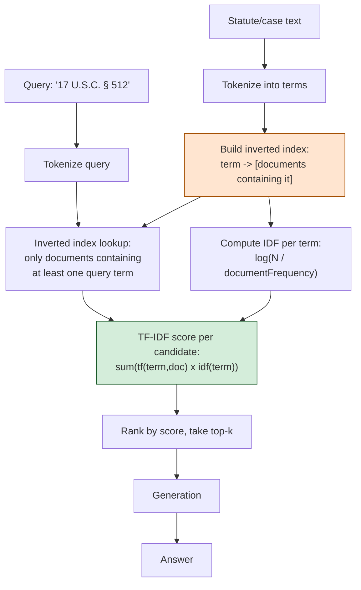

# Pattern 17: Sparse Retrieval

[← Back to index](README.md)

## 1. What is Sparse Retrieval?

Sparse Retrieval represents text as a **sparse vector** — one dimension per unique term
in the entire vocabulary, where almost every dimension is zero and only the dimensions
corresponding to terms actually present in the text are non-zero. This is the opposite
representation from dense embeddings (Pattern 16), where every one of a few hundred
dimensions carries continuous semantic signal. Sparse retrieval scores documents by
**exact term overlap**, weighted by how informative each term is — classically via
**TF-IDF** (term frequency × inverse document frequency), the foundational scoring
formula that BM25 (Pattern 18) later refined.

The core data structure behind sparse retrieval is the **inverted index**: instead of
"for each document, what terms does it contain" (a forward index), an inverted index
stores "for each term, which documents contain it" — which is what makes sparse search
fast even over huge corpora, since a query only needs to look up its own few terms
rather than scan every document.

## 2. What problem does it solve?

Dense retrieval (Pattern 16) is excellent at meaning but is fundamentally *approximate*
— it has no concept of an exact match, only closeness in a learned vector space, and
that closeness can occasionally mislead exactly where precision matters most: **exact
identifiers that must not be confused with similar-looking ones.**

- A legal citation like *"17 U.S.C. § 512"* is not "semantically similar" to
  *"17 U.S.C. § 230"* in any way that matters to a lawyer — they're completely
  different statutes that happen to share surrounding structure. A dense embedding
  might place them close together (same legal-citation "shape"); sparse retrieval
  treats them as entirely different token sequences, indexed under different terms.
- Case citations, exact statute section numbers, and defined-term cross-references
  need **exact-match reliability**, not "the closest thing we found."

Sparse retrieval solves this by scoring purely on which exact terms overlap between
query and document — there is no learned approximation to get subtly wrong.

## 3. Realistic production scenario

**Company:** an internal legal research tool for looking up **statute and case
citations** — exact identifiers like `"17 U.S.C. § 512"`, `"Fair Use Doctrine"`,
`"Miller v. California"` — where a wrong-but-similar-looking match is a serious
research error, not a minor imprecision.

**Problem:** early experiments using dense-only retrieval (Pattern 16's approach)
occasionally surfaced the wrong statute section for citation-heavy queries, because
statute text follows a repetitive, formulaic structure ("Notwithstanding subsection
(a)...") that embeds similarly across many unrelated sections — the actual
distinguishing information (the specific section number) is a small fragment of the
text and doesn't dominate the embedding.

**Goal:** build a sparse-only retrieval path — an inverted index plus TF-IDF scoring —
for citation lookups, where exact term matching on statute/case identifiers is
strictly more reliable than semantic approximation.

## 4. Architecture / flow diagram



## 5. Request-to-response walkthrough

1. **Indexing:** every statute/case document is tokenized, and an inverted index is
   built mapping each unique term to the list of documents containing it — this is the
   structure that makes lookup fast: a query for `"512"` only needs to check documents
   that actually contain the token `"512"`, never the entire corpus.
2. **IDF is precomputed** for every term in the vocabulary — terms that appear in
   almost every document (like "the", "shall", "notwithstanding" in legal text) get a
   low IDF weight since they carry little distinguishing information; terms that appear
   in only one or two documents (like a specific section number) get a high IDF weight.
3. **User asks:** *"17 U.S.C. § 512"*.
4. **Query tokenization** produces terms like `17`, `usc`, `512`.
5. **Inverted index lookup** restricts candidates to only documents containing at least
   one of these terms — documents about entirely unrelated statutes are never even
   scored, let alone ranked.
6. **TF-IDF scoring:** each candidate document's score is the sum, over query terms, of
   `termFrequency(term, doc) × idf(term)` — the document that actually discusses
   Section 512 specifically scores far higher than one that merely mentions "17 U.S.C."
   in passing, because the rare, high-IDF term `512` dominates the score.
7. **Top-ranked document(s) returned**, exact-match-grounded, and used for generation.

## 6. Why this pattern is appropriate here

- **Zero approximation risk on exact identifiers** — a citation lookup either contains
  the queried term or it doesn't; there's no learned vector space to be subtly wrong
  about.
- **The inverted index scales efficiently** — lookup cost depends on how many documents
  contain the query's specific terms, not on the total corpus size, which is why sparse
  retrieval remains the backbone of production search engines (Elasticsearch,
  OpenSearch) even in the embedding era.
- **TF-IDF's IDF weighting is what makes rare, distinguishing terms matter more than
  common ones** — this is precisely the property that makes a specific section number
  outweigh generic legal boilerplate in the final score.
- **When this is *not* enough:** if users ask conceptual questions about a legal
  doctrine using their own words rather than exact citations ("can I use a copyrighted
  clip if it's brief and for commentary"), pure sparse retrieval will miss entirely,
  since there's no exact term overlap with "fair use" doctrine text — that's exactly
  when you'd fall back to dense retrieval (Pattern 16) or combine both via Hybrid
  Search (Pattern 15), which is the typical production answer once both needs coexist
  in one system.

## 7. Production-quality implementation (Java / Spring AI)

```java
package com.acme.rag.sparse;

import org.springframework.ai.chat.client.ChatClient;
import org.springframework.ai.chat.prompt.PromptTemplate;
import org.springframework.ai.document.Document;
import org.springframework.ai.ollama.OllamaChatModel;
import org.springframework.ai.ollama.api.OllamaApi;
import org.springframework.ai.ollama.api.OllamaOptions;

import java.io.IOException;
import java.io.UncheckedIOException;
import java.nio.file.Files;
import java.nio.file.Path;
import java.util.*;
import java.util.stream.Collectors;

/**
 * Sparse Retrieval -- an inverted index plus TF-IDF scoring, used standalone
 * (no dense/embedding component at all) for exact-identifier-heavy lookups
 * where semantic approximation is actively undesirable.
 */
public final class SparseRetrievalApp {

    record RagConfig(String llmModel, double llmTemperature, int topK) {
        static RagConfig defaults() { return new RagConfig("llama3.1", 0.0, 3); }
    }

    /**
     * A minimal inverted index with TF-IDF scoring. Unlike Pattern 18's BM25
     * (which adds term-frequency saturation and document-length normalization
     * on top of this same IDF idea), plain TF-IDF here is intentionally simple
     * to make the foundational sparse-retrieval mechanics explicit.
     */
    static final class InvertedIndexTfIdf {
        private final List<Document> documents = new ArrayList<>();
        private final List<Map<String, Integer>> termFrequencies = new ArrayList<>();
        private final Map<String, List<Integer>> invertedIndex = new HashMap<>();
        private final Map<String, Double> idfByTerm = new HashMap<>();

        void index(List<Document> docs) {
            for (Document doc : docs) {
                int docId = documents.size();
                documents.add(doc);

                Map<String, Integer> tf = new HashMap<>();
                for (String term : tokenize(doc.getText())) tf.merge(term, 1, Integer::sum);
                termFrequencies.add(tf);

                for (String term : tf.keySet()) {
                    invertedIndex.computeIfAbsent(term, t -> new ArrayList<>()).add(docId);
                }
            }

            int n = documents.size();
            for (var entry : invertedIndex.entrySet()) {
                int documentFrequency = entry.getValue().size();
                double idf = Math.log((double) n / documentFrequency);
                idfByTerm.put(entry.getKey(), idf);
            }
        }

        List<Map.Entry<Document, Double>> search(String query, int topK) {
            List<String> queryTerms = tokenize(query);

            // Inverted-index lookup: only consider documents that contain at
            // least one query term -- this is what keeps sparse search fast and
            // is the defining structural difference from a brute-force scan.
            Set<Integer> candidateDocIds = new HashSet<>();
            for (String term : queryTerms) {
                candidateDocIds.addAll(invertedIndex.getOrDefault(term, List.of()));
            }

            List<Map.Entry<Document, Double>> scored = new ArrayList<>();
            for (int docId : candidateDocIds) {
                double score = 0;
                Map<String, Integer> tf = termFrequencies.get(docId);
                for (String term : queryTerms) {
                    int frequency = tf.getOrDefault(term, 0);
                    if (frequency == 0) continue;
                    double idf = idfByTerm.getOrDefault(term, 0.0);
                    score += frequency * idf;
                }
                if (score > 0) scored.add(Map.entry(documents.get(docId), score));
            }

            scored.sort((a, b) -> Double.compare(b.getValue(), a.getValue()));
            return scored.subList(0, Math.min(topK, scored.size()));
        }

        private static List<String> tokenize(String text) {
            // Lowercased, alphanumeric-plus-section-symbol tokens; keeps digit
            // sequences like "512" and "230" intact as distinguishing terms.
            return Arrays.stream(text.toLowerCase().replace("§", " section ").split("[^a-z0-9]+"))
                    .filter(t -> !t.isBlank())
                    .collect(Collectors.toList());
        }
    }

    static final class SparseCitationSearchBot {
        private static final String GEN_SYSTEM = """
                You are a legal research assistant. Answer using ONLY the context below,
                which was retrieved via exact statutory/case citation matching. If the
                context does not contain the answer, say so explicitly.

                Context:
                {context}
                """;

        private final InvertedIndexTfIdf index = new InvertedIndexTfIdf();
        private final RagConfig config;
        private final ChatClient chatClient;
        private final PromptTemplate genPromptTemplate = new PromptTemplate(GEN_SYSTEM);

        SparseCitationSearchBot(RagConfig config, ChatClient chatClient, Path sourceDir) {
            this.config = config;
            this.chatClient = chatClient;

            List<Document> docs;
            try (var files = Files.list(sourceDir)) {
                docs = files.filter(p -> p.toString().endsWith(".md")).sorted()
                        .map(p -> {
                            try {
                                return new Document(Files.readString(p),
                                        Map.of("source", p.getFileName().toString()));
                            } catch (IOException e) { throw new UncheckedIOException(e); }
                        }).collect(Collectors.toList());
            } catch (IOException e) { throw new UncheckedIOException(e); }

            index.index(docs);
        }

        record AskResult(String answer, List<String> sources) {}

        AskResult ask(String query) {
            if (query == null || query.isBlank()) {
                throw new IllegalArgumentException("Query must not be empty.");
            }

            List<Map.Entry<Document, Double>> results = index.search(query, config.topK());
            if (results.isEmpty()) {
                return new AskResult("No matching citation found in the index.", List.of());
            }

            String context = results.stream()
                    .map(e -> "[" + e.getKey().getMetadata().getOrDefault("source", "unknown") + "]\n"
                            + e.getKey().getText())
                    .collect(Collectors.joining("\n\n---\n\n"));

            String answer;
            try {
                String systemMessage = genPromptTemplate.render(Map.of("context", context));
                answer = chatClient.prompt().system(systemMessage).user(query).call().content();
            } catch (Exception ex) {
                System.err.println("Generation failed: " + ex);
                answer = "Sorry, something went wrong answering that question.";
            }

            List<String> sources = results.stream()
                    .map(e -> String.valueOf(e.getKey().getMetadata().getOrDefault("source", "unknown")))
                    .collect(Collectors.toList());

            return new AskResult(answer, sources);
        }
    }

    private static void writeSampleDocs(Path dir) throws IOException {
        Files.createDirectories(dir);
        Files.writeString(dir.resolve("dmca_512.md"), """
                ## 17 U.S.C. Section 512 -- Online Copyright Infringement Liability Limitation
                Section 512 establishes safe harbor provisions limiting the liability of
                online service providers for copyright infringement by their users,
                subject to compliance with notice-and-takedown procedures.
                """);
        Files.writeString(dir.resolve("cda_230.md"), """
                ## 47 U.S.C. Section 230 -- Protection for Private Blocking and Screening
                Section 230 provides that no provider of an interactive computer service
                shall be treated as the publisher of information provided by another
                content provider.
                """);
        Files.writeString(dir.resolve("fair_use.md"), """
                ## 17 U.S.C. Section 107 -- Fair Use
                Section 107 sets out the fair use doctrine, permitting limited use of
                copyrighted material without permission for purposes such as criticism,
                commentary, news reporting, teaching, and research.
                """);
    }

    public static void main(String[] args) throws IOException {
        RagConfig config = RagConfig.defaults();
        Path sampleDir = Path.of("./sample_legal_citations");
        writeSampleDocs(sampleDir);

        OllamaApi ollamaApi = OllamaApi.builder().baseUrl("http://localhost:11434").build();
        OllamaChatModel chatModel = OllamaChatModel.builder()
                .ollamaApi(ollamaApi)
                .defaultOptions(OllamaOptions.builder().model(config.llmModel())
                        .temperature(config.llmTemperature()).build())
                .build();
        ChatClient chatClient = ChatClient.create(chatModel);

        SparseCitationSearchBot bot = new SparseCitationSearchBot(config, chatClient, sampleDir);

        SparseCitationSearchBot.AskResult result = bot.ask("17 U.S.C. § 512");
        System.out.println("\nQ: 17 U.S.C. § 512");
        System.out.println("  sources: " + result.sources());
        System.out.println("A: " + result.answer());
    }
}
```

### Key production details worth noting

- **No embedding model is used anywhere in this pattern** — this is deliberate and is
  the point: sparse retrieval is a complete, self-sufficient retrieval mechanism on its
  own, not merely a fallback or a component of hybrid search. It's the right *sole*
  choice for exact-identifier-heavy corpora, as demonstrated here.
- **The `§` symbol is explicitly normalized to the token `"section"`** during
  tokenization — a small but important detail: real-world text uses inconsistent
  notation (`§ 512`, `Section 512`, `Sec. 512`) for the same concept, and the tokenizer
  must normalize these or the inverted index will silently fail to connect them.
- **The inverted index (`Map<String, List<Integer>>`) is what makes this fast at
  scale** — search cost scales with how many documents contain the query's specific
  terms, not with total corpus size, unlike a brute-force scan over every document's
  raw text.
- **This pattern and Pattern 18 (BM25) share the IDF concept** but differ in the
  term-frequency weighting: plain TF-IDF here uses raw term frequency linearly, while
  BM25 applies saturation (diminishing returns for repeated terms) and document-length
  normalization — Pattern 18 explains exactly why that refinement matters and when it
  changes rankings.

---
[← Back to index](README.md)
