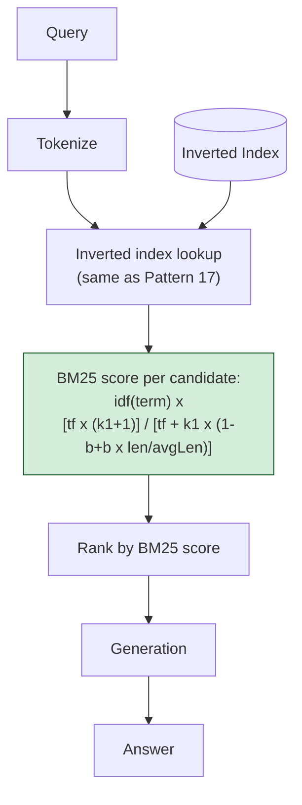

# Pattern 18: BM25

[← Back to index](README.md)

## 1. What is BM25?

BM25 ("Best Matching 25") is the refined, production-standard scoring function that
sparse retrieval (Pattern 17) uses in practice instead of plain TF-IDF. It keeps
TF-IDF's core idea — score by term overlap, weighted by how rare/informative each term
is — but fixes two specific weaknesses in plain TF-IDF through two tunable parameters:

- **`k1` (term frequency saturation):** in plain TF-IDF, a term appearing 10 times
  contributes exactly 10x the score of it appearing once — linear, unbounded. BM25
  applies **diminishing returns**: the 2nd occurrence of a term matters a lot, the 10th
  occurrence barely more than the 9th. `k1` controls how quickly this saturation kicks
  in (typically 1.2–2.0).
- **`b` (document length normalization):** a longer document naturally contains more
  term occurrences just by having more words, which would otherwise make it
  artificially outscore a short, precisely-relevant document. `b` controls how much
  a document's length (relative to the corpus average) discounts its score
  (`b=0` disables length normalization entirely; `b=1` applies it fully; `0.75` is the
  standard default).

## 2. What problem does it solve?

Plain TF-IDF (Pattern 17) has two specific, well-documented failure modes that BM25
exists to fix:

- **Keyword stuffing artificially wins.** A long document that happens to repeat the
  query term many times (even innocuously — a long runbook that mentions "timeout"
  a dozen times across many unrelated troubleshooting steps) can outscore a short,
  perfectly on-topic document that mentions "timeout" just twice, purely because raw
  term frequency is unbounded and linear in TF-IDF.
- **Long documents get an unfair advantage.** Independent of keyword stuffing, longer
  documents simply have more words and thus more chances to contain any given query
  term multiple times — TF-IDF has no mechanism to account for this, so length alone
  becomes a confounding variable in the ranking.

BM25's saturation (`k1`) and length normalization (`b`) directly correct both of these,
which is why BM25 — not plain TF-IDF — is what real search engines (Elasticsearch,
OpenSearch, Lucene) actually implement as their default relevance scoring function.

## 3. Realistic production scenario

**Company:** the internal engineering knowledge base, now specifically stress-testing
retrieval quality across a corpus with **wildly varying document lengths** — short,
one-paragraph FAQ-style answers mixed with long, multi-section runbooks that
legitimately discuss several related topics (and so legitimately mention shared terms
like "timeout" or "retry" many times across different sections).

**Problem:** using plain TF-IDF (as in Pattern 17) on this specific corpus, a long
multi-topic runbook that happens to mention "connection timeout" eight times across
eight unrelated troubleshooting sections consistently outranks a short, precisely
on-topic FAQ entry that mentions "connection timeout" twice — even though the FAQ entry
is the better, more directly relevant answer.

**Goal:** switch from plain TF-IDF to BM25 scoring, tune `k1` and `b` for this
corpus's length distribution, and demonstrate concretely how the ranking changes and
why.

## 4. Architecture / flow diagram



## 5. Request-to-response walkthrough

1. **Query comes in:** *"connection timeout"*.
2. **Candidate lookup:** the same inverted-index lookup as plain sparse retrieval
   (Pattern 17) narrows to documents containing at least one query term.
3. **BM25 scoring, term by term:** for each candidate document, and each query term,
   the score contribution is `idf(term) × [tf × (k1+1)] / [tf + k1 × (1 - b + b ×
   (docLength / avgDocLength))]`.
4. **Saturation in action:** for the long runbook mentioning "timeout" 8 times, the
   numerator `tf × (k1+1)` grows, but the denominator grows *faster* as `tf` increases
   (because `tf` also appears alone in the denominator) — so each additional occurrence
   contributes progressively less. The 8th occurrence barely moves the score compared
   to the 2nd.
5. **Length normalization in action:** the runbook's `docLength` is far above
   `avgDocLength`, so the denominator's `b × (docLength / avgDocLength)` term inflates
   further, discounting the score specifically *because* the document is unusually
   long — correcting for the "more words, more chances to match" confound.
6. **Result:** the short, precisely on-topic FAQ entry — with a `docLength` near the
   corpus average and only 2 occurrences that aren't yet heavily saturated — now scores
   competitively with or higher than the long runbook, correctly.
7. **Top-ranked chunks used for generation**, same as every other pattern.

## 6. Why this pattern is appropriate here

- **This is the industry-standard sparse scoring function for a reason** — the
  saturation and length-normalization fixes it makes over plain TF-IDF are exactly the
  failure modes that show up in real, heterogeneous document corpora (which is nearly
  every production corpus, especially ones mixing short FAQs with long runbooks).
- **`k1` and `b` are legitimately worth tuning per corpus**, not just left at defaults:
  a corpus of very uniform-length documents benefits less from length normalization
  (`b` closer to 0 is reasonable); a corpus prone to keyword-stuffed documents benefits
  from a lower `k1` (faster saturation).
- **This pattern completes the sparse-retrieval story** started in Pattern 17: exact
  matching (the inverted index) plus properly-calibrated relevance scoring (BM25) is
  what makes sparse retrieval production-grade rather than a naive baseline — and it's
  this BM25 implementation, not plain TF-IDF, that Pattern 15's Hybrid Search actually
  fuses with dense retrieval.
- **When this is *not* enough:** BM25 still has zero notion of synonymy or paraphrase —
  it will never match "cancel" against "terminate" no matter how well-tuned `k1`/`b`
  are. That gap is what Hybrid Search (Pattern 15) closes by running dense retrieval
  alongside it.

## 7. Production-quality implementation (Java / Spring AI)

```java
package com.acme.rag.bm25;

import org.springframework.ai.chat.client.ChatClient;
import org.springframework.ai.chat.prompt.PromptTemplate;
import org.springframework.ai.document.Document;
import org.springframework.ai.ollama.OllamaChatModel;
import org.springframework.ai.ollama.api.OllamaApi;
import org.springframework.ai.ollama.api.OllamaOptions;

import java.io.IOException;
import java.io.UncheckedIOException;
import java.nio.file.Files;
import java.nio.file.Path;
import java.util.*;
import java.util.stream.Collectors;

/**
 * BM25 -- sparse retrieval scoring with term-frequency saturation (k1) and
 * document-length normalization (b), tunable per corpus. Contrast with
 * Pattern 17's plain TF-IDF, which lacks both corrections.
 */
public final class Bm25App {

    record RagConfig(String llmModel, double llmTemperature, int topK, double k1, double b) {
        static RagConfig defaults() {
            // k1=1.5, b=0.75 are the widely-used standard defaults (as in
            // Elasticsearch/Lucene) and are a reasonable starting point for
            // most corpora before any corpus-specific tuning.
            return new RagConfig("llama3.1", 0.0, 3, 1.5, 0.75);
        }
    }

    static final class Bm25Index {
        private final double k1;
        private final double b;
        private final List<Document> documents = new ArrayList<>();
        private final List<Map<String, Integer>> termFrequencies = new ArrayList<>();
        private final Map<String, Integer> documentFrequency = new HashMap<>();
        private double averageDocLength = 0;

        Bm25Index(double k1, double b) {
            this.k1 = k1;
            this.b = b;
        }

        void index(List<Document> docs) {
            for (Document doc : docs) {
                List<String> tokens = tokenize(doc.getText());
                Map<String, Integer> tf = new HashMap<>();
                for (String token : tokens) tf.merge(token, 1, Integer::sum);

                documents.add(doc);
                termFrequencies.add(tf);
                for (String term : tf.keySet()) documentFrequency.merge(term, 1, Integer::sum);
            }
            averageDocLength = termFrequencies.stream()
                    .mapToInt(tf -> tf.values().stream().mapToInt(Integer::intValue).sum())
                    .average().orElse(0);
        }

        List<Map.Entry<Document, Double>> search(String query, int topK) {
            List<String> queryTerms = tokenize(query);
            int n = documents.size();

            List<Map.Entry<Document, Double>> scored = new ArrayList<>();
            for (int i = 0; i < documents.size(); i++) {
                Map<String, Integer> tf = termFrequencies.get(i);
                int docLength = tf.values().stream().mapToInt(Integer::intValue).sum();
                double score = 0;

                for (String term : queryTerms) {
                    int frequency = tf.getOrDefault(term, 0);
                    if (frequency == 0) continue;
                    int df = documentFrequency.getOrDefault(term, 0);
                    double idf = Math.log(1 + (n - df + 0.5) / (df + 0.5));

                    // The BM25 formula itself: saturating term frequency (k1) and
                    // length normalization (b), applied together in the denominator.
                    double numerator = frequency * (k1 + 1);
                    double denominator = frequency + k1 * (1 - b + b * (docLength / averageDocLength));
                    score += idf * (numerator / denominator);
                }
                if (score > 0) scored.add(Map.entry(documents.get(i), score));
            }

            scored.sort((x, y) -> Double.compare(y.getValue(), x.getValue()));
            return scored.subList(0, Math.min(topK, scored.size()));
        }

        private static List<String> tokenize(String text) {
            return Arrays.stream(text.toLowerCase().split("[^a-z0-9]+"))
                    .filter(t -> !t.isBlank())
                    .collect(Collectors.toList());
        }
    }

    static final class Bm25SearchBot {
        private static final String GEN_SYSTEM = """
                You are an internal engineering search assistant. Answer using ONLY the
                context below. If the context is insufficient, say so.

                Context:
                {context}
                """;

        private final Bm25Index index;
        private final ChatClient chatClient;
        private final RagConfig config;
        private final PromptTemplate genPromptTemplate = new PromptTemplate(GEN_SYSTEM);

        Bm25SearchBot(RagConfig config, ChatClient chatClient, Path sourceDir) {
            this.config = config;
            this.chatClient = chatClient;
            this.index = new Bm25Index(config.k1(), config.b());

            List<Document> docs;
            try (var files = Files.list(sourceDir)) {
                docs = files.filter(p -> p.toString().endsWith(".md")).sorted()
                        .map(p -> {
                            try {
                                return new Document(Files.readString(p),
                                        Map.of("source", p.getFileName().toString()));
                            } catch (IOException e) { throw new UncheckedIOException(e); }
                        }).collect(Collectors.toList());
            } catch (IOException e) { throw new UncheckedIOException(e); }
            index.index(docs);
        }

        record AskResult(String answer, List<String> sourcesRanked) {}

        AskResult ask(String query) {
            if (query == null || query.isBlank()) {
                throw new IllegalArgumentException("Query must not be empty.");
            }

            List<Map.Entry<Document, Double>> results = index.search(query, config.topK());
            System.out.println("BM25 scores (k1=" + config.k1() + ", b=" + config.b() + "): "
                    + results.stream()
                            .map(e -> e.getKey().getMetadata().get("source") + "=" + String.format("%.3f", e.getValue()))
                            .collect(Collectors.joining(", ")));

            if (results.isEmpty()) {
                return new AskResult("No relevant documents found.", List.of());
            }

            String context = results.stream()
                    .map(e -> "[" + e.getKey().getMetadata().getOrDefault("source", "unknown") + "]\n"
                            + e.getKey().getText())
                    .collect(Collectors.joining("\n\n---\n\n"));

            String answer;
            try {
                String systemMessage = genPromptTemplate.render(Map.of("context", context));
                answer = chatClient.prompt().system(systemMessage).user(query).call().content();
            } catch (Exception ex) {
                System.err.println("Generation failed: " + ex);
                answer = "Sorry, something went wrong answering that question.";
            }

            List<String> sources = results.stream()
                    .map(e -> String.valueOf(e.getKey().getMetadata().getOrDefault("source", "unknown")))
                    .collect(Collectors.toList());

            return new AskResult(answer, sources);
        }
    }

    private static void writeSampleDocs(Path dir) throws IOException {
        Files.createDirectories(dir);
        // A short, precisely on-topic FAQ entry -- mentions the query term twice.
        Files.writeString(dir.resolve("faq_connection_timeout.md"), """
                ## Connection Timeout FAQ
                A connection timeout usually means the target service is unreachable or
                overloaded. Increase the client timeout setting or check the service's
                health dashboard if you see repeated connection timeout errors.
                """);
        // A long, multi-topic runbook -- mentions "timeout" many times across
        // unrelated sections, which would inflate plain TF-IDF but is corrected
        // by BM25's saturation and length normalization.
        Files.writeString(dir.resolve("general_troubleshooting_runbook.md"), """
                ## General Service Troubleshooting Runbook
                ### Database Issues
                Database connection timeout can occur under high load; check connection
                pool exhaustion first.
                ### Cache Issues
                Cache lookups rarely timeout, but a cold cache after deploy can cause
                elevated latency that looks like a timeout to callers.
                ### Message Queue Issues
                Consumer timeout settings should exceed the p99 processing time to avoid
                spurious redelivery.
                ### Load Balancer Issues
                Health check timeout misconfiguration can route traffic to instances that
                are still starting up.
                ### External API Issues
                Third-party API timeout handling should always include a circuit breaker
                to avoid cascading failures across dependent services.
                ### DNS Issues
                DNS resolution timeout is rare internally but can happen during a
                misconfigured VPC peering change.
                ### TLS Issues
                TLS handshake timeout is often confused with a general connection
                timeout; check certificate validation logs to distinguish the two.
                ### Retry Logic
                Retries after a timeout should use exponential backoff, not fixed-delay
                retries, to avoid amplifying load during an incident.
                """);
    }

    public static void main(String[] args) throws IOException {
        RagConfig config = RagConfig.defaults();
        Path sampleDir = Path.of("./sample_eng_kb_bm25");
        writeSampleDocs(sampleDir);

        OllamaApi ollamaApi = OllamaApi.builder().baseUrl("http://localhost:11434").build();
        OllamaChatModel chatModel = OllamaChatModel.builder()
                .ollamaApi(ollamaApi)
                .defaultOptions(OllamaOptions.builder().model(config.llmModel())
                        .temperature(config.llmTemperature()).build())
                .build();
        ChatClient chatClient = ChatClient.create(chatModel);

        Bm25SearchBot bot = new Bm25SearchBot(config, chatClient, sampleDir);

        Bm25SearchBot.AskResult result = bot.ask("connection timeout");
        System.out.println("\nQ: connection timeout");
        System.out.println("  sources ranked: " + result.sourcesRanked());
        System.out.println("A: " + result.answer());
    }
}
```

### Key production details worth noting

- **The BM25 score is logged per document before generation** (`System.out.println`
  showing each source's raw score) specifically so the saturation and length-
  normalization effects are directly observable when comparing the short FAQ entry
  against the long runbook — this is a valuable pattern to keep in production logging
  too, for debugging unexpected rankings.
- **`k1` and `b` are `RagConfig` fields, not hardcoded constants** — making them
  trivially tunable per corpus without touching the scoring logic itself; a corpus of
  very uniform document lengths can reasonably lower `b`, while a corpus prone to
  keyword-heavy documents can lower `k1` to saturate faster.
- **This exact BM25 implementation is what Pattern 15's Hybrid Search fuses with dense
  retrieval** via Reciprocal Rank Fusion — Pattern 18 is the deep-dive on the sparse
  half of that fusion, explaining precisely why its rankings look the way they do.
- **`averageDocLength` is computed once at indexing time** across the whole corpus —
  it's a corpus-level statistic, not recomputed per query, which keeps query-time
  scoring fast (a single pass over candidate documents, no full-corpus rescan).

---
[← Back to index](README.md)
