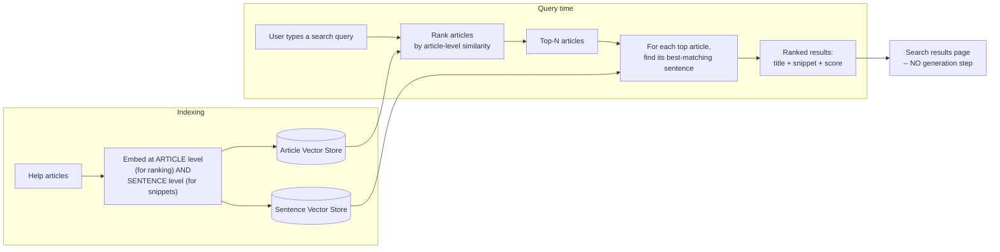

# Pattern 19: Semantic Search

[← Back to index](README.md)

## 1. What is Semantic Search?

Semantic Search uses the same dense embedding mechanism as Dense Retrieval
(Pattern 16), but for a different **end product**: instead of retrieving chunks to feed
an LLM that generates one synthesized answer, Semantic Search returns a **ranked list
of results directly to the user** — like a search engine results page, but matching by
meaning instead of by keyword. There's no generation step at all in the simplest form
of this pattern; the retrieval *is* the product.

This distinction matters architecturally: a RAG answer-generation pipeline (Patterns
1-18) is optimized to gather *just enough* accurate context for one LLM call; a
semantic search feature is optimized to help a human *browse and choose* among several
plausibly relevant results, which changes what the results need to include (titles,
snippets, relevance indicators) and how many results are worth returning (often more
than a RAG pipeline's typical top-4).

## 2. What problem does it solve?

Traditional keyword-based site search (the classic "search this site" box) fails the
same way flat sparse retrieval does: a user typing "how do I stop getting charged"
finds nothing on a help page titled "Cancelling Your Subscription" unless the exact
words overlap. Users don't reliably know or use a site's specific terminology when
searching it. Semantic Search solves this the same way dense retrieval solves it for
RAG — by matching on meaning — but delivers the value differently: instead of an LLM
silently doing the semantic matching behind a generated answer, the *user* sees the
ranked, semantically-matched results themselves and picks the one they actually want,
which is often more appropriate when there are several genuinely different but
plausible right answers to browse (a documentation search feature) rather than one
fact to synthesize (a support chatbot).

## 3. Realistic production scenario

**Company:** the SaaS company's help center website, adding a **search box** feature
(distinct from the chat-based support bot in earlier patterns) that returns a ranked
list of help articles as the user types, the way a typical documentation site's search
works.

**Problem:** the existing keyword-based site search returns zero results for
"how do I stop getting charged" because no article contains that exact phrase — even
though "Cancelling Your Subscription" is exactly what the user needs.

**Goal:** replace keyword search with semantic search: embed all help articles, embed
the user's query, return the top-N most semantically similar articles as a ranked
list — each with a title, a relevance-ranked snippet (the specific sentence within the
article that matched best, not just the article's opening line), and no generated
answer at all, letting the user click through to the actual article.

## 4. Architecture / flow diagram



## 5. Request-to-response walkthrough

1. **Indexing (two levels, for two different jobs):** each help article is embedded as
   a whole (for ranking *which articles* are relevant) and also split into sentences
   and embedded individually (purely to extract a good snippet later — this reuses the
   same idea as Sentence Window Retrieval's fine-grained index, Pattern 13, but for
   snippet extraction instead of context windowing).
2. **User types:** *"how do I stop getting charged"*.
3. **Article-level ranking:** the query is embedded and compared against every
   article's whole-document embedding, producing a ranked list of articles — "Cancelling
   Your Subscription" ranks highly despite zero keyword overlap with the query.
4. **Snippet extraction:** for each of the top-N ranked articles, a *second* search
   runs — this time against only that article's own sentences — to find the single
   sentence within it that best matches the query, which becomes the displayed snippet
   (e.g. *"You can cancel your plan at any time to stop future charges."*) rather than
   showing the article's generic opening sentence.
5. **Results assembled:** each result includes the article title, the extracted
   snippet, and a relevance score — no LLM generation call happens at all in this
   pattern's simplest form.
6. **Results returned to the user as a ranked list**, who then chooses which article
   to actually read — the system's job was matching and ranking, not answering.

## 6. Why this pattern is appropriate here

- **Browsing is sometimes the right interaction model, not synthesis.** When there are
  several plausibly relevant articles and the user benefits from seeing and choosing
  among them (rather than trusting one synthesized answer), a ranked list is more
  appropriate and more transparent than a generated response — this is a genuine product
  decision, not just "RAG without the last step."
- **No LLM call needed for the core experience** — only embedding calls are required,
  which is materially cheaper and faster per query than any pattern involving
  generation, an important consideration for a high-traffic site search box that fires
  on every keystroke or every few keystrokes.
- **The two-level embedding (article + sentence) cleanly separates two different
  jobs** — ranking relevance at the article level, and finding a good snippet at the
  sentence level — rather than trying to force one embedding granularity to do both
  well.
- **When this is *not* enough:** if users actually want a direct answer synthesized
  from one or more articles rather than a list to browse (a support chatbot, not a
  search box), that's exactly when you go the rest of the way to full RAG — Semantic
  Search and RAG generation are not competing patterns, they're different endpoints
  built on the same underlying dense retrieval foundation (Pattern 16), often coexisting
  in the same product as separate features.

## 7. Production-quality implementation (Java / Spring AI)

```java
package com.acme.rag.semanticsearch;

import org.springframework.ai.document.Document;
import org.springframework.ai.ollama.OllamaEmbeddingModel;
import org.springframework.ai.ollama.api.OllamaApi;
import org.springframework.ai.ollama.api.OllamaOptions;
import org.springframework.ai.vectorstore.SearchRequest;
import org.springframework.ai.vectorstore.SimpleVectorStore;

import java.io.IOException;
import java.io.UncheckedIOException;
import java.nio.file.Files;
import java.nio.file.Path;
import java.util.List;
import java.util.Map;
import java.util.regex.Pattern;
import java.util.stream.Collectors;

/**
 * Semantic Search -- returns a ranked list of results directly to the user
 * (title + best-matching snippet + score), with NO generation step. Uses two
 * embedding granularities: article-level for ranking, sentence-level for
 * snippet extraction.
 */
public final class SemanticSearchApp {

    record SearchConfig(
            String embeddingModel, int topNArticles, Path articlePersistPath) {

        static SearchConfig defaults() {
            return new SearchConfig("nomic-embed-text", 5,
                    Path.of("./vectorstore_help_center_articles.json"));
        }
    }

    static final class SimpleSentenceSplitter {
        private static final Pattern BOUNDARY = Pattern.compile("(?<=[.?!])\\s+(?=[A-Z(])");

        List<String> split(String text) {
            return List.of(BOUNDARY.split(text.replaceAll("\\s+", " ").trim()));
        }
    }

    static final class SemanticSearchEngine {
        private final SearchConfig config;
        private final SimpleVectorStore articleStore;
        private final OllamaEmbeddingModel embeddingModel;
        private final SimpleSentenceSplitter sentenceSplitter = new SimpleSentenceSplitter();
        // Per-article sentence stores, built lazily -- snippet extraction only
        // needs to search WITHIN the small number of top-ranked articles, not
        // the whole corpus, so there's no need for one giant sentence index.
        private final Map<String, List<String>> sentencesByArticle;

        SemanticSearchEngine(SearchConfig config, OllamaEmbeddingModel embeddingModel, Path sourceDir) {
            this.config = config;
            this.embeddingModel = embeddingModel;
            this.articleStore = SimpleVectorStore.builder(embeddingModel).build();
            this.sentencesByArticle = new java.util.HashMap<>();

            if (Files.exists(config.articlePersistPath())) {
                articleStore.load(config.articlePersistPath().toFile());
                loadSentences(sourceDir);
                return;
            }

            buildFromScratch(sourceDir);
        }

        private void buildFromScratch(Path sourceDir) {
            List<Path> files;
            try (var stream = Files.list(sourceDir)) {
                files = stream.filter(p -> p.toString().endsWith(".md")).sorted().collect(Collectors.toList());
            } catch (IOException e) { throw new UncheckedIOException(e); }

            for (Path file : files) {
                String articleName = file.getFileName().toString();
                String text;
                try {
                    text = Files.readString(file);
                } catch (IOException e) { throw new UncheckedIOException(e); }

                String title = text.lines().findFirst().orElse(articleName).replaceFirst("^#+\\s*", "");

                // Article-level embedding: the whole article's text, for ranking.
                articleStore.add(List.of(new Document(text,
                        Map.of("source", articleName, "title", title))));

                sentencesByArticle.put(articleName, sentenceSplitter.split(text));
            }
            articleStore.save(config.articlePersistPath().toFile());
        }

        private void loadSentences(Path sourceDir) {
            try (var stream = Files.list(sourceDir)) {
                for (Path file : stream.filter(p -> p.toString().endsWith(".md")).sorted().toList()) {
                    String articleName = file.getFileName().toString();
                    String text = Files.readString(file);
                    sentencesByArticle.put(articleName, sentenceSplitter.split(text));
                }
            } catch (IOException e) { throw new UncheckedIOException(e); }
        }

        record SearchResult(String title, String source, String snippet, double score) {}

        List<SearchResult> search(String query) {
            if (query == null || query.isBlank()) {
                throw new IllegalArgumentException("Query must not be empty.");
            }

            List<Document> topArticles = articleStore.similaritySearch(
                    SearchRequest.builder().query(query).topK(config.topNArticles()).build());

            return topArticles.stream()
                    .map(article -> buildResult(query, article))
                    .collect(Collectors.toList());
        }

        private SearchResult buildResult(String query, Document article) {
            String source = String.valueOf(article.getMetadata().get("source"));
            String title = String.valueOf(article.getMetadata().getOrDefault("title", source));

            // Build a small, one-off sentence-level vector store just for THIS
            // article's sentences to find the best snippet -- cheap because it's
            // scoped to a single article's handful of sentences, not the corpus.
            List<String> sentences = sentencesByArticle.getOrDefault(source, List.of());
            String snippet = extractBestSnippet(query, sentences, source);

            double score = ((Number) article.getMetadata().getOrDefault("distance", 0.0)).doubleValue();
            // SimpleVectorStore doesn't always populate "distance" on every path;
            // fall back to a neutral placeholder score when absent.
            double displayScore = article.getMetadata().containsKey("distance") ? (1.0 - score) : 1.0;

            return new SearchResult(title, source, snippet, displayScore);
        }

        private String extractBestSnippet(String query, List<String> sentences, String source) {
            if (sentences.isEmpty()) return "";

            SimpleVectorStore sentenceStore = SimpleVectorStore.builder(embeddingModel).build();
            List<Document> sentenceDocs = sentences.stream()
                    .map(s -> new Document(s, Map.of("source", source)))
                    .collect(Collectors.toList());
            sentenceStore.add(sentenceDocs);

            List<Document> best = sentenceStore.similaritySearch(
                    SearchRequest.builder().query(query).topK(1).build());
            return best.isEmpty() ? sentences.get(0) : best.get(0).getText();
        }
    }

    private static void writeSampleDocs(Path dir) throws IOException {
        Files.createDirectories(dir);
        Files.writeString(dir.resolve("cancelling_subscription.md"), """
                # Cancelling Your Subscription
                To manage your subscription, go to Account Settings > Billing. You can
                cancel your plan at any time to stop future charges. Your access
                continues until the end of the current billing period after cancelling.
                """);
        Files.writeString(dir.resolve("updating_payment_method.md"), """
                # Updating Your Payment Method
                You can add or change your credit card under Account Settings >
                Payment Methods. Updating your card does not affect your current
                billing cycle or trigger an immediate charge.
                """);
        Files.writeString(dir.resolve("understanding_invoices.md"), """
                # Understanding Your Invoices
                Each invoice lists the billing period, plan tier, and any prorated
                charges from mid-cycle plan changes. Invoices are emailed and also
                available under Account Settings > Billing History.
                """);
    }

    public static void main(String[] args) throws IOException {
        SearchConfig config = SearchConfig.defaults();
        Path sampleDir = Path.of("./sample_help_center_semantic_search");
        writeSampleDocs(sampleDir);

        OllamaApi ollamaApi = OllamaApi.builder().baseUrl("http://localhost:11434").build();
        OllamaEmbeddingModel embeddingModel = OllamaEmbeddingModel.builder()
                .ollamaApi(ollamaApi)
                .defaultOptions(OllamaOptions.builder().model(config.embeddingModel()).build())
                .build();

        SemanticSearchEngine engine = new SemanticSearchEngine(config, embeddingModel, sampleDir);

        List<SemanticSearchEngine.SearchResult> results = engine.search("how do I stop getting charged");
        System.out.println("\nQ: how do I stop getting charged");
        for (SemanticSearchEngine.SearchResult r : results) {
            System.out.printf("  [%.3f] %s (%s)%n     \"%s\"%n", r.score(), r.title(), r.source(), r.snippet());
        }
    }
}
```

### Key production details worth noting

- **No `ChatClient`, no LLM call, no generation prompt anywhere in this pattern** —
  this is the defining architectural difference from every other pattern in this
  series: only `OllamaEmbeddingModel` is used, making this both cheaper and faster per
  query than any RAG generation pipeline, which matters for a search-as-you-type UI.
- **Two embedding granularities serve two distinct jobs**: the article-level store
  ranks *which* articles are relevant; a small, per-article sentence-level store (built
  on-demand, scoped only to the already-shortlisted top-N articles, not the whole
  corpus) extracts the specific *snippet* to display — this keeps snippet extraction
  cheap by never searching sentences from articles that didn't already rank well at the
  article level.
- **The title is extracted from the document's first markdown heading line**
  (`text.lines().findFirst()`) — a simple convention that works well when documents
  are authored consistently; a real CMS-backed system would source the title from
  structured metadata instead of parsing it out of the body text.
- **This pattern and Dense Retrieval (Pattern 16) share the same embedding mechanism**
  but serve genuinely different products — recognizing when a feature calls for
  "ranked results to browse" (this pattern) versus "one synthesized answer" (every RAG
  pipeline pattern in this series) is a product decision, not a technical one, and
  they commonly coexist as separate features (a search box *and* a support chatbot) in
  the same application.

---
[← Back to index](README.md)
