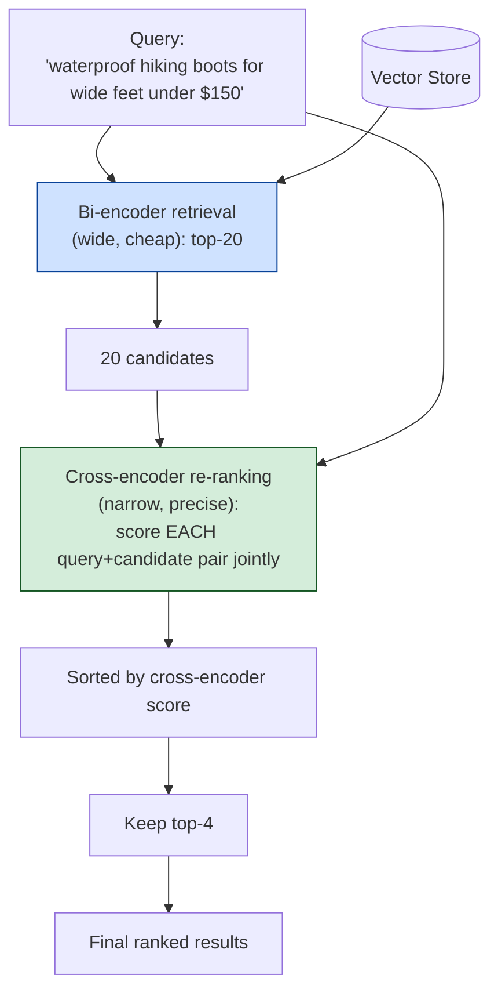

# Pattern 20: Re-Ranking

[← Back to index](README.md)

## 1. What is Re-Ranking?

Re-Ranking is a **second, more expensive relevance-scoring pass** applied to a small
set of already-retrieved candidates, using a model that judges query and passage
*jointly* rather than by comparing pre-computed independent embeddings. Pattern 3
(Advanced RAG) already used a simple version of this as one fixed step; this pattern
goes deep on *why* re-ranking works structurally better than embedding similarity
alone, and treats it as its own tunable, swappable module.

The key architectural distinction is **bi-encoder vs. cross-encoder**:

- **Bi-encoder** (what every dense retrieval pattern so far has used): the query and
  each document are embedded *independently*, and compared afterward via cosine
  similarity. This is fast — embeddings can be precomputed for the whole corpus once —
  but the model never actually looks at the query and document *together*.
- **Cross-encoder**: the query and a *specific candidate document* are fed into the
  model *together*, and the model outputs one relevance score for that exact pair. This
  is far more accurate (the model can reason jointly about both texts) but far more
  expensive — a fresh forward pass is required for every query-document pair, so it's
  only practical on a small candidate set, never the whole corpus.

Re-ranking's standard shape is therefore: **bi-encoder for the wide, cheap first pass
(retrieval) → cross-encoder for the narrow, precise second pass (re-ranking)** — using
each architecture for exactly what it's good at.

## 2. What problem does it solve?

Bi-encoder similarity has a structural ceiling: because query and document embeddings
are computed independently, the similarity score can never capture *interactions*
between specific details in the query and specific details in the document. This shows
up sharply on queries with **multiple simultaneous constraints**:

- *"waterproof hiking boots for wide feet under $150"* — a bi-encoder embeds this whole
  sentence as one vector; a product that's waterproof but not wide-fit, or wide-fit but
  $180, might embed deceptively close to the ideal match, because the embedding
  averages/blends all the constraints together rather than checking each one.
- A cross-encoder, by contrast, can process the query and a specific product's full
  description *together* and explicitly reason "waterproof ✓, wide-fit ✗ (this is a
  standard-width boot), price ✓" — catching the constraint violation a bi-encoder's
  single blended vector comparison would miss.

## 3. Realistic production scenario

**Company:** an e-commerce site's product search, where users frequently type
multi-constraint queries (material, fit, price ceiling, use case combined in one
sentence) against a catalog of product descriptions.

**Problem:** the initial bi-encoder retrieval (Pattern 16-style dense search) returns a
reasonable top-20 candidate pool, but the *ordering* within that pool doesn't reliably
put the truly best-matching product first — a product satisfying only 2 of 3 stated
constraints sometimes outranks one satisfying all 3, because the embedding similarity
score doesn't explicitly verify each constraint.

**Goal:** retrieve a wide top-20 candidate pool via bi-encoder dense search (cheap),
then re-rank those 20 using an LLM prompted to act as a cross-encoder — jointly
evaluating the full query against each candidate's full description and outputting an
explicit relevance score — keeping only the top-4 re-ranked results for the final
response.

## 4. Architecture / flow diagram



## 5. Request-to-response walkthrough

1. **User searches:** *"waterproof hiking boots for wide feet under $150"*.
2. **Bi-encoder retrieval (wide pass):** the query is embedded and compared against
   precomputed product embeddings, returning the top-20 semantically closest products —
   fast, since only one query embedding was computed and compared against
   already-indexed vectors.
3. **Cross-encoder re-ranking (narrow pass):** for each of the 20 candidates, the full
   query and that specific product's full description are sent *together* to the LLM,
   which is prompted to output a 0-10 relevance score after explicitly considering each
   stated constraint (material, fit, price).
4. **Constraint violations are caught explicitly:** a product that's waterproof and
   under $150 but described as "standard fit" scores lower than one explicitly
   described as "wide-fit available," because the model is reasoning about the *actual
   text of both* together, not comparing two independently-computed vectors.
5. **Results sorted by cross-encoder score**, top-4 kept as the final ranked results.
6. **Results returned**, now correctly prioritizing products that satisfy all stated
   constraints over those that only superficially resemble the query.

## 6. Why this pattern is appropriate here

- **Multi-constraint queries are exactly where bi-encoder similarity structurally
  underperforms** — this is not a matter of using a "better" embedding model; it's an
  architectural limitation of comparing independently-computed vectors, which
  cross-encoding directly addresses by letting the model see both texts together.
- **The two-stage bi-encoder → cross-encoder shape is the right cost/accuracy
  trade-off** — cross-encoding all 10,000+ products in the catalog against every query
  would be prohibitively slow; restricting the expensive cross-encoder pass to a small,
  already-plausible top-20 candidate pool keeps total latency reasonable while still
  getting cross-encoder-quality final ordering.
- **This is the same underlying technique used informally in Pattern 3**, now treated
  as its own deep, swappable module — in a real production system with strict latency
  requirements, this LLM-as-cross-encoder approach would typically be replaced with a
  dedicated, much smaller and faster cross-encoder model (e.g. a fine-tuned
  `ms-marco-MiniLM`-style model served via a lightweight inference endpoint) rather
  than a full LLM call per candidate — the *pattern* (bi-encoder retrieve, then
  cross-encoder re-rank) stays identical either way.
- **When this is *not* enough:** if the candidate pool itself is missing the right
  product entirely (a retrieval recall problem, not a ranking problem), no amount of
  re-ranking helps — that's addressed by widening the initial retrieval (`wideK`) or by
  Hybrid Search (Pattern 15) if the miss is due to lexical mismatch rather than
  semantic blending.

## 7. Production-quality implementation (Java / Spring AI)

```java
package com.acme.rag.reranking;

import org.springframework.ai.chat.client.ChatClient;
import org.springframework.ai.document.Document;
import org.springframework.ai.ollama.OllamaChatModel;
import org.springframework.ai.ollama.OllamaEmbeddingModel;
import org.springframework.ai.ollama.api.OllamaApi;
import org.springframework.ai.ollama.api.OllamaOptions;
import org.springframework.ai.vectorstore.SearchRequest;
import org.springframework.ai.vectorstore.SimpleVectorStore;

import java.io.IOException;
import java.io.UncheckedIOException;
import java.nio.file.Files;
import java.nio.file.Path;
import java.util.AbstractMap.SimpleEntry;
import java.util.Comparator;
import java.util.List;
import java.util.Map;
import java.util.regex.Matcher;
import java.util.regex.Pattern;
import java.util.stream.Collectors;

/**
 * Re-Ranking -- bi-encoder (dense) retrieval for a wide, cheap first pass,
 * then cross-encoder-style joint scoring (via LLM prompting here, standing in
 * for a dedicated cross-encoder model) for a narrow, precise second pass.
 */
public final class ReRankingApp {

    record RagConfig(
            String embeddingModel, String llmModel, double llmTemperature,
            int wideK, int finalK, Path persistPath) {

        static RagConfig defaults() {
            return new RagConfig("nomic-embed-text", "llama3.1", 0.0, 20, 4,
                    Path.of("./vectorstore_products_rerank.json"));
        }
    }

    /**
     * Cross-encoder-style joint scorer. In production, swap this LLM-prompted
     * version for a dedicated cross-encoder model (much lower latency per
     * candidate) -- the surrounding bi-encoder-then-rerank pattern is unchanged
     * either way.
     */
    static final class CrossEncoderReRanker {
        private static final String SYSTEM = """
                You are scoring product search relevance. Given a shopper's query and a
                product description, jointly evaluate how well the product satisfies
                EVERY constraint stated in the query (e.g. material, fit, price ceiling,
                use case) -- not just general topical similarity. A product that
                violates even one explicit constraint should score noticeably lower
                than one that satisfies all of them.

                Respond with ONLY a number from 0 to 10.
                """;
        private static final Pattern NUMBER = Pattern.compile("\\d+(\\.\\d+)?");
        private final ChatClient chatClient;

        CrossEncoderReRanker(ChatClient chatClient) { this.chatClient = chatClient; }

        double score(String query, String candidateText) {
            try {
                String raw = chatClient.prompt().system(SYSTEM)
                        .user("Query: " + query + "\n\nProduct description:\n" + candidateText)
                        .call().content();
                Matcher m = NUMBER.matcher(raw);
                double value = m.find() ? Double.parseDouble(m.group()) : 0.0;
                // Clamp defensively -- an LLM occasionally returns an out-of-range
                // number despite instructions; never let that silently corrupt sorting.
                return Math.max(0.0, Math.min(10.0, value));
            } catch (Exception ex) {
                System.err.println("Cross-encoder scoring failed for a candidate, scoring as 0: " + ex);
                return 0.0;
            }
        }

        List<Document> rerank(String query, List<Document> candidates, int keep) {
            List<SimpleEntry<Document, Double>> scored = candidates.stream()
                    .map(d -> new SimpleEntry<>(d, score(query, d.getText())))
                    .sorted(Comparator.comparingDouble((SimpleEntry<Document, Double> e) -> e.getValue()).reversed())
                    .collect(Collectors.toList());

            System.out.println("Cross-encoder scores: " + scored.stream()
                    .map(e -> e.getKey().getMetadata().getOrDefault("source", "?") + "=" + e.getValue())
                    .collect(Collectors.joining(", ")));

            return scored.stream().limit(keep).map(SimpleEntry::getKey).collect(Collectors.toList());
        }
    }

    static final class ReRankingProductSearch {
        private final RagConfig config;
        private final SimpleVectorStore vectorStore;
        private final CrossEncoderReRanker reranker;

        ReRankingProductSearch(RagConfig config, OllamaEmbeddingModel embeddingModel,
                                ChatClient chatClient, Path sourceDir) {
            this.config = config;
            this.reranker = new CrossEncoderReRanker(chatClient);
            this.vectorStore = buildOrLoad(embeddingModel, sourceDir);
        }

        private SimpleVectorStore buildOrLoad(OllamaEmbeddingModel embeddingModel, Path sourceDir) {
            SimpleVectorStore store = SimpleVectorStore.builder(embeddingModel).build();
            if (Files.exists(config.persistPath())) {
                store.load(config.persistPath().toFile());
                return store;
            }
            List<Document> docs;
            try (var files = Files.list(sourceDir)) {
                docs = files.filter(p -> p.toString().endsWith(".md")).sorted()
                        .map(p -> {
                            try {
                                return new Document(Files.readString(p),
                                        Map.of("source", p.getFileName().toString()));
                            } catch (IOException e) { throw new UncheckedIOException(e); }
                        }).collect(Collectors.toList());
            } catch (IOException e) { throw new UncheckedIOException(e); }
            store.add(docs); // product descriptions are indexed whole, not chunked
            store.save(config.persistPath().toFile());
            return store;
        }

        record SearchResult(List<String> productsBiEncoderOrder, List<String> productsReRankedOrder) {}

        SearchResult search(String query) {
            if (query == null || query.isBlank()) {
                throw new IllegalArgumentException("Query must not be empty.");
            }

            List<Document> wideCandidates = vectorStore.similaritySearch(
                    SearchRequest.builder().query(query).topK(config.wideK()).build());

            List<String> biEncoderOrder = wideCandidates.stream()
                    .map(d -> String.valueOf(d.getMetadata().getOrDefault("source", "unknown")))
                    .collect(Collectors.toList());

            List<Document> reRanked = reranker.rerank(query, wideCandidates, config.finalK());
            List<String> reRankedOrder = reRanked.stream()
                    .map(d -> String.valueOf(d.getMetadata().getOrDefault("source", "unknown")))
                    .collect(Collectors.toList());

            return new SearchResult(biEncoderOrder, reRankedOrder);
        }
    }

    private static void writeSampleDocs(Path dir) throws IOException {
        Files.createDirectories(dir);
        Files.writeString(dir.resolve("trailblazer_boot.md"),
                "Trailblazer Hiking Boot -- $135. Waterproof leather upper, standard width "
                + "fit only. Built for rugged trail use with reinforced ankle support.");
        Files.writeString(dir.resolve("summit_wide_boot.md"),
                "Summit Wide-Fit Hiking Boot -- $145. Fully waterproof membrane, available in "
                + "wide and extra-wide width options. Designed for all-day comfort on long hikes.");
        Files.writeString(dir.resolve("premium_alpine_boot.md"),
                "Alpine Pro Hiking Boot -- $210. Waterproof and available in wide fit, but "
                + "priced above most casual hikers' budget; built for technical mountaineering.");
        Files.writeString(dir.resolve("casual_sneaker.md"),
                "Trail Runner Sneaker -- $89. Lightweight and breathable, NOT waterproof, "
                + "standard fit only. Best for dry-weather day hikes.");
    }

    public static void main(String[] args) throws IOException {
        RagConfig config = RagConfig.defaults();
        Path sampleDir = Path.of("./sample_products_rerank");
        writeSampleDocs(sampleDir);

        OllamaApi ollamaApi = OllamaApi.builder().baseUrl("http://localhost:11434").build();
        OllamaEmbeddingModel embeddingModel = OllamaEmbeddingModel.builder()
                .ollamaApi(ollamaApi)
                .defaultOptions(OllamaOptions.builder().model(config.embeddingModel()).build())
                .build();
        OllamaChatModel chatModel = OllamaChatModel.builder()
                .ollamaApi(ollamaApi)
                .defaultOptions(OllamaOptions.builder().model(config.llmModel())
                        .temperature(config.llmTemperature()).build())
                .build();
        ChatClient chatClient = ChatClient.create(chatModel);

        ReRankingProductSearch search = new ReRankingProductSearch(config, embeddingModel, chatClient, sampleDir);

        ReRankingProductSearch.SearchResult result =
                search.search("waterproof hiking boots for wide feet under $150");
        System.out.println("\nQ: waterproof hiking boots for wide feet under $150");
        System.out.println("  bi-encoder order:  " + result.productsBiEncoderOrder());
        System.out.println("  re-ranked order:   " + result.productsReRankedOrder());
    }
}
```

### Key production details worth noting

- **Both orderings are returned side by side** (`productsBiEncoderOrder` vs.
  `productsReRankedOrder`) specifically so the effect of re-ranking is directly
  observable — expect the Summit Wide-Fit Boot ($145, wide-fit, waterproof) to move up
  and the Alpine Pro ($210, over budget) to move down after re-ranking, even if their
  bi-encoder embeddings placed them similarly, since only re-ranking explicitly checks
  the price constraint against the query.
- **Score clamping (`Math.max(0.0, Math.min(10.0, value))`)** guards against an LLM
  occasionally ignoring the "0 to 10" instruction — never let unvalidated model output
  silently corrupt a sort order.
- **`wideK` >> `finalK`** is the same core idea as Pattern 3's Advanced RAG, but this
  pattern makes explicit *why* it works: the expensive cross-encoder pass is only ever
  run on a small, already-plausible candidate set, never the full catalog.
- **In production, swap the LLM-prompted scorer for a dedicated cross-encoder model**
  — the `CrossEncoderReRanker` class's public interface (`score`, `rerank`) would stay
  identical; only its internal implementation would change from an LLM prompt call to
  a call against a small, fast, purpose-trained cross-encoder inference endpoint,
  which is the standard production choice once per-query LLM re-ranking latency/cost
  becomes a bottleneck.

---
[← Back to index](README.md)
