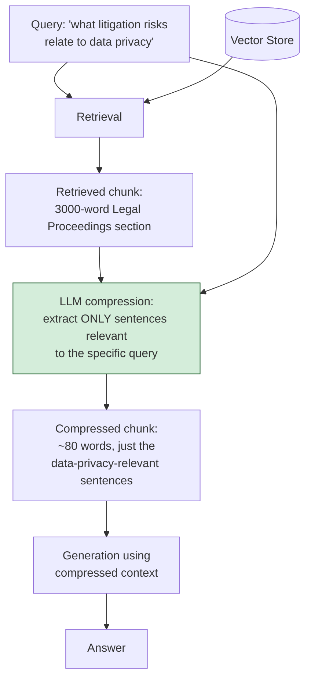

# Pattern 21: Context Compression

[← Back to index](README.md)

## 1. What is Context Compression?

Context Compression takes each retrieved chunk and **shrinks it down to only the
sentences or facts actually relevant to the query**, discarding the rest, before
handing it to the LLM for generation. It's the mirror image of Sentence Window
Retrieval (Pattern 13): where that pattern *expands* a precise match outward for
context, Context Compression *shrinks* a broad but noisy chunk down to its relevant
core.

This addresses a problem that shows up specifically with large, retrieved chunks: a
retrieved section might be genuinely the right one, but only a small fraction of its
text actually answers the question — the rest is boilerplate, unrelated details, or
tangential context that dilutes the LLM's attention and burns tokens for no benefit.

## 2. What problem does it solve?

Large chunks (whether from Parent-Child Retrieval's parent sections, or simply from
using a large `chunkSize`) solve the "missing context" problem but reintroduce a
different one: **signal dilution**. A 2,000-word retrieved section that contains one
critical sentence buried among nineteen unrelated ones:

- **Costs more tokens** for no benefit — every irrelevant sentence still costs money
  and context-window space at generation time.
- **Can genuinely hurt answer quality**, not just efficiency — LLMs are demonstrably
  more accurate when given focused, relevant context than when the right answer is
  buried in a much larger block of mostly-irrelevant text (a well-documented
  "needle in a haystack" effect that gets worse as irrelevant surrounding volume
  increases).
- **Makes multi-chunk contexts unwieldy** — when several chunks are retrieved together
  (as in nearly every pattern in this series), each carrying its own irrelevant
  padding, the combined context balloons even though the *actually relevant* content
  might be a few sentences total.

Context Compression fixes this directly: after retrieval decides *which* chunks are
relevant, compression decides *which parts of those chunks* are actually worth keeping.

## 3. Realistic production scenario

**Company:** a financial due-diligence tool that searches through long-form regulatory
filings (10-K annual reports) — documents that are hundreds of pages long, where any
single retrieved section (e.g. "Risk Factors" or "Legal Proceedings") is a lengthy,
formulaic block of largely-boilerplate legal language with a handful of
company-specific facts buried inside.

**Problem:** a query like *"what litigation risks does this company disclose related to
data privacy"* retrieves the correct "Legal Proceedings" section, but that section is
3,000 words covering a dozen unrelated lawsuits, contractual disputes, and standard
risk-disclosure boilerplate — only two or three sentences actually concern data
privacy litigation. Sending the whole section to the LLM wastes tokens and risks the
relevant sentences getting lost among unrelated ones.

**Goal:** after retrieval, compress each retrieved section down to only the sentences
relevant to the specific query, before generation — cutting token cost substantially
while improving answer focus.

## 4. Architecture / flow diagram



## 5. Request-to-response walkthrough

1. **User asks:** *"what litigation risks does this company disclose related to data
   privacy"*.
2. **Retrieval** finds the correct "Legal Proceedings" section — a large, mostly
   boilerplate block covering many unrelated matters.
3. **Compression call, per retrieved chunk:** the LLM is prompted with the query and
   the full chunk, and asked to extract *only* the sentences relevant to that specific
   query, verbatim — not to summarize or paraphrase, but to select and return the
   actually-relevant subset of the original text.
4. **Compressed chunk replaces the original** in the context — the 3,000-word section
   shrinks to the 2-3 sentences that actually discuss data privacy litigation.
5. **If a chunk compresses to nothing** (the LLM determines no part of it is actually
   relevant to this specific query, despite having been retrieved), it's dropped from
   the context entirely — this can happen when retrieval's similarity match was
   topically close but not actually on point.
6. **Generation** proceeds using the compressed, focused context — dramatically fewer
   tokens, and the relevant facts are no longer buried among irrelevant ones.
7. **Answer returned**, grounded specifically in the extracted, on-point sentences.

## 6. Why this pattern is appropriate here

- **Directly reduces token cost** in a domain (financial filings) where retrieved
  sections are routinely very large — compression can cut context size by an order of
  magnitude without losing any information relevant to the query.
- **Improves answer focus, not just cost** — removing irrelevant surrounding text
  measurably helps the LLM attend to what matters, independent of the cost savings.
- **"Extract, don't summarize" is a deliberate instruction**, not an implementation
  detail — extraction preserves the source text verbatim (important for a
  due-diligence tool where users may need to verify exact wording), whereas
  summarization would introduce paraphrase risk and potential subtle inaccuracies in a
  domain where exact wording can carry legal significance.
- **When this is *not* enough:** if the relevant information isn't phrased as
  standalone sentences but is only meaningful in combination with surrounding
  structure (a table, a numbered list with cross-references), aggressive compression
  can itself reintroduce Pattern 2's "chunking breaks context" problem — in that case,
  Parent-Child (Pattern 12) or Sentence Window (Pattern 13) retrieval is the safer
  choice, or compression should be applied more conservatively (keeping whole
  paragraphs rather than individual sentences).

## 7. Production-quality implementation (Java / Spring AI)

```java
package com.acme.rag.compression;

import org.springframework.ai.chat.client.ChatClient;
import org.springframework.ai.chat.prompt.PromptTemplate;
import org.springframework.ai.document.Document;
import org.springframework.ai.ollama.OllamaChatModel;
import org.springframework.ai.ollama.OllamaEmbeddingModel;
import org.springframework.ai.ollama.api.OllamaApi;
import org.springframework.ai.ollama.api.OllamaOptions;
import org.springframework.ai.vectorstore.SearchRequest;
import org.springframework.ai.vectorstore.SimpleVectorStore;

import java.io.IOException;
import java.io.UncheckedIOException;
import java.nio.file.Files;
import java.nio.file.Path;
import java.util.ArrayList;
import java.util.List;
import java.util.Map;
import java.util.stream.Collectors;

/**
 * Context Compression -- after retrieval, extract only the query-relevant
 * sentences from each retrieved chunk, discarding irrelevant surrounding
 * text, before generation.
 */
public final class ContextCompressionApp {

    record RagConfig(
            String embeddingModel, String llmModel, double llmTemperature,
            int topK, Path persistPath) {

        static RagConfig defaults() {
            return new RagConfig("nomic-embed-text", "llama3.1", 0.0, 3,
                    Path.of("./vectorstore_filings_compression.json"));
        }
    }

    /** Extracts only the query-relevant sentences from a retrieved chunk, verbatim. */
    static final class ContextCompressor {
        private static final String SYSTEM = """
                You will be given a search query and a passage. Extract and return ONLY
                the sentences from the passage that are directly relevant to answering
                the query, copied VERBATIM -- do not paraphrase or summarize. If NO part
                of the passage is relevant, respond with exactly: NOTHING_RELEVANT
                """;
        private final ChatClient chatClient;

        ContextCompressor(ChatClient chatClient) { this.chatClient = chatClient; }

        /** Returns the compressed text, or empty if nothing in the passage was relevant. */
        java.util.Optional<String> compress(String query, String passage) {
            try {
                String result = chatClient.prompt().system(SYSTEM)
                        .user("Query: " + query + "\n\nPassage:\n" + passage)
                        .call().content().trim();
                if (result.isEmpty() || result.equals("NOTHING_RELEVANT")) {
                    return java.util.Optional.empty();
                }
                return java.util.Optional.of(result);
            } catch (Exception ex) {
                System.err.println("Compression failed for a chunk, keeping it uncompressed: " + ex);
                return java.util.Optional.of(passage); // fail safe: keep original rather than drop it
            }
        }
    }

    static final class ContextCompressionFilingsBot {
        private static final String GEN_SYSTEM = """
                You are a financial due-diligence research assistant. Answer using ONLY
                the context below, which has already been filtered to the relevant
                excerpts from the source filing. If the context does not contain the
                answer, say so explicitly.

                Context:
                {context}
                """;

        private final RagConfig config;
        private final SimpleVectorStore vectorStore;
        private final ChatClient chatClient;
        private final ContextCompressor compressor;
        private final PromptTemplate genPromptTemplate = new PromptTemplate(GEN_SYSTEM);

        ContextCompressionFilingsBot(RagConfig config, OllamaEmbeddingModel embeddingModel,
                                      ChatClient chatClient, Path sourceDir) {
            this.config = config;
            this.chatClient = chatClient;
            this.compressor = new ContextCompressor(chatClient);
            this.vectorStore = buildOrLoad(embeddingModel, sourceDir);
        }

        private SimpleVectorStore buildOrLoad(OllamaEmbeddingModel embeddingModel, Path sourceDir) {
            SimpleVectorStore store = SimpleVectorStore.builder(embeddingModel).build();
            if (Files.exists(config.persistPath())) {
                store.load(config.persistPath().toFile());
                return store;
            }
            List<Document> docs;
            try (var files = Files.list(sourceDir)) {
                docs = files.filter(p -> p.toString().endsWith(".md")).sorted()
                        .map(p -> {
                            try {
                                return new Document(Files.readString(p),
                                        Map.of("source", p.getFileName().toString()));
                            } catch (IOException e) { throw new UncheckedIOException(e); }
                        }).collect(Collectors.toList());
            } catch (IOException e) { throw new UncheckedIOException(e); }
            store.add(docs); // whole (long) sections indexed as single chunks in this example
            store.save(config.persistPath().toFile());
            return store;
        }

        record AskResult(String answer, int originalCharCount, int compressedCharCount, List<String> sources) {}

        AskResult ask(String question) {
            if (question == null || question.isBlank()) {
                throw new IllegalArgumentException("Question must not be empty.");
            }

            List<Document> retrieved = vectorStore.similaritySearch(
                    SearchRequest.builder().query(question).topK(config.topK()).build());

            int originalChars = retrieved.stream().mapToInt(d -> d.getText().length()).sum();

            List<String> compressedTexts = new ArrayList<>();
            List<String> sourcesKept = new ArrayList<>();
            for (Document doc : retrieved) {
                var compressed = compressor.compress(question, doc.getText());
                compressed.ifPresent(text -> {
                    compressedTexts.add("[" + doc.getMetadata().getOrDefault("source", "unknown") + "]\n" + text);
                    sourcesKept.add(String.valueOf(doc.getMetadata().getOrDefault("source", "unknown")));
                });
            }

            String context = String.join("\n\n---\n\n", compressedTexts);
            int compressedChars = context.length();

            String answer;
            if (compressedTexts.isEmpty()) {
                answer = "I couldn't find relevant information to answer that question.";
            } else {
                try {
                    String systemMessage = genPromptTemplate.render(Map.of("context", context));
                    answer = chatClient.prompt().system(systemMessage).user(question).call().content();
                } catch (Exception ex) {
                    System.err.println("Generation failed: " + ex);
                    answer = "Sorry, something went wrong answering that question.";
                }
            }

            return new AskResult(answer, originalChars, compressedChars, sourcesKept);
        }
    }

    private static void writeSampleDocs(Path dir) throws IOException {
        Files.createDirectories(dir);
        Files.writeString(dir.resolve("legal_proceedings.md"), """
                ## Item 3. Legal Proceedings
                In the ordinary course of business, the Company is party to various
                claims, lawsuits, and legal proceedings. Management believes that the
                ultimate resolution of these matters will not have a material adverse
                effect on the Company's financial condition.

                In March 2024, a former supplier filed a breach of contract claim
                seeking damages of approximately $2.1 million related to a terminated
                purchase agreement; the Company disputes the claim and intends to defend
                vigorously.

                In August 2024, the Company received a putative class action complaint
                alleging violations of state data privacy laws in connection with the
                collection of customer browsing data without adequate disclosure. The
                Company has denied the allegations and is engaged in early-stage
                discovery; the ultimate outcome and any associated financial exposure
                cannot be reasonably estimated at this time.

                The Company is also involved in routine employment-related disputes and
                intellectual property matters, none of which are individually material.
                Additionally, in prior periods the Company settled two minor consumer
                protection matters for immaterial amounts, and management does not
                believe any currently pending matters, individually or in the aggregate,
                will materially affect the Company's results of operations.
                """);
    }

    public static void main(String[] args) throws IOException {
        RagConfig config = RagConfig.defaults();
        Path sampleDir = Path.of("./sample_filings_compression");
        writeSampleDocs(sampleDir);

        OllamaApi ollamaApi = OllamaApi.builder().baseUrl("http://localhost:11434").build();
        OllamaEmbeddingModel embeddingModel = OllamaEmbeddingModel.builder()
                .ollamaApi(ollamaApi)
                .defaultOptions(OllamaOptions.builder().model(config.embeddingModel()).build())
                .build();
        OllamaChatModel chatModel = OllamaChatModel.builder()
                .ollamaApi(ollamaApi)
                .defaultOptions(OllamaOptions.builder().model(config.llmModel())
                        .temperature(config.llmTemperature()).build())
                .build();
        ChatClient chatClient = ChatClient.create(chatModel);

        ContextCompressionFilingsBot bot =
                new ContextCompressionFilingsBot(config, embeddingModel, chatClient, sampleDir);

        ContextCompressionFilingsBot.AskResult result =
                bot.ask("what litigation risks does this company disclose related to data privacy");
        System.out.println("\nQ: what litigation risks does this company disclose related to data privacy");
        System.out.println("  original context: " + result.originalCharCount() + " chars");
        System.out.println("  compressed context: " + result.compressedCharCount() + " chars");
        System.out.println("  sources: " + result.sources());
        System.out.println("A: " + result.answer());
    }
}
```

### Key production details worth noting

- **"Extract verbatim, never paraphrase" is enforced by the prompt itself**, not just
  described in prose — this is the property that makes compressed output trustworthy
  for a due-diligence use case where exact wording matters; a summarizing compressor
  would risk subtly altering meaning in ways that matter legally/financially.
- **A chunk that compresses to nothing is dropped entirely**, not kept as an empty
  string — retrieval's similarity match can be topically close without being actually
  relevant to the specific query asked, and compression is what catches and discards
  that case before it wastes context-window space.
- **Fail-safe on compression errors: keep the original chunk uncompressed** rather than
  dropping it — a compression failure should degrade to "less efficient but still
  correct," never to "silently missing information."
- **`originalCharCount` / `compressedCharCount` are returned explicitly** so the token
  savings are directly measurable per query — in production this is exactly the metric
  you'd track to quantify compression's cost benefit over time.

---
[← Back to index](README.md)
