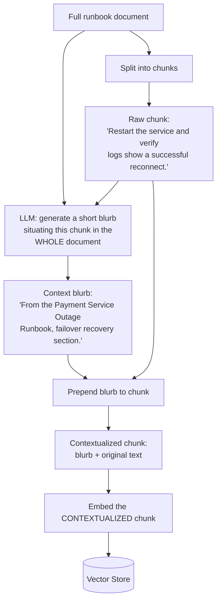
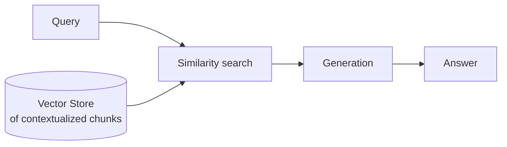

# Pattern 22: Contextual Retrieval

[← Back to index](README.md)

## 1. What is Contextual Retrieval?

Contextual Retrieval fixes chunk ambiguity **at indexing time**, before embedding ever
happens: for every chunk, an LLM generates a short (1-2 sentence) blurb explaining
*where this chunk sits within its source document and what it's about*, and that blurb
is **prepended to the chunk before it's embedded** (and before it's indexed for BM25,
if using Hybrid Search). The chunk that gets searched and matched is the
*contextualized* version, not the bare original text.

This is different in kind from every other pattern in this series that touches
chunking: Parent-Child (Pattern 12) and Sentence Window (Pattern 13) solve context loss
by changing *what's returned* after a match; Contextual Retrieval solves it by changing
*what's embedded and matched in the first place* — the ambiguity is fixed at the
source, once, at indexing time, rather than compensated for after the fact at query
time.

## 2. What problem does it solve?

A chunk pulled out of the middle of a long document is often **genuinely ambiguous on
its own**, independent of chunk size or boundary placement:

- *"Restart the service and verify the logs show a successful reconnect."* — restart
  *which* service? This sentence is perfectly clear within its source runbook (the
  surrounding sections make it obvious), but as an isolated embedded chunk, it could
  match almost any "restart and verify" troubleshooting query for any service.
- Two runbooks — one for the Payment Service, one for the Notification Service — might
  each contain a nearly identically-worded "restart and verify" step. Their embeddings,
  computed on the bare chunk text alone, could be nearly indistinguishable, even though
  a human reading either document in full would never confuse them.

This is a distinct failure mode from failure mode ② in Pattern 2 ("chunking breaks
context," where information needed to answer is missing entirely) — here, the chunk
*contains* the needed information, but its embedding doesn't reflect which broader
context it belongs to, so it's hard to reliably retrieve *for the right query* and easy
to confuse with a near-duplicate chunk from an unrelated document.

## 3. Realistic production scenario

**Company:** the internal engineering knowledge base, specifically its collection of
per-service incident runbooks — many of which share nearly identical generic
troubleshooting steps ("restart the service," "check the health endpoint," "verify
logs") that only make sense in combination with which specific service's runbook
they're from.

**Problem:** a query like *"how do I recover the payment service after a failover"*
sometimes retrieves the near-identical "restart and verify" step from the *notification*
service's runbook instead, because both chunks' bare-text embeddings are almost
indistinguishable — the word "payment" only appears many paragraphs earlier in the
source document, far outside the retrieved chunk's own boundaries.

**Goal:** at indexing time, generate a short contextual blurb for every chunk (using the
whole source document as context) situating it within its document, prepend that blurb
to the chunk before embedding, and re-index. Retrieval then naturally distinguishes
"restart step, from the Payment Service runbook" from "restart step, from the
Notification Service runbook," because that distinguishing information is now baked
into what gets embedded.

## 4. Architecture / flow diagram

**Indexing time (where this pattern actually lives):**



**Query time (identical to every earlier pattern — the fix already happened upstream):**



## 5. Request-to-response walkthrough

1. **Indexing:** each runbook is split into chunks as usual. For each chunk, the LLM is
   given *both the whole source document and that specific chunk*, and asked to write a
   short blurb (1-2 sentences) explaining what the chunk covers and where it sits in
   the document — e.g. *"This is from the Payment Service Outage Runbook, in the
   section on verifying recovery after a failover."*
2. **Contextualization:** this blurb is prepended to the chunk's original text, and
   *this combined text* — not the bare chunk — is what gets embedded and stored.
3. **User asks:** *"how do I recover the payment service after a failover"*.
4. **Retrieval:** because the Payment Service chunk's embedding now reflects both its
   own content *and* its document-level context, it's reliably distinguishable from
   the near-identical Notification Service chunk, whose embedding instead reflects
   *its* document's context — the query matches the correct one with far more
   confidence than bare-chunk embeddings would have provided.
5. **Generation** proceeds using the correctly-matched, contextualized chunk (the
   context blurb is typically kept in the text sent to the LLM too — it helps the
   generation step understand the source just as much as it helped retrieval).
6. **Answer returned**, correctly scoped to the payment service, not confused with a
   superficially similar step from an unrelated runbook.

## 6. Why this pattern is appropriate here

- **Fixes ambiguity at its actual source** — the embedding itself — rather than
  compensating for it after retrieval (as Parent-Child and Sentence Window do). This is
  a strictly earlier, and often more effective, intervention point for this specific
  failure mode.
- **Particularly valuable for corpora with many structurally similar documents**
  (per-service runbooks, per-region policy documents, per-version release notes) —
  exactly the shape of corpus where bare-chunk embeddings are most likely to collide
  across documents that share generic phrasing.
- **Composes directly with Hybrid Search (Pattern 15)**: the same contextualized chunk
  text can be indexed into both the dense vector store *and* the BM25 sparse index, so
  keyword matching also benefits from the added distinguishing context (e.g. "Payment
  Service" now appears as a literal token in the indexed text of every chunk from that
  runbook, not just once at the top of the document).
- **The cost is paid once, at indexing time, not per query** — contextualization
  requires one LLM call per chunk during ingestion, which is a one-time cost
  independent of query volume, unlike query-time patterns (rewriting, HyDE, re-ranking)
  whose LLM-call cost scales with traffic.
- **When this is *not* enough:** if two chunks are ambiguous *within the same document*
  (not across documents), document-level context alone won't disambiguate them —
  that's better addressed by Sentence Window Retrieval's local context (Pattern 13) or
  by generating more granular, section-level context blurbs rather than one per
  document.

## 7. Production-quality implementation (Java / Spring AI)

```java
package com.acme.rag.contextual;

import org.springframework.ai.chat.client.ChatClient;
import org.springframework.ai.chat.prompt.PromptTemplate;
import org.springframework.ai.document.Document;
import org.springframework.ai.ollama.OllamaChatModel;
import org.springframework.ai.ollama.OllamaEmbeddingModel;
import org.springframework.ai.ollama.api.OllamaApi;
import org.springframework.ai.ollama.api.OllamaOptions;
import org.springframework.ai.transformer.splitter.TokenTextSplitter;
import org.springframework.ai.vectorstore.SearchRequest;
import org.springframework.ai.vectorstore.SimpleVectorStore;

import java.io.IOException;
import java.io.UncheckedIOException;
import java.nio.file.Files;
import java.nio.file.Path;
import java.util.List;
import java.util.Map;
import java.util.stream.Collectors;

/**
 * Contextual Retrieval -- at INDEXING time, generate a short blurb situating
 * each chunk within its source document, prepend it to the chunk, and embed
 * the contextualized version. Retrieval and generation are otherwise
 * unchanged from earlier patterns; the fix lives entirely upstream.
 */
public final class ContextualRetrievalApp {

    record RagConfig(
            String embeddingModel, String llmModel, double llmTemperature,
            int chunkSize, int chunkOverlap, int topK, Path persistPath) {

        static RagConfig defaults() {
            return new RagConfig("nomic-embed-text", "llama3.1", 0.0, 400, 50, 3,
                    Path.of("./vectorstore_runbooks_contextual.json"));
        }
    }

    /** Generates a short blurb situating a chunk within its whole source document. */
    static final class ChunkContextualizer {
        private static final String SYSTEM = """
                You will be given a whole document and one chunk extracted from it.
                Write a short (1 sentence) blurb identifying which document this chunk
                is from and what section/topic it covers, so the chunk can be understood
                and correctly matched even without the rest of the document present.
                Respond with ONLY the blurb.
                """;
        private final ChatClient chatClient;

        ChunkContextualizer(ChatClient chatClient) { this.chatClient = chatClient; }

        String contextualize(String wholeDocument, String chunkText, String documentName) {
            try {
                // Truncate the whole-document context for the prompt to keep this
                // fast; a production system might summarize very long documents
                // once and reuse that summary as the "whole document" context for
                // every chunk within it, rather than re-sending full text per chunk.
                String docExcerpt = wholeDocument.length() > 2500
                        ? wholeDocument.substring(0, 2500) : wholeDocument;
                String blurb = chatClient.prompt().system(SYSTEM)
                        .user("Document:\n" + docExcerpt + "\n\nChunk:\n" + chunkText)
                        .call().content().trim();
                return blurb.isEmpty() ? documentName : blurb;
            } catch (Exception ex) {
                System.err.println("Contextualization failed, falling back to filename: " + ex);
                return documentName; // a minimal but non-empty fallback context
            }
        }
    }

    static final class ContextualRetrievalIndex {
        private final RagConfig config;
        private final SimpleVectorStore vectorStore;

        ContextualRetrievalIndex(RagConfig config, OllamaEmbeddingModel embeddingModel,
                                  ChunkContextualizer contextualizer, Path sourceDir) {
            this.config = config;
            this.vectorStore = SimpleVectorStore.builder(embeddingModel).build();

            if (Files.exists(config.persistPath())) {
                vectorStore.load(config.persistPath().toFile());
                return;
            }
            buildFromScratch(contextualizer, sourceDir);
        }

        private void buildFromScratch(ChunkContextualizer contextualizer, Path sourceDir) {
            TokenTextSplitter splitter = new TokenTextSplitter(
                    config.chunkSize(), config.chunkOverlap(), 5, 10000, true);

            List<Path> files;
            try (var stream = Files.list(sourceDir)) {
                files = stream.filter(p -> p.toString().endsWith(".md")).sorted().collect(Collectors.toList());
            } catch (IOException e) { throw new UncheckedIOException(e); }

            for (Path file : files) {
                String documentName = file.getFileName().toString();
                String fullText;
                try {
                    fullText = Files.readString(file);
                } catch (IOException e) { throw new UncheckedIOException(e); }

                Document wholeDoc = new Document(fullText, Map.of());
                List<Document> rawChunks = splitter.apply(List.of(wholeDoc));

                for (Document chunk : rawChunks) {
                    String blurb = contextualizer.contextualize(fullText, chunk.getText(), documentName);
                    // The contextualized text -- blurb prepended to the original chunk
                    // -- is what gets embedded AND what gets returned for generation.
                    String contextualizedText = blurb + "\n\n" + chunk.getText();

                    vectorStore.add(List.of(new Document(contextualizedText,
                            Map.of("source", documentName, "contextBlurb", blurb))));
                }
            }

            vectorStore.save(config.persistPath().toFile());
        }

        List<Document> retrieve(String query) {
            return vectorStore.similaritySearch(
                    SearchRequest.builder().query(query).topK(config.topK()).build());
        }
    }

    static final class ContextualRetrievalRunbookBot {
        private static final String GEN_SYSTEM = """
                You are an internal engineering runbook assistant. Answer using ONLY the
                context below, which includes a short identifying blurb before each
                excerpt. If the context does not contain the answer, say so explicitly.

                Context:
                {context}
                """;

        private final ContextualRetrievalIndex index;
        private final ChatClient chatClient;
        private final PromptTemplate genPromptTemplate = new PromptTemplate(GEN_SYSTEM);

        ContextualRetrievalRunbookBot(ContextualRetrievalIndex index, ChatClient chatClient) {
            this.index = index;
            this.chatClient = chatClient;
        }

        record AskResult(String answer, List<String> sources) {}

        AskResult ask(String question) {
            if (question == null || question.isBlank()) {
                throw new IllegalArgumentException("Question must not be empty.");
            }

            List<Document> retrieved = index.retrieve(question);
            String context = retrieved.stream()
                    .map(Document::getText)
                    .collect(Collectors.joining("\n\n---\n\n"));

            String answer;
            try {
                String systemMessage = genPromptTemplate.render(Map.of("context", context));
                answer = chatClient.prompt().system(systemMessage).user(question).call().content();
            } catch (Exception ex) {
                System.err.println("Generation failed: " + ex);
                answer = "Sorry, something went wrong answering that question.";
            }

            List<String> sources = retrieved.stream()
                    .map(d -> String.valueOf(d.getMetadata().getOrDefault("source", "unknown")))
                    .collect(Collectors.toList());

            return new AskResult(answer, sources);
        }
    }

    private static void writeSampleDocs(Path dir) throws IOException {
        Files.createDirectories(dir);
        Files.writeString(dir.resolve("payment_service_outage_runbook.md"), """
                # Payment Service Outage Runbook
                This runbook covers recovery steps for the Payment Service after an
                outage or failover event.

                ## Failover Recovery
                After a failover completes, restart the service and verify logs show a
                successful reconnect to the primary database before resuming traffic.

                ## Post-Recovery Validation
                Confirm the payment queue depth returns to baseline within 10 minutes.
                """);
        Files.writeString(dir.resolve("notification_service_outage_runbook.md"), """
                # Notification Service Outage Runbook
                This runbook covers recovery steps for the Notification Service after
                an outage or failover event.

                ## Failover Recovery
                After a failover completes, restart the service and verify logs show a
                successful reconnect to the message broker before resuming traffic.

                ## Post-Recovery Validation
                Confirm the notification delivery lag returns to baseline within 5
                minutes.
                """);
    }

    public static void main(String[] args) throws IOException {
        RagConfig config = RagConfig.defaults();
        Path sampleDir = Path.of("./sample_runbooks_contextual");
        writeSampleDocs(sampleDir);

        OllamaApi ollamaApi = OllamaApi.builder().baseUrl("http://localhost:11434").build();
        OllamaEmbeddingModel embeddingModel = OllamaEmbeddingModel.builder()
                .ollamaApi(ollamaApi)
                .defaultOptions(OllamaOptions.builder().model(config.embeddingModel()).build())
                .build();
        OllamaChatModel chatModel = OllamaChatModel.builder()
                .ollamaApi(ollamaApi)
                .defaultOptions(OllamaOptions.builder().model(config.llmModel())
                        .temperature(config.llmTemperature()).build())
                .build();
        ChatClient chatClient = ChatClient.create(chatModel);

        ContextualRetrievalIndex index = new ContextualRetrievalIndex(
                config, embeddingModel, new ChunkContextualizer(chatClient), sampleDir);
        ContextualRetrievalRunbookBot bot = new ContextualRetrievalRunbookBot(index, chatClient);

        ContextualRetrievalRunbookBot.AskResult result =
                bot.ask("how do I recover the payment service after a failover");
        System.out.println("\nQ: how do I recover the payment service after a failover");
        System.out.println("  sources: " + result.sources());
        System.out.println("A: " + result.answer());
    }
}
```

### Key production details worth noting

- **Contextualization happens once, at indexing time** — the per-chunk LLM call cost is
  paid during ingestion, entirely independent of query volume, unlike every query-time
  pattern in this series (rewriting, HyDE, re-ranking) whose LLM cost scales with
  traffic.
- **The contextualized text — blurb + original — is what's embedded AND what's
  returned for generation**, not just used transiently for embedding — the blurb helps
  the LLM understand the source at generation time too, not only helping retrieval find
  it.
- **Truncating the whole-document context sent to the contextualizer prompt** (to 2500
  characters here) is a pragmatic latency/cost trade-off for very long source
  documents; a production system indexing many chunks from the same long document
  could instead generate one document-level summary once and reuse it as context for
  every chunk within that document, rather than re-sending the full document text per
  chunk.
- **This pattern composes directly with Hybrid Search (Pattern 15) and Re-Ranking
  (Pattern 20)** — nothing about contextualized chunks changes how BM25 indexing or
  cross-encoder re-ranking work; they simply operate on richer, less ambiguous input
  text, which is exactly the combination Anthropic's original published Contextual
  Retrieval technique recommends for maximum retrieval accuracy.

---
[← Back to index](README.md)
