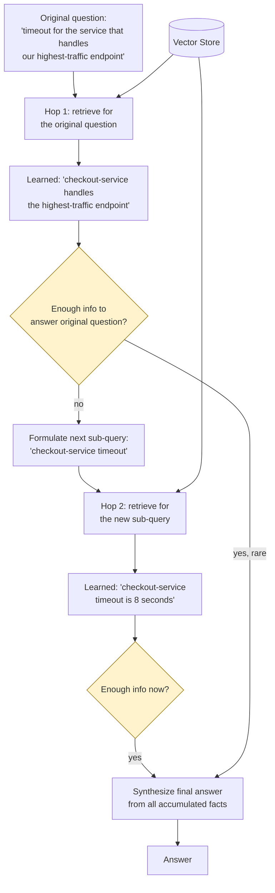

# Pattern 23: Multi-Hop RAG

[← Back to index](README.md)

## 1. What is Multi-Hop RAG?

Multi-Hop RAG answers a question by **retrieving sequentially, in a chain**, where
each retrieval step's result determines *what to search for next* — as opposed to
Multi-Query RAG (Pattern 8, several angles fired in parallel and merged) or Query
Decomposition (Pattern 10, independent sub-questions retrieved in parallel and merged).
The defining property is **sequential dependency**: the second search query cannot be
known in advance, because it depends on a fact discovered by the *first* search.

This is exactly the gap flagged as unaddressed at the end of Patterns 8, 10, and 11:
each of those patterns explicitly called out that they only work when sub-queries are
*independent* of each other. Multi-Hop RAG is the pattern for when they're not.

## 2. What problem does it solve?

Some questions require **connecting two facts that live in different places**, where
finding the second fact requires first knowing what the first fact was:

- *"What's the timeout for the service that handles our highest-traffic endpoint?"* —
  you cannot search for "the timeout of [service]" until you first know *which*
  service handles the highest-traffic endpoint. That's a genuinely two-step lookup,
  not a single query nor a set of independent parallel ones.
- *"Who is the on-call engineer for the team that owns the service with the most
  recent incident?"* — three chained facts: most recent incident → which service →
  which team → who's on-call for that team.

Multi-Query RAG and Decomposition both assume all needed sub-queries can be identified
*up front*, from the original question alone. Multi-Hop RAG handles the case where a
later query can only be formed *after* seeing an earlier retrieval's result — the
chain has to be walked one link at a time.

## 3. Realistic production scenario

**Company:** the internal engineering knowledge base, revisiting the exact example
first raised (and deferred) all the way back in Pattern 8's Multi-Query discussion:
*"what's the timeout for the service that handles our highest-traffic endpoint"*.

**Problem:** the answer requires two facts from two different documents: a
traffic-overview doc names which service owns the highest-traffic endpoint; a
per-service config doc states that specific service's timeout setting. Neither
Multi-Query nor Decomposition can pre-generate the second sub-query ("what's
checkout-service's timeout") without already knowing the answer to the first
("checkout-service handles the highest-traffic endpoint").

**Goal:** build a loop that retrieves for the current sub-question, checks whether
enough information has been gathered to answer the *original* question, and if not,
formulates the next sub-question based on what was just learned — repeating until
either the question can be answered or a hop limit is reached (a safety bound against
infinite loops).

## 4. Architecture / flow diagram



## 5. Request-to-response walkthrough

1. **Hop 1:** the original question is used directly as the first retrieval query.
   Retrieval finds the traffic-overview document, which states that
   `checkout-service` handles the highest-traffic endpoint.
2. **Reflection after hop 1:** an LLM call reviews the original question plus everything
   retrieved so far, and asks itself: "do I now have enough information to fully answer
   the original question?" Here: no — the traffic-overview document says *which*
   service, but not its timeout.
3. **Next query formulated:** based on what was just learned (`checkout-service`), the
   LLM formulates the next sub-query: *"checkout-service timeout configuration"*.
4. **Hop 2:** this new, specific query retrieves the per-service config document,
   which states `checkout-service`'s timeout is 8 seconds.
5. **Reflection after hop 2:** the LLM reviews the original question plus *all*
   accumulated facts from both hops, and determines: yes, this is now sufficient to
   answer the original question fully.
6. **Final synthesis:** the LLM composes one answer using facts from *both* hops
   together — "checkout-service handles the highest-traffic endpoint, and its timeout
   is 8 seconds" — something neither single retrieval alone could have produced.
7. **Hop limit as a safety net:** if the loop reaches a configured maximum (e.g. 3
   hops) without the LLM ever confirming sufficiency, the pipeline stops and answers
   with whatever was accumulated, rather than looping indefinitely — a partial,
   honestly-caveated answer beats an infinite loop or a crash.

## 6. Why this pattern is appropriate here

- **This is the only pattern in the series that can actually answer chained, dependent
  questions** — every parallel-fan-out pattern (Multi-Query, Decomposition) structurally
  cannot, because they require all sub-queries to be knowable from the original
  question alone.
- **The reflection step (checking sufficiency before continuing) is what prevents
  wasted hops** — a question answerable in one hop stops after one hop; the loop only
  continues as many times as the question actually requires.
- **A hard hop limit is a necessary safety bound**, not an implementation detail — an
  LLM's judgment about "is this enough information" can be wrong or indecisive, and an
  unbounded loop is a real production risk (runaway latency and cost) that this pattern
  must guard against explicitly.
- **When this is *not* enough:** if the number and shape of hops needed varies wildly
  by question type, and the system also needs to decide *which tool or retriever* to
  use at each hop (not just what to search for), you're looking at Agentic RAG
  (Pattern 25) — Multi-Hop RAG is a constrained, retrieval-only special case of the
  more general agentic loop.

## 7. Production-quality implementation (Java / Spring AI)

```java
package com.acme.rag.multihop;

import org.springframework.ai.chat.client.ChatClient;
import org.springframework.ai.chat.prompt.PromptTemplate;
import org.springframework.ai.document.Document;
import org.springframework.ai.ollama.OllamaChatModel;
import org.springframework.ai.ollama.OllamaEmbeddingModel;
import org.springframework.ai.ollama.api.OllamaApi;
import org.springframework.ai.ollama.api.OllamaOptions;
import org.springframework.ai.vectorstore.SearchRequest;
import org.springframework.ai.vectorstore.SimpleVectorStore;

import java.io.IOException;
import java.io.UncheckedIOException;
import java.nio.file.Files;
import java.nio.file.Path;
import java.util.ArrayList;
import java.util.List;
import java.util.Map;
import java.util.stream.Collectors;

/**
 * Multi-Hop RAG -- sequentially chained retrieval, where each hop's result
 * determines the next hop's query, until an LLM reflection step confirms
 * enough has been gathered to answer the original question (or a hop limit
 * is reached as a safety bound).
 */
public final class MultiHopRagApp {

    record RagConfig(
            String embeddingModel, String llmModel, double llmTemperature,
            int topKPerHop, int maxHops, Path persistPath) {

        static RagConfig defaults() {
            return new RagConfig("nomic-embed-text", "llama3.1", 0.0, 3, 3,
                    Path.of("./vectorstore_eng_kb_multihop.json"));
        }
    }

    /** One hop's outcome: what was searched, and what was retrieved. */
    record Hop(String query, List<Document> retrieved) {}

    /**
     * Decides, after each hop, whether enough has been gathered to answer the
     * original question, and if not, what the next sub-query should be.
     */
    static final class HopReflector {
        private static final String SYSTEM = """
                You are answering a question by gathering facts one step at a time.
                Given the ORIGINAL question and everything learned SO FAR, decide:
                - If you now have enough information to fully answer the original
                  question, respond with exactly: SUFFICIENT
                - Otherwise, respond with the single next search query needed to find
                  the missing piece of information, based specifically on what you've
                  learned so far. Respond with ONLY that query, nothing else.
                """;
        private final ChatClient chatClient;

        HopReflector(ChatClient chatClient) { this.chatClient = chatClient; }

        /** Returns empty if sufficient; otherwise returns the next query to search for. */
        java.util.Optional<String> nextQueryOrSufficient(String originalQuestion, List<Hop> hopsSoFar) {
            String accumulatedFacts = hopsSoFar.stream()
                    .map(h -> "Searched: " + h.query() + "\nFound:\n" + h.retrieved().stream()
                            .map(Document::getText).collect(Collectors.joining("\n")))
                    .collect(Collectors.joining("\n\n"));

            try {
                String response = chatClient.prompt().system(SYSTEM)
                        .user("Original question: " + originalQuestion
                                + "\n\nLearned so far:\n" + accumulatedFacts)
                        .call().content().trim();

                if (response.equalsIgnoreCase("SUFFICIENT")) {
                    return java.util.Optional.empty();
                }
                return java.util.Optional.of(response);
            } catch (Exception ex) {
                System.err.println("Reflection failed, treating as sufficient to stop the loop: " + ex);
                return java.util.Optional.empty();
            }
        }
    }

    static final class MultiHopEngKb {
        private static final String FINAL_SYSTEM = """
                You are an internal engineering search assistant. You gathered the
                following facts across multiple search steps to answer the user's
                question. Synthesize ONE coherent answer using ONLY these facts. If
                the facts are still insufficient, say so explicitly.

                Facts gathered:
                {context}
                """;

        private final RagConfig config;
        private final SimpleVectorStore vectorStore;
        private final ChatClient chatClient;
        private final HopReflector reflector;
        private final PromptTemplate finalPromptTemplate = new PromptTemplate(FINAL_SYSTEM);

        MultiHopEngKb(RagConfig config, OllamaEmbeddingModel embeddingModel,
                      ChatClient chatClient, Path sourceDir) {
            this.config = config;
            this.chatClient = chatClient;
            this.reflector = new HopReflector(chatClient);
            this.vectorStore = buildOrLoad(embeddingModel, sourceDir);
        }

        private SimpleVectorStore buildOrLoad(OllamaEmbeddingModel embeddingModel, Path sourceDir) {
            SimpleVectorStore store = SimpleVectorStore.builder(embeddingModel).build();
            if (Files.exists(config.persistPath())) {
                store.load(config.persistPath().toFile());
                return store;
            }
            List<Document> docs;
            try (var files = Files.list(sourceDir)) {
                docs = files.filter(p -> p.toString().endsWith(".md")).sorted()
                        .map(p -> {
                            try {
                                return new Document(Files.readString(p),
                                        Map.of("source", p.getFileName().toString()));
                            } catch (IOException e) { throw new UncheckedIOException(e); }
                        }).collect(Collectors.toList());
            } catch (IOException e) { throw new UncheckedIOException(e); }
            store.add(docs);
            store.save(config.persistPath().toFile());
            return store;
        }

        record AskResult(String answer, List<String> hopQueries, List<String> sources) {}

        AskResult ask(String question) {
            if (question == null || question.isBlank()) {
                throw new IllegalArgumentException("Question must not be empty.");
            }

            List<Hop> hops = new ArrayList<>();
            String currentQuery = question;

            for (int hopNumber = 1; hopNumber <= config.maxHops(); hopNumber++) {
                List<Document> retrieved = vectorStore.similaritySearch(
                        SearchRequest.builder().query(currentQuery).topK(config.topKPerHop()).build());
                hops.add(new Hop(currentQuery, retrieved));
                System.out.println("Hop " + hopNumber + " query: " + currentQuery
                        + " -> " + retrieved.size() + " chunk(s) retrieved");

                var next = reflector.nextQueryOrSufficient(question, hops);
                if (next.isEmpty()) {
                    System.out.println("Reflection: sufficient after " + hopNumber + " hop(s).");
                    break;
                }
                currentQuery = next.get();

                if (hopNumber == config.maxHops()) {
                    System.out.println("Hop limit (" + config.maxHops() + ") reached; "
                            + "answering with whatever was gathered so far.");
                }
            }

            String context = hops.stream()
                    .map(h -> "[searched: " + h.query() + "]\n" + h.retrieved().stream()
                            .map(d -> "[" + d.getMetadata().getOrDefault("source", "unknown") + "] " + d.getText())
                            .collect(Collectors.joining("\n")))
                    .collect(Collectors.joining("\n\n---\n\n"));

            String answer;
            try {
                String systemMessage = finalPromptTemplate.render(Map.of("context", context));
                answer = chatClient.prompt().system(systemMessage).user(question).call().content();
            } catch (Exception ex) {
                System.err.println("Final synthesis failed: " + ex);
                answer = "Sorry, something went wrong answering that question.";
            }

            List<String> hopQueries = hops.stream().map(Hop::query).collect(Collectors.toList());
            List<String> sources = hops.stream()
                    .flatMap(h -> h.retrieved().stream())
                    .map(d -> String.valueOf(d.getMetadata().getOrDefault("source", "unknown")))
                    .distinct()
                    .collect(Collectors.toList());

            return new AskResult(answer, hopQueries, sources);
        }
    }

    private static void writeSampleDocs(Path dir) throws IOException {
        Files.createDirectories(dir);
        Files.writeString(dir.resolve("traffic_overview.md"), """
                ## Endpoint Traffic Overview
                Among all public API endpoints, /api/checkout receives the highest
                traffic volume, roughly 3x the next-busiest endpoint. This endpoint is
                handled by checkout-service.
                """);
        Files.writeString(dir.resolve("checkout_service_config.md"), """
                ## checkout-service Configuration Reference
                checkout-service is configured with a request timeout of 8 seconds and
                a maximum of 3 automatic retries on upstream 5xx responses.
                """);
        Files.writeString(dir.resolve("notification_service_config.md"), """
                ## notification-service Configuration Reference
                notification-service is configured with a request timeout of 4 seconds
                and does not automatically retry on failure.
                """);
    }

    public static void main(String[] args) throws IOException {
        RagConfig config = RagConfig.defaults();
        Path sampleDir = Path.of("./sample_eng_kb_multihop");
        writeSampleDocs(sampleDir);

        OllamaApi ollamaApi = OllamaApi.builder().baseUrl("http://localhost:11434").build();
        OllamaEmbeddingModel embeddingModel = OllamaEmbeddingModel.builder()
                .ollamaApi(ollamaApi)
                .defaultOptions(OllamaOptions.builder().model(config.embeddingModel()).build())
                .build();
        OllamaChatModel chatModel = OllamaChatModel.builder()
                .ollamaApi(ollamaApi)
                .defaultOptions(OllamaOptions.builder().model(config.llmModel())
                        .temperature(config.llmTemperature()).build())
                .build();
        ChatClient chatClient = ChatClient.create(chatModel);

        MultiHopEngKb bot = new MultiHopEngKb(config, embeddingModel, chatClient, sampleDir);

        MultiHopEngKb.AskResult result =
                bot.ask("what's the timeout for the service that handles our highest-traffic endpoint");
        System.out.println("\nQ: what's the timeout for the service that handles our highest-traffic endpoint");
        System.out.println("  hop queries: " + result.hopQueries());
        System.out.println("  sources: " + result.sources());
        System.out.println("A: " + result.answer());
    }
}
```

### Key production details worth noting

- **`maxHops` is a hard, non-negotiable safety bound**, checked in the loop's `for`
  condition itself, not just as a soft guideline — an LLM reflection step misjudging
  "sufficient" is a real, expected failure mode that this bound must contain
  unconditionally, since an ungrounded loop is a production incident (runaway latency
  and cost), not just a minor inefficiency.
- **The reflection prompt sees the *original* question at every hop**, not just the
  most recent sub-query — this is what allows it to correctly judge overall
  sufficiency rather than getting lost chasing tangential facts hop after hop.
- **All hops' retrieved context is carried into the final synthesis call**, not just
  the last hop's — the final answer needs facts from *every* hop combined
  (checkout-service's identity from hop 1, its timeout from hop 2), which is the entire
  point of this pattern over a single-shot retrieval.
- **Graceful reflection failure defaults to stopping the loop** (`java.util.Optional
  .empty()`), not continuing indefinitely — if the reflection LLM call itself errors
  out, the safest behavior is to answer with whatever's been gathered so far, not to
  either crash or loop unboundedly.

---
[← Back to index](README.md)
