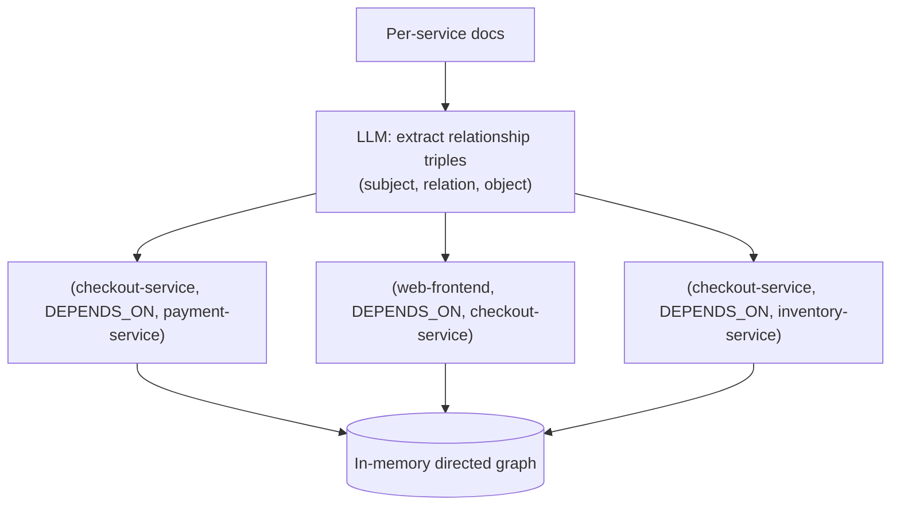
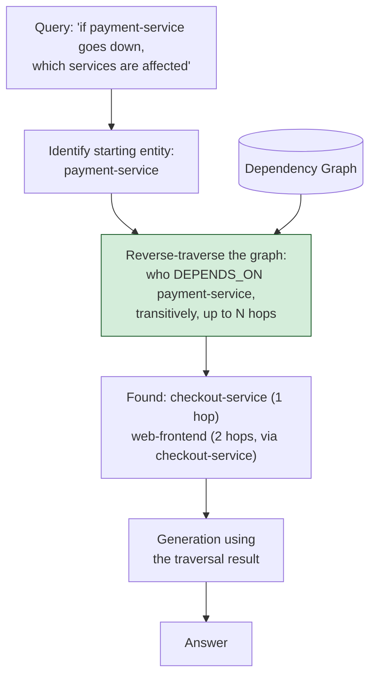

# Pattern 24: Graph RAG

[← Back to index](README.md)

## 1. What is Graph RAG?

Graph RAG replaces (or augments) vector similarity search with **traversal of an
explicit knowledge graph** — entities as nodes, relationships as labeled edges — built
from the corpus ahead of time. Instead of asking "which chunks are semantically similar
to this query," Graph RAG asks "starting from the entity this query is about, which
other entities are *connected* to it, and how, within N hops?"

This is a fundamentally different retrieval mechanism from every other pattern in this
series: dense/sparse/hybrid retrieval (Patterns 15-19) all reason about *textual
similarity*; Multi-Hop RAG (Pattern 23) chains *vector searches* sequentially using LLM
reflection. Graph RAG instead reasons about **explicit structural relationships**
between named entities — which is a different, often more reliable mechanism
specifically for questions that are fundamentally about *how things connect*.

## 2. What problem does it solve?

Some questions are not really about finding a fact stated somewhere in a document —
they're about **traversing a relationship structure** that may never be written down
as a single connected passage anywhere in the corpus:

- *"If payment-service goes down, which other services are affected?"* — the answer
  requires knowing the full dependency chain (payment-service → checkout-service →
  web-frontend), which might be documented as three separate, disconnected facts
  scattered across three different service-config documents, never stated together as
  one passage a vector search could retrieve in one shot.
- *"Who is on the team that owns the service most recently involved in an incident?"* —
  a chain of relationships (incident → service → owning team → team members) that
  exists structurally across the org, but isn't prose anywhere.

Even Multi-Hop RAG (Pattern 23) can eventually answer some of these by chaining vector
searches, but it does so by re-deriving the relationship structure fresh, via LLM
reflection, on every single query — expensive and not guaranteed to find every
relevant hop. Graph RAG instead **builds the relationship structure once, explicitly**,
and traversal becomes a fast, complete, deterministic graph operation rather than a
per-query LLM-guided search.

## 3. Realistic production scenario

**Company:** the internal engineering knowledge base, now tackling **service
dependency questions** — "what breaks if X goes down," "what depends on Y" — where the
underlying relationships (service A calls service B) are stated individually across
many separate per-service documentation pages, never as one connected passage.

**Problem:** a question like *"if payment-service goes down, which other services are
affected"* requires knowing not just payment-service's direct callers, but *their*
callers too (a multi-level dependency chain) — information genuinely spread across
several documents with no single passage stating the full chain.

**Goal:** extract explicit `(service) -[DEPENDS_ON]-> (service)` relationship triples
from the documentation corpus (via one-time LLM extraction at indexing time, similar in
spirit to Pattern 22's indexing-time processing), build an in-memory directed graph
from those triples, and answer dependency questions by **traversing the graph** — not
by vector-searching for a passage that states the full chain, because no such passage
exists.

## 4. Architecture / flow diagram

**Indexing time — building the graph:**



**Query time — traversal, not similarity search:**



## 5. Request-to-response walkthrough

1. **Indexing (one-time graph construction):** every service's documentation page is
   passed to an LLM prompted to extract explicit dependency relationships as
   `(subject, relation, object)` triples — e.g. `(checkout-service, DEPENDS_ON,
   payment-service)`. These triples are added as directed edges to an in-memory graph.
2. **User asks:** *"if payment-service goes down, which other services are affected"*.
3. **Entity identification:** the query names `payment-service` directly as the
   starting node (in a more general system, this step might itself use an LLM or
   named-entity recognition to identify the entity if it isn't stated verbatim).
4. **Reverse traversal:** because the question asks about *impact*, the graph is
   traversed in reverse — finding every node that has a `DEPENDS_ON` edge pointing
   (directly or transitively) *at* `payment-service`, up to a configured hop limit (a
   safety bound, same principle as Multi-Hop RAG's `maxHops`).
5. **Traversal finds:** `checkout-service` (1 hop, direct dependency) and
   `web-frontend` (2 hops, depends on checkout-service, which depends on
   payment-service) — a complete answer derived from structural traversal, not from any
   single passage that happened to state this whole chain.
6. **Generation:** the LLM is given the traversal result (the specific path found) and
   asked to phrase it as a natural answer, e.g. *"checkout-service depends on
   payment-service directly, and web-frontend depends on checkout-service, so both
   would be affected."*
7. **Answer returned**, grounded in a complete, explicitly-traced relationship chain.

## 6. Why this pattern is appropriate here

- **This is the only pattern in the series that can reliably answer multi-hop
  relationship questions when no single passage states the full chain** — vector
  similarity (even with Multi-Hop's LLM-guided chaining) is fundamentally searching for
  *text*, while graph traversal is searching a *structure* built explicitly for this
  purpose.
- **Traversal is deterministic and complete** within its hop limit, unlike Multi-Hop
  RAG's LLM-guided search, which can miss a hop if the reflection step misjudges
  sufficiency — once the graph is built correctly, "who depends on X" is a graph
  algorithm with a guaranteed-correct answer (within the graph's own hop limit), not a
  probabilistic search.
- **The extraction cost is paid once, at indexing time** (same principle as Contextual
  Retrieval, Pattern 22) — building the graph is a one-time LLM-extraction cost per
  document, independent of how many dependency questions get asked afterward.
- **When this is *not* enough:** if the corpus's relationships are too varied,
  ambiguous, or numerous to extract reliably into clean triples (unstructured prose
  where relationships are implied rather than stated), graph extraction quality
  degrades and vector-based retrieval becomes more robust — Graph RAG earns its
  complexity specifically for corpora with clear, extractable, relationship-heavy
  structure (org charts, dependency graphs, citation networks), not general prose.

## 7. Production-quality implementation (Java / Spring AI)

```java
package com.acme.rag.graphrag;

import org.springframework.ai.chat.client.ChatClient;
import org.springframework.ai.document.Document;
import org.springframework.ai.ollama.OllamaChatModel;
import org.springframework.ai.ollama.api.OllamaApi;
import org.springframework.ai.ollama.api.OllamaOptions;

import java.io.IOException;
import java.io.UncheckedIOException;
import java.nio.file.Files;
import java.nio.file.Path;
import java.util.*;
import java.util.stream.Collectors;

/**
 * Graph RAG -- extract (subject, relation, object) triples from documents at
 * indexing time, build an in-memory directed graph, and answer relationship
 * questions via graph traversal rather than vector similarity search.
 */
public final class GraphRagApp {

    record RagConfig(String llmModel, double llmTemperature, int maxTraversalHops) {
        static RagConfig defaults() { return new RagConfig("llama3.1", 0.0, 4); }
    }

    record Triple(String subject, String relation, String object) {}

    /** Extracts relationship triples from a document via LLM prompting. */
    static final class TripleExtractor {
        private static final String SYSTEM = """
                Extract service dependency relationships from this documentation as
                triples in the exact format: SUBJECT|DEPENDS_ON|OBJECT
                One triple per line, no extra text. Use the exact service names as
                written (lowercase, hyphenated). If there are no dependency
                relationships, respond with: NONE
                """;
        private final ChatClient chatClient;

        TripleExtractor(ChatClient chatClient) { this.chatClient = chatClient; }

        List<Triple> extract(String documentText) {
            try {
                String raw = chatClient.prompt().system(SYSTEM).user(documentText).call().content();
                if (raw.trim().equalsIgnoreCase("NONE")) return List.of();

                List<Triple> triples = new ArrayList<>();
                for (String line : raw.split("\\R")) {
                    String[] parts = line.trim().split("\\|");
                    if (parts.length == 3) {
                        triples.add(new Triple(parts[0].trim(), parts[1].trim(), parts[2].trim()));
                    }
                }
                return triples;
            } catch (Exception ex) {
                System.err.println("Triple extraction failed for a document: " + ex);
                return List.of();
            }
        }
    }

    /** An in-memory directed graph of DEPENDS_ON relationships, with forward and reverse indices. */
    static final class DependencyGraph {
        private final Map<String, List<Triple>> outgoingEdges = new HashMap<>();
        private final Map<String, List<Triple>> incomingEdges = new HashMap<>();

        void addTriples(List<Triple> triples) {
            for (Triple t : triples) {
                outgoingEdges.computeIfAbsent(t.subject(), k -> new ArrayList<>()).add(t);
                incomingEdges.computeIfAbsent(t.object(), k -> new ArrayList<>()).add(t);
            }
        }

        record TraversalStep(String entity, int hopDistance, Triple viaEdge) {}

        /**
         * Reverse traversal: find every node that transitively DEPENDS_ON the
         * given entity (i.e. would be affected if the entity goes down), up to
         * maxHops -- a breadth-first search over the incoming-edges index.
         */
        List<TraversalStep> findDependents(String entity, int maxHops) {
            List<TraversalStep> results = new ArrayList<>();
            Set<String> visited = new HashSet<>();
            Deque<TraversalStep> queue = new ArrayDeque<>();
            queue.add(new TraversalStep(entity, 0, null));
            visited.add(entity);

            while (!queue.isEmpty()) {
                TraversalStep current = queue.poll();
                if (current.hopDistance() >= maxHops) continue;

                for (Triple edge : incomingEdges.getOrDefault(current.entity(), List.of())) {
                    String dependent = edge.subject(); // X DEPENDS_ON current.entity()
                    if (visited.add(dependent)) {
                        TraversalStep step = new TraversalStep(dependent, current.hopDistance() + 1, edge);
                        results.add(step);
                        queue.add(step);
                    }
                }
            }
            return results;
        }
    }

    static final class GraphRagDependencyBot {
        private static final String GEN_SYSTEM = """
                You are an engineering assistant explaining service dependency impact.
                Below is a traced dependency path found by graph traversal (not free
                text search). Explain the impact chain clearly and naturally, using
                ONLY these traced relationships -- do not invent any relationship not
                listed.

                Traced relationships:
                {context}
                """;

        private final DependencyGraph graph = new DependencyGraph();
        private final ChatClient chatClient;
        private final RagConfig config;

        GraphRagDependencyBot(RagConfig config, ChatClient chatClient,
                               TripleExtractor extractor, Path sourceDir) {
            this.config = config;
            this.chatClient = chatClient;

            List<Path> files;
            try (var stream = Files.list(sourceDir)) {
                files = stream.filter(p -> p.toString().endsWith(".md")).sorted().collect(Collectors.toList());
            } catch (IOException e) { throw new UncheckedIOException(e); }

            for (Path file : files) {
                String text;
                try {
                    text = Files.readString(file);
                } catch (IOException e) { throw new UncheckedIOException(e); }
                graph.addTriples(extractor.extract(text));
            }
        }

        record AskResult(String answer, List<String> affectedServices) {}

        /** entity is passed explicitly here; a fuller system would extract it via NER/LLM from the question. */
        AskResult askImpact(String question, String entity) {
            List<DependencyGraph.TraversalStep> dependents =
                    graph.findDependents(entity, config.maxTraversalHops());

            if (dependents.isEmpty()) {
                return new AskResult(
                        "No other services were found to depend on " + entity + ".", List.of());
            }

            String context = dependents.stream()
                    .map(d -> d.viaEdge().subject() + " " + d.viaEdge().relation() + " "
                            + d.viaEdge().object() + " (hop " + d.hopDistance() + ")")
                    .collect(Collectors.joining("\n"));

            String answer;
            try {
                String systemMessage = GEN_SYSTEM.replace("{context}", context);
                answer = chatClient.prompt().system(systemMessage).user(question).call().content();
            } catch (Exception ex) {
                System.err.println("Generation failed: " + ex);
                answer = "Sorry, something went wrong answering that question.";
            }

            List<String> affected = dependents.stream()
                    .map(DependencyGraph.TraversalStep::entity)
                    .collect(Collectors.toList());

            return new AskResult(answer, affected);
        }
    }

    private static void writeSampleDocs(Path dir) throws IOException {
        Files.createDirectories(dir);
        Files.writeString(dir.resolve("checkout_service.md"), """
                # checkout-service
                checkout-service handles order checkout. It depends on payment-service
                to process payments and on inventory-service to reserve stock.
                """);
        Files.writeString(dir.resolve("web_frontend.md"), """
                # web-frontend
                web-frontend is the customer-facing web application. It depends on
                checkout-service for the checkout flow and on catalog-service for
                product listings.
                """);
        Files.writeString(dir.resolve("payment_service.md"), """
                # payment-service
                payment-service processes credit card and wallet payments. It has no
                internal service dependencies of its own.
                """);
    }

    public static void main(String[] args) throws IOException {
        RagConfig config = RagConfig.defaults();
        Path sampleDir = Path.of("./sample_eng_kb_graphrag");
        writeSampleDocs(sampleDir);

        OllamaApi ollamaApi = OllamaApi.builder().baseUrl("http://localhost:11434").build();
        OllamaChatModel chatModel = OllamaChatModel.builder()
                .ollamaApi(ollamaApi)
                .defaultOptions(OllamaOptions.builder().model(config.llmModel())
                        .temperature(config.llmTemperature()).build())
                .build();
        ChatClient chatClient = ChatClient.create(chatModel);

        GraphRagDependencyBot bot = new GraphRagDependencyBot(
                config, chatClient, new TripleExtractor(chatClient), sampleDir);

        GraphRagDependencyBot.AskResult result = bot.askImpact(
                "if payment-service goes down, which other services are affected", "payment-service");
        System.out.println("\nQ: if payment-service goes down, which other services are affected");
        System.out.println("  affected services (traced): " + result.affectedServices());
        System.out.println("A: " + result.answer());
    }
}
```

### Key production details worth noting

- **Triple extraction happens once at indexing time**, same cost model as Contextual
  Retrieval (Pattern 22) — the per-document LLM extraction cost is independent of how
  many graph-traversal questions get asked afterward.
- **Traversal uses a breadth-first search over an explicit `incomingEdges` index** —
  this is a deterministic graph algorithm, not a similarity search, which is what
  guarantees completeness within the hop limit (every actual dependent is found, not
  just the ones that happen to be textually similar to the query).
- **`maxTraversalHops` is the same safety-bound principle as Multi-Hop RAG's
  `maxHops`** — an unbounded graph traversal on a large or accidentally cyclic graph is
  a real production risk, so the BFS loop explicitly stops expanding past the
  configured depth.
- **Entity identification is simplified here** (`entity` is passed directly to
  `askImpact` rather than extracted from the question text) — a complete production
  system would add an entity-extraction step (LLM-based or a proper NER model) to
  identify `payment-service` from the raw question automatically; this is called out
  explicitly as a simplification rather than left silent, since it's the one piece of
  this pattern most systems will need to add themselves.
- **This pattern composes with everything upstream**: nothing prevents also running
  vector retrieval (Patterns 15-19) alongside graph traversal and merging both sets of
  context for questions that need both a specific fact *and* a relationship chain — in
  large production Graph RAG systems, graph traversal and vector search are frequently
  used together, not as exclusive alternatives.

---
[← Back to index](README.md)
