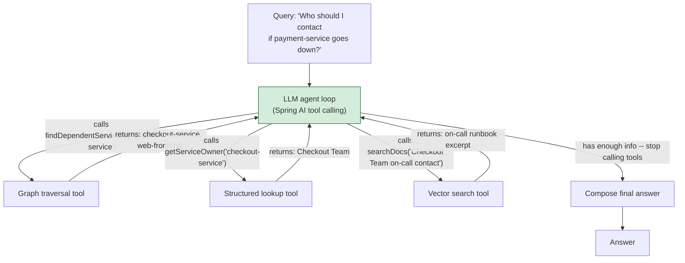

# Pattern 25: Agentic RAG

[← Back to index](README.md)

## 1. What is Agentic RAG?

Agentic RAG hands control of the retrieval process to the LLM itself: instead of a
fixed pipeline (even a chained one like Multi-Hop RAG) deciding what happens next, the
LLM is given a set of **tools** — vector search, graph traversal, structured lookups,
whatever the system exposes — and **autonomously decides, at each step, which tool to
call, with what arguments, and when it has enough information to stop and answer.**

This is the generalization explicitly deferred to at the end of Pattern 23: Multi-Hop
RAG chains retrieval steps, but always the *same* retrieval mechanism (vector search)
in a fixed reflect-then-search loop. Agentic RAG removes that constraint — the model
can choose *which* retrieval mechanism fits the current sub-problem (a vector search
for a fact, a graph traversal for a relationship, a structured lookup for an exact
record), interleaving different tools within a single question as needed.

## 2. What problem does it solve?

Some questions require **different retrieval mechanisms for different sub-parts**, and
deciding which mechanism fits which sub-part is itself a judgment call that a fixed
pipeline can't make — only a reasoning model, given the options, can:

- *"Who should I contact if payment-service goes down?"* — this needs graph traversal
  first (which services depend on payment-service, i.e. Pattern 24's mechanism), *then*
  a structured lookup (which team owns each of those affected services), and possibly
  *then* a vector search (does the on-call runbook for that team mention a specific
  contact channel). No single fixed pipeline shape handles all three steps generically
  — the *sequence and choice* of tools genuinely depends on what's discovered along the
  way.

Multi-Hop RAG (Pattern 23) can chain vector searches, and Graph RAG (Pattern 24) can
traverse a graph, but neither can decide *mid-question* to switch from one mechanism to
the other. Agentic RAG is the pattern for when a question's shape isn't known in
advance and the right tool at each step depends on what was just learned.

## 3. Realistic production scenario

**Company:** the internal engineering knowledge base, now equipped with three distinct
capabilities built in earlier patterns — vector search over documentation (Patterns
1-22), graph traversal over the service dependency graph (Pattern 24), and a simple
structured lookup of which team owns which service — exposed to an LLM agent as three
callable tools.

**Problem:** *"Who should I contact if payment-service goes down?"* requires
graph traversal (to find affected services) *and* a structured lookup (to find each
affected service's owning team) *and possibly* a documentation search (to find that
team's specific on-call contact process) — in a sequence that can't be hard-coded in
advance, because which services are affected (and therefore which team lookups and doc
searches are needed) isn't known until the graph traversal actually runs.

**Goal:** expose `searchDocs`, `findDependentServices`, and `getServiceOwner` as tools
to an LLM agent via Spring AI's tool-calling support, and let the model autonomously
plan and execute the sequence of tool calls needed, stopping once it has gathered
enough to answer.

## 4. Architecture / flow diagram



## 5. Request-to-response walkthrough

1. **User asks:** *"Who should I contact if payment-service goes down?"*
2. **The LLM agent receives the question plus three tool definitions** (with
   descriptions Spring AI derives from `@Tool`-annotated methods) and begins reasoning
   about how to answer it.
3. **First tool call, chosen autonomously by the model:** `findDependentServices("payment-service")`
   — the model recognizes this is fundamentally a dependency-impact question and picks
   the graph traversal tool first, without being told to.
4. **Tool result returned to the model:** `["checkout-service", "web-frontend"]`.
5. **Second tool call:** the model now calls `getServiceOwner("checkout-service")` (and
   similarly for `web-frontend`) to find who owns each affected service — a different
   tool than the first, chosen because the model now needs a different *kind* of
   information than a dependency traversal provides.
6. **Third tool call (if needed):** the model may call `searchDocs("Checkout Team
   on-call contact process")` to find the specific contact mechanism, if the owner
   lookup alone doesn't include contact details.
7. **The model decides it has enough information** and stops calling tools, composing
   a final natural-language answer synthesizing everything gathered across all three
   tool calls.
8. **Answer returned**, along with the full trace of which tools were called, with what
   arguments, in what order — essential for debugging and trust in an agentic system.

## 6. Why this pattern is appropriate here

- **This is the only pattern that can handle genuinely heterogeneous, unpredictable
  tool sequences** — Multi-Hop RAG always chains the same mechanism; Graph RAG always
  traverses the same graph; Agentic RAG can interleave both plus anything else exposed
  as a tool, in whatever order the specific question actually requires.
- **The model's tool choice is itself informative** — logging which tools were called,
  with what arguments, is a form of interpretability that a fixed pipeline doesn't
  need but an agentic one absolutely requires for debugging and trust.
- **Spring AI's tool-calling support makes this a natural extension of everything
  already built** — the vector search, graph traversal, and lookup logic from earlier
  patterns become tools with almost no new code; the *only* new thing is exposing them
  via `@Tool` and letting the model orchestrate.
- **When this is *not* enough, or is overkill:** for a question whose shape is
  predictable and consistent (always "search then generate," always "traverse the
  graph then generate"), a fixed pipeline (any earlier pattern) is faster, cheaper, and
  more predictable than an agentic loop — Agentic RAG's autonomy is valuable
  specifically when tool sequence genuinely can't be known in advance, and should be
  reserved for that case rather than used as a default for everything, given its
  higher latency and less predictable cost per query.

## 7. Production-quality implementation (Java / Spring AI)

```java
package com.acme.rag.agentic;

import org.springframework.ai.chat.client.ChatClient;
import org.springframework.ai.document.Document;
import org.springframework.ai.ollama.OllamaChatModel;
import org.springframework.ai.ollama.OllamaEmbeddingModel;
import org.springframework.ai.ollama.api.OllamaApi;
import org.springframework.ai.ollama.api.OllamaOptions;
import org.springframework.ai.tool.annotation.Tool;
import org.springframework.ai.tool.annotation.ToolParam;
import org.springframework.ai.transformer.splitter.TokenTextSplitter;
import org.springframework.ai.vectorstore.SearchRequest;
import org.springframework.ai.vectorstore.SimpleVectorStore;

import java.io.IOException;
import java.io.UncheckedIOException;
import java.nio.file.Files;
import java.nio.file.Path;
import java.util.*;
import java.util.stream.Collectors;

/**
 * Agentic RAG -- expose vector search, graph traversal, and a structured
 * lookup as tools; let the LLM agent autonomously plan and execute whatever
 * sequence of tool calls the specific question requires.
 */
public final class AgenticRagApp {

    record RagConfig(
            String embeddingModel, String llmModel, double llmTemperature,
            int topK, Path vectorPersistPath) {

        static RagConfig defaults() {
            return new RagConfig("nomic-embed-text", "llama3.1", 0.0, 3,
                    Path.of("./vectorstore_eng_kb_agentic.json"));
        }
    }

    /**
     * The tool surface exposed to the agent. Each @Tool method's javadoc-style
     * description is what the model reads to decide WHEN to call it -- these
     * descriptions matter as much as the implementation for good tool selection.
     */
    static final class EngineeringAssistantTools {
        private final SimpleVectorStore vectorStore;
        private final Map<String, List<String>> dependents; // service -> services that depend on it
        private final Map<String, String> serviceOwners;
        private final int topK;
        private final List<String> callLog = new ArrayList<>();

        EngineeringAssistantTools(SimpleVectorStore vectorStore, Map<String, List<String>> dependents,
                                   Map<String, String> serviceOwners, int topK) {
            this.vectorStore = vectorStore;
            this.dependents = dependents;
            this.serviceOwners = serviceOwners;
            this.topK = topK;
        }

        List<String> callLog() { return callLog; }

        @Tool(description = "Search engineering documentation (runbooks, guides, references) "
                + "for information matching a natural-language query.")
        String searchDocs(@ToolParam(description = "The search query") String query) {
            callLog.add("searchDocs(\"" + query + "\")");
            List<Document> results = vectorStore.similaritySearch(
                    SearchRequest.builder().query(query).topK(topK).build());
            if (results.isEmpty()) return "No matching documentation found.";
            return results.stream().map(Document::getText).collect(Collectors.joining("\n---\n"));
        }

        @Tool(description = "Given a service name, find all other services that would be "
                + "affected (directly or transitively) if that service goes down.")
        List<String> findDependentServices(
                @ToolParam(description = "The service name, e.g. 'payment-service'") String serviceName) {
            callLog.add("findDependentServices(\"" + serviceName + "\")");
            return dependents.getOrDefault(serviceName, List.of());
        }

        @Tool(description = "Given a service name, look up which team owns/operates it.")
        String getServiceOwner(
                @ToolParam(description = "The service name, e.g. 'checkout-service'") String serviceName) {
            callLog.add("getServiceOwner(\"" + serviceName + "\")");
            return serviceOwners.getOrDefault(serviceName, "Unknown owning team");
        }
    }

    static final class AgenticEngKbAssistant {
        private static final String SYSTEM = """
                You are an internal engineering assistant. You have tools available to
                search documentation, trace service dependencies, and look up service
                ownership. Use whichever tools are needed, in whatever order makes
                sense, to fully answer the user's question. Call tools as many times as
                needed before giving your final answer. Base your final answer only on
                information returned by the tools.
                """;

        private final ChatClient chatClient;
        private final EngineeringAssistantTools tools;

        AgenticEngKbAssistant(OllamaChatModel chatModel, EngineeringAssistantTools tools) {
            this.tools = tools;
            // Registering the tools object makes every @Tool-annotated method
            // available to the model; Spring AI handles the call/response loop
            // (model requests a tool call -> Spring AI invokes the Java method ->
            // result is fed back to the model -> repeat until the model stops
            // requesting tools and returns a final answer).
            this.chatClient = ChatClient.builder(chatModel)
                    .defaultSystem(SYSTEM)
                    .defaultTools(tools)
                    .build();
        }

        record AskResult(String answer, List<String> toolCallTrace) {}

        AskResult ask(String question) {
            if (question == null || question.isBlank()) {
                throw new IllegalArgumentException("Question must not be empty.");
            }

            String answer;
            try {
                answer = chatClient.prompt().user(question).call().content();
            } catch (Exception ex) {
                System.err.println("Agentic call failed: " + ex);
                answer = "Sorry, something went wrong answering that question.";
            }

            return new AskResult(answer, List.copyOf(tools.callLog()));
        }
    }

    private static SimpleVectorStore buildVectorStore(RagConfig config,
                                                        OllamaEmbeddingModel embeddingModel, Path sourceDir) {
        SimpleVectorStore store = SimpleVectorStore.builder(embeddingModel).build();
        if (Files.exists(config.vectorPersistPath())) {
            store.load(config.vectorPersistPath().toFile());
            return store;
        }
        List<Document> docs;
        try (var files = Files.list(sourceDir)) {
            docs = files.filter(p -> p.toString().endsWith(".md")).sorted()
                    .map(p -> {
                        try {
                            return new Document(Files.readString(p),
                                    Map.of("source", p.getFileName().toString()));
                        } catch (IOException e) { throw new UncheckedIOException(e); }
                    }).collect(Collectors.toList());
        } catch (IOException e) { throw new UncheckedIOException(e); }
        TokenTextSplitter splitter = new TokenTextSplitter(500, 60, 5, 10000, true);
        store.add(splitter.apply(docs));
        store.save(config.vectorPersistPath().toFile());
        return store;
    }

    private static void writeSampleDocs(Path dir) throws IOException {
        Files.createDirectories(dir);
        Files.writeString(dir.resolve("checkout_team_oncall.md"), """
                ## Checkout Team On-Call Process
                The Checkout Team's on-call engineer can be reached via the
                #checkout-oncall Slack channel or by paging "checkout-primary" in
                PagerDuty for urgent issues.
                """);
        Files.writeString(dir.resolve("web_team_oncall.md"), """
                ## Web Platform Team On-Call Process
                The Web Platform Team's on-call engineer can be reached by paging
                "web-platform-primary" in PagerDuty.
                """);
    }

    public static void main(String[] args) throws IOException {
        RagConfig config = RagConfig.defaults();
        Path sampleDir = Path.of("./sample_eng_kb_agentic");
        writeSampleDocs(sampleDir);

        OllamaApi ollamaApi = OllamaApi.builder().baseUrl("http://localhost:11434").build();
        OllamaEmbeddingModel embeddingModel = OllamaEmbeddingModel.builder()
                .ollamaApi(ollamaApi)
                .defaultOptions(OllamaOptions.builder().model(config.embeddingModel()).build())
                .build();
        OllamaChatModel chatModel = OllamaChatModel.builder()
                .ollamaApi(ollamaApi)
                .defaultOptions(OllamaOptions.builder().model(config.llmModel())
                        .temperature(config.llmTemperature()).build())
                .build();

        SimpleVectorStore vectorStore = buildVectorStore(config, embeddingModel, sampleDir);

        // Same dependency data as Pattern 24's graph, simplified to a direct map here.
        Map<String, List<String>> dependents = Map.of(
                "payment-service", List.of("checkout-service", "web-frontend"));
        Map<String, String> serviceOwners = Map.of(
                "checkout-service", "Checkout Team",
                "web-frontend", "Web Platform Team");

        EngineeringAssistantTools tools =
                new EngineeringAssistantTools(vectorStore, dependents, serviceOwners, config.topK());
        AgenticEngKbAssistant assistant = new AgenticEngKbAssistant(chatModel, tools);

        AgenticEngKbAssistant.AskResult result =
                assistant.ask("Who should I contact if payment-service goes down?");
        System.out.println("\nQ: Who should I contact if payment-service goes down?");
        System.out.println("  tool call trace: " + result.toolCallTrace());
        System.out.println("A: " + result.answer());
    }
}
```

### Key production details worth noting

- **`@Tool` descriptions are the model's entire basis for deciding when to call each
  tool** — they matter as much as the implementation itself; a vague or missing
  description leads to the model either never calling a tool it should, or calling the
  wrong one.
- **Spring AI's `defaultTools(...)` registers the tools object once**, and the
  request/response tool-calling loop (model asks for a tool call → Spring AI invokes
  the annotated Java method → result is returned to the model → model decides whether
  to call another tool or answer) is handled automatically — no manual loop needed in
  application code, unlike the hand-rolled hop loop in Multi-Hop RAG (Pattern 23).
- **`callLog` gives full observability into what the agent actually did** — returning
  the tool-call trace alongside the answer is essential for debugging an agentic
  system, since (unlike a fixed pipeline) the exact sequence of operations isn't known
  until after the model has run.
- **This pattern's tools directly reuse Pattern 24's graph traversal and earlier
  patterns' vector search** — Agentic RAG is best understood as a control layer that
  sits *on top of* the retrieval mechanisms built in every earlier pattern, not a
  replacement for any of them.

---
[← Back to index](README.md)
