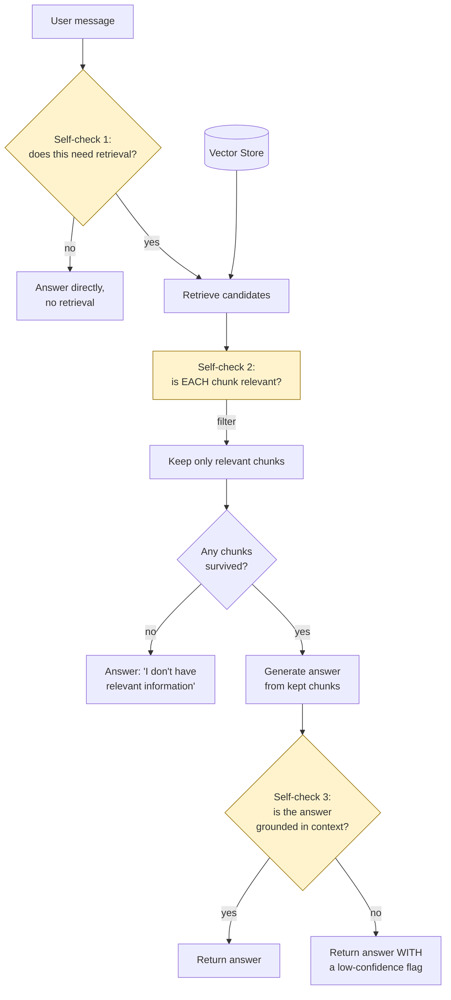

# Pattern 26: Self-RAG

[← Back to index](README.md)

## 1. What is Self-RAG?

Self-RAG adds explicit **self-critique steps** throughout the RAG pipeline, at three
distinct decision points:

1. **Retrieval necessity** — before retrieving anything, does this question actually
   need external context, or can it be answered directly (or should it be declined)?
2. **Relevance** — after retrieving, is *each* retrieved chunk actually relevant to the
   question, or should it be filtered out before it ever reaches generation?
3. **Groundedness/support** — after generating an answer, is it actually *supported* by
   the retrieved context, or did the model drift into unsupported claims despite having
   real context available?

This is the direct, structural fix for failure mode ⑤ identified all the way back in
Pattern 2's Naive RAG diagnostics — **"single-shot, no self-check."** Every pattern
since then has improved *what* gets retrieved or *how* it's ranked, but none of them
added a step where the system checks its own work before answering. Self-RAG is that
missing step, made explicit at each of the three points where something could silently
go wrong.

## 2. What problem does it solve?

A standard RAG pipeline (even a very well-tuned one from any earlier pattern in this
series) has three specific blind spots that self-critique directly addresses:

- **Retrieving when it shouldn't.** A greeting ("hi", "thanks") or a general-knowledge
  question unrelated to the corpus still triggers a retrieval call in a naive pipeline,
  wasting a search and risking irrelevant context being force-fit into the answer.
- **Trusting retrieval blindly.** Even good retrieval occasionally returns a
  chunk that's topically related but doesn't actually answer the specific question —
  without a relevance check, that chunk still gets stuffed into the prompt and can
  mislead generation.
- **Trusting generation blindly.** Even with genuinely relevant context, an LLM can
  still produce a claim not actually supported by that context (a subtler form of
  hallucination — not fabricating from nothing, but overstating or misreading what the
  context actually says). Without a groundedness check, this goes undetected.

## 3. Realistic production scenario

**Company:** the "Ask HR" assistant from Pattern 1, now being hardened for wider
rollout — the original version (no self-checks) occasionally: answered a casual "thanks!"
by retrieving and citing an irrelevant policy chunk; included a retrieved-but-barely-related
chunk that confused rather than helped; and in one flagged case, stated a specific
number that wasn't actually present anywhere in the retrieved context (paraphrased
imprecisely into a wrong specific figure).

**Goal:** add explicit self-critique at all three points: skip retrieval for
non-substantive messages, filter out retrieved chunks that don't pass a relevance
check, and verify the generated answer is actually grounded in the (relevance-filtered)
context before returning it — flagging low confidence rather than returning an
ungrounded answer if the groundedness check fails.

## 4. Architecture / flow diagram



## 5. Request-to-response walkthrough

1. **User sends:** *"thanks, that's helpful!"*
2. **Self-check 1 (retrieval necessity):** an LLM call classifies whether this message
   needs retrieval at all — here, no; it's a conversational acknowledgment. The
   pipeline answers directly with a short reply, skipping retrieval entirely.
3. **A different message:** *"How many sick days do new hires get?"*
4. **Self-check 1 says yes** — this needs retrieval. Standard vector search runs,
   returning 4 candidate chunks.
5. **Self-check 2 (relevance), applied per chunk:** each of the 4 retrieved chunks is
   independently checked for whether it actually addresses the question — say, 3 pass
   (genuinely about sick leave) and 1 is filtered out (topically adjacent — about
   parental leave — but not actually relevant to this specific question).
6. **Generation** proceeds using only the 3 relevance-checked chunks.
7. **Self-check 3 (groundedness):** the generated answer is checked against the kept
   context — does every claim in the answer actually appear, or follow directly, from
   what was retrieved? If the model stated a specific number not present in the
   context, this check catches it.
8. **If grounded:** the answer is returned as-is. **If not grounded:** the answer is
   still returned, but flagged with a low-confidence notice (e.g. "please verify this
   with HR directly") rather than silently presenting an unsupported claim as fact.

## 6. Why this pattern is appropriate here

- **This is the structural completion of the "no self-check" gap from Pattern 2** —
  every self-critique step here targets exactly the failure mode named at the very
  start of this series, closing a loop that's been open since Pattern 2.
- **Retrieval-necessity checking saves cost and avoids irrelevant-context pollution**
  on the (common, in a chat interface) fraction of messages that aren't really
  questions at all.
- **Relevance filtering is a finer-grained, per-chunk version of what Re-Ranking
  (Pattern 20) does at the ranking level** — re-ranking orders chunks by relevance;
  Self-RAG's relevance check can outright *remove* a chunk that doesn't clear a bar at
  all, which matters when even the "best available" chunk still isn't good enough to
  use.
- **Groundedness checking is the last line of defense against hallucination** — it
  can't prevent an ungrounded claim from being generated, but it can prevent it from
  being presented to the user without a caveat, which is a materially different (and
  much safer) failure mode.
- **When this is *not* enough:** if a groundedness failure should trigger *active
  correction* (re-retrieving with a different query, or re-generating with stricter
  instructions) rather than just a low-confidence flag, that's Corrective RAG
  (Pattern 27) — Self-RAG detects problems; Corrective RAG's job is to actively fix
  them.

## 7. Production-quality implementation (Java / Spring AI)

```java
package com.acme.rag.selfrag;

import org.springframework.ai.chat.client.ChatClient;
import org.springframework.ai.document.Document;
import org.springframework.ai.ollama.OllamaChatModel;
import org.springframework.ai.ollama.OllamaEmbeddingModel;
import org.springframework.ai.ollama.api.OllamaApi;
import org.springframework.ai.ollama.api.OllamaOptions;
import org.springframework.ai.transformer.splitter.TokenTextSplitter;
import org.springframework.ai.vectorstore.SearchRequest;
import org.springframework.ai.vectorstore.SimpleVectorStore;

import java.io.IOException;
import java.io.UncheckedIOException;
import java.nio.file.Files;
import java.nio.file.Path;
import java.util.ArrayList;
import java.util.List;
import java.util.Map;
import java.util.stream.Collectors;

/**
 * Self-RAG -- explicit self-critique at three points: does this need
 * retrieval, is each retrieved chunk relevant, and is the generated answer
 * grounded in the (filtered) context.
 */
public final class SelfRagApp {

    record RagConfig(
            String embeddingModel, String llmModel, double llmTemperature,
            int topK, Path persistPath) {

        static RagConfig defaults() {
            return new RagConfig("nomic-embed-text", "llama3.1", 0.0, 4,
                    Path.of("./vectorstore_hr_handbook_selfrag.json"));
        }
    }

    static final class SelfCritiques {
        private static final String NEEDS_RETRIEVAL_SYSTEM = """
                Does answering this message require looking up information from an HR
                handbook, or is it a general conversational message (greeting, thanks,
                small talk) that can be answered directly? Respond with ONLY: YES or NO
                """;
        private static final String RELEVANCE_SYSTEM = """
                Does this passage contain information that directly helps answer the
                question? Respond with ONLY: YES or NO
                """;
        private static final String GROUNDEDNESS_SYSTEM = """
                Is every factual claim in this answer directly supported by the
                provided context? Respond with ONLY: YES or NO
                """;

        private final ChatClient chatClient;

        SelfCritiques(ChatClient chatClient) { this.chatClient = chatClient; }

        boolean needsRetrieval(String question) {
            return askYesNo(NEEDS_RETRIEVAL_SYSTEM, "Message: " + question, true);
        }

        boolean isRelevant(String question, String passage) {
            return askYesNo(RELEVANCE_SYSTEM,
                    "Question: " + question + "\n\nPassage:\n" + passage, false);
        }

        boolean isGrounded(String answer, String context) {
            return askYesNo(GROUNDEDNESS_SYSTEM,
                    "Context:\n" + context + "\n\nAnswer:\n" + answer, false);
        }

        private boolean askYesNo(String system, String user, boolean defaultOnError) {
            try {
                String response = chatClient.prompt().system(system).user(user)
                        .call().content().trim().toUpperCase();
                return response.startsWith("YES");
            } catch (Exception ex) {
                System.err.println("Self-critique call failed, defaulting to "
                        + defaultOnError + ": " + ex);
                return defaultOnError;
            }
        }
    }

    static final class SelfRagHrAssistant {
        private static final String GEN_SYSTEM = """
                You are the Ask HR assistant for Acme Corp. Answer using ONLY the
                context below. If the context does not fully answer the question, say
                so explicitly rather than guessing.

                Context:
                {context}
                """;

        private final RagConfig config;
        private final SimpleVectorStore vectorStore;
        private final ChatClient chatClient;
        private final SelfCritiques critiques;

        SelfRagHrAssistant(RagConfig config, OllamaEmbeddingModel embeddingModel,
                            ChatClient chatClient, Path sourceDir) {
            this.config = config;
            this.chatClient = chatClient;
            this.critiques = new SelfCritiques(chatClient);
            this.vectorStore = buildOrLoad(embeddingModel, sourceDir);
        }

        private SimpleVectorStore buildOrLoad(OllamaEmbeddingModel embeddingModel, Path sourceDir) {
            SimpleVectorStore store = SimpleVectorStore.builder(embeddingModel).build();
            if (Files.exists(config.persistPath())) {
                store.load(config.persistPath().toFile());
                return store;
            }
            List<Document> docs;
            try (var files = Files.list(sourceDir)) {
                docs = files.filter(p -> p.toString().endsWith(".md")).sorted()
                        .map(p -> {
                            try {
                                return new Document(Files.readString(p),
                                        Map.of("source", p.getFileName().toString()));
                            } catch (IOException e) { throw new UncheckedIOException(e); }
                        }).collect(Collectors.toList());
            } catch (IOException e) { throw new UncheckedIOException(e); }
            TokenTextSplitter splitter = new TokenTextSplitter(600, 80, 5, 10000, true);
            List<Document> chunks = splitter.apply(docs);
            store.add(chunks);
            store.save(config.persistPath().toFile());
            return store;
        }

        record AskResult(String answer, boolean retrievalUsed, boolean grounded, List<String> sources) {}

        AskResult ask(String question) {
            if (question == null || question.isBlank()) {
                throw new IllegalArgumentException("Question must not be empty.");
            }

            // Self-check 1: does this need retrieval at all?
            if (!critiques.needsRetrieval(question)) {
                String directAnswer = chatClient.prompt()
                        .user("Respond briefly and naturally to this message: " + question)
                        .call().content();
                return new AskResult(directAnswer, false, true, List.of());
            }

            // Retrieve, then self-check 2: filter to relevant chunks only.
            List<Document> retrieved = vectorStore.similaritySearch(
                    SearchRequest.builder().query(question).topK(config.topK()).build());

            List<Document> relevantChunks = new ArrayList<>();
            for (Document doc : retrieved) {
                if (critiques.isRelevant(question, doc.getText())) {
                    relevantChunks.add(doc);
                }
            }

            if (relevantChunks.isEmpty()) {
                return new AskResult(
                        "I don't have relevant information in the handbook to answer that — "
                        + "please contact HR directly.", true, true, List.of());
            }

            String context = relevantChunks.stream()
                    .map(d -> "[" + d.getMetadata().getOrDefault("source", "unknown") + "]\n" + d.getText())
                    .collect(Collectors.joining("\n\n---\n\n"));

            String answer;
            try {
                String systemMessage = GEN_SYSTEM.replace("{context}", context);
                answer = chatClient.prompt().system(systemMessage).user(question).call().content();
            } catch (Exception ex) {
                System.err.println("Generation failed: " + ex);
                return new AskResult("Sorry, something went wrong answering that question.",
                        true, false, List.of());
            }

            // Self-check 3: is the generated answer actually grounded in the context?
            boolean grounded = critiques.isGrounded(answer, context);
            String finalAnswer = grounded ? answer
                    : answer + "\n\n[Low confidence: please verify this with HR directly.]";

            List<String> sources = relevantChunks.stream()
                    .map(d -> String.valueOf(d.getMetadata().getOrDefault("source", "unknown")))
                    .collect(Collectors.toList());

            return new AskResult(finalAnswer, true, grounded, sources);
        }
    }

    private static void writeSampleHandbook(Path dir) throws IOException {
        Files.createDirectories(dir);
        Files.writeString(dir.resolve("leave_policy.md"), """
                ## Sick Leave Policy
                New employees accrue 6 paid sick days during their first year of
                employment. After one year, employees accrue 10 paid sick days per
                calendar year.

                ## Parental Leave Policy
                Employees are entitled to 16 weeks of paid parental leave after 12
                months of continuous employment.
                """);
    }

    public static void main(String[] args) throws IOException {
        RagConfig config = RagConfig.defaults();
        Path sampleDir = Path.of("./sample_hr_docs_selfrag");
        writeSampleHandbook(sampleDir);

        OllamaApi ollamaApi = OllamaApi.builder().baseUrl("http://localhost:11434").build();
        OllamaEmbeddingModel embeddingModel = OllamaEmbeddingModel.builder()
                .ollamaApi(ollamaApi)
                .defaultOptions(OllamaOptions.builder().model(config.embeddingModel()).build())
                .build();
        OllamaChatModel chatModel = OllamaChatModel.builder()
                .ollamaApi(ollamaApi)
                .defaultOptions(OllamaOptions.builder().model(config.llmModel())
                        .temperature(config.llmTemperature()).build())
                .build();
        ChatClient chatClient = ChatClient.create(chatModel);

        SelfRagHrAssistant assistant = new SelfRagHrAssistant(config, embeddingModel, chatClient, sampleDir);

        List<String> messages = List.of(
                "thanks, that's helpful!",
                "How many sick days do new hires get?");

        for (String m : messages) {
            SelfRagHrAssistant.AskResult result = assistant.ask(m);
            System.out.println("\nQ: " + m);
            System.out.println("  retrieval used: " + result.retrievalUsed()
                    + " | grounded: " + result.grounded() + " | sources: " + result.sources());
            System.out.println("A: " + result.answer());
        }
    }
}
```

### Key production details worth noting

- **Each self-critique defaults safely on failure**, but with *different* defaults
  chosen deliberately: `needsRetrieval` defaults to `true` on error (safer to
  over-retrieve than to skip needed context), while `isRelevant` and `isGrounded`
  default to `false` (safer to filter out a possibly-relevant chunk or flag a
  possibly-fine answer than to silently trust an unchecked critique call that itself
  failed).
- **A groundedness failure doesn't discard the answer — it flags it.** This is a
  deliberate design choice: the answer may still be useful and correct even if the
  automated groundedness check couldn't confirm it; transparency (flagging low
  confidence) is preferred over silently discarding potentially-good information.
- **Relevance filtering happens chunk-by-chunk, before generation** — this is a
  distinct, finer-grained mechanism from Context Compression (Pattern 21), which
  shrinks *within* a chunk; Self-RAG's relevance check decides whether to include a
  chunk *at all*.
- **Three separate LLM calls are added per question in the worst case** (necessity +
  N relevance checks + 1 groundedness check) — a real cost/latency trade-off worth
  measuring against the value of catching the specific failure modes this pattern
  targets; not every application needs all three checks at full strength, and cheaper
  heuristic approximations (e.g. word-overlap groundedness, as used in Pattern 2's
  diagnostic harness) are a reasonable lower-cost alternative where LLM-call latency
  is the binding constraint.

---
[← Back to index](README.md)
