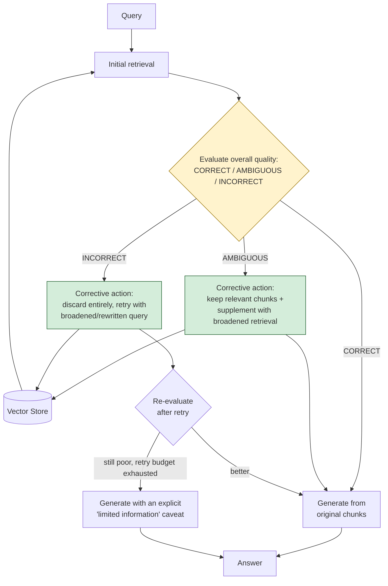

# Pattern 27: Corrective RAG

[← Back to index](README.md)

## 1. What is Corrective RAG?

Corrective RAG (CRAG) takes Self-RAG's (Pattern 26) detection one step further: instead
of just *flagging* a problem with retrieved context, it **actively takes a corrective
action** and retries. After retrieval, the candidate chunks are evaluated as a whole
and classified into one of three states:

- **Correct** — the retrieved chunks are genuinely relevant and sufficient; proceed to
  generation as normal.
- **Ambiguous** — some chunks are relevant, some aren't; keep the relevant ones, and
  *supplement* with an additional corrective retrieval (typically with a broadened or
  rewritten query) rather than proceeding with a possibly-incomplete context.
- **Incorrect** — none of the retrieved chunks are actually relevant; discard them
  entirely and retry retrieval with a substantially different strategy (a broadened
  query, a different transformation) rather than generating from irrelevant context at
  all.

Self-RAG detects a problem and flags the output; Corrective RAG detects the same kind
of problem and **does something about it before generation happens**, closing the loop
one step earlier and more actively.

## 2. What problem does it solve?

Self-RAG's groundedness flag happens *after* generation — the user still sees an
answer, just with a caveat attached. That's the right behavior when the answer might
still be useful despite imperfect grounding. But sometimes the retrieved context is bad
enough that generating from it at all is the wrong move — no caveat can save an answer
built from genuinely irrelevant context. Corrective RAG addresses this earlier and more
decisively: when retrieval quality is poor, **don't generate from it yet — try to fix
retrieval first.**

This matters most for queries where the *first* retrieval attempt reasonably fails —
unusual phrasing, a typo, a question about something genuinely underdocumented — and a
second attempt with a different strategy has a real chance of succeeding, rather than
the system settling for (and just flagging) a bad first attempt.

## 3. Realistic production scenario

**Company:** the SaaS support bot, handling a query where the first retrieval attempt
comes back weak: *"why was I double billed this month"* — the corpus has a "Refund
Policy" doc and a "Duplicate Charges" FAQ entry, but the specific phrase "double
billed" doesn't closely match either document's wording, so the first retrieval
attempt's top-4 chunks are only weakly relevant (a mix of loosely-related billing
content, none of it squarely on point).

**Goal:** classify the first retrieval attempt's overall quality; if it's ambiguous or
incorrect, actively retry with a broadened/rewritten query before generating anything —
rather than either generating from weak context (Naive RAG's failure) or generating and
just flagging low confidence after the fact (Self-RAG's response).

## 4. Architecture / flow diagram



## 5. Request-to-response walkthrough

1. **User asks:** *"why was I double billed this month"*.
2. **Initial retrieval** returns 4 chunks, none of which squarely address "double
   billing" — a per-chunk relevance check (same mechanism as Self-RAG) finds 0 of 4
   pass.
3. **Overall classification: INCORRECT** — zero relevant chunks means the whole
   attempt is discarded, not partially kept.
4. **Corrective action — query broadening:** the system generates a broadened/rewritten
   query (e.g. *"duplicate charge billing error refund"*), explicitly trying different
   phrasing rather than repeating the same search.
5. **Retry retrieval** with the broadened query — this time surfaces the "Duplicate
   Charges" FAQ entry, which directly addresses the situation.
6. **Re-evaluation:** the retried chunks now pass relevance checks — classification
   becomes CORRECT (or at least AMBIGUOUS-with-useful-content).
7. **Generation** proceeds using the successfully-retried context.
8. **A bounded retry budget** (e.g. one corrective retry) prevents this from looping
   indefinitely — if even the corrective retry comes back poor, the system generates
   with an explicit "limited information available" caveat rather than retrying forever
   or silently answering from bad context.

## 6. Why this pattern is appropriate here

- **Actively fixes retrieval failures instead of just reporting them** — for queries
  where a second attempt with different phrasing has a real chance of succeeding
  (unusual wording, near-miss vocabulary), this materially improves the final answer
  rather than just adding a caveat to a bad one.
- **The three-way classification (correct/ambiguous/incorrect) enables proportionate
  correction** — a fully-failed retrieval gets a full retry; a partially-successful one
  gets supplemented rather than discarded entirely, avoiding throwing away chunks that
  were actually useful.
- **Composes directly with Self-RAG (Pattern 26)**: the per-chunk relevance check
  mechanism is identical; Corrective RAG's contribution is the *decision logic layered
  on top* (retry vs. supplement vs. proceed) plus the bounded retry loop itself.
- **When this is *not* enough:** if even broadened/rewritten retrieval genuinely can't
  find relevant content because the corpus itself lacks the answer (not a phrasing
  problem, a coverage gap), no amount of retry helps — that's a corpus/coverage issue
  to flag for content owners, not something retrieval-side correction can fix, and the
  bounded retry budget plus honest "limited information" fallback exists precisely to
  handle this gracefully rather than looping forever trying to find something that
  isn't there.

## 7. Production-quality implementation (Java / Spring AI)

```java
package com.acme.rag.corrective;

import org.springframework.ai.chat.client.ChatClient;
import org.springframework.ai.document.Document;
import org.springframework.ai.ollama.OllamaChatModel;
import org.springframework.ai.ollama.OllamaEmbeddingModel;
import org.springframework.ai.ollama.api.OllamaApi;
import org.springframework.ai.ollama.api.OllamaOptions;
import org.springframework.ai.transformer.splitter.TokenTextSplitter;
import org.springframework.ai.vectorstore.SearchRequest;
import org.springframework.ai.vectorstore.SimpleVectorStore;

import java.io.IOException;
import java.io.UncheckedIOException;
import java.nio.file.Files;
import java.nio.file.Path;
import java.util.*;
import java.util.stream.Collectors;

/**
 * Corrective RAG -- classify retrieval quality as CORRECT / AMBIGUOUS /
 * INCORRECT, and actively retry with a broadened query when quality is poor,
 * instead of just flagging a poor result after generation (Self-RAG).
 */
public final class CorrectiveRagApp {

    enum RetrievalQuality { CORRECT, AMBIGUOUS, INCORRECT }

    record RagConfig(
            String embeddingModel, String llmModel, double llmTemperature,
            int topK, int maxCorrectiveRetries, Path persistPath) {

        static RagConfig defaults() {
            return new RagConfig("nomic-embed-text", "llama3.1", 0.0, 4, 1,
                    Path.of("./vectorstore_support_docs_crag.json"));
        }
    }

    static final class RelevanceEvaluator {
        private static final String SYSTEM = """
                Does this passage contain information that directly helps answer the
                query? Respond with ONLY: YES or NO
                """;
        private final ChatClient chatClient;

        RelevanceEvaluator(ChatClient chatClient) { this.chatClient = chatClient; }

        boolean isRelevant(String query, String passage) {
            try {
                String response = chatClient.prompt().system(SYSTEM)
                        .user("Query: " + query + "\n\nPassage:\n" + passage)
                        .call().content().trim().toUpperCase();
                return response.startsWith("YES");
            } catch (Exception ex) {
                System.err.println("Relevance check failed, treating as not relevant: " + ex);
                return false;
            }
        }

        RetrievalQuality classify(List<Boolean> relevanceResults) {
            long relevantCount = relevanceResults.stream().filter(Boolean::booleanValue).count();
            if (relevantCount == relevanceResults.size() && !relevanceResults.isEmpty()) return RetrievalQuality.CORRECT;
            if (relevantCount == 0) return RetrievalQuality.INCORRECT;
            return RetrievalQuality.AMBIGUOUS;
        }
    }

    static final class QueryBroadener {
        private static final String SYSTEM = """
                The following search query returned poor results. Rewrite it using
                different, broader, or more formal terminology that might better match
                how this topic is documented. Return ONLY the rewritten query.
                """;
        private final ChatClient chatClient;

        QueryBroadener(ChatClient chatClient) { this.chatClient = chatClient; }

        String broaden(String originalQuery) {
            try {
                String rewritten = chatClient.prompt().system(SYSTEM).user(originalQuery)
                        .call().content().trim();
                return rewritten.isEmpty() ? originalQuery : rewritten;
            } catch (Exception ex) {
                System.err.println("Query broadening failed, keeping original query: " + ex);
                return originalQuery;
            }
        }
    }

    static final class CorrectiveRagSupportBot {
        private static final String GEN_SYSTEM = """
                You are a customer support assistant for Acme SaaS. Answer using ONLY
                the context below. If the context is limited or you're not fully
                confident, say so explicitly rather than guessing.

                Context:
                {context}
                """;

        private final RagConfig config;
        private final SimpleVectorStore vectorStore;
        private final ChatClient chatClient;
        private final RelevanceEvaluator evaluator;
        private final QueryBroadener broadener;

        CorrectiveRagSupportBot(RagConfig config, OllamaEmbeddingModel embeddingModel,
                                 ChatClient chatClient, Path sourceDir) {
            this.config = config;
            this.chatClient = chatClient;
            this.evaluator = new RelevanceEvaluator(chatClient);
            this.broadener = new QueryBroadener(chatClient);
            this.vectorStore = buildOrLoad(embeddingModel, sourceDir);
        }

        private SimpleVectorStore buildOrLoad(OllamaEmbeddingModel embeddingModel, Path sourceDir) {
            SimpleVectorStore store = SimpleVectorStore.builder(embeddingModel).build();
            if (Files.exists(config.persistPath())) {
                store.load(config.persistPath().toFile());
                return store;
            }
            List<Document> docs;
            try (var files = Files.list(sourceDir)) {
                docs = files.filter(p -> p.toString().endsWith(".md")).sorted()
                        .map(p -> {
                            try {
                                return new Document(Files.readString(p),
                                        Map.of("source", p.getFileName().toString()));
                            } catch (IOException e) { throw new UncheckedIOException(e); }
                        }).collect(Collectors.toList());
            } catch (IOException e) { throw new UncheckedIOException(e); }
            TokenTextSplitter splitter = new TokenTextSplitter(500, 60, 5, 10000, true);
            List<Document> chunks = splitter.apply(docs);
            store.add(chunks);
            store.save(config.persistPath().toFile());
            return store;
        }

        record AskResult(String answer, RetrievalQuality finalQuality, int correctionsApplied, List<String> sources) {}

        AskResult ask(String question) {
            if (question == null || question.isBlank()) {
                throw new IllegalArgumentException("Question must not be empty.");
            }

            String currentQuery = question;
            List<Document> relevantChunks = new ArrayList<>();
            RetrievalQuality quality = RetrievalQuality.INCORRECT;
            int corrections = 0;

            for (int attempt = 0; attempt <= config.maxCorrectiveRetries(); attempt++) {
                List<Document> retrieved = vectorStore.similaritySearch(
                        SearchRequest.builder().query(currentQuery).topK(config.topK()).build());

                List<Boolean> relevanceFlags = new ArrayList<>();
                List<Document> newlyRelevant = new ArrayList<>();
                for (Document doc : retrieved) {
                    boolean relevant = evaluator.isRelevant(question, doc.getText());
                    relevanceFlags.add(relevant);
                    if (relevant) newlyRelevant.add(doc);
                }

                quality = evaluator.classify(relevanceFlags);
                System.out.println("Attempt " + (attempt + 1) + " query=\"" + currentQuery
                        + "\" quality=" + quality + " relevantChunks=" + newlyRelevant.size());

                // AMBIGUOUS: keep what's relevant so far rather than discarding it.
                for (Document doc : newlyRelevant) {
                    if (relevantChunks.stream().noneMatch(d -> d.getText().equals(doc.getText()))) {
                        relevantChunks.add(doc);
                    }
                }

                if (quality == RetrievalQuality.CORRECT) break;
                if (attempt == config.maxCorrectiveRetries()) break; // retry budget exhausted

                // Corrective action: broaden the query and try again (for both
                // AMBIGUOUS and INCORRECT -- AMBIGUOUS supplements what's kept,
                // INCORRECT effectively replaces an empty set).
                corrections++;
                currentQuery = broadener.broaden(currentQuery);
            }

            if (relevantChunks.isEmpty()) {
                return new AskResult(
                        "I couldn't find relevant information to answer that — please contact support directly.",
                        RetrievalQuality.INCORRECT, corrections, List.of());
            }

            String context = relevantChunks.stream()
                    .map(d -> "[" + d.getMetadata().getOrDefault("source", "unknown") + "]\n" + d.getText())
                    .collect(Collectors.joining("\n\n---\n\n"));

            String answer;
            try {
                String systemMessage = GEN_SYSTEM.replace("{context}", context);
                answer = chatClient.prompt().system(systemMessage).user(question).call().content();
            } catch (Exception ex) {
                System.err.println("Generation failed: " + ex);
                answer = "Sorry, something went wrong answering that question.";
            }

            List<String> sources = relevantChunks.stream()
                    .map(d -> String.valueOf(d.getMetadata().getOrDefault("source", "unknown")))
                    .collect(Collectors.toList());

            return new AskResult(answer, quality, corrections, sources);
        }
    }

    private static void writeSampleDocs(Path dir) throws IOException {
        Files.createDirectories(dir);
        Files.writeString(dir.resolve("refund_policy.md"), """
                ## Refund Policy
                Refunds are issued in full within 7 days of purchase. After 7 days, no
                partial refunds are issued for the remainder of the billing cycle.
                """);
        Files.writeString(dir.resolve("duplicate_charges_faq.md"), """
                ## Duplicate Charges FAQ
                If you see two charges for the same billing period, this is usually a
                temporary authorization hold, not an actual duplicate charge, and will
                drop off within 3-5 business days. If both charges remain after 5 days,
                contact support with both transaction ids for a manual refund review.
                """);
    }

    public static void main(String[] args) throws IOException {
        RagConfig config = RagConfig.defaults();
        Path sampleDir = Path.of("./sample_support_docs_crag");
        writeSampleDocs(sampleDir);

        OllamaApi ollamaApi = OllamaApi.builder().baseUrl("http://localhost:11434").build();
        OllamaEmbeddingModel embeddingModel = OllamaEmbeddingModel.builder()
                .ollamaApi(ollamaApi)
                .defaultOptions(OllamaOptions.builder().model(config.embeddingModel()).build())
                .build();
        OllamaChatModel chatModel = OllamaChatModel.builder()
                .ollamaApi(ollamaApi)
                .defaultOptions(OllamaOptions.builder().model(config.llmModel())
                        .temperature(config.llmTemperature()).build())
                .build();
        ChatClient chatClient = ChatClient.create(chatModel);

        CorrectiveRagSupportBot bot = new CorrectiveRagSupportBot(config, embeddingModel, chatClient, sampleDir);

        CorrectiveRagSupportBot.AskResult result = bot.ask("why was I double billed this month");
        System.out.println("\nQ: why was I double billed this month");
        System.out.println("  final quality: " + result.finalQuality()
                + " | corrections applied: " + result.correctionsApplied());
        System.out.println("  sources: " + result.sources());
        System.out.println("A: " + result.answer());
    }
}
```

### Key production details worth noting

- **`maxCorrectiveRetries` is a hard bound**, checked in the loop condition itself —
  same non-negotiable safety principle as Multi-Hop RAG's `maxHops` (Pattern 23):
  retry logic must always terminate, especially when the underlying cause (a genuine
  corpus coverage gap) can't be fixed by retrying at all.
- **AMBIGUOUS chunks are kept, not discarded, across retries** — the loop accumulates
  `relevantChunks` across attempts (deduplicated by text) rather than replacing them
  each time, so a partially-successful first attempt isn't thrown away just because a
  corrective retry was also triggered.
- **The corrective action here is query broadening**, but the pattern generalizes to
  other corrective strategies (switching to Hybrid Search for a lexical-mismatch case,
  falling back to a web search tool for out-of-corpus questions in systems that have
  one) — the decision *when* to correct (via quality classification) is the reusable
  core of this pattern, independent of *which* corrective strategy is plugged in.
- **A fully-exhausted retry budget still returns the best available answer**, generated
  with an honest low-confidence framing built into the generation prompt itself,
  rather than either failing outright or silently presenting a low-quality answer with
  full confidence.

---
[← Back to index](README.md)
