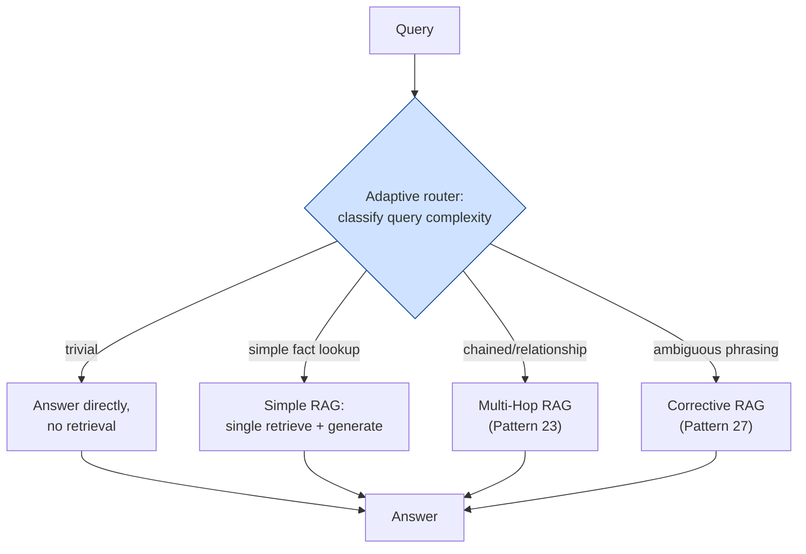

# Pattern 28: Adaptive RAG

[← Back to index](README.md)

## 1. What is Adaptive RAG?

Adaptive RAG is the **top-level router** that ties the whole series together: given an
incoming query, it classifies the query's *complexity and shape*, then dispatches to
whichever strategy from earlier patterns actually fits — a simple direct answer with no
retrieval, a single-shot retrieve-and-generate, a multi-hop chain (Pattern 23), or a
quality-checked corrective loop (Pattern 27) — rather than running every query through
one fixed pipeline regardless of what it actually needs.

This is the natural capstone of Part 5: Multi-Hop RAG, Graph RAG, Agentic RAG, Self-RAG,
and Corrective RAG each solve a *specific* kind of reasoning or reliability problem, at
a real cost (extra LLM calls, extra latency) that isn't justified for every query.
Adaptive RAG is the front door that decides, per query, which of those costs are
actually worth paying.

## 2. What problem does it solve?

Every advanced pattern in this series is a trade-off: better handling of some class of
hard query, in exchange for more LLM calls and latency on *every* query if applied
unconditionally. Running Multi-Hop RAG's reflection loop, or Corrective RAG's
relevance-checking retry logic, on a simple factual lookup ("what's our office
address") is pure waste — that query needed one retrieval and one generation call, not
three self-critique calls and a potential retry loop.

Conversely, running simple single-shot RAG on a genuinely complex, chained question
("what's the timeout for the service handling our highest-traffic endpoint") produces
an incomplete or wrong answer, because that specific query structurally needs Multi-Hop
RAG's sequential retrieval.

Adaptive RAG solves this by **not committing to one pipeline shape for the whole
system** — it classifies each query's complexity first, and only pays the extra cost of
an advanced pattern on the queries that actually need it.

## 3. Realistic production scenario

**Company:** the internal engineering assistant, now serving as the single front-door
chat interface for the whole engineering knowledge base built across this entire
series — fielding everything from *"what's our VPN address"* (trivial) to *"why is
checkout slow"* (ambiguous, benefits from Multi-Query, Pattern 8) to *"what's the
timeout for the service handling our highest-traffic endpoint"* (structurally requires
Multi-Hop RAG, Pattern 23).

**Goal:** classify each incoming query into a complexity tier, and route:
- **Trivial / no-retrieval-needed** → answer directly, no retrieval at all.
- **Simple, single-fact lookup** → standard single-shot retrieve-and-generate.
- **Complex / chained / relationship-dependent** → Multi-Hop RAG's sequential
  retrieval loop.
- **Ambiguous phrasing where a first attempt might miss** → Corrective RAG's
  quality-checked retry loop.

## 4. Architecture / flow diagram



## 5. Request-to-response walkthrough

1. **Query 1: *"what's our VPN address"*** — classified `TRIVIAL` (this is answerable
   directly, or with a single well-known fact, not requiring the full retrieval
   pipeline). Answered directly with minimal cost.
2. **Query 2: *"what's the rate limit for the /invoices endpoint"*** — classified
   `SIMPLE` — one clear fact, one document likely has it. Standard single-shot
   retrieve-and-generate runs.
3. **Query 3: *"what's the timeout for the service that handles our highest-traffic
   endpoint"*** — classified `CHAINED` — the router recognizes this requires knowing
   one fact before the next query can even be formed. Dispatches to the Multi-Hop RAG
   strategy (Pattern 23's sequential hop loop).
4. **Query 4: *"why was I double billed"*** — classified `AMBIGUOUS` — the phrasing is
   informal and might not match corpus vocabulary well on the first attempt.
   Dispatches to the Corrective RAG strategy (Pattern 27's quality-checked retry loop).
5. **Each strategy runs independently** using its own internal logic (already built in
   earlier patterns), and returns a normalized result to the router.
6. **Answer returned**, along with which strategy was used — critical for
   observability, since a mismatch between which strategy the router picked and which
   one a query actually needed is exactly the kind of thing worth monitoring over time.

## 6. Why this pattern is appropriate here

- **This is the only pattern that makes cost proportional to actual query need across
  an entire, heterogeneous production system** — every other advanced pattern in this
  series is a specialist tool; Adaptive RAG is what decides, query by query, which
  specialist to call, so the system as a whole doesn't pay a specialist's cost on
  every request.
- **The classification step itself is cheap** (one LLM call) relative to the cost
  difference between strategies (a single generate call vs. a multi-hop loop with
  several reflection calls), so the router's own overhead is easily justified by the
  savings on queries that don't need the expensive path.
- **This is the natural integration point for everything built in this series** — a
  production system rarely uses exactly one pattern in isolation; Adaptive RAG is the
  architectural layer that lets Simple RAG, Multi-Hop RAG, and Corrective RAG coexist
  in one application, each handling the queries it's actually suited for.
- **When this is *not* enough:** if the *set* of available strategies itself needs to
  be dynamic — new tools discoverable at runtime, not just a fixed enum of known
  strategies — that's closer to Agentic RAG's (Pattern 25) fully autonomous tool
  selection; Adaptive RAG's classification-then-dispatch is a lighter-weight, more
  predictable mechanism appropriate when the strategy set itself is small, known, and
  stable.

## 7. Production-quality implementation (Java / Spring AI)

```java
package com.acme.rag.adaptive;

import org.springframework.ai.chat.client.ChatClient;
import org.springframework.ai.document.Document;
import org.springframework.ai.ollama.OllamaChatModel;
import org.springframework.ai.ollama.OllamaEmbeddingModel;
import org.springframework.ai.ollama.api.OllamaApi;
import org.springframework.ai.ollama.api.OllamaOptions;
import org.springframework.ai.transformer.splitter.TokenTextSplitter;
import org.springframework.ai.vectorstore.SearchRequest;
import org.springframework.ai.vectorstore.SimpleVectorStore;

import java.io.IOException;
import java.io.UncheckedIOException;
import java.nio.file.Files;
import java.nio.file.Path;
import java.util.ArrayList;
import java.util.List;
import java.util.Map;
import java.util.stream.Collectors;

/**
 * Adaptive RAG -- classifies each query's complexity and dispatches to the
 * cheapest strategy that can handle it: direct answer, single-shot RAG, a
 * simplified Multi-Hop loop (Pattern 23), or a simplified Corrective loop
 * (Pattern 27). Ties the series together as a front-door router.
 */
public final class AdaptiveRagApp {

    enum QueryComplexity { TRIVIAL, SIMPLE, CHAINED, AMBIGUOUS }

    record RagConfig(
            String embeddingModel, String llmModel, double llmTemperature,
            int topK, int maxHops, Path persistPath) {

        static RagConfig defaults() {
            return new RagConfig("nomic-embed-text", "llama3.1", 0.0, 4, 3,
                    Path.of("./vectorstore_eng_kb_adaptive.json"));
        }
    }

    static final class ComplexityClassifier {
        private static final String SYSTEM = """
                Classify this engineering question into exactly one category:
                - 'trivial': answerable directly with common knowledge, no lookup needed
                - 'simple': a single clear fact likely stated in one document
                - 'chained': requires first finding one fact, THEN using it to look up a
                  second, related fact (e.g. 'the timeout of the service that handles X')
                - 'ambiguous': informal or unusual phrasing that might not match how this
                  is documented
                Respond with ONLY the category name.
                """;
        private final ChatClient chatClient;

        ComplexityClassifier(ChatClient chatClient) { this.chatClient = chatClient; }

        QueryComplexity classify(String question) {
            try {
                String raw = chatClient.prompt().system(SYSTEM).user(question)
                        .call().content().trim().toLowerCase();
                return switch (raw) {
                    case "trivial" -> QueryComplexity.TRIVIAL;
                    case "chained" -> QueryComplexity.CHAINED;
                    case "ambiguous" -> QueryComplexity.AMBIGUOUS;
                    default -> QueryComplexity.SIMPLE;
                };
            } catch (Exception ex) {
                System.err.println("Classification failed, defaulting to SIMPLE: " + ex);
                return QueryComplexity.SIMPLE;
            }
        }
    }

    static final class AdaptiveEngKbAssistant {
        private static final String GEN_SYSTEM = """
                You are an internal engineering assistant. Answer using ONLY the
                context below. If the context does not contain the answer, say so.

                Context:
                {context}
                """;
        private static final String NEXT_HOP_SYSTEM = """
                Given the original question and what's been learned so far, respond with
                exactly SUFFICIENT if you can now fully answer it, otherwise respond with
                the next search query needed.
                """;
        private static final String BROADEN_SYSTEM = """
                Rewrite this query using broader or more formal terminology that might
                better match documentation. Respond with ONLY the rewritten query.
                """;
        private static final String RELEVANCE_SYSTEM = """
                Does this passage help answer the query? Respond with ONLY YES or NO.
                """;

        private final RagConfig config;
        private final SimpleVectorStore vectorStore;
        private final ChatClient chatClient;
        private final ComplexityClassifier classifier;

        AdaptiveEngKbAssistant(RagConfig config, OllamaEmbeddingModel embeddingModel,
                                ChatClient chatClient, Path sourceDir) {
            this.config = config;
            this.chatClient = chatClient;
            this.classifier = new ComplexityClassifier(chatClient);
            this.vectorStore = buildOrLoad(embeddingModel, sourceDir);
        }

        private SimpleVectorStore buildOrLoad(OllamaEmbeddingModel embeddingModel, Path sourceDir) {
            SimpleVectorStore store = SimpleVectorStore.builder(embeddingModel).build();
            if (Files.exists(config.persistPath())) {
                store.load(config.persistPath().toFile());
                return store;
            }
            List<Document> docs;
            try (var files = Files.list(sourceDir)) {
                docs = files.filter(p -> p.toString().endsWith(".md")).sorted()
                        .map(p -> {
                            try {
                                return new Document(Files.readString(p),
                                        Map.of("source", p.getFileName().toString()));
                            } catch (IOException e) { throw new UncheckedIOException(e); }
                        }).collect(Collectors.toList());
            } catch (IOException e) { throw new UncheckedIOException(e); }
            TokenTextSplitter splitter = new TokenTextSplitter(500, 60, 5, 10000, true);
            List<Document> chunks = splitter.apply(docs);
            store.add(chunks);
            store.save(config.persistPath().toFile());
            return store;
        }

        record AskResult(String answer, QueryComplexity strategyUsed, List<String> sources) {}

        AskResult ask(String question) {
            if (question == null || question.isBlank()) {
                throw new IllegalArgumentException("Question must not be empty.");
            }

            QueryComplexity complexity = classifier.classify(question);
            System.out.println("Adaptive routing: \"" + question + "\" -> " + complexity);

            return switch (complexity) {
                case TRIVIAL -> answerDirectly(question);
                case CHAINED -> answerViaMultiHop(question);
                case AMBIGUOUS -> answerViaCorrective(question);
                case SIMPLE -> answerViaSimpleRag(question);
            };
        }

        private AskResult answerDirectly(String question) {
            String answer = chatClient.prompt()
                    .user("Answer briefly and directly: " + question).call().content();
            return new AskResult(answer, QueryComplexity.TRIVIAL, List.of());
        }

        private AskResult answerViaSimpleRag(String question) {
            List<Document> retrieved = vectorStore.similaritySearch(
                    SearchRequest.builder().query(question).topK(config.topK()).build());
            return new AskResult(generate(question, retrieved), QueryComplexity.SIMPLE,
                    sourcesOf(retrieved));
        }

        /** Simplified Multi-Hop loop -- full version in Pattern 23. */
        private AskResult answerViaMultiHop(String question) {
            List<Document> allRetrieved = new ArrayList<>();
            String currentQuery = question;

            for (int hop = 1; hop <= config.maxHops(); hop++) {
                List<Document> retrieved = vectorStore.similaritySearch(
                        SearchRequest.builder().query(currentQuery).topK(config.topK()).build());
                allRetrieved.addAll(retrieved);

                String factsSoFar = allRetrieved.stream().map(Document::getText)
                        .collect(Collectors.joining("\n"));
                String next = chatClient.prompt().system(NEXT_HOP_SYSTEM)
                        .user("Original question: " + question + "\n\nLearned so far:\n" + factsSoFar)
                        .call().content().trim();

                if (next.equalsIgnoreCase("SUFFICIENT") || hop == config.maxHops()) break;
                currentQuery = next;
            }

            return new AskResult(generate(question, allRetrieved), QueryComplexity.CHAINED,
                    sourcesOf(allRetrieved));
        }

        /** Simplified Corrective loop -- full version in Pattern 27. */
        private AskResult answerViaCorrective(String question) {
            String currentQuery = question;
            List<Document> relevantChunks = new ArrayList<>();

            for (int attempt = 0; attempt < 2; attempt++) {
                List<Document> retrieved = vectorStore.similaritySearch(
                        SearchRequest.builder().query(currentQuery).topK(config.topK()).build());

                for (Document doc : retrieved) {
                    String verdict = chatClient.prompt().system(RELEVANCE_SYSTEM)
                            .user("Query: " + question + "\n\nPassage:\n" + doc.getText())
                            .call().content().trim().toUpperCase();
                    if (verdict.startsWith("YES")) relevantChunks.add(doc);
                }

                if (!relevantChunks.isEmpty()) break;
                currentQuery = chatClient.prompt().system(BROADEN_SYSTEM).user(currentQuery)
                        .call().content().trim();
            }

            return new AskResult(generate(question, relevantChunks), QueryComplexity.AMBIGUOUS,
                    sourcesOf(relevantChunks));
        }

        private String generate(String question, List<Document> context) {
            if (context.isEmpty()) {
                return "I don't have relevant information to answer that.";
            }
            String contextText = context.stream()
                    .map(d -> "[" + d.getMetadata().getOrDefault("source", "unknown") + "]\n" + d.getText())
                    .collect(Collectors.joining("\n\n---\n\n"));
            try {
                String systemMessage = GEN_SYSTEM.replace("{context}", contextText);
                return chatClient.prompt().system(systemMessage).user(question).call().content();
            } catch (Exception ex) {
                System.err.println("Generation failed: " + ex);
                return "Sorry, something went wrong answering that question.";
            }
        }

        private static List<String> sourcesOf(List<Document> docs) {
            return docs.stream()
                    .map(d -> String.valueOf(d.getMetadata().getOrDefault("source", "unknown")))
                    .distinct().collect(Collectors.toList());
        }
    }

    private static void writeSampleDocs(Path dir) throws IOException {
        Files.createDirectories(dir);
        Files.writeString(dir.resolve("traffic_overview.md"), """
                ## Endpoint Traffic Overview
                /api/checkout receives the highest traffic volume of all endpoints and
                is handled by checkout-service.
                """);
        Files.writeString(dir.resolve("checkout_service_config.md"), """
                ## checkout-service Configuration
                checkout-service has a request timeout of 8 seconds.
                """);
        Files.writeString(dir.resolve("duplicate_charges_faq.md"), """
                ## Duplicate Charges FAQ
                A duplicate-looking charge is usually a temporary authorization hold
                that drops off within 3-5 business days.
                """);
        Files.writeString(dir.resolve("rate_limits.md"), """
                ## Rate Limits
                The /invoices endpoint is limited to 60 requests per minute.
                """);
    }

    public static void main(String[] args) throws IOException {
        RagConfig config = RagConfig.defaults();
        Path sampleDir = Path.of("./sample_eng_kb_adaptive");
        writeSampleDocs(sampleDir);

        OllamaApi ollamaApi = OllamaApi.builder().baseUrl("http://localhost:11434").build();
        OllamaEmbeddingModel embeddingModel = OllamaEmbeddingModel.builder()
                .ollamaApi(ollamaApi)
                .defaultOptions(OllamaOptions.builder().model(config.embeddingModel()).build())
                .build();
        OllamaChatModel chatModel = OllamaChatModel.builder()
                .ollamaApi(ollamaApi)
                .defaultOptions(OllamaOptions.builder().model(config.llmModel())
                        .temperature(config.llmTemperature()).build())
                .build();
        ChatClient chatClient = ChatClient.create(chatModel);

        AdaptiveEngKbAssistant assistant = new AdaptiveEngKbAssistant(config, embeddingModel, chatClient, sampleDir);

        List<String> questions = List.of(
                "what's 2 plus 2",
                "what's the rate limit for the /invoices endpoint",
                "what's the timeout for the service that handles our highest-traffic endpoint",
                "why was I double billed this month");

        for (String q : questions) {
            AdaptiveEngKbAssistant.AskResult result = assistant.ask(q);
            System.out.println("\nQ: " + q);
            System.out.println("  strategy: " + result.strategyUsed() + " | sources: " + result.sources());
            System.out.println("A: " + result.answer());
        }
    }
}
```

### Key production details worth noting

- **Each strategy branch is a simplified inline version of its full pattern** (Pattern
  23's hop loop, Pattern 27's corrective retry) rather than a re-import of separate
  classes — in a real codebase, these would be the actual `MultiHopEngKb` and
  `CorrectiveRagSupportBot` classes from those patterns, injected and delegated to;
  they're inlined here to keep this file self-contained and to make the routing logic
  the clear focus.
- **`strategyUsed` is returned with every answer** — this is the single most important
  observability signal for an adaptive system: logging and periodically auditing
  whether the classifier's chosen strategy actually matched what a question needed is
  how you catch and correct systematic misrouting over time.
- **The classifier defaults to `SIMPLE` on failure**, not `TRIVIAL` or a more expensive
  strategy — a reasonable, moderate-cost fallback when the routing decision itself
  can't be made reliably.
- **This pattern is intentionally the last stop in Part 5** because it depends
  conceptually on Multi-Hop RAG (Pattern 23) and Corrective RAG (Pattern 27) already
  existing as strategies to route to — Adaptive RAG's value is entirely in *routing
  between* good strategies, not in being a strategy itself.

---
[← Back to index](README.md)
