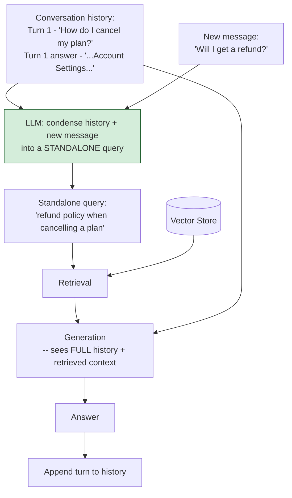

# Pattern 29: Conversational RAG

[← Back to index](README.md)

## 1. What is Conversational RAG?

Conversational RAG adapts the retrieval pipeline to **multi-turn conversations**, where
a later message often only makes sense in light of earlier ones. Before retrieval runs,
the current message plus the conversation history are passed through a **query
condensation** step: an LLM rewrites the current turn into a fully standalone query that
resolves pronouns, references, and implicit context ("that", "the same", "what about
X instead") from prior turns — *then* that standalone query is used for retrieval,
exactly as in any earlier pattern.

This is the gap explicitly named at the end of Pattern 7 (Query Rewriting): rewriting a
single message in isolation can't fix a reference to something only mentioned in an
earlier turn — that requires folding in conversation history first.

## 2. What problem does it solve?

Standalone-message retrieval (every pattern so far in this series) breaks down the
moment a conversation has more than one turn:

- **Turn 1:** *"How do I cancel my plan?"* — retrieves the cancellation policy
  correctly.
- **Turn 2:** *"Will I get a refund?"* — taken in isolation, this is a vague,
  underspecified query; a bare vector search for "will I get a refund" has no idea
  *which* refund scenario is being asked about (a general refund policy? a
  cancellation-specific one? a duplicate-charge one?). Only the conversation history
  makes it unambiguous: the user means a refund *in the context of cancelling*.

Without conversational awareness, turn 2's retrieval either matches the wrong refund
scenario or a too-generic one, producing an answer that ignores the actual context the
user is asking within.

## 3. Realistic production scenario

**Company:** the SaaS support bot, now deployed as an actual multi-turn chat interface
(not single-shot Q&A as in every earlier pattern's demo) — users routinely ask
follow-up questions that only make sense given what was just discussed.

**Problem:** turn-by-turn retrieval treats every message as if it were the first thing
the user ever said, causing follow-up questions like "will I get a refund" or "is that
the same for the other endpoint" to retrieve generically or incorrectly.

**Goal:** before every retrieval call, condense the current message plus recent
conversation history into a standalone, self-contained query — then retrieve and
generate using that condensed query, while the generation step itself still sees the
full conversation history for natural, contextually appropriate phrasing.

## 4. Architecture / flow diagram



## 5. Request-to-response walkthrough

1. **Turn 1:** *"How do I cancel my plan?"* — no history yet, so condensation is a
   no-op; retrieval and generation proceed as in any single-shot pattern. The turn
   (question + answer) is appended to the conversation history.
2. **Turn 2:** *"Will I get a refund?"*
3. **Condensation step:** the LLM is given the conversation history (turn 1's question
   and answer) plus the new message, and asked to produce a standalone query that
   would make sense with no prior context — e.g. *"refund policy when cancelling a
   plan"*.
4. **Retrieval** runs against this standalone query, correctly finding the
   cancellation-specific refund policy rather than a generic or unrelated one.
5. **Generation** uses the *retrieved* context plus the *full conversation history*
   (not just the condensed query) — this matters because the answer should read
   naturally as a follow-up ("Yes — as mentioned, cancelling within 7 days gets a full
   refund...") rather than as a disconnected, freshly-generated response.
6. **Answer returned**, and the new turn is appended to the history for the next
   message to build on.
7. **A third turn — *"what if it's been 10 days"*** — condensation now folds in *both*
   prior turns (cancellation context AND the refund question just asked), producing a
   standalone query like *"refund policy for cancelling after 7 days"*.

## 6. Why this pattern is appropriate here

- **This is the only pattern that correctly handles conversational reference
  resolution** — every other pattern in this series treats each message as
  independent, which is simply wrong for a chat interface with real multi-turn use.
- **Condensation and generation deliberately see different inputs**: condensation only
  needs *just enough* history to resolve references (recent turns are usually
  sufficient); generation benefits from the *full* relevant history for natural,
  contextually consistent phrasing — conflating the two would either bloat the
  retrieval query with irrelevant history or starve generation of conversational
  context.
- **Composes with every retrieval pattern in this series** — once the standalone query
  is produced, it can be fed into Hybrid Search, Multi-Hop RAG, or any other retrieval
  strategy exactly as if it had been the user's first message; conversational awareness
  is a pre-stage, not a replacement for retrieval logic.
- **When this is *not* enough:** if the conversation grows very long, sending the
  entire history to both the condensation and generation steps becomes expensive and
  can exceed context limits — production systems typically window the history (keep
  only the last N turns, or summarize older turns), a practical extension of this same
  pattern rather than a different one.

## 7. Production-quality implementation (Java / Spring AI)

```java
package com.acme.rag.conversational;

import org.springframework.ai.chat.client.ChatClient;
import org.springframework.ai.document.Document;
import org.springframework.ai.ollama.OllamaChatModel;
import org.springframework.ai.ollama.OllamaEmbeddingModel;
import org.springframework.ai.ollama.api.OllamaApi;
import org.springframework.ai.ollama.api.OllamaOptions;
import org.springframework.ai.transformer.splitter.TokenTextSplitter;
import org.springframework.ai.vectorstore.SearchRequest;
import org.springframework.ai.vectorstore.SimpleVectorStore;

import java.io.IOException;
import java.io.UncheckedIOException;
import java.nio.file.Files;
import java.nio.file.Path;
import java.util.ArrayList;
import java.util.List;
import java.util.Map;
import java.util.stream.Collectors;

/**
 * Conversational RAG -- condense the current message plus conversation
 * history into a standalone query before retrieval, while generation still
 * sees the full history for natural, contextually consistent answers.
 */
public final class ConversationalRagApp {

    record RagConfig(
            String embeddingModel, String llmModel, double llmTemperature,
            int topK, int maxHistoryTurns, Path persistPath) {

        static RagConfig defaults() {
            return new RagConfig("nomic-embed-text", "llama3.1", 0.0, 4, 6,
                    Path.of("./vectorstore_support_docs_conversational.json"));
        }
    }

    record Turn(String userMessage, String assistantAnswer) {}

    static final class ConversationHistory {
        private final int maxTurns;
        private final List<Turn> turns = new ArrayList<>();

        ConversationHistory(int maxTurns) { this.maxTurns = maxTurns; }

        void append(Turn turn) {
            turns.add(turn);
            // Window the history so condensation/generation prompts stay bounded
            // as a conversation grows long, rather than sending unbounded history.
            while (turns.size() > maxTurns) turns.remove(0);
        }

        String asText() {
            if (turns.isEmpty()) return "(no prior conversation)";
            return turns.stream()
                    .map(t -> "User: " + t.userMessage() + "\nAssistant: " + t.assistantAnswer())
                    .collect(Collectors.joining("\n\n"));
        }

        boolean isEmpty() { return turns.isEmpty(); }
    }

    static final class QueryCondenser {
        private static final String SYSTEM = """
                Given the conversation history and a new message, rewrite the new
                message into a fully standalone question that makes sense with NO prior
                context -- resolve any pronouns or implicit references ("that", "the
                same", "it") using the history. If the new message is already
                standalone, return it unchanged. Respond with ONLY the standalone
                question.
                """;
        private final ChatClient chatClient;

        QueryCondenser(ChatClient chatClient) { this.chatClient = chatClient; }

        String condense(ConversationHistory history, String newMessage) {
            if (history.isEmpty()) return newMessage; // no-op on the first turn
            try {
                String standalone = chatClient.prompt().system(SYSTEM)
                        .user("Conversation history:\n" + history.asText()
                                + "\n\nNew message: " + newMessage)
                        .call().content().trim();
                return standalone.isEmpty() ? newMessage : standalone;
            } catch (Exception ex) {
                System.err.println("Condensation failed, using raw message: " + ex);
                return newMessage;
            }
        }
    }

    static final class ConversationalRagSupportBot {
        private static final String GEN_SYSTEM = """
                You are a customer support assistant for Acme SaaS, continuing an
                ongoing conversation. Answer the user's latest message naturally, as a
                follow-up to the conversation so far, using ONLY the retrieved context
                below for facts. If the context does not contain the answer, say so.

                Conversation so far:
                {history}

                Retrieved context:
                {context}
                """;

        private final RagConfig config;
        private final SimpleVectorStore vectorStore;
        private final ChatClient chatClient;
        private final QueryCondenser condenser;
        private final ConversationHistory history;

        ConversationalRagSupportBot(RagConfig config, OllamaEmbeddingModel embeddingModel,
                                     ChatClient chatClient, Path sourceDir) {
            this.config = config;
            this.chatClient = chatClient;
            this.condenser = new QueryCondenser(chatClient);
            this.history = new ConversationHistory(config.maxHistoryTurns());
            this.vectorStore = buildOrLoad(embeddingModel, sourceDir);
        }

        private SimpleVectorStore buildOrLoad(OllamaEmbeddingModel embeddingModel, Path sourceDir) {
            SimpleVectorStore store = SimpleVectorStore.builder(embeddingModel).build();
            if (Files.exists(config.persistPath())) {
                store.load(config.persistPath().toFile());
                return store;
            }
            List<Document> docs;
            try (var files = Files.list(sourceDir)) {
                docs = files.filter(p -> p.toString().endsWith(".md")).sorted()
                        .map(p -> {
                            try {
                                return new Document(Files.readString(p),
                                        Map.of("source", p.getFileName().toString()));
                            } catch (IOException e) { throw new UncheckedIOException(e); }
                        }).collect(Collectors.toList());
            } catch (IOException e) { throw new UncheckedIOException(e); }
            TokenTextSplitter splitter = new TokenTextSplitter(500, 60, 5, 10000, true);
            List<Document> chunks = splitter.apply(docs);
            store.add(chunks);
            store.save(config.persistPath().toFile());
            return store;
        }

        record AskResult(String answer, String standaloneQuery, List<String> sources) {}

        AskResult ask(String message) {
            if (message == null || message.isBlank()) {
                throw new IllegalArgumentException("Message must not be empty.");
            }

            String standaloneQuery = condenser.condense(history, message);
            System.out.println("Condensed: \"" + message + "\" -> \"" + standaloneQuery + "\"");

            List<Document> retrieved = vectorStore.similaritySearch(
                    SearchRequest.builder().query(standaloneQuery).topK(config.topK()).build());

            String context = retrieved.stream()
                    .map(d -> "[" + d.getMetadata().getOrDefault("source", "unknown") + "]\n" + d.getText())
                    .collect(Collectors.joining("\n\n---\n\n"));

            String answer;
            try {
                String systemMessage = GEN_SYSTEM
                        .replace("{history}", history.asText())
                        .replace("{context}", context);
                answer = chatClient.prompt().system(systemMessage).user(message).call().content();
            } catch (Exception ex) {
                System.err.println("Generation failed: " + ex);
                answer = "Sorry, something went wrong answering that question.";
            }

            history.append(new Turn(message, answer));

            List<String> sources = retrieved.stream()
                    .map(d -> String.valueOf(d.getMetadata().getOrDefault("source", "unknown")))
                    .collect(Collectors.toList());

            return new AskResult(answer, standaloneQuery, sources);
        }
    }

    private static void writeSampleDocs(Path dir) throws IOException {
        Files.createDirectories(dir);
        Files.writeString(dir.resolve("cancellation.md"), """
                ## Plan Cancellation
                Cancel your plan any time from Account Settings > Billing.
                """);
        Files.writeString(dir.resolve("refund_policy.md"), """
                ## Refund Policy When Cancelling
                If you cancel within 7 days of purchase, you receive a full refund.
                After 7 days, no partial refund is issued for the remainder of the
                current billing cycle, but access continues until the cycle ends.
                """);
    }

    public static void main(String[] args) throws IOException {
        RagConfig config = RagConfig.defaults();
        Path sampleDir = Path.of("./sample_support_docs_conversational");
        writeSampleDocs(sampleDir);

        OllamaApi ollamaApi = OllamaApi.builder().baseUrl("http://localhost:11434").build();
        OllamaEmbeddingModel embeddingModel = OllamaEmbeddingModel.builder()
                .ollamaApi(ollamaApi)
                .defaultOptions(OllamaOptions.builder().model(config.embeddingModel()).build())
                .build();
        OllamaChatModel chatModel = OllamaChatModel.builder()
                .ollamaApi(ollamaApi)
                .defaultOptions(OllamaOptions.builder().model(config.llmModel())
                        .temperature(config.llmTemperature()).build())
                .build();
        ChatClient chatClient = ChatClient.create(chatModel);

        ConversationalRagSupportBot bot =
                new ConversationalRagSupportBot(config, embeddingModel, chatClient, sampleDir);

        List<String> conversation = List.of(
                "How do I cancel my plan?",
                "Will I get a refund?",
                "What if it's been 10 days?");

        for (String message : conversation) {
            ConversationalRagSupportBot.AskResult result = bot.ask(message);
            System.out.println("\nUser: " + message);
            System.out.println("  standalone query used: " + result.standaloneQuery());
            System.out.println("  sources: " + result.sources());
            System.out.println("Assistant: " + result.answer());
        }
    }
}
```

### Key production details worth noting

- **Condensation is a no-op on the first turn** (`history.isEmpty()` check) — there's
  nothing to resolve yet, so the raw message is used directly, avoiding an unnecessary
  LLM call on every conversation's opening message.
- **`ConversationHistory` windows itself** (`maxHistoryTurns`), automatically dropping
  the oldest turn once the limit is exceeded — this is the practical extension called
  out in section 6 for long conversations, implemented as a simple bound here rather
  than left as an unaddressed concern.
- **Condensation and generation read history independently and for different
  purposes** — condensation uses it only to resolve references into a clean retrieval
  query; generation uses the same history to phrase a natural, conversationally
  consistent answer — both are necessary, and conflating them (e.g. skipping
  condensation and just stuffing history into the retrieval query directly) tends to
  produce noisy, unfocused retrieval.
- **Every turn is appended to history only after generation succeeds** — a failed
  generation still appends the turn with its (apologetic) answer, so the assistant's
  own prior response is always part of what future condensation and generation steps
  see, keeping the conversation state consistent even after a partial failure.

---
[← Back to index](README.md)
