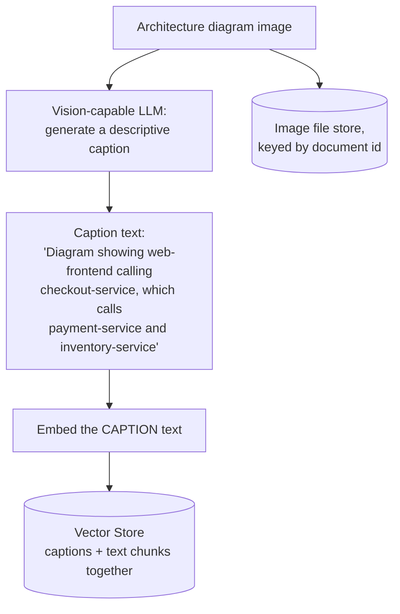
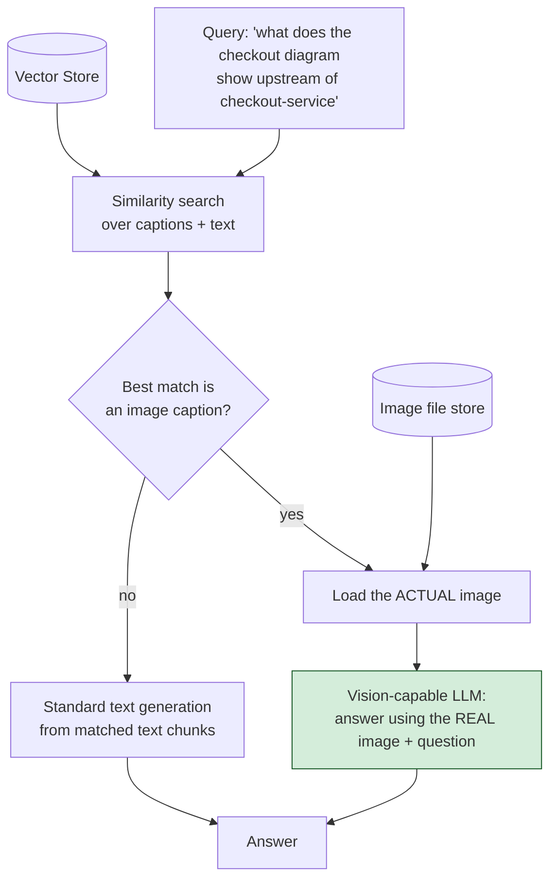

# Pattern 30: Multimodal RAG

[← Back to index](README.md)

## 1. What is Multimodal RAG?

Multimodal RAG extends retrieval and generation beyond text to include **images**
(diagrams, screenshots, charts) as first-class retrievable and answerable content. Two
distinct capabilities are needed:

1. **Indexing images for retrieval** — since embedding models here work on text, each
   image is given a text *caption/description* (generated once, at indexing time, by a
   vision-capable model), and that caption is what gets embedded and matched against
   queries — the same "textify, then embed" idea used in Contextual Retrieval (Pattern
   22), applied to a genuinely different modality.
2. **Answering from the actual image** — once an image is identified as relevant, the
   *actual image* (not just its caption) is passed to a vision-capable LLM alongside
   the question, so the final answer can reference visual details the caption might
   have summarized away or missed entirely.

## 2. What problem does it solve?

Engineering, product, and research knowledge bases routinely contain critical
information that lives in **diagrams, screenshots, and charts**, not prose — an
architecture diagram showing which services call which, a screenshot of an error
dialog, a chart showing a metric trend. A text-only RAG pipeline (every earlier pattern
in this series) simply cannot see this content at all; it's invisible to embedding,
retrieval, and generation alike, no matter how good the surrounding text chunking or
ranking is.

Multimodal RAG solves this in two stages: making images *findable* (via generated
captions that behave like any other retrievable text for search purposes), and making
images *usable* for answering (by handing the real image to a vision-capable model at
generation time, rather than trying to answer from the caption alone — a caption is a
lossy summary, and specific visual details the user asks about may not be captured in
it).

## 3. Realistic production scenario

**Company:** the internal engineering knowledge base, now including **architecture
diagrams** alongside its text runbooks — a service-dependency diagram, a request-flow
diagram for checkout, etc. — stored as image files alongside the markdown docs used in
every earlier pattern.

**Problem:** a question like *"what does the checkout service architecture diagram
show upstream of checkout-service"* has no text-only answer at all — the information
exists only in the diagram's visual layout, which no earlier pattern in this series can
retrieve or read.

**Goal:** at indexing time, generate a text caption for each diagram using a
vision-capable model, and embed that caption for retrieval alongside the existing text
corpus. At query time, if an image's caption is the best match, load the actual image
and pass it directly to a vision-capable model together with the question, so the
answer reflects the real diagram content, not just its caption.

## 4. Architecture / flow diagram

**Indexing time:**



**Query time:**



## 5. Request-to-response walkthrough

1. **Indexing:** the checkout architecture diagram image is passed to a vision-capable
   Ollama model (e.g. `llava`), prompted to generate a detailed textual description of
   what the diagram shows. This caption is embedded and stored in the same vector
   store as ordinary text chunks, tagged with metadata marking it as an image
   reference and pointing to the actual image file.
2. **User asks:** *"what does the checkout service architecture diagram show upstream
   of checkout-service"*.
3. **Retrieval:** the query is embedded and compared against everything in the vector
   store — captions and text chunks alike — and the diagram's caption scores highest,
   since it was generated specifically to describe this content.
4. **Modality branch:** because the best match is tagged as an image reference (not a
   plain text chunk), the pipeline loads the *actual image file*, not just its caption.
5. **Vision QA call:** the real image is sent to the vision-capable model together
   with the original question, as a multimodal message — the model can now answer
   based on what it actually sees in the diagram (exact service names, arrow
   directions, layout), not just what the caption happened to summarize.
6. **Answer returned**, grounded in the real image content — if the caption's
   description was incomplete or slightly imprecise, the vision QA step still produces
   an accurate answer, because it's looking at the source image itself.

## 6. Why this pattern is appropriate here

- **This is the only pattern that makes visual-only information findable and
  answerable at all** — no amount of better text chunking, re-ranking, or query
  transformation helps when the actual answer lives in a diagram's pixels, not in any
  text anywhere in the corpus.
- **Captioning at indexing time reuses the "textify for embedding" principle from
  Contextual Retrieval (Pattern 22)** — the caption's job is purely to make the image
  findable via a text-embedding-based vector store; it's not meant to be a complete or
  final answer.
- **Passing the real image (not the caption) to the final answering step is the
  critical correctness detail** — a caption is a lossy, one-time summary; the specific
  question asked at query time may need visual details the caption-generation prompt
  didn't happen to emphasize, so re-examining the actual image at answer time avoids
  compounding that information loss.
- **When this is *not* enough:** for corpora with many images where visual similarity
  itself matters (finding visually similar diagrams, not just topically similar
  captions), true multimodal embeddings (models that embed images and text into a
  shared vector space directly, rather than captioning-then-text-embedding) are a more
  advanced extension of this same idea — this pattern's caption-based approach is the
  practical, broadly-compatible starting point.

## 7. Production-quality implementation (Java / Spring AI)

```java
package com.acme.rag.multimodal;

import org.springframework.ai.chat.client.ChatClient;
import org.springframework.ai.chat.messages.UserMessage;
import org.springframework.ai.content.Media;
import org.springframework.ai.document.Document;
import org.springframework.ai.ollama.OllamaChatModel;
import org.springframework.ai.ollama.OllamaEmbeddingModel;
import org.springframework.ai.ollama.api.OllamaApi;
import org.springframework.ai.ollama.api.OllamaOptions;
import org.springframework.ai.transformer.splitter.TokenTextSplitter;
import org.springframework.ai.vectorstore.SearchRequest;
import org.springframework.ai.vectorstore.SimpleVectorStore;
import org.springframework.core.io.FileSystemResource;
import org.springframework.util.MimeTypeUtils;

import java.io.IOException;
import java.io.UncheckedIOException;
import java.nio.file.Files;
import java.nio.file.Path;
import java.util.List;
import java.util.Map;
import java.util.stream.Collectors;

/**
 * Multimodal RAG -- caption images at indexing time for text-based retrieval,
 * then pass the ACTUAL image (not just the caption) to a vision-capable
 * model at answer time when an image is the best match.
 */
public final class MultimodalRagApp {

    record RagConfig(
            String embeddingModel, String visionModel, double llmTemperature,
            int topK, Path persistPath) {

        static RagConfig defaults() {
            // A vision-capable Ollama model is required, e.g.:
            //   ollama pull llava
            return new RagConfig("nomic-embed-text", "llava", 0.0, 3,
                    Path.of("./vectorstore_eng_kb_multimodal.json"));
        }
    }

    /** Generates a descriptive text caption for an image, for embedding-based retrieval. */
    static final class ImageCaptioner {
        private static final String PROMPT = """
                Describe this architecture diagram in detail: name every service or
                component shown, and describe the direction of every arrow/connection
                between them. Be specific and exhaustive -- this description is the only
                way this diagram will be found by search.
                """;
        private final ChatClient visionChatClient;

        ImageCaptioner(ChatClient visionChatClient) { this.visionChatClient = visionChatClient; }

        String caption(Path imagePath) {
            try {
                Media image = Media.builder()
                        .mimeType(MimeTypeUtils.IMAGE_PNG)
                        .data(new FileSystemResource(imagePath.toFile()))
                        .build();
                UserMessage message = UserMessage.builder().text(PROMPT).media(image).build();
                return visionChatClient.prompt().messages(message).call().content().trim();
            } catch (Exception ex) {
                System.err.println("Captioning failed for " + imagePath + ": " + ex);
                return imagePath.getFileName().toString(); // minimal fallback caption
            }
        }
    }

    static final class MultimodalIndex {
        private final RagConfig config;
        private final SimpleVectorStore vectorStore;

        MultimodalIndex(RagConfig config, OllamaEmbeddingModel embeddingModel,
                         ImageCaptioner captioner, Path textDir, Path imageDir) {
            this.config = config;
            this.vectorStore = SimpleVectorStore.builder(embeddingModel).build();

            if (Files.exists(config.persistPath())) {
                vectorStore.load(config.persistPath().toFile());
                return;
            }
            buildFromScratch(captioner, textDir, imageDir);
        }

        private void buildFromScratch(ImageCaptioner captioner, Path textDir, Path imageDir) {
            // Text chunks, indexed exactly as in every earlier pattern.
            TokenTextSplitter splitter = new TokenTextSplitter(500, 60, 5, 10000, true);
            try (var files = Files.list(textDir)) {
                for (Path file : files.filter(p -> p.toString().endsWith(".md")).sorted().toList()) {
                    Document wholeDoc = new Document(Files.readString(file),
                            Map.of("source", file.getFileName().toString(), "type", "text"));
                    vectorStore.add(splitter.apply(List.of(wholeDoc)));
                }
            } catch (IOException e) { throw new UncheckedIOException(e); }

            // Images, indexed by their generated caption text, tagged so query
            // time knows to load the real image instead of just using the caption.
            try (var files = Files.list(imageDir)) {
                for (Path file : files.filter(p -> p.toString().endsWith(".png")).sorted().toList()) {
                    String caption = captioner.caption(file);
                    vectorStore.add(List.of(new Document(caption,
                            Map.of("source", file.getFileName().toString(), "type", "image",
                                   "imagePath", file.toAbsolutePath().toString()))));
                }
            } catch (IOException e) { throw new UncheckedIOException(e); }

            vectorStore.save(config.persistPath().toFile());
        }

        List<Document> search(String query) {
            return vectorStore.similaritySearch(
                    SearchRequest.builder().query(query).topK(config.topK()).build());
        }
    }

    static final class MultimodalEngKbBot {
        private static final String TEXT_GEN_SYSTEM = """
                You are an internal engineering assistant. Answer using ONLY the context
                below. If the context does not contain the answer, say so.

                Context:
                {context}
                """;

        private final MultimodalIndex index;
        private final ChatClient visionChatClient; // same underlying vision model, used for final QA too

        MultimodalEngKbBot(MultimodalIndex index, ChatClient visionChatClient) {
            this.index = index;
            this.visionChatClient = visionChatClient;
        }

        record AskResult(String answer, boolean answeredFromImage, List<String> sources) {}

        AskResult ask(String question) {
            if (question == null || question.isBlank()) {
                throw new IllegalArgumentException("Question must not be empty.");
            }

            List<Document> retrieved = index.search(question);
            if (retrieved.isEmpty()) {
                return new AskResult("I don't have relevant information to answer that.",
                        false, List.of());
            }

            Document topMatch = retrieved.get(0);
            boolean topIsImage = "image".equals(topMatch.getMetadata().get("type"));

            if (topIsImage) {
                return answerFromImage(question, topMatch);
            }
            return answerFromText(question, retrieved);
        }

        private AskResult answerFromImage(String question, Document imageDoc) {
            String imagePath = String.valueOf(imageDoc.getMetadata().get("imagePath"));
            String answer;
            try {
                // Critical: pass the ACTUAL image, not the caption, so the model can
                // answer based on real visual content rather than a lossy summary.
                Media image = Media.builder()
                        .mimeType(MimeTypeUtils.IMAGE_PNG)
                        .data(new FileSystemResource(imagePath))
                        .build();
                UserMessage message = UserMessage.builder().text(question).media(image).build();
                answer = visionChatClient.prompt().messages(message).call().content();
            } catch (Exception ex) {
                System.err.println("Vision QA failed: " + ex);
                answer = "Sorry, something went wrong reading that diagram.";
            }
            return new AskResult(answer, true,
                    List.of(String.valueOf(imageDoc.getMetadata().get("source"))));
        }

        private AskResult answerFromText(String question, List<Document> retrieved) {
            String context = retrieved.stream()
                    .map(d -> "[" + d.getMetadata().getOrDefault("source", "unknown") + "]\n" + d.getText())
                    .collect(Collectors.joining("\n\n---\n\n"));
            String answer;
            try {
                String systemMessage = TEXT_GEN_SYSTEM.replace("{context}", context);
                answer = visionChatClient.prompt().system(systemMessage).user(question).call().content();
            } catch (Exception ex) {
                System.err.println("Generation failed: " + ex);
                answer = "Sorry, something went wrong answering that question.";
            }
            List<String> sources = retrieved.stream()
                    .map(d -> String.valueOf(d.getMetadata().getOrDefault("source", "unknown")))
                    .collect(Collectors.toList());
            return new AskResult(answer, false, sources);
        }
    }

    private static void writeSampleDocs(Path textDir) throws IOException {
        Files.createDirectories(textDir);
        Files.writeString(textDir.resolve("checkout_service.md"), """
                # checkout-service
                checkout-service handles order checkout logic. Full request-flow details
                are shown in the architecture diagram (see diagrams folder).
                """);
    }

    public static void main(String[] args) throws IOException {
        RagConfig config = RagConfig.defaults();
        Path textDir = Path.of("./sample_eng_kb_multimodal/text");
        Path imageDir = Path.of("./sample_eng_kb_multimodal/diagrams");
        Files.createDirectories(imageDir);
        writeSampleDocs(textDir);
        // NOTE: this example assumes a real PNG diagram already exists at
        // imageDir/checkout_architecture.png -- image generation/creation is out
        // of scope for this pattern; only retrieval and vision QA are demonstrated.

        OllamaApi ollamaApi = OllamaApi.builder().baseUrl("http://localhost:11434").build();
        OllamaEmbeddingModel embeddingModel = OllamaEmbeddingModel.builder()
                .ollamaApi(ollamaApi)
                .defaultOptions(OllamaOptions.builder().model(config.embeddingModel()).build())
                .build();
        OllamaChatModel visionModel = OllamaChatModel.builder()
                .ollamaApi(ollamaApi)
                .defaultOptions(OllamaOptions.builder().model(config.visionModel())
                        .temperature(config.llmTemperature()).build())
                .build();
        ChatClient visionChatClient = ChatClient.create(visionModel);

        MultimodalIndex index = new MultimodalIndex(
                config, embeddingModel, new ImageCaptioner(visionChatClient), textDir, imageDir);
        MultimodalEngKbBot bot = new MultimodalEngKbBot(index, visionChatClient);

        MultimodalEngKbBot.AskResult result = bot.ask(
                "what does the checkout service architecture diagram show upstream of checkout-service");
        System.out.println("\nQ: what does the checkout service architecture diagram show "
                + "upstream of checkout-service");
        System.out.println("  answered from image: " + result.answeredFromImage()
                + " | sources: " + result.sources());
        System.out.println("A: " + result.answer());
    }
}
```

### Key production details worth noting

- **The vision-capable model is used for three distinct jobs**: generating captions at
  index time, answering text-only questions (as a normal LLM), and answering
  image-grounded questions with the actual image attached — a single vision-capable
  Ollama model (e.g. `llava`) can serve all three roles, since vision-capable models
  are still fully capable text models.
- **`Media.builder()` + `UserMessage.builder().media(...)`** is Spring AI's mechanism
  for attaching an image to a chat message — the same pattern works whether the image
  comes from a local file (`FileSystemResource`, as here) or any other Spring
  `Resource` implementation.
- **The `imagePath` metadata field is what makes the two-stage design work**: the
  vector store only ever holds the *caption text* for embedding purposes, but each
  image document's metadata retains the path needed to load the *real* file when that
  document is the winning match — this is the mechanism that keeps embedding
  (text-based) and final answering (vision-based) correctly decoupled.
- **Real diagram creation/generation is explicitly out of scope for this pattern** —
  it assumes diagrams already exist as image files in the corpus (created by humans,
  exported from a diagramming tool, etc.); this pattern is about making *existing*
  images findable and answerable, not about generating new ones.

---
[← Back to index](README.md)
