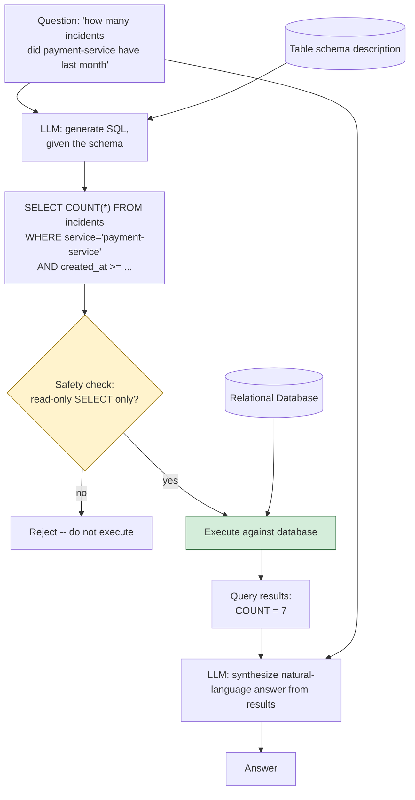

# Pattern 31: SQL RAG

[← Back to index](README.md)

## 1. What is SQL RAG?

SQL RAG replaces vector retrieval entirely with **natural-language-to-SQL
translation**: given a question and the target database's schema, an LLM generates a
SQL query, that query is executed against a real relational database, and the LLM then
synthesizes a natural-language answer from the actual query results. This is a
fundamentally different retrieval mechanism from every other pattern in this series —
there's no embedding, no chunking, no vector store at all; "retrieval" here means
*querying structured data directly*.

## 2. What problem does it solve?

Structured, tabular data — metrics, counts, aggregations, time-series records — is a
poor fit for vector search entirely, independent of how well any earlier pattern's
chunking or ranking is tuned:

- *"How many incidents did payment-service have last month?"* — this is a `COUNT(*)`
  aggregation over rows matching a filter. No document chunk "contains" this answer;
  it has to be *computed* from the underlying rows, not retrieved as pre-existing text.
- A vector store embeds and searches *text*; a relational database *computes* answers
  from structured records. Trying to force aggregation/filtering questions through
  text retrieval means either pre-computing every possible aggregate as a document
  (impossible to anticipate in advance) or getting no useful answer at all.

SQL RAG solves this by using the LLM for what it's actually good at here — translating
a natural-language question's *intent* into a correct SQL query — while delegating the
actual computation to the database engine, which is what relational databases are
built to do reliably and efficiently.

## 3. Realistic production scenario

**Company:** the engineering team's incident-tracking database — a table of past
incidents with columns for service name, severity, creation time, and resolution time —
queried through a natural-language chat interface instead of requiring engineers to
write SQL themselves.

**Problem:** engineers want to ask ad-hoc questions like *"how many incidents did
payment-service have last month"* or *"what's the average resolution time for
severity-1 incidents"* without knowing SQL or the exact schema — and no fixed set of
pre-written queries can anticipate every question shape in advance.

**Goal:** given the schema, translate each natural-language question into SQL,
execute it safely (read-only, with basic validation against destructive statements),
and synthesize a natural-language answer from the actual query results.

## 4. Architecture / flow diagram



## 5. Request-to-response walkthrough

1. **User asks:** *"how many incidents did payment-service have last month"*.
2. **SQL generation:** the LLM is given the table schema (column names and types) and
   the question, and generates a SQL query — e.g. `SELECT COUNT(*) FROM incidents
   WHERE service = 'payment-service' AND created_at >= '2026-07-01' AND created_at <
   '2026-08-01'`.
3. **Safety validation (non-negotiable):** before execution, the generated SQL is
   checked to confirm it's a read-only `SELECT` statement with no destructive keywords
   (`DROP`, `DELETE`, `UPDATE`, `INSERT`, `ALTER`) anywhere in it — an LLM-generated
   query must never be trusted to execute unchecked against a real database.
4. **Execution:** the validated query runs against the actual database via JDBC,
   returning real rows — here, a single count value.
5. **Error handling:** if the SQL fails to execute (a syntax error, a column name the
   model got wrong), the error message is fed back to the LLM for one bounded retry
   attempt at generating corrected SQL, rather than failing outright on the first
   mistake.
6. **Answer synthesis:** the LLM is given the original question plus the actual query
   results, and asked to phrase a natural-language answer — e.g. *"payment-service had
   7 incidents last month."*
7. **Answer returned**, computed from real data, not retrieved from any pre-written
   text.

## 6. Why this pattern is appropriate here

- **This is the only pattern that can correctly answer aggregation/computation
  questions** — no chunking, ranking, or retrieval strategy from earlier patterns can
  substitute for actually running `COUNT`, `AVG`, `SUM`, or a `WHERE` filter against
  live structured data.
- **SQL validation before execution is not optional** — this is the single most
  important production safeguard in this pattern: an LLM occasionally generates SQL
  that doesn't match user intent, and a destructive or overly broad query executed
  against a real production database is a severe, irreversible risk. Read-only
  enforcement, ideally combined with executing against a read-replica or a
  restricted-permission database user (defense in depth beyond the application-level
  check shown here), is the baseline requirement.
- **The bounded retry-on-error loop mirrors the safety-bound principle used throughout
  this series** (Multi-Hop RAG's `maxHops`, Corrective RAG's `maxCorrectiveRetries`) —
  SQL generation errors are common enough (wrong column name, syntax slip) that one
  retry meaningfully improves reliability without risking an unbounded loop.
- **When this is *not* enough:** if the question needs both structured data *and*
  unstructured context together (e.g. "how many incidents did payment-service have,
  and what did the postmortems say about the root causes"), SQL RAG alone only answers
  the first half — that's a case for combining this pattern with vector retrieval
  (Patterns 15-19) in the same response, similar in spirit to how Agentic RAG
  (Pattern 25) combines multiple retrieval mechanisms as tools.

## 7. Production-quality implementation (Java / Spring AI)

```java
package com.acme.rag.sqlrag;

import org.springframework.ai.chat.client.ChatClient;
import org.springframework.ai.ollama.OllamaChatModel;
import org.springframework.ai.ollama.api.OllamaApi;
import org.springframework.ai.ollama.api.OllamaOptions;

import java.sql.*;
import java.util.List;
import java.util.Locale;
import java.util.regex.Pattern;

/**
 * SQL RAG -- translate natural language to SQL against a real schema,
 * validate for read-only safety, execute, and synthesize an answer from the
 * actual query results. Uses an in-memory H2 database so the example is
 * runnable standalone; swap the JDBC URL for a real database in production.
 *
 * Install (pom.xml): com.h2database:h2
 */
public final class SqlRagApp {

    record RagConfig(String llmModel, double llmTemperature, int maxSqlRetries) {
        static RagConfig defaults() { return new RagConfig("llama3.1", 0.0, 2); }
    }

    private static final String SCHEMA_DESCRIPTION = """
            Table: incidents
              id INT
              service VARCHAR       -- e.g. 'payment-service', 'checkout-service'
              severity INT          -- 1 (highest) to 4 (lowest)
              created_at DATE
              resolved_at DATE      -- NULL if still open
            """;

    /** Enforces read-only, non-destructive SQL before anything is ever executed. */
    static final class SqlSafetyValidator {
        private static final Pattern FORBIDDEN = Pattern.compile(
                "\\b(DROP|DELETE|UPDATE|INSERT|ALTER|TRUNCATE|CREATE|GRANT|REVOKE)\\b",
                Pattern.CASE_INSENSITIVE);

        boolean isSafe(String sql) {
            String trimmed = sql.trim().toUpperCase(Locale.ROOT);
            if (!trimmed.startsWith("SELECT")) return false;
            return !FORBIDDEN.matcher(sql).find();
        }
    }

    static final class SqlGenerator {
        private static final String SYSTEM = """
                Given this database schema, translate the user's question into a single
                read-only SQL SELECT query. Respond with ONLY the SQL query, no
                explanation, no markdown formatting.

                Schema:
                {schema}
                """;
        private static final String RETRY_SYSTEM = """
                The previous SQL query failed with this error. Generate a corrected
                read-only SQL SELECT query. Respond with ONLY the corrected SQL.

                Schema:
                {schema}

                Previous query:
                {previousSql}

                Error:
                {error}
                """;
        private final ChatClient chatClient;

        SqlGenerator(ChatClient chatClient) { this.chatClient = chatClient; }

        String generate(String question) {
            String system = SYSTEM.replace("{schema}", SCHEMA_DESCRIPTION);
            return chatClient.prompt().system(system).user(question).call().content().trim();
        }

        String regenerateAfterError(String previousSql, String error) {
            String system = RETRY_SYSTEM
                    .replace("{schema}", SCHEMA_DESCRIPTION)
                    .replace("{previousSql}", previousSql)
                    .replace("{error}", error);
            return chatClient.prompt().system(system).user("Fix the query.").call().content().trim();
        }
    }

    static final class SqlRagAssistant {
        private final RagConfig config;
        private final ChatClient chatClient;
        private final SqlGenerator sqlGenerator;
        private final SqlSafetyValidator validator = new SqlSafetyValidator();
        private final String jdbcUrl;

        SqlRagAssistant(RagConfig config, ChatClient chatClient, String jdbcUrl) {
            this.config = config;
            this.chatClient = chatClient;
            this.sqlGenerator = new SqlGenerator(chatClient);
            this.jdbcUrl = jdbcUrl;
        }

        record AskResult(String answer, String sqlExecuted, boolean succeeded) {}

        AskResult ask(String question) {
            if (question == null || question.isBlank()) {
                throw new IllegalArgumentException("Question must not be empty.");
            }

            String sql = sqlGenerator.generate(question);
            String lastError = null;

            for (int attempt = 0; attempt <= config.maxSqlRetries(); attempt++) {
                if (!validator.isSafe(sql)) {
                    return new AskResult(
                            "I can't run that query -- it doesn't look like a safe, "
                            + "read-only request.", sql, false);
                }

                try {
                    List<String> rows = executeQuery(sql);
                    String answer = synthesizeAnswer(question, sql, rows);
                    return new AskResult(answer, sql, true);
                } catch (SQLException ex) {
                    System.err.println("SQL execution failed (attempt " + (attempt + 1) + "): " + ex.getMessage());
                    lastError = ex.getMessage();
                    if (attempt < config.maxSqlRetries()) {
                        sql = sqlGenerator.regenerateAfterError(sql, lastError);
                    }
                }
            }

            return new AskResult(
                    "I couldn't successfully query the database for that after "
                    + (config.maxSqlRetries() + 1) + " attempt(s). Last error: " + lastError,
                    sql, false);
        }

        private List<String> executeQuery(String sql) throws SQLException {
            List<String> rows = new java.util.ArrayList<>();
            try (Connection conn = DriverManager.getConnection(jdbcUrl);
                 Statement stmt = conn.createStatement();
                 ResultSet rs = stmt.executeQuery(sql)) {

                ResultSetMetaData meta = rs.getMetaData();
                int columnCount = meta.getColumnCount();

                while (rs.next()) {
                    StringBuilder row = new StringBuilder();
                    for (int i = 1; i <= columnCount; i++) {
                        if (i > 1) row.append(", ");
                        row.append(meta.getColumnName(i)).append("=").append(rs.getString(i));
                    }
                    rows.add(row.toString());
                }
            }
            return rows;
        }

        private String synthesizeAnswer(String question, String sql, List<String> rows) {
            String resultsText = rows.isEmpty() ? "(no rows returned)" : String.join("\n", rows);
            try {
                return chatClient.prompt()
                        .system("Answer the user's question in natural language, using ONLY "
                                + "the SQL query results below. Be concise.\n\nSQL: " + sql
                                + "\n\nResults:\n" + resultsText)
                        .user(question)
                        .call().content();
            } catch (Exception ex) {
                System.err.println("Answer synthesis failed: " + ex);
                return "Query succeeded, but I couldn't phrase a summary. Raw results: " + resultsText;
            }
        }
    }

    private static void setUpDatabaseAndSeedData(String jdbcUrl) throws SQLException {
        try (Connection conn = DriverManager.getConnection(jdbcUrl);
             Statement stmt = conn.createStatement()) {
            stmt.execute("""
                    CREATE TABLE incidents (
                        id INT PRIMARY KEY,
                        service VARCHAR(100),
                        severity INT,
                        created_at DATE,
                        resolved_at DATE
                    )
                    """);
            stmt.execute("""
                    INSERT INTO incidents VALUES
                        (1, 'payment-service', 2, '2026-07-03', '2026-07-03'),
                        (2, 'payment-service', 1, '2026-07-15', '2026-07-16'),
                        (3, 'checkout-service', 3, '2026-07-20', '2026-07-20'),
                        (4, 'payment-service', 2, '2026-08-02', NULL),
                        (5, 'payment-service', 4, '2026-07-28', '2026-07-29')
                    """);
        }
    }

    public static void main(String[] args) throws SQLException {
        RagConfig config = RagConfig.defaults();
        String jdbcUrl = "jdbc:h2:mem:incidentsdb;DB_CLOSE_DELAY=-1";
        setUpDatabaseAndSeedData(jdbcUrl);

        OllamaApi ollamaApi = OllamaApi.builder().baseUrl("http://localhost:11434").build();
        OllamaChatModel chatModel = OllamaChatModel.builder()
                .ollamaApi(ollamaApi)
                .defaultOptions(OllamaOptions.builder().model(config.llmModel())
                        .temperature(config.llmTemperature()).build())
                .build();
        ChatClient chatClient = ChatClient.create(chatModel);

        SqlRagAssistant assistant = new SqlRagAssistant(config, chatClient, jdbcUrl);

        SqlRagAssistant.AskResult result =
                assistant.ask("how many incidents did payment-service have in July 2026");
        System.out.println("\nQ: how many incidents did payment-service have in July 2026");
        System.out.println("  SQL executed: " + result.sqlExecuted());
        System.out.println("A: " + result.answer());
    }
}
```

### Key production details worth noting

- **`SqlSafetyValidator` is checked before every single execution, including retries**
  — a corrected query from the retry loop is validated exactly as strictly as the
  original; there's no path where an unvalidated query reaches the database.
- **Read-only enforcement here is an application-level safeguard, not a substitute for
  database-level permissions** — in production, the JDBC connection used for this
  feature should itself be restricted to a read-only database user or a read replica,
  so even a validator bug can't result in a destructive statement executing; defense
  in depth, not either/or.
- **The bounded retry loop feeds the actual SQL error back to the model**, not just a
  generic "try again" — this gives the LLM concrete information (a wrong column name,
  a syntax issue) to correct on the next attempt, materially improving retry success
  over a blind retry.
- **This example uses an in-memory H2 database** specifically so the pattern is
  runnable standalone with zero external setup — swapping to a real production
  database (Postgres, MySQL) only requires changing the `jdbcUrl` and driver
  dependency; the SQL generation, validation, and retry logic are entirely unchanged.

---
[← Back to index](README.md)
