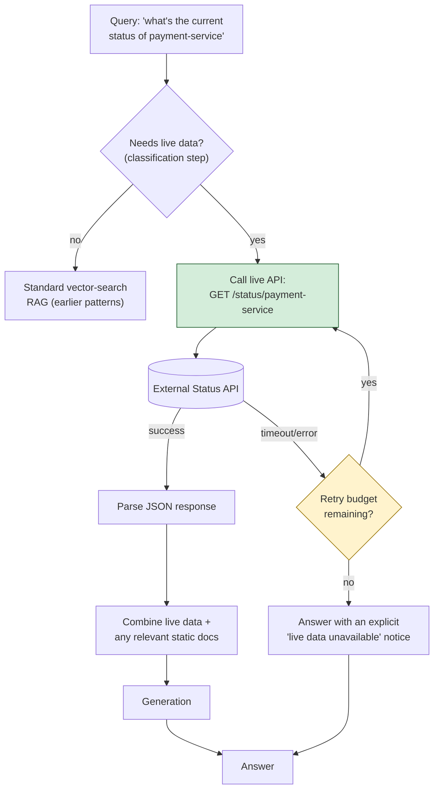

# Pattern 32: API/Data RAG

[← Back to index](README.md)

## 1. What is API/Data RAG?

API/Data RAG augments generation with **live data fetched from external REST APIs at
query time**, rather than from pre-indexed documents (vector search patterns) or a
queryable database (SQL RAG, Pattern 31). The defining property is *freshness*: some
questions need information that changes too often, or too unpredictably, to ever be
indexed in advance — current service status, live metrics, today's exchange rate — and
the only correct way to answer them is to call a live API at the moment the question is
asked.

This is architecturally distinct from Agentic RAG (Pattern 25): Agentic RAG gives the
LLM full autonomy to choose *any* tool in *any* order for *any* question shape. API/Data
RAG is typically a narrower, more predictable pipeline purpose-built around one or a
small number of specific live data sources, with the question of *whether* live data is
needed decided by an explicit classification step (the same shape as Self-RAG's
retrieval-necessity check, Pattern 26) rather than left entirely to open-ended agent
reasoning.

## 2. What problem does it solve?

Every retrieval mechanism built so far in this series — vector search, BM25, graph
traversal, SQL — operates on data that was **indexed or structured ahead of time**.
That's fundamentally the wrong model for information that's inherently *live*:

- *"What's the current status of payment-service?"* — this answer might be different
  in five minutes. No amount of document indexing, however fresh, can substitute for
  actually calling the live status endpoint at the moment the question is asked.
- Static documentation (a runbook, an architecture doc) can explain *what
  payment-service is* and *how to interpret its status codes*, but it structurally
  cannot tell you its status *right now* — that information doesn't exist as text
  anywhere until you ask the live system for it.

API/Data RAG solves this by treating "call this live API" as its own first-class
retrieval mechanism, on equal footing with vector search and SQL querying, specifically
for the class of questions where freshness is the whole point.

## 3. Realistic production scenario

**Company:** the internal engineering assistant, now needing to answer real-time
operational questions — *"what's the current status of payment-service"* — by calling
the company's actual internal service-status API, while still being able to pull in
static documentation (what a given status code means, standard remediation steps) when
useful context for interpreting the live data.

**Problem:** a purely document-based RAG pipeline has no access to current, live state
at all; a purely live-API pipeline has no access to the explanatory context around what
the raw API response actually means for the reader.

**Goal:** classify whether a question needs live data; if so, call the live status API
(with proper timeout and error handling, since external API calls can fail or hang in
ways a local vector search never does), and combine the live API response with any
relevant static documentation before generating a final answer.

## 4. Architecture / flow diagram



## 5. Request-to-response walkthrough

1. **User asks:** *"what's the current status of payment-service"*.
2. **Necessity classification:** an LLM call (or a cheap keyword heuristic — "current",
   "status", "right now" are strong signals) determines this question needs live data,
   not static documentation.
3. **Live API call:** the system calls the internal status API's
   `GET /status/payment-service` endpoint, with an explicit timeout — external API
   calls can hang or fail in ways a local vector search simply cannot, so this call
   must be bounded.
4. **Error handling:** if the call times out or returns an error, a bounded number of
   retries are attempted; if all retries are exhausted, the pipeline proceeds to
   generation with an honest "live data unavailable" notice rather than fabricating a
   plausible-sounding status.
5. **Response parsing:** a successful response (e.g. `{"service": "payment-service",
   "status": "degraded", "uptime_pct": 98.2}`) is parsed into a clean text summary.
6. **Combining with static context (optional):** if relevant, a quick vector search
   over static docs might add explanatory context — e.g. what "degraded" status means
   operationally, or standard next steps.
7. **Generation:** the LLM composes a natural-language answer from the live data (and
   any static context), clearly distinguishing "current live status" from "general
   background information" in how it's phrased.
8. **Answer returned**, timestamped or clearly framed as reflecting the moment the API
   was called — live data ages quickly, and the answer should reflect that.

## 6. Why this pattern is appropriate here

- **This is the only pattern that can correctly answer genuinely time-sensitive
  questions** — no indexing strategy, however sophisticated, can substitute for calling
  a live system at the moment of the question.
- **Explicit timeout and retry handling is a hard requirement, not an optimization** —
  external API calls introduce failure modes (network issues, downstream outages,
  slow responses) that don't exist for local vector search or an in-process database,
  and a hung or failed API call must never hang or silently corrupt the whole request.
- **Honest fallback on failure is critical** — if the live API can't be reached, saying
  so explicitly is far safer than answering from stale cached knowledge or, worse,
  fabricating a plausible-sounding status; this mirrors Self-RAG's (Pattern 26)
  principle of flagging uncertainty rather than hiding it.
- **When this is *not* enough:** if the system needs to autonomously decide *which* of
  several live APIs (plus vector search, plus SQL) fits a given question, with no
  predictable pattern to the choice, that's Agentic RAG's (Pattern 25) territory — this
  pattern's narrower, classification-then-call shape is the right fit specifically when
  the live data source(s) needed are well-known and the decision of *whether* to call
  them is simpler than fully open-ended tool orchestration.

## 7. Production-quality implementation (Java / Spring AI)

```java
package com.acme.rag.apidata;

import com.sun.net.httpserver.HttpExchange;
import com.sun.net.httpserver.HttpServer;
import org.springframework.ai.chat.client.ChatClient;
import org.springframework.ai.ollama.OllamaChatModel;
import org.springframework.ai.ollama.api.OllamaApi;
import org.springframework.ai.ollama.api.OllamaOptions;

import java.io.IOException;
import java.net.InetSocketAddress;
import java.net.URI;
import java.net.http.HttpClient;
import java.net.http.HttpRequest;
import java.net.http.HttpResponse;
import java.net.http.HttpTimeoutException;
import java.time.Duration;
import java.util.Map;
import java.util.regex.Matcher;
import java.util.regex.Pattern;

/**
 * API/Data RAG -- classify whether a question needs live data, call an
 * external REST API with a bounded timeout and retry policy if so, and
 * synthesize an answer from the live response (with an honest fallback on
 * failure). Runs a tiny local mock status API so the example is self-contained.
 */
public final class ApiDataRagApp {

    record RagConfig(
            String llmModel, double llmTemperature,
            int apiTimeoutSeconds, int maxApiRetries, String statusApiBaseUrl) {

        static RagConfig defaults() {
            return new RagConfig("llama3.1", 0.0, 3, 2, "http://localhost:8089");
        }
    }

    static final class LiveDataNecessityClassifier {
        private static final String SYSTEM = """
                Does this question ask about the CURRENT, real-time, right-now state of
                a system (e.g. status, uptime, whether something is working now), as
                opposed to general/historical/how-to information? Respond with ONLY:
                YES or NO
                """;
        private final ChatClient chatClient;

        LiveDataNecessityClassifier(ChatClient chatClient) { this.chatClient = chatClient; }

        boolean needsLiveData(String question) {
            try {
                String response = chatClient.prompt().system(SYSTEM).user(question)
                        .call().content().trim().toUpperCase();
                return response.startsWith("YES");
            } catch (Exception ex) {
                System.err.println("Live-data classification failed, defaulting to NO: " + ex);
                return false;
            }
        }
    }

    /** Calls the live status API with an explicit timeout and bounded retries. */
    static final class ServiceStatusApiClient {
        private static final Pattern STATUS_FIELD = Pattern.compile("\"status\"\\s*:\\s*\"([^\"]+)\"");
        private static final Pattern UPTIME_FIELD = Pattern.compile("\"uptime_pct\"\\s*:\\s*([\\d.]+)");

        private final HttpClient httpClient;
        private final RagConfig config;

        ServiceStatusApiClient(RagConfig config) {
            this.config = config;
            this.httpClient = HttpClient.newBuilder()
                    .connectTimeout(Duration.ofSeconds(config.apiTimeoutSeconds()))
                    .build();
        }

        record StatusResult(boolean success, String service, String status, Double uptimePct, String errorMessage) {}

        StatusResult fetchStatus(String serviceName) {
            String url = config.statusApiBaseUrl() + "/status/" + serviceName;
            String lastError = null;

            for (int attempt = 0; attempt <= config.maxApiRetries(); attempt++) {
                try {
                    HttpRequest request = HttpRequest.newBuilder()
                            .uri(URI.create(url))
                            .timeout(Duration.ofSeconds(config.apiTimeoutSeconds()))
                            .GET()
                            .build();

                    HttpResponse<String> response = httpClient.send(request, HttpResponse.BodyHandlers.ofString());

                    if (response.statusCode() != 200) {
                        lastError = "HTTP " + response.statusCode();
                        continue;
                    }

                    String body = response.body();
                    Matcher statusMatcher = STATUS_FIELD.matcher(body);
                    Matcher uptimeMatcher = UPTIME_FIELD.matcher(body);
                    String status = statusMatcher.find() ? statusMatcher.group(1) : "unknown";
                    Double uptime = uptimeMatcher.find() ? Double.parseDouble(uptimeMatcher.group(1)) : null;

                    return new StatusResult(true, serviceName, status, uptime, null);

                } catch (HttpTimeoutException ex) {
                    lastError = "timed out after " + config.apiTimeoutSeconds() + "s";
                    System.err.println("Status API call attempt " + (attempt + 1) + " timed out.");
                } catch (Exception ex) {
                    lastError = ex.getMessage();
                    System.err.println("Status API call attempt " + (attempt + 1) + " failed: " + ex);
                }
            }

            return new StatusResult(false, serviceName, null, null, lastError);
        }
    }

    static final class ApiDataRagAssistant {
        private final ChatClient chatClient;
        private final LiveDataNecessityClassifier classifier;
        private final ServiceStatusApiClient statusApiClient;

        ApiDataRagAssistant(ChatClient chatClient, RagConfig config) {
            this.chatClient = chatClient;
            this.classifier = new LiveDataNecessityClassifier(chatClient);
            this.statusApiClient = new ServiceStatusApiClient(config);
        }

        record AskResult(String answer, boolean usedLiveData, boolean liveDataSucceeded) {}

        /** serviceName is passed explicitly here; a fuller system would extract it
         *  from the question via NER/LLM, as noted for Pattern 24's entity step. */
        AskResult ask(String question, String serviceName) {
            if (question == null || question.isBlank()) {
                throw new IllegalArgumentException("Question must not be empty.");
            }

            if (!classifier.needsLiveData(question)) {
                // Would fall through to standard vector-search RAG (earlier patterns)
                // in a full system; simplified here to keep this pattern focused.
                String answer = chatClient.prompt()
                        .user("Answer generally (no live data needed): " + question)
                        .call().content();
                return new AskResult(answer, false, true);
            }

            ServiceStatusApiClient.StatusResult status = statusApiClient.fetchStatus(serviceName);

            if (!status.success()) {
                String answer = "I'm unable to reach the live status system right now "
                        + "(" + status.errorMessage() + "), so I can't confirm " + serviceName
                        + "'s current status. Please check the status dashboard directly.";
                return new AskResult(answer, true, false);
            }

            String liveDataSummary = String.format(
                    "service=%s, status=%s, uptime=%.1f%%",
                    status.service(), status.status(), status.uptimePct());

            String answer;
            try {
                answer = chatClient.prompt()
                        .system("Answer the user's question using this LIVE, current data. "
                                + "Make clear this reflects the current moment.\n\nLive data: " + liveDataSummary)
                        .user(question)
                        .call().content();
            } catch (Exception ex) {
                System.err.println("Generation failed: " + ex);
                answer = "Live status: " + liveDataSummary + " (unable to generate a full summary).";
            }

            return new AskResult(answer, true, true);
        }
    }

    /** A minimal mock of an internal service-status REST API, for a self-contained example. */
    private static HttpServer startMockStatusApi(int port) throws IOException {
        HttpServer server = HttpServer.create(new InetSocketAddress(port), 0);
        server.createContext("/status/payment-service", (HttpExchange exchange) -> {
            String json = "{\"service\":\"payment-service\",\"status\":\"degraded\",\"uptime_pct\":98.2}";
            exchange.getResponseHeaders().add("Content-Type", "application/json");
            exchange.sendResponseHeaders(200, json.getBytes().length);
            try (var os = exchange.getResponseBody()) { os.write(json.getBytes()); }
        });
        server.start();
        return server;
    }

    public static void main(String[] args) throws IOException, InterruptedException {
        RagConfig config = RagConfig.defaults();
        HttpServer mockApi = startMockStatusApi(8089);

        try {
            OllamaApi ollamaApi = OllamaApi.builder().baseUrl("http://localhost:11434").build();
            OllamaChatModel chatModel = OllamaChatModel.builder()
                    .ollamaApi(ollamaApi)
                    .defaultOptions(OllamaOptions.builder().model(config.llmModel())
                            .temperature(config.llmTemperature()).build())
                    .build();
            ChatClient chatClient = ChatClient.create(chatModel);

            ApiDataRagAssistant assistant = new ApiDataRagAssistant(chatClient, config);

            ApiDataRagAssistant.AskResult result =
                    assistant.ask("what's the current status of payment-service", "payment-service");
            System.out.println("\nQ: what's the current status of payment-service");
            System.out.println("  used live data: " + result.usedLiveData()
                    + " | live data succeeded: " + result.liveDataSucceeded());
            System.out.println("A: " + result.answer());
        } finally {
            mockApi.stop(0);
        }
    }
}
```

### Key production details worth noting

- **`HttpClient.newBuilder().connectTimeout(...)` and `HttpRequest.newBuilder()
  .timeout(...)` are both set explicitly** — an external API call with no timeout can
  hang a request indefinitely, a failure mode local vector search or an in-process
  database simply cannot exhibit; this is the single most important safeguard unique
  to this pattern.
- **The retry loop is bounded (`maxApiRetries`)**, same non-negotiable principle used
  throughout this series (Pattern 23's `maxHops`, Pattern 27's
  `maxCorrectiveRetries`), and every failed attempt's error is captured for the honest
  fallback message rather than silently swallowed.
- **A failed live-data call produces an explicit, honest failure message** — never a
  fabricated or stale-cached status presented as current; this is the operational
  equivalent of Self-RAG's groundedness flag (Pattern 26), applied to live external
  data instead of retrieved text.
- **This example runs a tiny local mock HTTP server** (`com.sun.net.httpserver
  .HttpServer`, part of the JDK, no extra dependency) purely so the pattern is
  runnable standalone — in production, `statusApiBaseUrl` points to the real internal
  API, and everything else (classification, timeout/retry handling, response parsing,
  fallback behavior) is unchanged.

---
[← Back to index](README.md)
