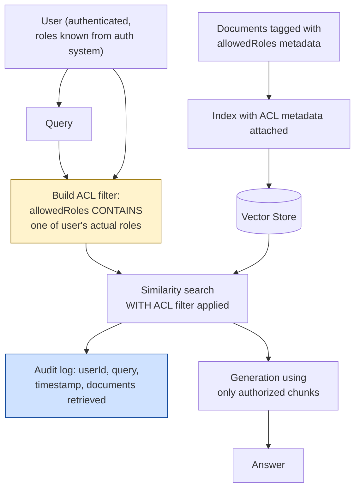

# Pattern 33: Enterprise RAG

[← Back to index](README.md)

## 1. What is Enterprise RAG?

Enterprise RAG isn't a new retrieval mechanism — it's the set of **cross-cutting
production requirements** that any of this series' patterns need before they can
safely serve a real organization: **access control** (a user must never see content
they're not authorized for, even indirectly through a generated answer), **audit
logging** (a durable record of who asked what and what was retrieved, for compliance
review), and **tenant isolation** (in a multi-tenant deployment, one customer's data
must never leak into another's retrieval results).

This pattern layers those requirements on top of any earlier retrieval pattern — most
directly, it extends Metadata Filtering (Pattern 14), but where Pattern 14 used
metadata to select the *correct product variant* (API version, region), this pattern
uses metadata to enforce **security boundaries**, where a filtering mistake isn't a
wrong answer — it's a data breach.

## 2. What problem does it solve?

A RAG pipeline built from any earlier pattern in this series, without access control,
has a serious structural flaw: **the vector store has no concept of who's asking.**
Every document is equally retrievable by every query, regardless of who sent it. In an
enterprise with genuinely sensitive documents — confidential HR records, unreleased
financial results, security incident details — this means:

- A retrieval-only mistake (a chunk from a confidential HR document scoring highly for
  an unrelated engineer's query) can leak sensitive content into a generated answer
  the requester was never authorized to see.
- There's no record afterward of what was retrieved for whom, making it impossible to
  audit whether a breach occurred, or to satisfy compliance requirements that mandate
  access logging.

Enterprise RAG fixes both: access control makes unauthorized retrieval **structurally
impossible**, not just unlikely; audit logging makes every retrieval **traceable**,
satisfying the kind of compliance requirement (SOC 2, HIPAA-adjacent internal policy,
etc.) that most consumer-facing RAG demos never need to consider.

## 3. Realistic production scenario

**Company:** an internal enterprise document search tool spanning multiple
departments — HR documents (confidential — HR team only), Finance documents
(confidential — Finance team only), and Engineering documents (open to all employees)
— all in one shared vector store, queried by employees across the whole company through
one search interface.

**Problem:** without access control, an engineer's query could retrieve a confidential
HR document if its content happened to be semantically similar to what they asked —
a real data-exposure risk that gets worse, not better, as the corpus and user base
grow.

**Goal:** tag every document with its required access role(s) at indexing time; at
query time, build a metadata filter from the *requesting user's actual roles*
(never from anything in the query text, which a malicious or careless user could try
to manipulate) so retrieval is structurally restricted to only documents that user is
authorized to see — and log every query, the user who made it, and which documents
were actually retrieved, to a durable audit trail.

## 4. Architecture / flow diagram



## 5. Request-to-response walkthrough

1. **A document is indexed:** an HR policy document is tagged with metadata
   `allowedRoles = "hr"`; an engineering runbook is tagged `allowedRoles =
   "engineering,all"`; a company-wide announcement is tagged `allowedRoles = "all"`.
2. **An engineer (roles: `["engineering", "all"]`) asks:** *"what's our parental leave
   policy"*.
3. **ACL filter construction:** the system builds a metadata filter from the user's
   *actual, authenticated roles* — never from the query text itself — restricting the
   search to documents whose `allowedRoles` includes at least one role this specific
   user actually holds.
4. **Filtered retrieval runs:** the HR policy document (`allowedRoles = "hr"`) is
   structurally excluded from the candidate pool for this user, regardless of how
   semantically relevant it is to the query — this is a hard filter, not a ranking
   penalty.
5. **Audit log entry written:** userId, the query text, a timestamp, and the list of
   document ids actually retrieved (in this case, likely nothing HR-specific, or a
   general "all"-tagged FAQ if one exists) are recorded to a durable audit store.
6. **Generation** proceeds using only the authorized subset of retrieved chunks.
7. **Answer returned** — in this example, likely an honest "I don't have access to that
   information" if nothing in the engineer's authorized document set actually answers
   the HR-specific question, which is the *correct* outcome, not a failure.
8. **A different user (roles: `["hr"]`) asking the same question** would have the HR
   policy document available in their filtered candidate pool, and would receive the
   real answer — same query, different authorized result, exactly as intended.

## 6. Why this pattern is appropriate here

- **Structural enforcement, not best-effort filtering** — the ACL filter is applied at
  the vector store query level itself (the same mechanism as Pattern 14's Metadata
  Filtering), meaning an unauthorized document is never even a candidate for
  retrieval, not merely ranked low or filtered out after the fact by a step that could
  be skipped or fail silently.
- **User roles come from the authentication system, never from the query or the
  request body** — this is a critical security detail: an ACL check that trusted
  client-supplied role claims would be trivially bypassable; roles must come from a
  server-side, authenticated identity, the same principle behind any real access
  control system regardless of whether RAG is involved at all.
- **Audit logging is what makes the system's behavior reviewable after the fact** —
  compliance and security review depend on being able to answer "who accessed what,
  when," which no earlier pattern in this series captures unless explicitly added.
- **When this is *not* enough:** for highly regulated domains (healthcare, finance)
  with legal requirements beyond basic RBAC — field-level redaction, data residency
  requirements, formal consent tracking — this pattern is the foundation those stricter
  requirements build on, not a complete compliance solution on its own; specialized
  legal/compliance review is required for those cases, this pattern provides the
  structural access-control and audit-logging groundwork they depend on.

## 7. Production-quality implementation (Java / Spring AI)

```java
package com.acme.rag.enterprise;

import org.springframework.ai.chat.client.ChatClient;
import org.springframework.ai.document.Document;
import org.springframework.ai.ollama.OllamaChatModel;
import org.springframework.ai.ollama.OllamaEmbeddingModel;
import org.springframework.ai.ollama.api.OllamaApi;
import org.springframework.ai.ollama.api.OllamaOptions;
import org.springframework.ai.vectorstore.SearchRequest;
import org.springframework.ai.vectorstore.SimpleVectorStore;
import org.springframework.ai.vectorstore.filter.Filter;
import org.springframework.ai.vectorstore.filter.FilterExpressionBuilder;

import java.io.IOException;
import java.io.UncheckedIOException;
import java.nio.file.Files;
import java.nio.file.Path;
import java.time.Instant;
import java.util.List;
import java.util.Map;
import java.util.Set;
import java.util.stream.Collectors;

/**
 * Enterprise RAG -- role-based access control enforced as a hard metadata
 * filter at the vector store level, plus a durable audit log of every query
 * and which documents were actually retrieved.
 */
public final class EnterpriseRagApp {

    record RagConfig(
            String embeddingModel, String llmModel, double llmTemperature,
            int topK, Path persistPath) {

        static RagConfig defaults() {
            return new RagConfig("nomic-embed-text", "llama3.1", 0.0, 4,
                    Path.of("./vectorstore_enterprise_docs.json"));
        }
    }

    /** Roles come from the authenticated identity system -- never from request/query text. */
    record UserContext(String userId, Set<String> roles) {}

    /** A durable, append-only audit trail. In production this writes to a real
     *  audit log store (a database table, a SIEM pipeline) rather than stdout. */
    static final class AuditLogger {
        void logQuery(UserContext user, String query, List<String> documentsRetrieved) {
            System.out.printf(
                    "[AUDIT] ts=%s userId=%s roles=%s query=%s documentsRetrieved=%s%n",
                    Instant.now(), user.userId(), user.roles(), query, documentsRetrieved);
        }
    }

    static final class EnterpriseRagAssistant {
        private static final String GEN_SYSTEM = """
                You are an internal enterprise document assistant. Answer using ONLY
                the context below, which has already been filtered to documents this
                specific user is authorized to access. If the context does not contain
                the answer, say so explicitly -- do not speculate about what an
                unauthorized document might say.

                Context:
                {context}
                """;

        private final RagConfig config;
        private final SimpleVectorStore vectorStore;
        private final ChatClient chatClient;
        private final AuditLogger auditLogger;

        EnterpriseRagAssistant(RagConfig config, OllamaEmbeddingModel embeddingModel,
                                ChatClient chatClient, AuditLogger auditLogger, Path sourceDir) {
            this.config = config;
            this.chatClient = chatClient;
            this.auditLogger = auditLogger;
            this.vectorStore = buildOrLoad(embeddingModel, sourceDir);
        }

        private SimpleVectorStore buildOrLoad(OllamaEmbeddingModel embeddingModel, Path sourceDir) {
            SimpleVectorStore store = SimpleVectorStore.builder(embeddingModel).build();
            if (Files.exists(config.persistPath())) {
                store.load(config.persistPath().toFile());
                return store;
            }

            for (SampleDoc doc : SAMPLE_DOCS) {
                store.add(List.of(new Document(doc.text(),
                        Map.of("source", doc.source(), "allowedRoles", doc.allowedRoles()))));
            }
            store.save(config.persistPath().toFile());
            return store;
        }

        record AskResult(String answer, List<String> sourcesRetrieved) {}

        AskResult ask(UserContext user, String question) {
            if (question == null || question.isBlank()) {
                throw new IllegalArgumentException("Question must not be empty.");
            }
            if (user.roles().isEmpty()) {
                throw new IllegalStateException("User has no roles; cannot authorize any retrieval.");
            }

            Filter.Expression aclFilter = buildAclFilter(user.roles());

            List<Document> retrieved = vectorStore.similaritySearch(
                    SearchRequest.builder()
                            .query(question)
                            .topK(config.topK())
                            .filterExpression(aclFilter)
                            .build());

            List<String> sources = retrieved.stream()
                    .map(d -> String.valueOf(d.getMetadata().getOrDefault("source", "unknown")))
                    .collect(Collectors.toList());

            // Audit logging happens regardless of whether anything relevant was
            // found -- an audit trail of "user X asked about Y and got nothing"
            // is itself useful compliance/security signal.
            auditLogger.logQuery(user, question, sources);

            if (retrieved.isEmpty()) {
                return new AskResult(
                        "I don't have any information you're authorized to access "
                        + "that answers that question.", List.of());
            }

            String context = retrieved.stream()
                    .map(d -> "[" + d.getMetadata().getOrDefault("source", "unknown") + "]\n" + d.getText())
                    .collect(Collectors.joining("\n\n---\n\n"));

            String answer;
            try {
                String systemMessage = GEN_SYSTEM.replace("{context}", context);
                answer = chatClient.prompt().system(systemMessage).user(question).call().content();
            } catch (Exception ex) {
                System.err.println("Generation failed: " + ex);
                answer = "Sorry, something went wrong answering that question.";
            }

            return new AskResult(answer, sources);
        }

        /**
         * Builds a filter matching any document whose allowedRoles metadata contains
         * AT LEAST ONE of the user's actual roles -- an OR across the user's roles.
         * allowedRoles is stored as a comma-separated string here for simplicity with
         * SimpleVectorStore's metadata model; a production vector store with native
         * array/set filtering (e.g. PgVectorStore with a JSONB array column) would
         * express this more directly.
         */
        private Filter.Expression buildAclFilter(Set<String> userRoles) {
            FilterExpressionBuilder b = new FilterExpressionBuilder();
            // SimpleVectorStore's filter DSL does not support substring/CONTAINS
            // matching on comma-separated fields directly, so in this simplified
            // example roles are matched by exact equality against single-role
            // documents; production systems should model allowedRoles as a true
            // multi-value field (e.g. a JSONB array in PgVectorStore) and use a
            // native "array contains any of" filter instead of string equality.
            List<Filter.Expression> roleClauses = userRoles.stream()
                    .map(role -> b.eq("allowedRoles", role).build())
                    .collect(Collectors.toList());

            Filter.Expression combined = roleClauses.get(0);
            for (int i = 1; i < roleClauses.size(); i++) {
                combined = b.or(combined, roleClauses.get(i)).build();
            }
            return combined;
        }
    }

    record SampleDoc(String source, String text, String allowedRoles) {}

    private static final List<SampleDoc> SAMPLE_DOCS = List.of(
            new SampleDoc("hr_parental_leave.md",
                    "Employees are entitled to 16 weeks of paid parental leave after "
                    + "12 months of continuous employment.", "hr"),
            new SampleDoc("finance_q3_results.md",
                    "Q3 revenue grew 12% year-over-year, driven primarily by enterprise "
                    + "tier subscription growth.", "finance"),
            new SampleDoc("eng_deploy_runbook.md",
                    "Deployments are triggered via the CI pipeline after merge to main; "
                    + "rollback is available via the deploy dashboard.", "all")
    );

    public static void main(String[] args) throws IOException {
        RagConfig config = RagConfig.defaults();
        // Sample docs are defined inline above (SAMPLE_DOCS); sourceDir is unused
        // in this example's buildOrLoad path but kept for interface consistency
        // with earlier patterns.
        Path unusedSourceDir = Path.of("./sample_enterprise_docs");
        Files.createDirectories(unusedSourceDir);

        OllamaApi ollamaApi = OllamaApi.builder().baseUrl("http://localhost:11434").build();
        OllamaEmbeddingModel embeddingModel = OllamaEmbeddingModel.builder()
                .ollamaApi(ollamaApi)
                .defaultOptions(OllamaOptions.builder().model(config.embeddingModel()).build())
                .build();
        OllamaChatModel chatModel = OllamaChatModel.builder()
                .ollamaApi(ollamaApi)
                .defaultOptions(OllamaOptions.builder().model(config.llmModel())
                        .temperature(config.llmTemperature()).build())
                .build();
        ChatClient chatClient = ChatClient.create(chatModel);

        EnterpriseRagAssistant assistant = new EnterpriseRagAssistant(
                config, embeddingModel, chatClient, new AuditLogger(), unusedSourceDir);

        UserContext engineer = new UserContext("alice", Set.of("engineering", "all"));
        UserContext hrStaff = new UserContext("bob", Set.of("hr"));

        EnterpriseRagAssistant.AskResult engineerResult =
                assistant.ask(engineer, "what's our parental leave policy");
        System.out.println("\n[alice, engineering] Q: what's our parental leave policy");
        System.out.println("  sources retrieved: " + engineerResult.sourcesRetrieved());
        System.out.println("A: " + engineerResult.answer());

        EnterpriseRagAssistant.AskResult hrResult =
                assistant.ask(hrStaff, "what's our parental leave policy");
        System.out.println("\n[bob, hr] Q: what's our parental leave policy");
        System.out.println("  sources retrieved: " + hrResult.sourcesRetrieved());
        System.out.println("A: " + hrResult.answer());
    }
}
```

### Key production details worth noting

- **`UserContext.roles` must come from an authenticated identity provider**, never
  from the HTTP request body or the query text — this is called out explicitly in the
  code comments and is the single most important security property of this pattern; an
  ACL system that trusts client-supplied role claims provides no real security at all.
- **The ACL filter is `AND`-ed into the vector search itself** (via
  `filterExpression`), the same mechanism as Pattern 14's product-variant filtering —
  reusing that mechanism for security purposes rather than inventing a separate,
  parallel filtering path reduces the chance of an inconsistency between the two.
- **Audit logging happens on every query, including ones that retrieve nothing** — a
  logged "no access" event is itself valuable security signal (e.g. detecting a user
  repeatedly probing for content they're not authorized to see), so logging must not
  be conditioned on retrieval success.
- **`allowedRoles` as a comma-separated string is called out as a simplification** —
  production systems should use a vector store with native multi-value metadata
  filtering (an array/JSONB column in `PgVectorStore`, for example) rather than a
  workaround requiring exact-match role clauses; this is flagged explicitly rather than
  presented as a finished, ideal implementation.

---
[← Back to index](README.md)
