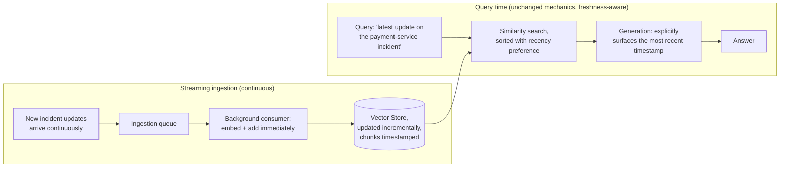

# Pattern 34: Real-Time RAG

[← Back to index](README.md)

## 1. What is Real-Time RAG?

Real-Time RAG keeps the **retrieval corpus itself continuously fresh** via incremental,
streaming ingestion — new documents are embedded and added to the vector store within
seconds of arriving, rather than the corpus being rebuilt on a periodic batch schedule
(nightly, hourly). This is distinct from API/Data RAG (Pattern 32): that pattern calls
a live external API *at query time* for one specific fact; Real-Time RAG instead keeps
the *searchable index itself* up to date continuously, so that ordinary vector search
(any pattern in this series) reflects near-real-time content without needing a special
per-query live-data call at all.

The two patterns solve genuinely different freshness problems and often coexist: Real-Time
RAG is right when the underlying *corpus of documents* is being actively updated (new
incident notes, new changelog entries, live announcements); API/Data RAG is right when
a single *computed value* changes continuously (current service uptime percentage) and
was never really "a document" to begin with.

## 2. What problem does it solve?

Every earlier pattern in this series that builds a persisted vector index (nearly all
of them) has assumed a **relatively static corpus** — build the index once, add to it
occasionally, done. That assumption breaks for any use case involving content that's
actively being produced *during* the time users are querying it:

- An ongoing incident's status updates ("mitigation applied, monitoring for
  recurrence," posted 3 minutes ago) are exactly the kind of content a periodic
  nightly reindex would miss entirely for the duration of an active incident — the
  worst possible time for RAG answers to be stale.
- A batch-reindexed system also risks a subtler problem: even when it *does* eventually
  reindex, older, superseded information (an earlier, now-incorrect incident update)
  remains in the index alongside the newer, corrected one, with no signal to the LLM
  about which is more current.

Real-Time RAG solves both: incremental, streaming ingestion closes the freshness gap
from "next scheduled rebuild" down to "seconds," and explicit timestamp metadata lets
retrieval and generation reason about recency directly.

## 3. Realistic production scenario

**Company:** an internal incident-response tool where status updates are posted
continuously as an incident unfolds (e.g. "investigating," "root cause identified,"
"mitigation applied," "resolved"), and engineers query the tool mid-incident asking
*"what's the latest update on the payment-service incident"* — where an answer based on
a stale, batch-reindexed snapshot from hours ago is actively harmful during a live
incident.

**Goal:** build a streaming ingestion pipeline that embeds and adds each new incident
update to the vector store within seconds of it being posted (no full reindex, no batch
delay), timestamp every indexed chunk, and have retrieval and generation explicitly
prefer and surface the most recent relevant update.

## 4. Architecture / flow diagram



## 5. Request-to-response walkthrough

1. **An incident begins:** *"14:02 — investigating elevated error rates on
   payment-service"* is posted. The streaming ingestion consumer picks this up
   immediately, embeds it, and adds it to the vector store — no batch delay, no
   waiting for a scheduled reindex.
2. **A follow-up update arrives:** *"14:15 — root cause identified: a bad deploy at
   13:58"* — this is also immediately embedded and added, timestamped 14:15.
3. **An engineer queries at 14:20:** *"what's the latest update on the payment-service
   incident"*.
4. **Retrieval:** both the 14:02 and 14:15 updates are semantically relevant and
   retrieved; because each carries an explicit timestamp, retrieval can sort or boost
   toward the most recent one rather than treating both as equally "current."
5. **Generation:** the LLM is given both updates *with their timestamps explicitly
   labeled*, and instructed to lead with the most recent one — producing an answer like
   *"As of 14:15 (13 minutes ago): root cause identified as a bad deploy at 13:58...
   (earlier, at 14:02, the team began investigating elevated error rates)."*
6. **A further update at 14:25** ("mitigation deployed, monitoring") is ingested within
   seconds and immediately available to the *next* query — there is no "wait until
   tonight's reindex" gap at any point in this flow.
7. **Answer returned**, explicitly timestamped so the requester knows exactly how
   fresh the information is — critical during an active incident, where the age of an
   update materially affects its usefulness.

## 6. Why this pattern is appropriate here

- **This is the only pattern that eliminates the batch-reindex freshness gap
  entirely** — every earlier pattern assumes indexing is a background/offline concern;
  Real-Time RAG makes indexing part of the live system, with the same latency budget
  as any other real-time pipeline.
- **Explicit timestamping is what makes recency reasoning possible at all** — without
  it, an LLM has no way to know which of two semantically similar but temporally
  different chunks is more current; this is a small addition (one metadata field) with
  an outsized effect on answer correctness for time-sensitive corpora.
- **Incremental add, never full rebuild, is what keeps ingestion latency low** — adding
  one new document to an existing vector store is fast; re-embedding an entire corpus
  from scratch on every update would not scale to a continuously-updating source.
- **When this is *not* enough:** if what's needed is a single, continuously changing
  *computed value* (not a growing collection of discrete documents), API/Data RAG
  (Pattern 32) is the more direct fit — Real-Time RAG is for keeping a *document
  corpus* fresh; it's not a substitute for calling a live API when the "document"
  doesn't really exist as text until you ask for it.

## 7. Production-quality implementation (Java / Spring AI)

```java
package com.acme.rag.realtime;

import org.springframework.ai.chat.client.ChatClient;
import org.springframework.ai.document.Document;
import org.springframework.ai.ollama.OllamaChatModel;
import org.springframework.ai.ollama.OllamaEmbeddingModel;
import org.springframework.ai.ollama.api.OllamaApi;
import org.springframework.ai.ollama.api.OllamaOptions;
import org.springframework.ai.vectorstore.SearchRequest;
import org.springframework.ai.vectorstore.SimpleVectorStore;

import java.time.Instant;
import java.time.temporal.ChronoUnit;
import java.util.Comparator;
import java.util.List;
import java.util.Map;
import java.util.concurrent.BlockingQueue;
import java.util.concurrent.Executors;
import java.util.concurrent.LinkedBlockingQueue;
import java.util.concurrent.ScheduledExecutorService;
import java.util.concurrent.TimeUnit;
import java.util.stream.Collectors;

/**
 * Real-Time RAG -- a background consumer incrementally embeds and adds new
 * documents to the vector store as they arrive (no batch reindex), with
 * every chunk timestamped so retrieval and generation can reason explicitly
 * about recency.
 */
public final class RealTimeRagApp {

    record RagConfig(
            String embeddingModel, String llmModel, double llmTemperature, int topK) {

        static RagConfig defaults() {
            return new RagConfig("nomic-embed-text", "llama3.1", 0.0, 4);
        }
    }

    record IncomingUpdate(String source, String text, Instant timestamp) {}

    /**
     * Streaming ingestion: a background consumer drains an ingestion queue and
     * embeds + adds each new update to the vector store immediately, one at a
     * time -- no batch window, no full reindex. Uses an in-memory queue here to
     * simulate a real event stream (e.g. a Kafka topic or webhook receiver in
     * production); the consumer logic itself is unchanged either way.
     */
    static final class StreamingIngestionConsumer {
        private final SimpleVectorStore vectorStore;
        private final BlockingQueue<IncomingUpdate> queue = new LinkedBlockingQueue<>();
        private final ScheduledExecutorService executor = Executors.newSingleThreadScheduledExecutor();

        StreamingIngestionConsumer(SimpleVectorStore vectorStore) {
            this.vectorStore = vectorStore;
        }

        void start() {
            executor.execute(() -> {
                while (!Thread.currentThread().isInterrupted()) {
                    try {
                        IncomingUpdate update = queue.take(); // blocks until an update arrives
                        Document doc = new Document(update.text(), Map.of(
                                "source", update.source(),
                                "timestamp", update.timestamp().toString()));
                        vectorStore.add(List.of(doc)); // incremental add, not a rebuild
                        System.out.println("[ingest] indexed update from " + update.timestamp());
                    } catch (InterruptedException ex) {
                        Thread.currentThread().interrupt();
                    } catch (Exception ex) {
                        System.err.println("[ingest] failed to index an update: " + ex);
                    }
                }
            });
        }

        void submit(IncomingUpdate update) {
            queue.add(update);
        }

        void shutdown() {
            executor.shutdownNow();
        }
    }

    static final class RealTimeIncidentAssistant {
        private static final String GEN_SYSTEM = """
                You are an incident-response assistant. Below are updates relevant to
                the question, each labeled with its timestamp. Lead your answer with
                the MOST RECENT relevant update, and mention how long ago it was
                posted. Reference earlier updates only as background context.
                Answer using ONLY the updates below.

                Updates (each timestamped):
                {context}
                """;

        private final SimpleVectorStore vectorStore;
        private final ChatClient chatClient;
        private final RagConfig config;

        RealTimeIncidentAssistant(SimpleVectorStore vectorStore, ChatClient chatClient, RagConfig config) {
            this.vectorStore = vectorStore;
            this.chatClient = chatClient;
            this.config = config;
        }

        record AskResult(String answer, List<String> updateTimestamps) {}

        AskResult ask(String question) {
            if (question == null || question.isBlank()) {
                throw new IllegalArgumentException("Question must not be empty.");
            }

            List<Document> retrieved = vectorStore.similaritySearch(
                    SearchRequest.builder().query(question).topK(config.topK()).build());

            // Sort retrieved chunks by recency (most recent first) so the
            // generation prompt naturally presents the freshest update first --
            // semantic relevance alone doesn't guarantee recency ordering.
            List<Document> sortedByRecency = retrieved.stream()
                    .sorted(Comparator.comparing(
                            (Document d) -> Instant.parse(String.valueOf(d.getMetadata().get("timestamp"))))
                            .reversed())
                    .collect(Collectors.toList());

            String context = sortedByRecency.stream()
                    .map(d -> {
                        Instant ts = Instant.parse(String.valueOf(d.getMetadata().get("timestamp")));
                        long minutesAgo = ChronoUnit.MINUTES.between(ts, Instant.now());
                        return "[" + ts + ", " + minutesAgo + " min ago]\n" + d.getText();
                    })
                    .collect(Collectors.joining("\n\n---\n\n"));

            String answer;
            try {
                String systemMessage = GEN_SYSTEM.replace("{context}", context);
                answer = chatClient.prompt().system(systemMessage).user(question).call().content();
            } catch (Exception ex) {
                System.err.println("Generation failed: " + ex);
                answer = "Sorry, something went wrong answering that question.";
            }

            List<String> timestamps = sortedByRecency.stream()
                    .map(d -> String.valueOf(d.getMetadata().get("timestamp")))
                    .collect(Collectors.toList());

            return new AskResult(answer, timestamps);
        }
    }

    public static void main(String[] args) throws Exception {
        RagConfig config = RagConfig.defaults();

        OllamaApi ollamaApi = OllamaApi.builder().baseUrl("http://localhost:11434").build();
        OllamaEmbeddingModel embeddingModel = OllamaEmbeddingModel.builder()
                .ollamaApi(ollamaApi)
                .defaultOptions(OllamaOptions.builder().model(config.embeddingModel()).build())
                .build();
        OllamaChatModel chatModel = OllamaChatModel.builder()
                .ollamaApi(ollamaApi)
                .defaultOptions(OllamaOptions.builder().model(config.llmModel())
                        .temperature(config.llmTemperature()).build())
                .build();
        ChatClient chatClient = ChatClient.create(chatModel);

        // Not persisted to disk in this example -- a real-time index is typically
        // kept in a durable, incrementally-updatable vector store (e.g.
        // PgVectorStore backed by a database) rather than a periodically-saved
        // JSON snapshot, precisely because it changes continuously.
        SimpleVectorStore vectorStore = SimpleVectorStore.builder(embeddingModel).build();

        StreamingIngestionConsumer ingestion = new StreamingIngestionConsumer(vectorStore);
        ingestion.start();

        Instant now = Instant.now();
        ingestion.submit(new IncomingUpdate("incident-142", "Investigating elevated "
                + "error rates on payment-service.", now.minus(18, ChronoUnit.MINUTES)));
        ingestion.submit(new IncomingUpdate("incident-142", "Root cause identified: "
                + "a bad deploy at 13:58 introduced a null pointer in the checkout path.",
                now.minus(5, ChronoUnit.MINUTES)));

        // Give the async consumer a moment to process the queued updates before
        // querying -- in a real system, queries naturally arrive after ingestion
        // latency (seconds), not synchronously in the same call stack.
        TimeUnit.SECONDS.sleep(2);

        RealTimeIncidentAssistant assistant = new RealTimeIncidentAssistant(vectorStore, chatClient, config);
        RealTimeIncidentAssistant.AskResult result =
                assistant.ask("what's the latest update on the payment-service incident");

        System.out.println("\nQ: what's the latest update on the payment-service incident");
        System.out.println("  update timestamps (most recent first): " + result.updateTimestamps());
        System.out.println("A: " + result.answer());

        ingestion.shutdown();
    }
}
```

### Key production details worth noting

- **`vectorStore.add(List.of(doc))` per update, never a full rebuild** — this is the
  entire mechanism that keeps ingestion latency in the seconds range regardless of how
  large the overall corpus grows; re-embedding everything on every update would not
  scale.
- **Every indexed chunk carries an explicit `timestamp` metadata field**, and
  retrieval explicitly re-sorts by it (`Comparator.comparing(...).reversed()`) —
  semantic similarity search has no inherent sense of recency, so this sort step is
  what actually guarantees the freshest relevant update is surfaced first.
- **The generation prompt explicitly labels each chunk's age** ("X min ago") and
  instructs the model to lead with the most recent one — this is what turns "the model
  happened to get the freshest chunk" into "the model reliably presents freshness
  correctly," a small but important prompt-engineering detail specific to this
  pattern.
- **`SimpleVectorStore` (in-memory, JSON-snapshot-persisted) is explicitly called out
  as not the right backing store for a genuinely continuous real-time system** — a
  production deployment of this pattern should use a vector store backed by a real,
  incrementally-writable database (`PgVectorStore` or similar) rather than one whose
  natural persistence model is periodic full-snapshot saves, which is a batch-shaped
  operation this pattern is specifically trying to avoid.

---

## Series complete

All 34 patterns are now covered, from Basic RAG through Real-Time RAG, each with a
runnable Java/Spring AI implementation. The series progressed from foundational
retrieve-then-generate mechanics (Part 1), through query-side and retrieval-side
refinements (Parts 2-3), post-retrieval polish (Part 4), reasoning and control patterns
(Part 5), and finally applied enterprise concerns (Part 6) — each pattern building
on, or explicitly deferring to, the ones around it, so the series as a whole reads as
one continuous progression rather than 34 disconnected recipes.

[← Back to index](README.md)
