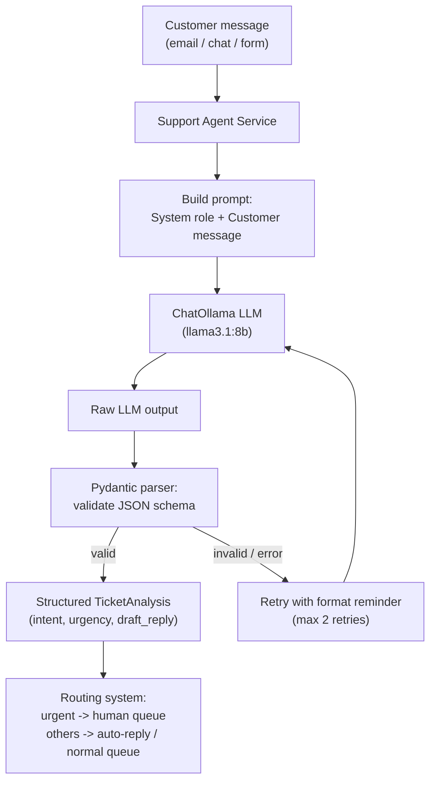

# Pattern 1: Basic Agent

## 1. What is a Basic Agent?

A **Basic Agent** is the simplest possible "agent": it takes a user's input, sends it to an
LLM along with a system prompt that gives it a role and personality, and returns the LLM's
answer. There are **no tools**, **no multi-step reasoning loop**, and **no memory beyond a
single turn** (unless you explicitly add conversation history).

Think of it as the difference between a plain chatbot and an "agent" — a Basic Agent is
really just a well-configured chatbot. But it's the foundation every other pattern in this
series builds on: before an agent can use tools, plan, reflect, or collaborate with other
agents, it first needs to reliably take an input, apply a role/instructions, and produce a
clean, structured output. Get this layer wrong (bad error handling, no retries, no
validation) and every pattern built on top of it inherits the same fragility.

## 2. What problem does it solve?

Without a Basic Agent wrapper, developers usually call the LLM directly and inline the prompt
into application code. That causes real problems in production:

- **No separation of concerns** — role/instructions, formatting rules, and business logic are
  tangled together in one string, making it hard to test or reuse.
- **No output contract** — the caller gets raw text back and has to hope it's parseable.
- **No resilience** — a timeout or malformed response crashes the whole request.
- **No observability** — you can't tell what the agent was asked, what model/version answered,
  or how long it took.

A Basic Agent pattern solves this by wrapping the LLM call behind a small, well-defined
class: a fixed **role** (system prompt), a **structured input/output contract** (Pydantic
models), and built-in **error handling, retries, and logging**. It's the "hello world" of
agents — but a production "hello world" still needs to not fall over.

## 3. Realistic production example: Customer Support Intent Classifier & Responder

**Scenario:** An e-commerce company gets thousands of support messages a day (email, chat
widget, contact form). Before any ticket reaches a human, they want a fast, cheap, always-on
first pass that:

- Reads the customer's message
- Classifies the intent (e.g. `order_status`, `refund_request`, `product_question`,
  `complaint`, `other`)
- Drafts a short, polite first-response
- Flags urgency (`low` / `medium` / `high`) so urgent tickets get routed to a human faster

This doesn't need tools (no order lookup yet — that's Pattern 2, Tool-Using Agent), it doesn't
need multi-step reasoning, and it doesn't need memory across tickets. It's a perfect fit for a
**Basic Agent**: one well-structured LLM call per ticket, with a strict output schema so the
rest of the ticketing system (a queue, a dashboard, a routing rule engine) can consume it
reliably.

## 4. Architecture / Flow Diagram



## 5. Request-to-response flow, step by step

1. **Input arrives**: a raw customer message string comes in from whatever channel
   (webhook, message queue, form submission).
2. **Agent builds the prompt**: a fixed system message defines the agent's role
   ("You are a support triage assistant..."), the output schema, and rules
   (be concise, be polite, never promise a refund amount). The user message is appended as-is.
3. **LLM call**: the prompt goes to a local Ollama model through `langchain-ollama`'s
   `ChatOllama` class.
4. **Parsing**: the response is parsed into a strict Pydantic schema
   (`intent`, `urgency`, `draft_reply`, `confidence`). This is what makes it "production
   ready" rather than a demo — downstream code never touches raw text.
5. **Validation & retry**: if parsing fails (the model added extra prose, or produced invalid
   JSON), the agent automatically retries with a stronger formatting reminder, up to a fixed
   retry limit, before failing loudly with a clear error.
6. **Output returned**: a validated `TicketAnalysis` object goes back to the caller, who
   can safely route it (e.g. `if urgency == "high": push to human queue`).
7. **Logging**: every call logs latency, model name, and success/failure — so you can monitor
   this in production and catch drift (e.g. the model starts misclassifying after an update).

## 6. Why this pattern fits (and when it doesn't)

**Fits well when:**
- The task is a single input → single output transformation.
- No external data lookups or actions are needed.
- Latency and cost matter (one LLM call, not a multi-step loop).
- You need a strict, machine-readable output contract.

**Doesn't fit when:**
- The agent needs to look something up (order status, inventory) → use **Tool-Using Agent**
  (Pattern 2).
- The task needs multi-step reasoning that adapts based on intermediate results → use
  **ReAct** (Pattern 3).
- The agent needs to remember previous tickets from the same customer → use
  **Agent Memory** (Pattern 18).

Knowing when *not* to reach for a more complex pattern is as important as knowing the pattern
itself — a Basic Agent that does its one job reliably beats an over-engineered multi-agent
system for a task this simple.

## 7. Production-quality implementation

```python
"""
Pattern 1: Basic Agent
-----------------------
A production-quality "Support Ticket Triage" Basic Agent built with
LangChain + Ollama.

Run prerequisites:
    ollama pull llama3.1:8b
    pip install -U langchain langchain-core langchain-ollama pydantic

Run:
    python basic_agent.py
"""

from __future__ import annotations

import logging
import time
from enum import Enum
from typing import Optional

from langchain_core.messages import HumanMessage, SystemMessage
from langchain_core.output_parsers import PydanticOutputParser
from langchain_core.exceptions import OutputParserException
from langchain_ollama import ChatOllama
from pydantic import BaseModel, Field, ValidationError

# --------------------------------------------------------------------------
# Logging setup — every production agent should log structured, useful data
# --------------------------------------------------------------------------
logging.basicConfig(
    level=logging.INFO,
    format="%(asctime)s | %(levelname)s | %(name)s | %(message)s",
)
logger = logging.getLogger("basic_agent")


# --------------------------------------------------------------------------
# Output contract — the whole point of wrapping the LLM call is to never
# hand raw text to the rest of the system.
# --------------------------------------------------------------------------
class Intent(str, Enum):
    ORDER_STATUS = "order_status"
    REFUND_REQUEST = "refund_request"
    PRODUCT_QUESTION = "product_question"
    COMPLAINT = "complaint"
    OTHER = "other"


class Urgency(str, Enum):
    LOW = "low"
    MEDIUM = "medium"
    HIGH = "high"


class TicketAnalysis(BaseModel):
    intent: Intent = Field(description="The primary intent of the customer's message")
    urgency: Urgency = Field(description="How urgently this needs human attention")
    draft_reply: str = Field(
        description="A short, polite first-response draft (2-4 sentences), "
        "no promises about refunds or compensation amounts"
    )
    confidence: float = Field(
        ge=0.0, le=1.0, description="Model's confidence in the intent classification"
    )


# --------------------------------------------------------------------------
# The agent itself
# --------------------------------------------------------------------------
class SupportTriageAgent:
    """A Basic Agent: one LLM call, strict input/output contract, retries."""

    SYSTEM_PROMPT = """You are a customer support triage assistant for an e-commerce company.

Your job, given one customer message, is to:
1. Classify the intent.
2. Assess urgency (high = angry/legal-threat/safety issue, medium = time-sensitive,
   low = general question).
3. Draft a short, polite first-response (2-4 sentences). Never promise specific refund
   amounts, discounts, or timelines you cannot guarantee.
4. Give a confidence score between 0 and 1 for your intent classification.

Respond ONLY with valid JSON matching this schema, no extra commentary:
{format_instructions}
"""

    def __init__(
        self,
        model_name: str = "llama3.1:8b",
        temperature: float = 0.2,
        max_retries: int = 2,
        request_timeout: int = 30,
    ) -> None:
        self.max_retries = max_retries
        self.parser = PydanticOutputParser(pydantic_object=TicketAnalysis)
        self.llm = ChatOllama(
            model=model_name,
            temperature=temperature,
            timeout=request_timeout,
        )
        self._system_message = SystemMessage(
            content=self.SYSTEM_PROMPT.format(
                format_instructions=self.parser.get_format_instructions()
            )
        )

    def analyze(self, customer_message: str) -> TicketAnalysis:
        """Analyze a single customer message. Raises RuntimeError if the
        LLM fails to produce valid output after all retries."""

        if not customer_message or not customer_message.strip():
            raise ValueError("customer_message must be a non-empty string")

        messages = [self._system_message, HumanMessage(content=customer_message)]

        last_error: Optional[Exception] = None
        for attempt in range(1, self.max_retries + 2):  # +1 for the first try
            start = time.monotonic()
            try:
                response = self.llm.invoke(messages)
                result = self.parser.parse(response.content)

                elapsed_ms = (time.monotonic() - start) * 1000
                logger.info(
                    "ticket_analyzed",
                    extra={"attempt": attempt, "elapsed_ms": round(elapsed_ms, 1)},
                )
                logger.info(
                    f"attempt={attempt} elapsed_ms={elapsed_ms:.1f} "
                    f"intent={result.intent} urgency={result.urgency}"
                )
                return result

            except (OutputParserException, ValidationError) as e:
                last_error = e
                logger.warning(f"attempt={attempt} parse_failed error={e}")
                # Nudge the model harder on retry
                messages.append(
                    HumanMessage(
                        content="Your previous response was not valid JSON matching the "
                        "schema. Respond again with ONLY the raw JSON object, nothing else."
                    )
                )
            except Exception as e:  # network/timeout/model errors
                last_error = e
                logger.error(f"attempt={attempt} llm_call_failed error={e}")
                time.sleep(min(2 ** attempt, 8))  # simple exponential backoff

        raise RuntimeError(
            f"SupportTriageAgent failed after {self.max_retries + 1} attempts: {last_error}"
        )


# --------------------------------------------------------------------------
# Example usage — simulating tickets flowing through the system
# --------------------------------------------------------------------------
def route_ticket(analysis: TicketAnalysis) -> str:
    """Toy routing rule engine consuming the agent's structured output."""
    if analysis.urgency == Urgency.HIGH:
        return "HUMAN_QUEUE_URGENT"
    if analysis.intent in (Intent.REFUND_REQUEST, Intent.COMPLAINT):
        return "HUMAN_QUEUE_NORMAL"
    return "AUTO_REPLY_QUEUE"


if __name__ == "__main__":
    agent = SupportTriageAgent(model_name="llama3.1:8b")

    sample_tickets = [
        "My order #48213 was supposed to arrive 5 days ago and I still have nothing. "
        "This is the third time this has happened and I want a refund NOW or I'm "
        "disputing the charge with my bank.",
        "Hi, does the blue hoodie run true to size or should I size up?",
        "I was charged twice for the same order, can someone please fix this?",
    ]

    for msg in sample_tickets:
        print("\n" + "=" * 70)
        print(f"CUSTOMER MESSAGE: {msg}")
        try:
            analysis = agent.analyze(msg)
            queue = route_ticket(analysis)
            print(f"INTENT: {analysis.intent} | URGENCY: {analysis.urgency} "
                  f"| CONFIDENCE: {analysis.confidence}")
            print(f"ROUTED TO: {queue}")
            print(f"DRAFT REPLY: {analysis.draft_reply}")
        except (RuntimeError, ValueError) as e:
            print(f"FAILED TO ANALYZE TICKET: {e}")
```

### Notes on the code

- **`PydanticOutputParser`** is what turns "an LLM that talks" into "a function that returns
  typed data." This single decision is what makes the agent safe to plug into a larger system.
- **Retries with a format reminder** handle the single most common real-world failure mode:
  the model wrapping JSON in prose or markdown fences.
- **Timeouts + exponential backoff** handle the second most common failure mode: Ollama being
  slow/cold-starting a model, or a transient connection error.
- **`temperature=0.2`** is intentional — classification tasks want consistency, not creativity.
- This code has **zero framework magic** (no `AgentExecutor`, no graph) on purpose: a Basic
  Agent is just "prompt in, validated data out," and the code should look exactly that simple.

### Versions used

- Python `3.11+`
- `langchain-core` `0.3.x`
- `langchain-ollama` `0.2.x`
- `pydantic` `2.x`
- Model: `llama3.1:8b` via local Ollama

---

**Next: [Pattern 2 — Tool-Using Agent](02-tool-using-agent.md)**, where this same triage agent
gains a real tool call — looking up an order's actual status — instead of only working off the
text the customer typed.
