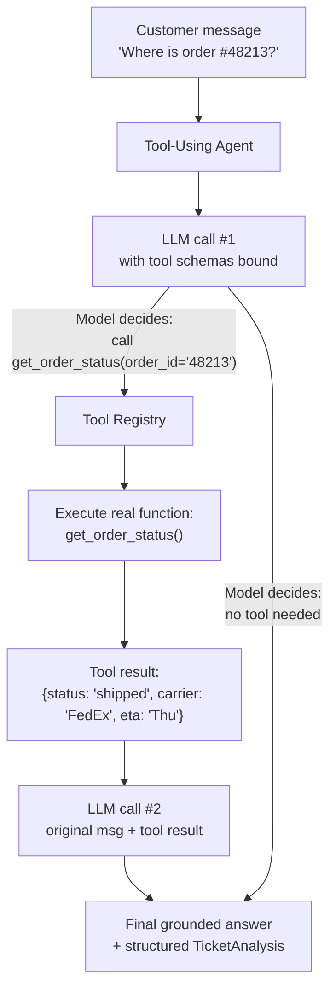

# Pattern 2: Tool-Using Agent

## 1. What is a Tool-Using Agent?

A **Tool-Using Agent** extends the Basic Agent with the ability to call real functions —
"tools" — during its reasoning: a database lookup, a REST API call, a calculator, a search
function. Instead of answering purely from what's in the prompt, the LLM decides *which*
tool to call and *with what arguments*, the application executes that tool in real code, and
the result is fed back to the LLM so it can produce a final, grounded answer.

The key mechanic is **tool/function calling**: the LLM doesn't run code itself — it emits a
structured request ("call `get_order_status` with `order_id='48213'`"), your application runs
it, and returns the result as data the model can read.

## 2. What problem does it solve?

A Basic Agent can only ever work with what's inside the prompt. That's fine for
classification or drafting text, but breaks down the moment the answer depends on **live,
external, or private data** the LLM was never trained on and can't know:

- "Where is my order?" → needs today's shipment data, not a guess.
- "Is this item in stock?" → needs the current inventory system.
- "What's 18% of $1,204.37?" → LLMs are unreliable at precise arithmetic.

Without tools, an LLM in this situation either **hallucinates** a plausible-sounding but wrong
answer, or refuses to answer. A Tool-Using Agent solves this by giving the model a fixed,
well-typed set of capabilities it can invoke on demand, and grounding its final answer in the
*real* result of that call rather than a guess.

## 3. Realistic production example: Order Status Lookup for Support Triage

**Building directly on Pattern 1:** our Support Triage Agent could classify intent and draft
a reply, but for `order_status` tickets its draft reply was generic ("we're looking into it")
because it had no way to actually know where the order was. Now we give it a tool:

- `get_order_status(order_id: str)` — queries the (simulated) order management system and
  returns status, carrier, and expected delivery date.
- `get_customer_order_history(customer_email: str)` — looks up a customer's recent orders,
  useful when the customer doesn't quote an order ID.

The agent should: read the ticket, decide if it needs order data, call the right tool with
the right arguments, and only then draft a reply — one that says "Your order #48213 shipped
via FedEx and is expected Thursday" instead of a vague placeholder.

## 4. Architecture / Flow Diagram



## 5. Request-to-response flow, step by step

1. **Input arrives**: the customer's message, same as Pattern 1.
2. **Tools are bound to the model**: each tool is defined as a typed Python function with a
   docstring; `bind_tools()` turns these into schemas the LLM can see and choose from.
3. **First LLM call**: the model reads the message and either (a) responds directly, or
   (b) emits one or more **tool calls** — structured JSON saying which function to run and
   with what arguments. The LLM never executes anything itself.
4. **Application executes the tool(s)**: your code — not the model — looks up the order,
   handles errors (invalid ID, system down), and returns a plain result.
5. **Tool result is appended to the conversation** as a `ToolMessage`, tied to the specific
   tool call ID that requested it.
6. **Second LLM call**: the model now has the original question *and* the real tool output,
   and produces a final, grounded, structured answer (reusing the `TicketAnalysis` schema
   from Pattern 1).
7. **Loop until done**: in general a tool-using agent may need several tool-call rounds
   (e.g. look up the customer's email first, then their orders) — the code below loops until
   the model stops requesting tools or a safety limit is hit.

## 6. Why this pattern fits (and when it doesn't)

**Fits well when:**
- The correct answer depends on live or private data the LLM can't know from training.
- The task involves precise computation, lookups, or side effects (send email, create ticket).
- You can enumerate the needed capabilities as a small, fixed set of functions.

**Doesn't fit when:**
- The task is a single self-contained transformation with no external data → Basic Agent
  (Pattern 1) is simpler and cheaper.
- The agent needs to *adapt its plan* based on what earlier tool calls returned, potentially
  many steps deep, with visible intermediate reasoning → that's **ReAct** (Pattern 3), which
  formalizes this loop with explicit "Thought → Action → Observation" reasoning traces.
- You need the agent to plan multiple steps *before* executing anything → **Planning Agent**
  (Pattern 4).

Tool-Using Agent is the mechanical foundation (how tool calls work); ReAct is the reasoning
strategy layered on top of it. We're covering the mechanism first because every later pattern
in this series depends on understanding it.

## 7. Production-quality implementation

```python
"""
Pattern 2: Tool-Using Agent
-----------------------------
Extends the Pattern 1 Support Triage Agent with real tool calls: looking up
an order's actual status instead of guessing.

Run prerequisites:
    ollama pull llama3.1:8b        # needs a model with good tool-calling support
    pip install -U langchain langchain-core langchain-ollama pydantic

Run:
    python tool_using_agent.py
"""

from __future__ import annotations

import json
import logging
import time
from datetime import date, timedelta
from enum import Enum
from typing import Optional

from langchain_core.messages import (
    AIMessage,
    HumanMessage,
    SystemMessage,
    ToolMessage,
)
from langchain_core.output_parsers import PydanticOutputParser
from langchain_core.exceptions import OutputParserException
from langchain_core.tools import tool
from langchain_ollama import ChatOllama
from pydantic import BaseModel, Field, ValidationError

logging.basicConfig(
    level=logging.INFO,
    format="%(asctime)s | %(levelname)s | %(name)s | %(message)s",
)
logger = logging.getLogger("tool_using_agent")


# --------------------------------------------------------------------------
# Simulated backend systems. In production these would hit a real DB / API;
# here they're deterministic fakes so this file runs standalone.
# --------------------------------------------------------------------------
_FAKE_ORDER_DB = {
    "48213": {
        "status": "shipped",
        "carrier": "FedEx",
        "eta": (date.today() + timedelta(days=1)).isoformat(),
    },
    "50110": {
        "status": "processing",
        "carrier": None,
        "eta": (date.today() + timedelta(days=4)).isoformat(),
    },
}

_FAKE_CUSTOMER_ORDERS = {
    "jane.doe@example.com": ["48213"],
    "sam.lee@example.com": ["50110"],
}


# --------------------------------------------------------------------------
# Tools — plain typed Python functions. The docstring IS the tool description
# the model sees, so it must be precise.
# --------------------------------------------------------------------------
@tool
def get_order_status(order_id: str) -> str:
    """Look up the current status of an order by its order ID.
    Returns JSON with status, carrier, and estimated delivery date,
    or an error message if the order ID is not found."""
    order = _FAKE_ORDER_DB.get(order_id)
    if not order:
        return json.dumps({"error": f"No order found with ID {order_id}"})
    return json.dumps(order)


@tool
def get_customer_order_history(customer_email: str) -> str:
    """Look up the list of recent order IDs for a customer, given their email.
    Use this when the customer refers to 'my order' without giving an order ID."""
    orders = _FAKE_CUSTOMER_ORDERS.get(customer_email.lower())
    if not orders:
        return json.dumps({"error": f"No orders found for {customer_email}"})
    return json.dumps({"order_ids": orders})


TOOLS = [get_order_status, get_customer_order_history]
TOOLS_BY_NAME = {t.name: t for t in TOOLS}


# --------------------------------------------------------------------------
# Output contract, reused from Pattern 1 with one addition: whether grounded
# order data was actually used.
# --------------------------------------------------------------------------
class Intent(str, Enum):
    ORDER_STATUS = "order_status"
    REFUND_REQUEST = "refund_request"
    PRODUCT_QUESTION = "product_question"
    COMPLAINT = "complaint"
    OTHER = "other"


class Urgency(str, Enum):
    LOW = "low"
    MEDIUM = "medium"
    HIGH = "high"


class TicketAnalysis(BaseModel):
    intent: Intent
    urgency: Urgency
    used_order_data: bool = Field(
        description="True if a tool was called to fetch real order data"
    )
    draft_reply: str = Field(
        description="Short, polite reply. If order data was fetched, reference the "
        "real status/ETA. Never invent order details that weren't returned by a tool."
    )


class ToolUsingSupportAgent:
    """Agent that can call real tools before producing its final structured answer."""

    SYSTEM_PROMPT = """You are a customer support triage assistant for an e-commerce company.

You have access to tools to look up real order data. Use them whenever the customer asks
about an order's status, shipping, or delivery — do NOT guess or invent order details.

If the customer gives an order ID, call get_order_status directly.
If they don't give an order ID but you know their email, call get_customer_order_history
first to find their order ID(s), then call get_order_status.
If no email or order ID is available, answer without tools and ask the customer to provide one.

Once you have all the information you need, respond with ONLY a JSON object matching this
schema (no extra commentary, no markdown fences):
{format_instructions}
"""

    def __init__(
        self,
        model_name: str = "llama3.1:8b",
        temperature: float = 0.1,
        max_tool_rounds: int = 4,
        max_retries: int = 2,
    ) -> None:
        self.max_tool_rounds = max_tool_rounds
        self.max_retries = max_retries
        self.parser = PydanticOutputParser(pydantic_object=TicketAnalysis)

        base_llm = ChatOllama(model=model_name, temperature=temperature)
        self.llm_with_tools = base_llm.bind_tools(TOOLS)

        self._system_message = SystemMessage(
            content=self.SYSTEM_PROMPT.format(
                format_instructions=self.parser.get_format_instructions()
            )
        )

    def _execute_tool_call(self, tool_call: dict) -> ToolMessage:
        """Run one tool call requested by the model, with error isolation so a
        bad tool call never crashes the whole agent."""
        name = tool_call["name"]
        args = tool_call.get("args", {})
        call_id = tool_call["id"]

        tool_fn = TOOLS_BY_NAME.get(name)
        if tool_fn is None:
            logger.error(f"model_requested_unknown_tool name={name}")
            return ToolMessage(content=f"Error: unknown tool '{name}'", tool_call_id=call_id)

        try:
            result = tool_fn.invoke(args)
            logger.info(f"tool_executed name={name} args={args}")
            return ToolMessage(content=str(result), tool_call_id=call_id)
        except Exception as e:
            logger.error(f"tool_execution_failed name={name} args={args} error={e}")
            return ToolMessage(content=f"Error executing {name}: {e}", tool_call_id=call_id)

    def analyze(self, customer_message: str, customer_email: Optional[str] = None) -> TicketAnalysis:
        if not customer_message.strip():
            raise ValueError("customer_message must be a non-empty string")

        user_content = customer_message
        if customer_email:
            user_content += f"\n\n[Known customer email: {customer_email}]"

        messages: list = [self._system_message, HumanMessage(content=user_content)]

        # ---- Tool-calling loop ----
        for round_num in range(1, self.max_tool_rounds + 1):
            response: AIMessage = self.llm_with_tools.invoke(messages)
            messages.append(response)

            if not response.tool_calls:
                # Model is done calling tools; this should be the final answer.
                return self._parse_final_answer(response.content, messages)

            logger.info(
                f"round={round_num} tool_calls_requested="
                f"{[tc['name'] for tc in response.tool_calls]}"
            )
            for tool_call in response.tool_calls:
                messages.append(self._execute_tool_call(tool_call))

        raise RuntimeError(
            f"Agent exceeded max_tool_rounds={self.max_tool_rounds} without a final answer"
        )

    def _parse_final_answer(self, content: str, messages: list) -> TicketAnalysis:
        last_error: Optional[Exception] = None
        for attempt in range(1, self.max_retries + 2):
            try:
                return self.parser.parse(content)
            except (OutputParserException, ValidationError) as e:
                last_error = e
                logger.warning(f"final_parse_failed attempt={attempt} error={e}")
                messages.append(
                    HumanMessage(
                        content="That was not valid JSON matching the schema. "
                        "Respond again with ONLY the raw JSON object."
                    )
                )
                # Re-call the plain LLM (no tools needed at this point)
                retry_response = self.llm_with_tools.invoke(messages)
                messages.append(retry_response)
                content = retry_response.content

        raise RuntimeError(f"Failed to parse final answer after retries: {last_error}")


if __name__ == "__main__":
    agent = ToolUsingSupportAgent(model_name="llama3.1:8b")

    cases = [
        {"message": "Hi, where is my order #48213? It's been a while.", "email": None},
        {"message": "Can you check on my order? I don't have the number handy.",
         "email": "sam.lee@example.com"},
        {"message": "Do you sell the hoodie in green?", "email": None},
    ]

    for case in cases:
        print("\n" + "=" * 70)
        print(f"CUSTOMER MESSAGE: {case['message']}")
        start = time.monotonic()
        try:
            result = agent.analyze(case["message"], customer_email=case["email"])
            elapsed = time.monotonic() - start
            print(f"[{elapsed:.1f}s] INTENT: {result.intent} | URGENCY: {result.urgency} "
                  f"| USED_ORDER_DATA: {result.used_order_data}")
            print(f"DRAFT REPLY: {result.draft_reply}")
        except (RuntimeError, ValueError) as e:
            print(f"FAILED: {e}")
```

### Notes on the code

- **`bind_tools(TOOLS)`** is the core mechanic: it attaches JSON-schema descriptions (derived
  automatically from each function's type hints + docstring) to the model so it knows what's
  available and how to call it.
- **The loop, not a single call, is the pattern.** A tool-using agent may need several rounds
  (look up email → get order IDs → get status for each). `max_tool_rounds` is a hard safety
  cap so a confused model can't loop forever and rack up cost.
- **Tool execution is isolated with try/except.** A single tool failing (bad ID, downstream
  system down) becomes a `ToolMessage` the model can react to ("tell the customer we couldn't
  find that order"), not a crash.
- **`ToolMessage(..., tool_call_id=...)`** must reference the exact ID from the request — this
  is how the model matches results back to the calls it made, especially when it requests
  multiple tools in parallel.
- Reused the exact same `TicketAnalysis`-style contract from Pattern 1, extended with
  `used_order_data` — showing how patterns compose rather than replace each other.

### Versions used

- Python `3.11+`
- `langchain-core` `0.3.x`
- `langchain-ollama` `0.2.x`
- `pydantic` `2.x`
- Model: `llama3.1:8b` via local Ollama (tool-calling support required — most current
  Ollama-hosted instruct models support this; verify with `ollama show <model>`)

---

**Next: [Pattern 3 — ReAct](03-react.md)**, where instead of a fixed "tools then final
answer" loop, the agent produces explicit, visible reasoning ("Thought: I need the order
ID first...") between each action — making multi-step decisions transparent and debuggable.
