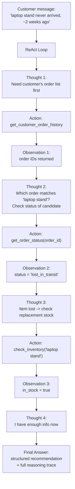

# Pattern 3: ReAct (Reason + Act)

## 1. What is the ReAct pattern?

**ReAct** ("Reasoning + Acting") makes the agent's thinking *visible and interleaved* with its
actions. Instead of silently deciding to call a tool (like Pattern 2), the model explicitly
narrates a loop:

```
Thought: <what I know so far, what I still need>
Action: <a tool to call>
Observation: <the tool's result>
... (repeat as needed) ...
Thought: I now have enough information
Final Answer: <the answer>
```

Each `Thought` is generated *after* seeing the previous `Observation`, so the agent's plan can
change as new facts come in — it's not committed to a fixed sequence of tool calls decided up
front. This is the difference between "call tools, then answer" (Pattern 2) and "reason,
act, observe, reason again" (Pattern 3): ReAct is adaptive and self-correcting step by step.

## 2. What problem does it solve?

Pattern 2's tool-loop works, but it's a black box: you see the tool calls and results, but not
*why* the model chose them, and if it goes down a wrong path there's no visible reasoning to
debug. That becomes a real problem when:

- A task needs **several dependent lookups** where each step's plan depends on the last
  result (e.g. "check if this order shipped; if not, check warehouse inventory; if out of
  stock, check the restock date").
- You need **explainability** — in regulated or high-stakes settings (finance, healthcare,
  legal), being able to show *why* the agent reached a conclusion, not just the final answer,
  is often a hard requirement.
- The model tends to **jump to conclusions** or call the wrong tool; forcing it to write out
  its reasoning before acting measurably improves accuracy (this is the core finding from the
  original ReAct paper, Yao et al. 2022) because it forces deliberate, stepwise reasoning
  instead of pattern-matching straight to an answer.

## 3. Realistic production example: Multi-Step Order Investigation Agent

**Building on Patterns 1 & 2 again.** Real support cases are often not a single lookup — they
need investigation:

> "I ordered a laptop stand 2 weeks ago (order somewhere in my recent history, I don't
> remember the ID) and it never arrived. Can you find out what happened and whether you can
> get me a replacement fast?"

This needs: find the customer's orders → identify which one matches "laptop stand" ordered
~2 weeks ago → check its status → if lost/delayed, check whether a replacement item is in
stock → produce an answer *and* a recommended next action. Each step depends on the previous
result — exactly the adaptive, multi-hop reasoning ReAct is built for. We add a **visible
reasoning trace** so a human support lead can audit exactly how the agent reached its
recommendation before it's sent.

## 4. Architecture / Flow Diagram



## 5. Request-to-response flow, step by step

1. **Input arrives**: the customer's (possibly vague, multi-fact) message.
2. **The loop starts** with a system prompt instructing the model to alternate strictly
   between `Thought`, `Action`, and (after execution) `Observation`, stopping only when it
   emits a `Final Answer`.
3. **Thought**: the model reasons in plain text about what it knows and what's missing.
   This isn't parsed structurally — it's kept as free text specifically so the model can think
   naturally, and so humans can read it directly for auditing.
4. **Action**: the model requests exactly one tool call (implemented here using the same
   `bind_tools` mechanism as Pattern 2 — ReAct is a *prompting/looping strategy* layered on
   top of Pattern 2's tool-calling mechanism, not a different mechanism).
5. **Observation**: the application executes the tool and injects the real result back into
   the conversation, labeled as an Observation.
6. **Loop**: steps 3–5 repeat. Because each new `Thought` sees the latest `Observation`, the
   model can change its plan — e.g., only decide to check inventory *after* learning the order
   was lost, not before.
7. **Termination**: the loop ends when the model emits a structured final answer instead of a
   new action, or when a max-step safety limit is hit (critical in production — an
   under-constrained ReAct loop can otherwise loop indefinitely).
8. **Output**: both the structured final answer *and* the full reasoning trace are returned,
   so the trace can be logged/audited even though only the final answer is shown to the
   customer.

## 6. Why this pattern fits (and when it doesn't)

**Fits well when:**
- Steps are *dependent* — what to do next genuinely depends on what the last observation was.
- You need an inspectable reasoning trace for debugging or compliance.
- Task complexity is moderate (a handful of steps) — ReAct's verbosity has a real token/cost
  and latency price per step.

**Doesn't fit when:**
- The tool sequence is fixed/known in advance (e.g. "always geocode, then always fetch
  weather") → Pattern 2's simpler loop is cheaper and just as correct.
- The task needs a full plan written out *before* any execution starts, so a human (or the
  system) can approve it first → **Planning Agent** (Pattern 4).
- The task is long-running/needs to check its own final answer for correctness before
  returning it → **Reflection Agent** (Pattern 5) and **Self-Critique Agent** (Pattern 6) add
  that on top.

## 7. Production-quality implementation

```python
"""
Pattern 3: ReAct (Reason + Act)
---------------------------------
A multi-step order-investigation agent that interleaves explicit reasoning
with tool calls, building on the tools from Pattern 2.

Run prerequisites:
    ollama pull llama3.1:8b
    pip install -U langchain langchain-core langchain-ollama pydantic

Run:
    python react_agent.py
"""

from __future__ import annotations

import json
import logging
import time
from dataclasses import dataclass, field
from datetime import date, timedelta
from typing import Optional

from langchain_core.messages import AIMessage, HumanMessage, SystemMessage, ToolMessage
from langchain_core.output_parsers import PydanticOutputParser
from langchain_core.exceptions import OutputParserException
from langchain_core.tools import tool
from langchain_ollama import ChatOllama
from pydantic import BaseModel, Field, ValidationError

logging.basicConfig(
    level=logging.INFO,
    format="%(asctime)s | %(levelname)s | %(name)s | %(message)s",
)
logger = logging.getLogger("react_agent")


# --------------------------------------------------------------------------
# Simulated backend data (extends Pattern 2's fake DB with item names and
# an inventory system, needed for the multi-hop investigation).
# --------------------------------------------------------------------------
_FAKE_ORDER_DB = {
    "48213": {"item": "wireless mouse", "status": "shipped",
              "eta": (date.today() + timedelta(days=1)).isoformat()},
    "50110": {"item": "laptop stand", "status": "lost_in_transit", "eta": None},
    "50111": {"item": "usb-c hub", "status": "delivered", "eta": None},
}

_FAKE_CUSTOMER_ORDERS = {
    "jane.doe@example.com": ["48213", "50110", "50111"],
}

_FAKE_INVENTORY = {
    "laptop stand": {"in_stock": True, "quantity": 42},
    "wireless mouse": {"in_stock": True, "quantity": 5},
    "usb-c hub": {"in_stock": False, "quantity": 0},
}


@tool
def get_customer_order_history(customer_email: str) -> str:
    """Return the list of recent order IDs and item names for a customer email."""
    order_ids = _FAKE_CUSTOMER_ORDERS.get(customer_email.lower(), [])
    orders = [{"order_id": oid, "item": _FAKE_ORDER_DB[oid]["item"]} for oid in order_ids]
    if not orders:
        return json.dumps({"error": f"No orders found for {customer_email}"})
    return json.dumps({"orders": orders})


@tool
def get_order_status(order_id: str) -> str:
    """Return status, item name, and ETA (if any) for a specific order ID."""
    order = _FAKE_ORDER_DB.get(order_id)
    if not order:
        return json.dumps({"error": f"No order found with ID {order_id}"})
    return json.dumps(order)


@tool
def check_inventory(item_name: str) -> str:
    """Check current stock level for an item by name, to see if a replacement
    can be sent out."""
    item = _FAKE_INVENTORY.get(item_name.lower())
    if item is None:
        return json.dumps({"error": f"No inventory record for '{item_name}'"})
    return json.dumps(item)


TOOLS = [get_customer_order_history, get_order_status, check_inventory]
TOOLS_BY_NAME = {t.name: t for t in TOOLS}


# --------------------------------------------------------------------------
# Output contract for the final answer
# --------------------------------------------------------------------------
class Recommendation(BaseModel):
    summary: str = Field(description="1-2 sentence summary of what happened to the order")
    recommended_action: str = Field(
        description="What the support team should do next, e.g. 'ship replacement', "
        "'issue refund', 'escalate to logistics'"
    )
    can_auto_resolve: bool = Field(
        description="True if this can be resolved automatically without a human"
    )


@dataclass
class ReActResult:
    answer: Recommendation
    trace: list[str] = field(default_factory=list)  # human-readable Thought/Action/Observation log


class ReActInvestigationAgent:
    """ReAct-style agent: explicit Thought -> Action -> Observation loop
    using LangChain tool binding under the hood."""

    SYSTEM_PROMPT = """You are a support investigation agent. You solve problems by reasoning
step by step and using tools, following the ReAct pattern:

- Write a "Thought:" explaining your reasoning and what you need to find out next.
- Then either call a tool to get more information, OR, if you have everything you need,
  respond with a final JSON answer instead of a tool call.

Rules:
- Always think before acting. Never call a tool without a preceding Thought.
- Only call ONE tool at a time so you can reason about its result before continuing.
- Once you have enough information, respond with ONLY a JSON object (no markdown fences,
  no extra text) matching this schema as your final answer:
{format_instructions}

Always put your Thought as plain text content alongside or before your tool call.
"""

    def __init__(
        self,
        model_name: str = "llama3.1:8b",
        temperature: float = 0.2,
        max_steps: int = 6,
        max_retries: int = 2,
    ) -> None:
        self.max_steps = max_steps
        self.max_retries = max_retries
        self.parser = PydanticOutputParser(pydantic_object=Recommendation)

        base_llm = ChatOllama(model=model_name, temperature=temperature)
        self.llm_with_tools = base_llm.bind_tools(TOOLS)

        self._system_message = SystemMessage(
            content=self.SYSTEM_PROMPT.format(
                format_instructions=self.parser.get_format_instructions()
            )
        )

    def _execute_tool_call(self, tool_call: dict, trace: list[str]) -> ToolMessage:
        name = tool_call["name"]
        args = tool_call.get("args", {})
        call_id = tool_call["id"]

        tool_fn = TOOLS_BY_NAME.get(name)
        if tool_fn is None:
            observation = f"Error: unknown tool '{name}'"
            logger.error(observation)
        else:
            try:
                observation = str(tool_fn.invoke(args))
            except Exception as e:
                observation = f"Error executing {name}: {e}"
                logger.error(observation)

        trace.append(f"Action: {name}({args})")
        trace.append(f"Observation: {observation}")
        logger.info(f"Action: {name}({args}) -> Observation: {observation}")
        return ToolMessage(content=observation, tool_call_id=call_id)

    def investigate(self, customer_message: str, customer_email: str) -> ReActResult:
        if not customer_message.strip():
            raise ValueError("customer_message must be non-empty")

        trace: list[str] = []
        messages: list = [
            self._system_message,
            HumanMessage(
                content=f"{customer_message}\n\n[Customer email: {customer_email}]"
            ),
        ]

        for step in range(1, self.max_steps + 1):
            response: AIMessage = self.llm_with_tools.invoke(messages)
            messages.append(response)

            # Log the model's Thought (its free-text content), if any
            if response.content and response.content.strip():
                trace.append(f"Thought: {response.content.strip()}")
                logger.info(f"Thought: {response.content.strip()[:200]}")

            if not response.tool_calls:
                # No more actions requested -> treat content as the final answer
                answer = self._parse_final_answer(response.content, messages)
                return ReActResult(answer=answer, trace=trace)

            for tool_call in response.tool_calls:
                messages.append(self._execute_tool_call(tool_call, trace))

        raise RuntimeError(
            f"ReAct loop exceeded max_steps={self.max_steps} without reaching a final answer. "
            f"Trace so far: {trace}"
        )

    def _parse_final_answer(self, content: str, messages: list) -> Recommendation:
        last_error: Optional[Exception] = None
        for attempt in range(1, self.max_retries + 2):
            try:
                return self.parser.parse(content)
            except (OutputParserException, ValidationError) as e:
                last_error = e
                logger.warning(f"final_parse_failed attempt={attempt} error={e}")
                messages.append(
                    HumanMessage(
                        content="That wasn't valid JSON matching the schema. "
                        "Respond again with ONLY the raw JSON object."
                    )
                )
                retry_response = self.llm_with_tools.invoke(messages)
                messages.append(retry_response)
                content = retry_response.content
        raise RuntimeError(f"Failed to parse final ReAct answer: {last_error}")


if __name__ == "__main__":
    agent = ReActInvestigationAgent(model_name="llama3.1:8b")

    message = (
        "I ordered a laptop stand about 2 weeks ago and it never arrived. "
        "Can you find out what happened and get me a replacement quickly?"
    )
    email = "jane.doe@example.com"

    print("=" * 70)
    print(f"CUSTOMER MESSAGE: {message}")
    start = time.monotonic()
    try:
        result = agent.investigate(message, customer_email=email)
        elapsed = time.monotonic() - start

        print(f"\n--- REASONING TRACE ({elapsed:.1f}s) ---")
        for line in result.trace:
            print(line)

        print("\n--- FINAL ANSWER ---")
        print(f"Summary: {result.answer.summary}")
        print(f"Recommended action: {result.answer.recommended_action}")
        print(f"Auto-resolvable: {result.answer.can_auto_resolve}")
    except (RuntimeError, ValueError) as e:
        print(f"FAILED: {e}")
```

### Notes on the code

- **`Thought` is just the model's free-text `content`** alongside (or instead of) a tool call —
  no special parsing needed. This keeps the reasoning natural instead of forcing a rigid
  micro-format, while still being fully logged for audit.
- **One tool call per step is enforced by prompt instruction**, not code, matching classic
  ReAct's tight loop (think → single act → observe) so each decision is grounded in the
  freshest possible information.
- **`max_steps` is a hard circuit breaker.** This is the most important production safeguard
  for ReAct: an ambiguous case or a model stuck in a loop must fail loudly with the partial
  trace preserved, rather than call tools/cost tokens forever.
- **The trace is returned alongside the structured answer** (`ReActResult`), not shown to the
  customer — it's for internal logging/auditing, e.g. attached to the ticket for a human
  reviewer to check the agent's reasoning before the recommendation is acted on.
- This still uses the **exact same `bind_tools` mechanism from Pattern 2** — ReAct is a
  prompting and control-flow pattern, not a different tool-calling API.

### Versions used

- Python `3.11+`
- `langchain-core` `0.3.x`
- `langchain-ollama` `0.2.x`
- `pydantic` `2.x`
- Model: `llama3.1:8b` via local Ollama

---

**Next: [Pattern 4 — Planning Agent](04-planning-agent.md)**, where instead of deciding one
step at a time, the agent first writes out a *complete multi-step plan* before executing
anything — useful when steps should be reviewable/approvable up front, or when jumping
straight into ReAct's step-by-step loop risks wasted or wrong early actions.
