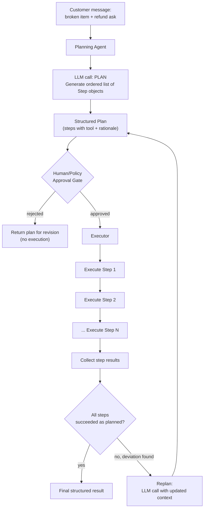

# Pattern 4: Planning Agent

## 1. What is a Planning Agent?

A **Planning Agent** separates *deciding what to do* from *doing it*. Before executing a
single tool call, the model first produces a complete, explicit multi-step plan — a list of
discrete sub-tasks with enough detail that a human (or a separate execution engine) could
review it, edit it, approve it, or reject it, *before* any action with real-world side effects
happens.

This is the key difference from ReAct (Pattern 3): ReAct interleaves one Thought → one Action
→ one Observation, adapting step by step as it goes. A Planning Agent instead does
**Plan (all steps) → Execute (each step) → optionally Replan** if execution reveals the plan
no longer fits. Planning is "measure twice, cut once"; ReAct is "cut, look, adjust, cut again."

## 2. What problem does it solve?

Step-by-step agents like ReAct work well for read-only investigations, but production systems
often need to take **actions with real consequences** — issuing a refund, creating a
replacement shipment, emailing a customer, modifying a database record. Letting a model decide
these one hidden step at a time, with no visibility into the full sequence, creates real risk:

- **No approval gate.** A human reviewer can't sign off on "issue $340 refund + expedite
  replacement" before it happens if the agent only reveals actions as it takes them.
- **No cost/scope estimate.** You can't tell upfront how many steps or tool calls a request
  will take, which matters for latency and cost budgets.
- **Harder to catch flawed reasoning early.** A bad plan is much easier to spot and fix as a
  short list of steps than by tracing through an in-progress interleaved execution log.

A Planning Agent solves this by making the *entire intended sequence of actions* a first-class,
inspectable artifact — generated once, up front, and (in production) optionally routed through
a human-in-the-loop approval gate before execution starts.

## 3. Realistic production example: Refund & Replacement Resolution Planner

**Building on the same order-support thread as Patterns 1–3.** For cases that involve
**money or shipping a replacement item**, the business requires a documented plan a support
supervisor can approve before anything happens — this is standard practice in most e-commerce
support orgs handling refunds above a threshold.

> "My laptop stand arrived broken. I want a replacement sent, and honestly given how late it
> was I think I deserve a partial refund too."

The agent should produce a **complete plan** up front: e.g.
1. Verify order and check it's eligible for replacement (not final-sale).
2. Check inventory for the replacement item.
3. Calculate refund eligibility based on delay policy.
4. Draft the replacement shipment request.
5. Draft the refund request (bounded, policy-compliant amount).
6. Draft a reply to the customer.

Only after a supervisor approves (simulated here as an approval flag) does execution run.

## 4. Architecture / Flow Diagram



## 5. Request-to-response flow, step by step

1. **Input arrives**: the customer's message describing the problem and ask.
2. **Planning call**: a single LLM call, prompted specifically to produce a **structured list
   of steps** (not to execute anything) — each step names the tool to use, its arguments, and
   a short rationale. This is parsed into a `Plan` Pydantic model, same discipline as every
   prior pattern.
3. **Approval gate**: in production, this plan is shown to a human supervisor (or checked
   against a policy engine — e.g. "no step may authorize a refund over $50 without human
   sign-off"). Here we simulate that with a configurable `auto_approve_under` threshold plus an
   explicit `approve()` call.
4. **Execution**: once approved, the executor runs each step's tool call **in the planned
   order**, collecting real results.
5. **Deviation check**: after execution, results are compared against what the plan expected
   (e.g., planned to check inventory and assumed in-stock, but it came back out-of-stock).
   If a deviation invalidates a later step, the agent **replans** from that point rather than
   blindly continuing a now-incorrect plan.
6. **Final answer**: a structured summary of what was actually done, returned to the caller
   along with the original plan, for a clean audit trail.

## 6. Why this pattern fits (and when it doesn't)

**Fits well when:**
- Actions have real-world side effects or cost, and need review/approval before execution.
- You need an inspectable, editable artifact (the plan) before committing to it.
- The task is decomposable into a bounded, mostly-predictable sequence of steps.

**Doesn't fit when:**
- The task is pure investigation/read-only with unpredictable branching at every step →
  ReAct (Pattern 3) is more natural and avoids planning overhead for something that will
  likely need replanning anyway.
- Steps are cheap, reversible, and don't need approval → the extra planning round-trip is just
  latency with no benefit; use Pattern 2's simpler tool loop.
- The agent needs to check and improve *the quality of its own final output* rather than the
  correctness of its action sequence → that's **Reflection** (Pattern 5) or **Self-Critique**
  (Pattern 6).

## 7. Production-quality implementation

```python
"""
Pattern 4: Planning Agent
----------------------------
A refund/replacement resolution agent that plans a full sequence of steps
up front, gates them behind an approval check, executes them, and replans
on deviation.

Run prerequisites:
    ollama pull llama3.1:8b
    pip install -U langchain langchain-core langchain-ollama pydantic

Run:
    python planning_agent.py
"""

from __future__ import annotations

import json
import logging
import time
from enum import Enum
from typing import Literal, Optional

from langchain_core.messages import HumanMessage, SystemMessage
from langchain_core.output_parsers import PydanticOutputParser
from langchain_core.exceptions import OutputParserException
from langchain_core.tools import tool
from langchain_ollama import ChatOllama
from pydantic import BaseModel, Field, ValidationError

logging.basicConfig(
    level=logging.INFO,
    format="%(asctime)s | %(levelname)s | %(name)s | %(message)s",
)
logger = logging.getLogger("planning_agent")


# --------------------------------------------------------------------------
# Simulated backend + tools the PLAN can reference (execution only, no
# planning logic lives inside these — they just do one job each).
# --------------------------------------------------------------------------
_FAKE_ORDER_DB = {
    "50110": {"item": "laptop stand", "price": 39.99, "eligible_for_replacement": True,
              "days_late": 9},
}
_FAKE_INVENTORY = {"laptop stand": {"in_stock": True, "quantity": 12}}

REFUND_POLICY_MAX_AUTO = 25.00  # refunds above this always need human approval
LATE_REFUND_PER_DAY = 2.00      # policy: $2 credit per day late, capped by order price


@tool
def check_order_eligibility(order_id: str) -> str:
    """Check if an order exists and is eligible for replacement/refund."""
    order = _FAKE_ORDER_DB.get(order_id)
    if not order:
        return json.dumps({"error": f"Order {order_id} not found"})
    return json.dumps(order)


@tool
def check_inventory(item_name: str) -> str:
    """Check stock availability for an item."""
    item = _FAKE_INVENTORY.get(item_name.lower())
    if item is None:
        return json.dumps({"error": f"No inventory record for '{item_name}'"})
    return json.dumps(item)


@tool
def calculate_late_refund(order_id: str) -> str:
    """Calculate the policy-compliant partial refund amount for a late order."""
    order = _FAKE_ORDER_DB.get(order_id)
    if not order:
        return json.dumps({"error": f"Order {order_id} not found"})
    amount = min(order["days_late"] * LATE_REFUND_PER_DAY, order["price"])
    return json.dumps({"refund_amount": round(amount, 2)})


@tool
def create_replacement_shipment(order_id: str, item_name: str) -> str:
    """Create a replacement shipment request for an order. Simulated — in
    production this would call the fulfillment system."""
    logger.info(f"[SIMULATED FULFILLMENT] Replacement created for order={order_id} item={item_name}")
    return json.dumps({"replacement_created": True, "order_id": order_id})


@tool
def issue_refund(order_id: str, amount: float) -> str:
    """Issue a refund for an order. Simulated — in production this would call
    the payments system."""
    logger.info(f"[SIMULATED PAYMENTS] Refund issued order={order_id} amount=${amount}")
    return json.dumps({"refund_issued": True, "order_id": order_id, "amount": amount})


TOOLS_BY_NAME = {
    t.name: t
    for t in [
        check_order_eligibility,
        check_inventory,
        calculate_late_refund,
        create_replacement_shipment,
        issue_refund,
    ]
}


# --------------------------------------------------------------------------
# Structured plan schema — the artifact a human/policy engine reviews
# --------------------------------------------------------------------------
class PlanStep(BaseModel):
    step_number: int
    tool_name: Literal[
        "check_order_eligibility",
        "check_inventory",
        "calculate_late_refund",
        "create_replacement_shipment",
        "issue_refund",
    ]
    tool_args: dict = Field(description="Arguments to pass to the tool, e.g. {'order_id': '50110'}")
    rationale: str = Field(description="Why this step is needed, one sentence")


class Plan(BaseModel):
    goal: str = Field(description="One-sentence description of what this plan accomplishes")
    steps: list[PlanStep]
    requires_human_approval: bool = Field(
        description="True if any step involves a refund or action a policy engine "
        "should review before execution"
    )


class StepResult(BaseModel):
    step_number: int
    tool_name: str
    success: bool
    output: str


class ExecutionSummary(BaseModel):
    plan: Plan
    step_results: list[StepResult]
    final_reply_to_customer: str = Field(
        description="A short, polite summary reply for the customer describing what was done"
    )


# --------------------------------------------------------------------------
# The Planning Agent
# --------------------------------------------------------------------------
class RefundResolutionPlanner:
    """Plans a full resolution sequence, gates it behind approval, executes
    it, and replans on deviation."""

    PLAN_SYSTEM_PROMPT = """You are a support resolution planner for an e-commerce company.

Given a customer's issue, produce a COMPLETE PLAN of steps to resolve it, using only these
tools: check_order_eligibility, check_inventory, calculate_late_refund,
create_replacement_shipment, issue_refund.

Rules:
- Always check_order_eligibility first if an order is involved.
- Only include issue_refund or create_replacement_shipment if the case clearly warrants it.
- Never invent a refund amount yourself — always get it from calculate_late_refund.
- Mark requires_human_approval = true if the plan includes any refund or replacement action.

Respond with ONLY a JSON object matching this schema (no markdown fences, no extra text):
{format_instructions}
"""

    def __init__(
        self,
        model_name: str = "llama3.1:8b",
        temperature: float = 0.1,
        max_retries: int = 2,
        auto_approve_under: float = REFUND_POLICY_MAX_AUTO,
    ) -> None:
        self.max_retries = max_retries
        self.auto_approve_under = auto_approve_under
        self.plan_parser = PydanticOutputParser(pydantic_object=Plan)
        self.llm = ChatOllama(model=model_name, temperature=temperature)

        self._plan_system_message = SystemMessage(
            content=self.PLAN_SYSTEM_PROMPT.format(
                format_instructions=self.plan_parser.get_format_instructions()
            )
        )

    # ---- Step 1: Plan ----
    def create_plan(self, customer_message: str, order_id: str) -> Plan:
        messages = [
            self._plan_system_message,
            HumanMessage(content=f"{customer_message}\n\n[Order ID: {order_id}]"),
        ]
        last_error: Optional[Exception] = None
        for attempt in range(1, self.max_retries + 2):
            try:
                response = self.llm.invoke(messages)
                plan = self.plan_parser.parse(response.content)
                logger.info(f"plan_created steps={len(plan.steps)} "
                            f"requires_approval={plan.requires_human_approval}")
                return plan
            except (OutputParserException, ValidationError) as e:
                last_error = e
                logger.warning(f"plan_parse_failed attempt={attempt} error={e}")
                messages.append(HumanMessage(
                    content="That wasn't valid JSON matching the schema. Respond again "
                    "with ONLY the raw JSON object."
                ))
        raise RuntimeError(f"Failed to create a valid plan: {last_error}")

    # ---- Step 2: Approval gate ----
    def requires_manual_approval(self, plan: Plan) -> bool:
        """Policy check: any refund step over the auto-approve threshold, or any
        plan the model itself flagged, must be reviewed by a human."""
        if plan.requires_human_approval:
            for step in plan.steps:
                if step.tool_name == "issue_refund":
                    amount = step.tool_args.get("amount", 0)
                    # Amount may not be known yet if it's calculated mid-plan; that's fine —
                    # the executor re-checks after calculate_late_refund runs.
                    if isinstance(amount, (int, float)) and amount > self.auto_approve_under:
                        return True
            return True  # any refund/replacement plan gets reviewed in this simulation
        return False

    # ---- Step 3: Execute ----
    def execute_plan(self, plan: Plan) -> list[StepResult]:
        results: list[StepResult] = []
        computed_refund_amount: Optional[float] = None

        for step in plan.steps:
            tool_fn = TOOLS_BY_NAME[step.tool_name]
            args = dict(step.tool_args)

            # Deviation handling: if issue_refund's amount wasn't computed by the plan
            # itself, pull it from the earlier calculate_late_refund result instead of
            # trusting a model-invented number.
            if step.tool_name == "issue_refund" and computed_refund_amount is not None:
                args["amount"] = computed_refund_amount

            try:
                raw_output = tool_fn.invoke(args)
                parsed = json.loads(raw_output) if isinstance(raw_output, str) else raw_output
                if step.tool_name == "calculate_late_refund" and "refund_amount" in parsed:
                    computed_refund_amount = parsed["refund_amount"]

                results.append(StepResult(
                    step_number=step.step_number,
                    tool_name=step.tool_name,
                    success="error" not in parsed,
                    output=raw_output,
                ))
                logger.info(f"step={step.step_number} tool={step.tool_name} "
                            f"success={'error' not in parsed}")
            except Exception as e:
                logger.error(f"step_execution_failed step={step.step_number} error={e}")
                results.append(StepResult(
                    step_number=step.step_number, tool_name=step.tool_name,
                    success=False, output=str(e),
                ))
                break  # stop executing on a hard failure; a real system would replan here

        return results

    # ---- Orchestration ----
    def resolve(self, customer_message: str, order_id: str, approve: bool = False) -> ExecutionSummary:
        plan = self.create_plan(customer_message, order_id)

        if self.requires_manual_approval(plan) and not approve:
            raise PermissionError(
                "Plan requires human approval before execution. "
                "Review the plan and call resolve(..., approve=True) to proceed.\n"
                f"Plan: {plan.model_dump_json(indent=2)}"
            )

        step_results = self.execute_plan(plan)
        reply = self._draft_final_reply(customer_message, plan, step_results)

        return ExecutionSummary(plan=plan, step_results=step_results, final_reply_to_customer=reply)

    def _draft_final_reply(self, customer_message: str, plan: Plan, results: list[StepResult]) -> str:
        summary_of_results = "\n".join(f"- {r.tool_name}: {r.output}" for r in results)
        prompt = (
            f"Customer originally said: {customer_message}\n\n"
            f"Here is what was actually done:\n{summary_of_results}\n\n"
            "Write a short, warm, 2-4 sentence reply to the customer summarizing the "
            "resolution. State concrete facts only (replacement shipped, refund amount) "
            "based on the results above — do not invent details."
        )
        response = self.llm.invoke([HumanMessage(content=prompt)])
        return response.content.strip()


if __name__ == "__main__":
    planner = RefundResolutionPlanner(model_name="llama3.1:8b")

    message = (
        "My laptop stand (order #50110) arrived broken and it was already 9 days late. "
        "I'd like a replacement sent, and I think I deserve some credit for how late it was."
    )

    print("=" * 70)
    print(f"CUSTOMER MESSAGE: {message}")

    # First call: expect it to require approval and NOT execute
    try:
        planner.resolve(message, order_id="50110", approve=False)
    except PermissionError as e:
        print(f"\n--- APPROVAL REQUIRED ---\n{e}")

    # Simulate a supervisor reviewing and approving the plan
    print("\n--- SUPERVISOR APPROVES PLAN ---")
    start = time.monotonic()
    summary = planner.resolve(message, order_id="50110", approve=True)
    elapsed = time.monotonic() - start

    print(f"\n--- EXECUTION SUMMARY ({elapsed:.1f}s) ---")
    for r in summary.step_results:
        print(f"Step {r.step_number} [{r.tool_name}] success={r.success}: {r.output}")

    print(f"\n--- REPLY TO CUSTOMER ---\n{summary.final_reply_to_customer}")
```

### Notes on the code

- **`Plan` is the reviewable artifact.** The `PermissionError` path in `resolve()` is a stand-in
  for a real approval workflow (e.g. write the plan to a queue, notify a supervisor via Slack,
  wait for an approve/reject webhook) — the important architectural point is that execution is
  *impossible* until approval is granted.
- **The executor never trusts model-invented numbers for money.** Even though the plan step for
  `issue_refund` might contain a placeholder amount, `execute_plan` overwrites it with the real
  value returned by `calculate_late_refund` — a concrete example of "ground actions in tool
  results, not model text" applied specifically to a high-stakes field.
- **Execution stops on hard failure** rather than plowing through a now-invalid plan; a fuller
  implementation would call `create_plan` again with the failure context appended
  (a "replan" call), which is noted in the flow diagram.
- **Separation of concerns**: `create_plan` (LLM), `requires_manual_approval` (policy code, no
  LLM), and `execute_plan` (deterministic tool execution) are three distinct methods —
  reviewable, testable, and auditable independently.

### Versions used

- Python `3.11+`
- `langchain-core` `0.3.x`
- `langchain-ollama` `0.2.x`
- `pydantic` `2.x`
- Model: `llama3.1:8b` via local Ollama

---

**Next: [Pattern 5 — Reflection Agent](05-reflection-agent.md)**, where instead of reviewing
the *plan* before execution, the agent reviews the *quality of its own output* after
producing it — catching a poorly-written customer reply or a weak analysis before it ever
leaves the system.
