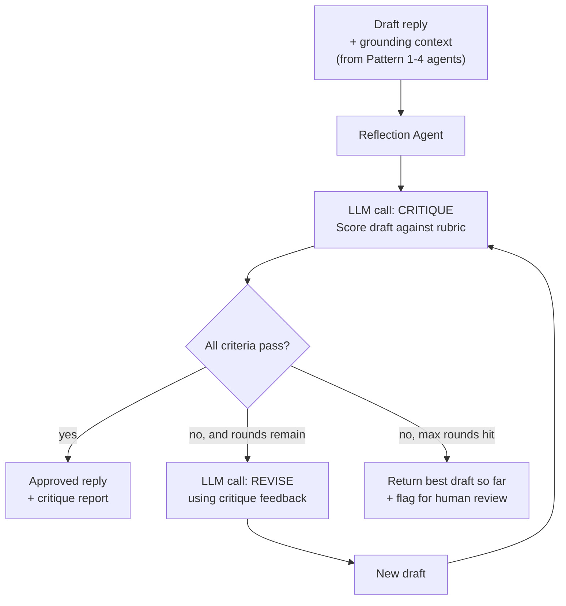

# Pattern 5: Reflection Agent

## 1. What is a Reflection Agent?

A **Reflection Agent** produces an initial output, then explicitly steps back and evaluates
its *own* work against a set of quality criteria, and revises it if it falls short — before
that output ever reaches the end user. The core loop is:

```
Draft -> Reflect (critique against criteria) -> Revise -> (repeat until good enough or limit hit)
```

The key idea is **separating generation from evaluation**, usually with two distinct prompts
(or even two different LLM calls) so the model isn't just generating text and moving on — it's
being asked, in a fresh pass, "does this actually meet the bar?" This tends to catch mistakes,
missing details, and tone problems that don't show up when a model is asked to "just get it
right the first time."

## 2. What problem does it solves

Every pattern so far assumes the agent's first output is good enough to act on or send.
In practice, first-pass LLM output — especially customer-facing text — often has real
problems: missing a specific detail the customer asked about, an overly blunt tone for a
frustrated customer, an unsupported claim, or a reply that doesn't actually address the
question. Shipping first-draft output straight to customers is risky for brand and support
quality.

A Basic/Tool-Using/Planning agent has **no built-in quality gate** — it trusts its own first
draft completely. A Reflection Agent solves this by treating the first draft as exactly that:
a draft. It adds a self-review step with explicit criteria, catching issues like:

- Tone mismatches (e.g. too curt with an already-frustrated customer).
- Missing information the customer explicitly asked for.
- Policy violations (e.g. promising something support isn't authorized to promise).
- Factual inconsistency with the actual data retrieved (from a tool, per Pattern 2/3).

## 3. Realistic production example: Customer Reply Quality Gate

**Building on the previous patterns' outputs.** Every draft reply produced by our support
agents (Patterns 1–4) — before it's sent to a customer or shown to a human agent for
one-click approval — passes through a Reflection Agent that checks it against a fixed
rubric:

1. **Addresses the question** — does it actually answer what the customer asked?
2. **Tone-appropriate** — empathetic if the customer is upset, concise if they just want facts.
3. **No unsupported promises** — no refund amounts, dates, or guarantees not backed by data
   already retrieved.
4. **Grounded** — doesn't state any fact (order status, item name) that wasn't in the provided
   context.

If the draft fails any criterion, the agent revises it and re-checks, up to a bounded number
of rounds, and reports which issues (if any) it caught and fixed — useful telemetry for
tracking draft quality over time.

## 4. Architecture / Flow Diagram



## 5. Request-to-response flow, step by step

1. **Input**: a draft reply plus its grounding context (e.g. the real order status data it's
   supposed to reflect, and a note on the customer's apparent emotional tone).
2. **Critique call**: a *separate* LLM call, with a prompt whose only job is evaluation — it
   scores the draft against each rubric criterion (pass/fail + a short reason) and returns a
   structured `Critique` object. Using a separate call (rather than asking the same call to
   "write and then check yourself") measurably reduces the model just rubber-stamping its own
   work.
3. **Decision**: if every criterion passes, the draft is approved as-is.
4. **Revision call**: if any criterion fails, a third call is made — given the original draft,
   the context, and the specific critique feedback — to produce a revised draft addressing
   exactly the flagged issues (not a full rewrite from scratch, which tends to introduce new
   problems).
5. **Loop**: the revised draft goes back through the critique step. This repeats up to
   `max_rounds` (kept small — 2 is often enough; diminishing returns and cost grow fast beyond
   that).
6. **Termination**: either an approved draft, or — if still failing after max rounds — the
   best available draft is returned along with a `needs_human_review=True` flag, so nothing
   silently ships as "fine" when it isn't.

## 6. Why this pattern fits (and when it doesn't)

**Fits well when:**
- Output quality has real consequences (customer-facing text, anything brand- or
  compliance-sensitive).
- Failure modes are somewhat predictable and expressible as a fixed rubric.
- You can afford 2-3x the LLM calls of a single-pass agent in exchange for materially higher
  quality.

**Doesn't fit when:**
- Latency/cost budget can't absorb multiple extra calls per request, and the task is
  low-stakes (e.g. an internal debug log summary) — Basic Agent is enough.
- The quality bar is genuinely subjective/open-ended rather than rubric-checkable — a fixed
  checklist won't capture it, and you likely want a human reviewer instead.
- What you actually need is the model checking its **reasoning process/factual correctness**
  through structured self-argument rather than **polishing a piece of text** — see
  **Self-Critique Agent** (Pattern 6), which is closely related but focused on verifying
  claims and logic rather than tone/completeness of a draft.

## 7. Production-quality implementation

```python
"""
Pattern 5: Reflection Agent
------------------------------
A quality gate that critiques and revises customer-facing draft replies
against a fixed rubric before they're allowed out the door.

Run prerequisites:
    ollama pull llama3.1:8b
    pip install -U langchain langchain-core langchain-ollama pydantic

Run:
    python reflection_agent.py
"""

from __future__ import annotations

import logging
import time
from typing import Optional

from langchain_core.messages import HumanMessage, SystemMessage
from langchain_core.output_parsers import PydanticOutputParser
from langchain_core.exceptions import OutputParserException
from langchain_ollama import ChatOllama
from pydantic import BaseModel, Field, ValidationError

logging.basicConfig(
    level=logging.INFO,
    format="%(asctime)s | %(levelname)s | %(name)s | %(message)s",
)
logger = logging.getLogger("reflection_agent")


# --------------------------------------------------------------------------
# Structured critique schema
# --------------------------------------------------------------------------
class CriterionResult(BaseModel):
    criterion: str
    passed: bool
    reason: str = Field(description="Brief reason for pass/fail, quoting the draft if relevant")


class Critique(BaseModel):
    criteria_results: list[CriterionResult]
    overall_pass: bool
    revision_instructions: Optional[str] = Field(
        default=None,
        description="If overall_pass is False, concrete instructions for what to fix. "
        "Null if overall_pass is True.",
    )


class ReflectionResult(BaseModel):
    final_reply: str
    rounds_taken: int
    needs_human_review: bool
    critique_history: list[Critique]


# --------------------------------------------------------------------------
# The Reflection Agent
# --------------------------------------------------------------------------
class ReplyQualityGate:
    """Critiques a draft reply against a fixed rubric and revises it until
    it passes or a round limit is hit."""

    RUBRIC = [
        "Addresses the customer's actual question or request directly.",
        "Tone matches the situation (empathetic if the customer seems upset or frustrated; "
        "concise and friendly otherwise).",
        "Makes no promises (refund amounts, dates, guarantees) that are not explicitly "
        "supported by the provided context data.",
        "States no fact (order status, item, dates) that is not present in the provided "
        "context data.",
    ]

    CRITIQUE_SYSTEM_PROMPT = """You are a strict quality reviewer for customer support replies.

Evaluate the DRAFT REPLY against each of these criteria, using ONLY the provided CONTEXT DATA
as ground truth (never your own assumptions about the order):

{rubric}

For each criterion, decide pass or fail with a short reason. Set overall_pass to true only if
ALL criteria pass. If overall_pass is false, give clear, specific revision_instructions.

Respond with ONLY a JSON object matching this schema (no markdown fences, no extra text):
{format_instructions}
"""

    REVISE_SYSTEM_PROMPT = """You are revising a customer support reply based on reviewer
feedback. Keep everything that already works; fix only what the feedback flags. Do not
introduce new claims or facts beyond the provided CONTEXT DATA. Output ONLY the revised
reply text, nothing else (no preamble, no quotes around it).
"""

    def __init__(
        self,
        model_name: str = "llama3.1:8b",
        temperature: float = 0.3,
        max_rounds: int = 2,
        max_retries: int = 2,
    ) -> None:
        self.max_rounds = max_rounds
        self.max_retries = max_retries
        self.critique_parser = PydanticOutputParser(pydantic_object=Critique)
        self.llm = ChatOllama(model=model_name, temperature=temperature)

        rubric_text = "\n".join(f"{i+1}. {c}" for i, c in enumerate(self.RUBRIC))
        self._critique_system_message = SystemMessage(
            content=self.CRITIQUE_SYSTEM_PROMPT.format(
                rubric=rubric_text,
                format_instructions=self.critique_parser.get_format_instructions(),
            )
        )

    def _critique(self, draft: str, context_data: str) -> Critique:
        prompt = f"CONTEXT DATA:\n{context_data}\n\nDRAFT REPLY:\n{draft}"
        messages = [self._critique_system_message, HumanMessage(content=prompt)]

        last_error: Optional[Exception] = None
        for attempt in range(1, self.max_retries + 2):
            try:
                response = self.llm.invoke(messages)
                return self.critique_parser.parse(response.content)
            except (OutputParserException, ValidationError) as e:
                last_error = e
                logger.warning(f"critique_parse_failed attempt={attempt} error={e}")
                messages.append(HumanMessage(
                    content="That wasn't valid JSON matching the schema. Respond again "
                    "with ONLY the raw JSON object."
                ))
        raise RuntimeError(f"Failed to produce a valid critique: {last_error}")

    def _revise(self, draft: str, context_data: str, revision_instructions: str) -> str:
        prompt = (
            f"CONTEXT DATA:\n{context_data}\n\n"
            f"ORIGINAL DRAFT:\n{draft}\n\n"
            f"REVIEWER FEEDBACK:\n{revision_instructions}"
        )
        messages = [SystemMessage(content=self.REVISE_SYSTEM_PROMPT), HumanMessage(content=prompt)]
        response = self.llm.invoke(messages)
        return response.content.strip()

    def review_and_improve(self, draft_reply: str, context_data: str) -> ReflectionResult:
        current_draft = draft_reply
        critique_history: list[Critique] = []

        for round_num in range(1, self.max_rounds + 1):
            critique = self._critique(current_draft, context_data)
            critique_history.append(critique)

            failed = [c.criterion for c in critique.criteria_results if not c.passed]
            logger.info(f"round={round_num} overall_pass={critique.overall_pass} "
                        f"failed_criteria={failed}")

            if critique.overall_pass:
                return ReflectionResult(
                    final_reply=current_draft,
                    rounds_taken=round_num,
                    needs_human_review=False,
                    critique_history=critique_history,
                )

            if round_num < self.max_rounds:
                current_draft = self._revise(
                    current_draft, context_data, critique.revision_instructions or ""
                )
                logger.info(f"round={round_num} revised_draft_produced")

        # Max rounds exhausted without a clean pass
        return ReflectionResult(
            final_reply=current_draft,
            rounds_taken=self.max_rounds,
            needs_human_review=True,
            critique_history=critique_history,
        )


if __name__ == "__main__":
    gate = ReplyQualityGate(model_name="llama3.1:8b", max_rounds=2)

    # Context data grounded in real tool results (as would come from Pattern 2/3's agents)
    context_data = (
        "order_id: 50110\n"
        "item: laptop stand\n"
        "status: lost_in_transit\n"
        "replacement_in_stock: true\n"
        "customer_tone: frustrated (order 9 days late, item never arrived)\n"
        "authorized_refund_amount: 18.00  # from calculate_late_refund, do not exceed"
    )

    # A deliberately weak first draft to demonstrate the reflection loop catching issues:
    # vague, doesn't mention the replacement or refund, and is too curt for a frustrated customer.
    weak_draft = "We'll look into your order. Thanks for reaching out."

    print("=" * 70)
    print(f"ORIGINAL DRAFT: {weak_draft}")

    start = time.monotonic()
    result = gate.review_and_improve(weak_draft, context_data)
    elapsed = time.monotonic() - start

    print(f"\n--- CRITIQUE HISTORY ({elapsed:.1f}s, {result.rounds_taken} round(s)) ---")
    for i, critique in enumerate(result.critique_history, 1):
        print(f"\nRound {i}: overall_pass={critique.overall_pass}")
        for c in critique.criteria_results:
            status = "PASS" if c.passed else "FAIL"
            print(f"  [{status}] {c.criterion} — {c.reason}")

    print(f"\n--- FINAL REPLY ---\n{result.final_reply}")
    print(f"\nneeds_human_review: {result.needs_human_review}")
```

### Notes on the code

- **Critique and revision are separate LLM calls with separate system prompts.** This is the
  single most important implementation detail of Reflection: a model asked to "write, then
  check your own work in the same breath" tends to be lenient. Splitting them into distinct
  calls with a strict reviewer persona produces meaningfully harsher, more useful critiques.
- **The rubric is explicit and fixed**, not "use your judgment" — this is what makes the
  pattern production-usable: consistent, auditable criteria rather than vibes, and something
  you can update as a config change when new failure modes show up in real tickets.
- **Revision is targeted, not a rewrite-from-scratch.** The prompt explicitly says "keep what
  works, fix only what's flagged" — full rewrites tend to regress previously-passing criteria.
- **`needs_human_review` is the honest failure path.** If the loop exhausts `max_rounds`
  without a clean pass, the agent doesn't pretend success — it flags the output for a human,
  which is the correct behavior for a quality gate that guards customer-facing text.
- **`critique_history` is retained and returned** — valuable for monitoring draft quality
  trends over time (e.g., "tone failures are up 20% this week" is a signal worth acting on).

### Versions used

- Python `3.11+`
- `langchain-core` `0.3.x`
- `langchain-ollama` `0.2.x`
- `pydantic` `2.x`
- Model: `llama3.1:8b` via local Ollama

---

**Next: [Pattern 6 — Self-Critique Agent](06-self-critique-agent.md)**, which applies a similar
generate-then-evaluate loop, but to the *correctness of reasoning and factual claims* — e.g.
verifying a multi-step analysis or calculation — rather than the tone/completeness of
customer-facing text.
