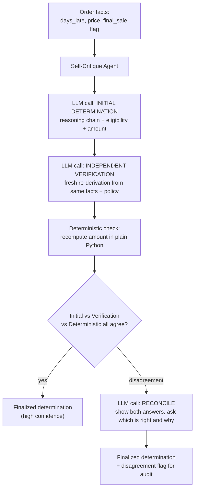

# Pattern 6: Self-Critique Agent

## 1. What is a Self-Critique Agent?

A **Self-Critique Agent** generates an answer that includes explicit reasoning or claims —
calculations, logical steps, factual assertions — and then interrogates that reasoning itself:
checking each step for logical validity, verifying arithmetic, and cross-checking claims
against the source data they're supposed to be derived from. It's easy to confuse with
Reflection (Pattern 5), so it's worth being precise about the difference:

- **Reflection** asks: *"Is this piece of text good?"* (tone, completeness, does it address
  the question).
- **Self-Critique** asks: *"Is this reasoning/claim actually correct?"* (is the arithmetic
  right, does each logical step follow from the last, is every stated fact traceable to a
  real source).

Reflection polishes; Self-Critique verifies. In production they're often used together, but
they catch fundamentally different failure classes.

## 2. What problem does it solves

LLMs are fluent, which means their reasoning can be **confidently wrong** — an eligibility
decision or a calculated amount can read as perfectly logical while containing an arithmetic
error, a skipped policy condition, or a conclusion that doesn't actually follow from the
stated facts. This is especially dangerous anywhere a wrong number or wrong "yes/no" decision
has direct financial or compliance consequences: refund amounts, discount eligibility,
contract clause interpretation, risk scoring.

A Self-Critique Agent solves this by never trusting a single reasoning pass. It:

1. Produces an initial reasoning chain + conclusion.
2. Independently re-derives or checks each step (ideally with a fresh prompt, sometimes with
   deterministic code for anything checkable, like arithmetic).
3. Flags and fixes any step that doesn't hold up, and only then finalizes the conclusion.

## 3. Realistic production example: Refund Eligibility & Amount Verifier

**Continuing the refund theme from Pattern 4**, but now focused specifically on getting the
*decision itself* right, independent of tone/wording (Pattern 5's job). Refund policy at our
example company:

- Late by 3–7 days → 10% credit of item price.
- Late by 8–14 days → 20% credit of item price, capped at $25.
- Late by 15+ days → full refund eligible.
- Item marked `final_sale` → never eligible for refund, regardless of delay.

A single LLM call computing this is exactly the kind of "confidently wrong" risk described
above — off-by-one errors on day thresholds, or missing the `final_sale` override, are common
and expensive if unchecked. The Self-Critique Agent produces the initial determination, then
runs an independent verification pass (a fresh prompt re-deriving the answer from policy +
facts) plus a deterministic Python check on the arithmetic, and reconciles any disagreement
before finalizing.

## 4. Architecture / Flow Diagram



## 5. Request-to-response flow, step by step

1. **Input**: the order facts needed to apply policy (days late, item price, final-sale flag).
2. **Initial determination**: an LLM call reasons step by step through the policy and produces
   a structured `Determination` (eligible: bool, tier, credit_amount, reasoning steps).
3. **Independent verification**: a *second, separately-prompted* LLM call is given the same
   raw facts and policy text — but not the first call's reasoning or answer — and asked to
   derive its own determination from scratch. This independence is what makes it a real check
   rather than the model just agreeing with itself.
4. **Deterministic check**: because the amount calculation is a pure function of policy rules,
   it's also recomputed in plain Python. Any check that *can* be done deterministically should
   be — LLM self-checking is for judgment calls (does this fact pattern match this policy
   clause), not arithmetic a calculator does perfectly.
5. **Comparison**: the three results (initial, independent, deterministic) are compared.
6. **Reconciliation**: if all three agree, confidence is high and the result is finalized
   immediately. If they disagree, a fourth call shows the model both conflicting answers and
   asks it to identify which is correct and why — this targeted reconciliation prompt performs
   much better than a vague "please double check" would.
7. **Output**: a finalized determination, with a `verified` flag and, if reconciliation was
   needed, a note explaining the discrepancy — critical audit trail for a financial decision.

## 6. Why this pattern fits (and when it doesn't)

**Fits well when:**
- Getting the answer *exactly right* matters more than speed/cost (financial calculations,
  eligibility decisions, compliance checks).
- Any part of the check can be made deterministic — always prefer that over an LLM re-check
  for those parts.
- Errors are subtle and plausible-looking, not obviously wrong (the hardest kind to catch by
  just reading the output once).

**Doesn't fit when:**
- The task is fuzzy/creative and there's no ground truth to check against — "is this reasoning
  correct" doesn't apply to something like tone or persuasiveness (use Reflection instead).
- Cost/latency is tight and the stakes of an error are low — running 2-4 LLM calls per
  determination is real overhead you shouldn't pay for a low-stakes decision.
- The correctness question is really about whether the *plan/sequence of actions* was right,
  not whether a *specific reasoning chain* was right — that's closer to Planning Agent
  (Pattern 4) with a replan step.

## 7. Production-quality implementation

```python
"""
Pattern 6: Self-Critique Agent
---------------------------------
A refund eligibility verifier that independently re-derives its own
determination and cross-checks the arithmetic deterministically before
finalizing anything.

Run prerequisites:
    ollama pull llama3.1:8b
    pip install -U langchain langchain-core langchain-ollama pydantic

Run:
    python self_critique_agent.py
"""

from __future__ import annotations

import logging
import time
from typing import Optional

from langchain_core.messages import HumanMessage, SystemMessage
from langchain_core.output_parsers import PydanticOutputParser
from langchain_core.exceptions import OutputParserException
from langchain_ollama import ChatOllama
from pydantic import BaseModel, Field, ValidationError

logging.basicConfig(
    level=logging.INFO,
    format="%(asctime)s | %(levelname)s | %(name)s | %(message)s",
)
logger = logging.getLogger("self_critique_agent")


POLICY_TEXT = """Refund policy for late deliveries:
- If item is marked final_sale: NEVER eligible for any refund, regardless of delay.
- Late by 3-7 days: 10% credit of item price.
- Late by 8-14 days: 20% credit of item price, capped at $25.00.
- Late by 15+ days: full refund (100% of item price).
- Late by 0-2 days: not eligible (within acceptable delivery window).
"""


# --------------------------------------------------------------------------
# Structured schema for a determination
# --------------------------------------------------------------------------
class Determination(BaseModel):
    eligible: bool
    tier: str = Field(description="Which policy tier applied, e.g. '8-14 days' or 'final_sale'")
    credit_amount: float = Field(description="Dollar amount, 0.00 if not eligible")
    reasoning_steps: list[str] = Field(description="Step-by-step reasoning that led to this conclusion")


class VerifiedDetermination(BaseModel):
    final: Determination
    initial: Determination
    independent: Determination
    deterministic_amount: float
    all_agreed: bool
    reconciliation_note: Optional[str] = None


# --------------------------------------------------------------------------
# Deterministic ground truth for anything that's pure arithmetic/logic —
# never trust an LLM to do this reliably when plain code can do it perfectly.
# --------------------------------------------------------------------------
def deterministic_refund_calc(days_late: int, price: float, final_sale: bool) -> tuple[bool, str, float]:
    if final_sale:
        return False, "final_sale", 0.00
    if days_late >= 15:
        return True, "15+ days", round(price, 2)
    if days_late >= 8:
        return True, "8-14 days", round(min(price * 0.20, 25.00), 2)
    if days_late >= 3:
        return True, "3-7 days", round(price * 0.10, 2)
    return False, "0-2 days", 0.00


class RefundVerifierAgent:
    """Self-critique agent: initial determination + independent re-derivation
    + deterministic check, reconciling any disagreement before finalizing."""

    DETERMINATION_PROMPT = """You are applying a refund policy to a specific order's facts.

POLICY:
{policy}

Reason step by step through the policy against the given facts, then give your final
determination. Respond with ONLY a JSON object matching this schema (no markdown fences,
no extra text):
{format_instructions}
"""

    RECONCILE_PROMPT = """Two independent analyses of the same refund case produced different
answers. Determine which is correct (or derive the correct answer yourself if both are wrong),
citing the policy explicitly.

POLICY:
{policy}

FACTS:
{facts}

ANALYSIS A:
{analysis_a}

ANALYSIS B:
{analysis_b}

DETERMINISTIC CALCULATION (trust this for the dollar amount specifically, it's a pure
policy-formula calculation, not a judgment call):
{deterministic}

Respond with ONLY a JSON object matching this schema for the CORRECT final determination
(no markdown fences, no extra text):
{format_instructions}
"""

    def __init__(self, model_name: str = "llama3.1:8b", temperature: float = 0.1, max_retries: int = 2) -> None:
        self.max_retries = max_retries
        self.parser = PydanticOutputParser(pydantic_object=Determination)
        self.llm = ChatOllama(model=model_name, temperature=temperature)

    def _call_for_determination(self, facts: str, prompt_template: str, **extra) -> Determination:
        system_content = prompt_template.format(
            policy=POLICY_TEXT,
            format_instructions=self.parser.get_format_instructions(),
            **extra,
        )
        messages = [SystemMessage(content=system_content), HumanMessage(content=facts)]

        last_error: Optional[Exception] = None
        for attempt in range(1, self.max_retries + 2):
            try:
                response = self.llm.invoke(messages)
                return self.parser.parse(response.content)
            except (OutputParserException, ValidationError) as e:
                last_error = e
                logger.warning(f"determination_parse_failed attempt={attempt} error={e}")
                messages.append(HumanMessage(
                    content="That wasn't valid JSON matching the schema. Respond again "
                    "with ONLY the raw JSON object."
                ))
        raise RuntimeError(f"Failed to produce a valid determination: {last_error}")

    def verify(self, days_late: int, price: float, final_sale: bool) -> VerifiedDetermination:
        facts = (
            f"days_late: {days_late}\nitem_price: ${price:.2f}\nfinal_sale: {final_sale}"
        )

        # 1. Initial determination
        initial = self._call_for_determination(facts, self.DETERMINATION_PROMPT)
        logger.info(f"initial eligible={initial.eligible} tier={initial.tier} "
                    f"amount={initial.credit_amount}")

        # 2. Independent re-derivation (fresh call, same facts, no knowledge of `initial`)
        independent = self._call_for_determination(facts, self.DETERMINATION_PROMPT)
        logger.info(f"independent eligible={independent.eligible} tier={independent.tier} "
                    f"amount={independent.credit_amount}")

        # 3. Deterministic ground truth for the arithmetic/logic
        det_eligible, det_tier, det_amount = deterministic_refund_calc(days_late, price, final_sale)
        logger.info(f"deterministic eligible={det_eligible} tier={det_tier} amount={det_amount}")

        all_agreed = (
            initial.eligible == independent.eligible == det_eligible
            and abs(initial.credit_amount - det_amount) < 0.01
            and abs(independent.credit_amount - det_amount) < 0.01
        )

        if all_agreed:
            return VerifiedDetermination(
                final=initial, initial=initial, independent=independent,
                deterministic_amount=det_amount, all_agreed=True,
            )

        # 4. Reconciliation — disagreement found, resolve it explicitly and log it for audit
        logger.warning("disagreement_detected running_reconciliation")
        reconcile_content = self.RECONCILE_PROMPT.format(
            policy=POLICY_TEXT,
            facts=facts,
            analysis_a=initial.model_dump_json(),
            analysis_b=independent.model_dump_json(),
            deterministic=f"eligible={det_eligible}, tier={det_tier}, amount=${det_amount:.2f}",
            format_instructions=self.parser.get_format_instructions(),
        )
        messages = [SystemMessage(content=reconcile_content), HumanMessage(content=facts)]
        response = self.llm.invoke(messages)
        final = self.parser.parse(response.content)

        # Belt-and-suspenders: never let the final dollar amount deviate from the
        # deterministic calculation, no matter what the reconciliation call said.
        if abs(final.credit_amount - det_amount) > 0.01:
            logger.warning(
                f"reconciliation_amount_overridden model_said={final.credit_amount} "
                f"forcing_deterministic={det_amount}"
            )
            final.credit_amount = det_amount

        return VerifiedDetermination(
            final=final, initial=initial, independent=independent,
            deterministic_amount=det_amount, all_agreed=False,
            reconciliation_note=(
                f"Initial and independent analyses disagreed "
                f"(initial=${initial.credit_amount:.2f}, independent=${independent.credit_amount:.2f}); "
                f"reconciled against deterministic policy calculation (${det_amount:.2f})."
            ),
        )


if __name__ == "__main__":
    agent = RefundVerifierAgent(model_name="llama3.1:8b")

    cases = [
        {"days_late": 9, "price": 39.99, "final_sale": False},   # 20% tier, capped test
        {"days_late": 20, "price": 150.00, "final_sale": False}, # full refund tier
        {"days_late": 12, "price": 60.00, "final_sale": True},   # final_sale override
    ]

    for case in cases:
        print("\n" + "=" * 70)
        print(f"FACTS: {case}")
        start = time.monotonic()
        result = agent.verify(**case)
        elapsed = time.monotonic() - start

        print(f"[{elapsed:.1f}s] all_agreed={result.all_agreed}")
        print(f"FINAL: eligible={result.final.eligible} tier={result.final.tier} "
              f"amount=${result.final.credit_amount:.2f}")
        if result.reconciliation_note:
            print(f"RECONCILIATION: {result.reconciliation_note}")
```

### Notes on the code

- **Two independent LLM calls, not one call asked to "double-check itself."** The `initial`
  and `independent` calls use identical prompts and facts but are separate invocations with no
  shared context — this independence is what gives disagreement real diagnostic value (if the
  model just re-reads its own answer and nods, you've learned nothing).
- **Deterministic code is the ground truth for anything checkable.** `deterministic_refund_calc`
  isn't a "third opinion" — it's treated as authoritative for the dollar amount because it's a
  pure function of stated policy rules. Never use an LLM to check arithmetic that plain code
  can compute exactly.
- **The final safeguard** (`if abs(final.credit_amount - det_amount) > 0.01: ... forcing
  deterministic`) is deliberate belt-and-suspenders: even the reconciliation call's output is
  not blindly trusted for the money field — the deterministic value always wins for the amount,
  while the LLM is trusted for the more judgment-based `eligible`/`tier`/reasoning fields.
- **Every disagreement is logged and surfaced** in `reconciliation_note` — in a real system
  this would also increment a metric (`refund_determination_disagreement_rate`), since a rising
  disagreement rate is a strong signal the underlying model or prompt needs attention.

### Versions used

- Python `3.11+`
- `langchain-core` `0.3.x`
- `langchain-ollama` `0.2.x`
- `pydantic` `2.x`
- Model: `llama3.1:8b` via local Ollama

---

**Next: [Pattern 7 — Self-Improving Agent](07-self-improving-agent.md)**, where instead of
verifying a single answer, the agent accumulates feedback *across many runs over time* and
uses it to improve its own prompts/strategy — turning individual corrections into lasting
improvement rather than one-off fixes.
