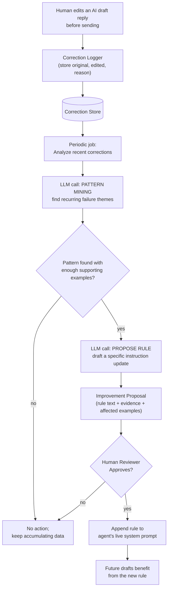

# Pattern 7: Self-Improving Agent

## 1. What is a Self-Improving Agent?

A **Self-Improving Agent** doesn't just handle one request well — it accumulates feedback
*across many runs over time* (corrections from humans, outcomes of past decisions, patterns
in what kept failing) and uses that accumulated experience to change its own future behavior:
updating its prompt, adding new few-shot examples, or adjusting rules — without a human
manually rewriting the prompt every time a new failure mode is discovered.

This is different from every pattern so far, which improve a *single* output within a *single*
request (Reflection revises one draft; Self-Critique verifies one determination). Self-
Improvement operates on a longer timescale: it's about the agent getting measurably better at
its job *release over release*, driven by real production feedback, not about polishing one
answer right now.

## 2. What problem does it solves

Even with Reflection and Self-Critique gates in place, the same *category* of mistake can keep
recurring — the same tone problem shows up in every ticket about a certain product line, the
same edge case in a policy keeps tripping up the eligibility checker. Fixing these one ticket
at a time (Pattern 5/6's job) never reduces the *rate* at which they happen; it only cleans up
after the fact. Meanwhile, manually noticing these patterns and rewriting prompts by hand is
slow, easy to neglect, and doesn't scale as ticket volume grows.

A Self-Improving Agent solves this by treating every human correction or negative outcome as
labeled training signal: it stores each correction, periodically looks for **recurring
patterns** in what's being corrected, and — crucially, with a human review gate before
anything ships — proposes concrete updates to its own instructions (an added rule, a new
example) that should reduce that specific failure mode going forward.

## 3. Realistic production example: Learning From Support-Reply Corrections

**Building on Pattern 5's reply quality gate.** Whenever a human support agent edits an
AI-drafted reply before sending it, that edit is a rich signal: it shows exactly what was
wrong and what "good" looks like for that case. Today, those corrections are usually just...
sent and forgotten. This agent instead:

1. **Logs** every (original draft, human-edited final version, short reason if given) triple.
2. **Periodically analyzes** a batch of these corrections (e.g. weekly) to find recurring
   patterns — "the model keeps omitting the estimated delivery date when one is available."
3. **Proposes a specific, minimal prompt update** (a new rule or few-shot example) targeting
   that pattern, with the supporting evidence (which corrections drove the proposal).
4. **Routes the proposal to a human** for approval — the agent never silently rewrites its own
   production prompt; it recommends a change and shows its work, matching the "propose,
   don't auto-deploy" discipline enterprises expect from anything touching a live system
   prompt.
5. Once approved, the new rule is appended to the agent's instructions for future runs.

## 4. Architecture / Flow Diagram



## 5. Request-to-response flow, step by step

1. **Continuous logging**: every time a human edits an AI draft (from Pattern 1 or Pattern 5's
   output) before it goes out, the (original, edited, optional reason) triple is stored. This
   happens automatically as part of normal operations — no extra step for the support agent.
2. **Batch trigger**: on a schedule (e.g. weekly) or once enough new corrections accumulate
   (e.g. 20+), the improvement job runs.
3. **Pattern mining call**: an LLM reads a batch of corrections and is asked specifically to
   find *recurring* themes — not to comment on each one individually, but to identify what
   keeps showing up across multiple examples, with a minimum-support threshold so a single
   one-off correction doesn't trigger a prompt change.
4. **Proposal call**: for each pattern with enough supporting evidence, a second call drafts a
   concrete, minimal instruction to add to the system prompt — phrased as a rule, with the
   specific corrections that justify it attached as evidence.
5. **Human review**: proposals are queued for a human to approve, edit, or reject — this gate
   exists because prompt changes affect *every future request*, so the blast radius of a bad
   change is much larger than a single wrong reply.
6. **Deployment**: approved rules are appended to the versioned system prompt (with the
   evidence kept in a changelog), and the updated agent is used going forward.
7. **Feedback loop closes**: the next batch of corrections will show whether the new rule
   actually reduced that failure pattern — a fully-instrumented version of this would track
   the failure-pattern rate before/after each prompt version.

## 6. Why this pattern fits (and when it doesn't)

**Fits well when:**
- The agent runs at high enough volume that recurring failure patterns are common and worth
  systematically fixing rather than one-off correcting.
- You have (or can capture) a feedback signal — human edits, thumbs down, downstream outcome —
  tied to individual runs.
- Prompt/instruction changes are cheap to deploy relative to retraining a model, making this a
  practical lever (this pattern is about **prompt/instruction evolution**, not fine-tuning).

**Doesn't fit when:**
- Volume is too low to find statistically meaningful patterns — a handful of corrections a
  month isn't enough signal, and you'd be reacting to noise.
- Changes need to happen instantly, within a single conversation — this is a slow, batch,
  between-releases pattern, not an in-request adaptation (that would be closer to Reflection
  or Self-Critique, working within one call).
- There's no human review capacity — auto-deploying prompt changes without review is exactly
  the failure mode this pattern's approval gate exists to prevent.

## 7. Production-quality implementation

```python
"""
Pattern 7: Self-Improving Agent
-----------------------------------
Logs human corrections to AI-drafted replies, periodically mines them for
recurring patterns, and proposes (human-approved) prompt rule updates.

Run prerequisites:
    ollama pull llama3.1:8b
    pip install -U langchain langchain-core langchain-ollama pydantic

Run:
    python self_improving_agent.py
"""

from __future__ import annotations

import json
import logging
import time
from dataclasses import dataclass, field
from datetime import datetime
from pathlib import Path
from typing import Optional

from langchain_core.messages import HumanMessage, SystemMessage
from langchain_core.output_parsers import PydanticOutputParser
from langchain_core.exceptions import OutputParserException
from langchain_ollama import ChatOllama
from pydantic import BaseModel, Field, ValidationError

logging.basicConfig(
    level=logging.INFO,
    format="%(asctime)s | %(levelname)s | %(name)s | %(message)s",
)
logger = logging.getLogger("self_improving_agent")


# --------------------------------------------------------------------------
# Correction store — in production this would be a real database table;
# here it's a simple JSONL file for a runnable, self-contained example.
# --------------------------------------------------------------------------
@dataclass
class Correction:
    original_draft: str
    edited_final: str
    reason: Optional[str] = None
    timestamp: str = field(default_factory=lambda: datetime.utcnow().isoformat())


class CorrectionStore:
    def __init__(self, path: str = "corrections.jsonl") -> None:
        self.path = Path(path)

    def log(self, correction: Correction) -> None:
        with self.path.open("a") as f:
            f.write(json.dumps(correction.__dict__) + "\n")
        logger.info(f"correction_logged reason={correction.reason!r}")

    def load_recent(self, limit: int = 50) -> list[Correction]:
        if not self.path.exists():
            return []
        lines = self.path.read_text().strip().splitlines()
        records = [json.loads(line) for line in lines[-limit:]]
        return [Correction(**r) for r in records]


# --------------------------------------------------------------------------
# Structured schemas for pattern mining + proposal
# --------------------------------------------------------------------------
class FailurePattern(BaseModel):
    theme: str = Field(description="Short name for the recurring issue, e.g. 'omits ETA'")
    description: str = Field(description="What the model keeps doing wrong")
    supporting_example_indices: list[int] = Field(
        description="0-based indices into the provided corrections list that show this pattern"
    )


class PatternMiningResult(BaseModel):
    patterns: list[FailurePattern] = Field(
        description="Only include patterns with at least 2 supporting examples. "
        "Empty list if nothing recurring was found."
    )


class RuleProposal(BaseModel):
    pattern_theme: str
    proposed_rule: str = Field(
        description="A single, concrete instruction to add to the system prompt, phrased "
        "as an imperative rule, e.g. 'Always state the estimated delivery date if one is "
        "present in the context data.'"
    )
    rationale: str


# --------------------------------------------------------------------------
# The Self-Improving Agent
# --------------------------------------------------------------------------
class SelfImprovingReplyAgent:
    """Mines recurring correction patterns and proposes (human-gated) prompt
    rule updates to reduce them going forward."""

    BASE_SYSTEM_PROMPT = (
        "You are a customer support reply assistant. Draft short, accurate, "
        "empathetic replies grounded only in the provided context data."
    )

    MINING_PROMPT = """You are analyzing a batch of human corrections to AI-drafted customer
support replies. Each entry has the ORIGINAL AI draft and the EDITED final version a human
support agent actually sent.

Find RECURRING patterns — issues that show up across MULTIPLE corrections, not one-off edits.
Only include a pattern if at least 2 of the provided examples support it.

CORRECTIONS:
{corrections_text}

Respond with ONLY a JSON object matching this schema (no markdown fences, no extra text):
{format_instructions}
"""

    PROPOSAL_PROMPT = """Given this recurring failure pattern found in AI-drafted replies,
propose ONE concrete, minimal rule to add to the assistant's system prompt that would prevent
it going forward. The rule must be a single clear imperative sentence.

PATTERN: {theme}
DESCRIPTION: {description}
EXAMPLE CORRECTIONS SUPPORTING THIS PATTERN:
{examples_text}

Respond with ONLY a JSON object matching this schema (no markdown fences, no extra text):
{format_instructions}
"""

    def __init__(
        self,
        model_name: str = "llama3.1:8b",
        temperature: float = 0.2,
        max_retries: int = 2,
        min_corrections_for_mining: int = 2,
        correction_store: Optional[CorrectionStore] = None,
    ) -> None:
        self.max_retries = max_retries
        self.min_corrections_for_mining = min_corrections_for_mining
        self.llm = ChatOllama(model=model_name, temperature=temperature)
        self.store = correction_store or CorrectionStore()

        self.mining_parser = PydanticOutputParser(pydantic_object=PatternMiningResult)
        self.proposal_parser = PydanticOutputParser(pydantic_object=RuleProposal)

        # The "live" system prompt — starts as the base prompt, grows with approved rules.
        self.active_rules: list[str] = []

    @property
    def current_system_prompt(self) -> str:
        if not self.active_rules:
            return self.BASE_SYSTEM_PROMPT
        rules_text = "\n".join(f"- {r}" for r in self.active_rules)
        return f"{self.BASE_SYSTEM_PROMPT}\n\nAdditional rules learned from past corrections:\n{rules_text}"

    # ---- Normal operation: log a correction whenever a human edits a draft ----
    def log_correction(self, original_draft: str, edited_final: str, reason: Optional[str] = None) -> None:
        if original_draft.strip() == edited_final.strip():
            return  # no actual correction happened
        self.store.log(Correction(original_draft=original_draft, edited_final=edited_final, reason=reason))

    # ---- Periodic improvement job ----
    def _call_llm_structured(self, system_content: str, user_content: str, parser) -> BaseModel:
        messages = [SystemMessage(content=system_content), HumanMessage(content=user_content)]
        last_error: Optional[Exception] = None
        for attempt in range(1, self.max_retries + 2):
            try:
                response = self.llm.invoke(messages)
                return parser.parse(response.content)
            except (OutputParserException, ValidationError) as e:
                last_error = e
                logger.warning(f"structured_call_failed attempt={attempt} error={e}")
                messages.append(HumanMessage(
                    content="That wasn't valid JSON matching the schema. Respond again "
                    "with ONLY the raw JSON object."
                ))
        raise RuntimeError(f"Structured call failed after retries: {last_error}")

    def mine_patterns(self, corrections: list[Correction]) -> PatternMiningResult:
        if len(corrections) < self.min_corrections_for_mining:
            logger.info("not_enough_corrections_to_mine")
            return PatternMiningResult(patterns=[])

        corrections_text = "\n\n".join(
            f"[{i}] ORIGINAL: {c.original_draft}\n    EDITED: {c.edited_final}\n    "
            f"REASON: {c.reason or 'not given'}"
            for i, c in enumerate(corrections)
        )
        system_content = self.MINING_PROMPT.format(
            corrections_text=corrections_text,
            format_instructions=self.mining_parser.get_format_instructions(),
        )
        result = self._call_llm_structured(system_content, "Analyze the corrections above.", self.mining_parser)
        logger.info(f"patterns_found={len(result.patterns)}")
        return result

    def propose_rule(self, pattern: FailurePattern, corrections: list[Correction]) -> RuleProposal:
        examples_text = "\n\n".join(
            f"ORIGINAL: {corrections[i].original_draft}\nEDITED: {corrections[i].edited_final}"
            for i in pattern.supporting_example_indices
            if i < len(corrections)
        )
        system_content = self.PROPOSAL_PROMPT.format(
            theme=pattern.theme,
            description=pattern.description,
            examples_text=examples_text,
            format_instructions=self.proposal_parser.get_format_instructions(),
        )
        return self._call_llm_structured(system_content, "Propose the rule.", self.proposal_parser)

    def run_improvement_cycle(self) -> list[RuleProposal]:
        """Runs the full mine -> propose pipeline. Returns proposals awaiting
        human approval; does NOT modify active_rules itself."""
        corrections = self.store.load_recent(limit=50)
        mining_result = self.mine_patterns(corrections)

        proposals = []
        for pattern in mining_result.patterns:
            proposal = self.propose_rule(pattern, corrections)
            proposals.append(proposal)
            logger.info(f"proposal_generated theme={proposal.pattern_theme} "
                        f"rule={proposal.proposed_rule!r}")
        return proposals

    # ---- Human approval gate ----
    def approve_and_apply(self, proposal: RuleProposal) -> None:
        """A human reviewer calls this explicitly to accept a proposal. This is
        the ONLY path by which the live system prompt changes."""
        self.active_rules.append(proposal.proposed_rule)
        logger.info(f"rule_applied rule={proposal.proposed_rule!r} "
                    f"total_active_rules={len(self.active_rules)}")


if __name__ == "__main__":
    store = CorrectionStore(path="demo_corrections.jsonl")
    # Reset the demo file for a clean run each time this script executes
    Path("demo_corrections.jsonl").unlink(missing_ok=True)

    agent = SelfImprovingReplyAgent(model_name="llama3.1:8b", correction_store=store)

    # Simulate several human corrections that share a recurring pattern:
    # the AI drafts keep omitting the estimated delivery date even when it's available.
    sample_corrections = [
        ("We're looking into your order, thanks for your patience.",
         "We're looking into your order — it's currently showing an estimated delivery "
         "of this Thursday. Thanks for your patience!",
         "omitted the ETA we had on file"),
        ("Your replacement is on its way!",
         "Your replacement is on its way and should arrive by Friday!",
         "should include ETA when we have one"),
        ("Thanks for reaching out, we'll update you soon.",
         "Thanks for reaching out — your order is currently in transit with an ETA of "
         "Tuesday, we'll keep you posted if anything changes.",
         "missing ETA again"),
    ]
    for original, edited, reason in sample_corrections:
        agent.log_correction(original, edited, reason)

    print("=" * 70)
    print("BEFORE IMPROVEMENT CYCLE:")
    print(agent.current_system_prompt)

    start = time.monotonic()
    proposals = agent.run_improvement_cycle()
    elapsed = time.monotonic() - start

    print(f"\n--- PROPOSALS FOUND ({elapsed:.1f}s) ---")
    for p in proposals:
        print(f"\nPattern: {p.pattern_theme}")
        print(f"Proposed rule: {p.proposed_rule}")
        print(f"Rationale: {p.rationale}")

    if proposals:
        print("\n--- SIMULATING HUMAN APPROVAL OF FIRST PROPOSAL ---")
        agent.approve_and_apply(proposals[0])

    print("\nAFTER IMPROVEMENT CYCLE (approved rules applied):")
    print(agent.current_system_prompt)
```

### Notes on the code

- **Corrections are the training signal, logged as a normal side effect** of humans editing
  drafts — no extra workflow step is imposed on support staff, which is essential for this
  data actually accumulating in practice.
- **`min_corrections_for_mining` and "at least 2 supporting examples per pattern"** are both
  explicit anti-overfitting guards: this pattern must not let a single unusual correction
  permanently change behavior for every future request.
- **`approve_and_apply` is the only path that mutates `active_rules`.** There is deliberately
  no automatic path from `run_improvement_cycle()`'s output straight into the live prompt —
  mirroring the human-approval discipline from Pattern 4's Planning Agent, applied here to
  prompt changes instead of financial actions.
- **`current_system_prompt` is a property**, not a stored string, so every call always reflects
  the latest approved rules — and in a real system, each version would be timestamped/versioned
  so you can correlate prompt changes with downstream quality metrics.
- **`CorrectionStore` is a trivial JSONL file here** for a runnable standalone example; the
  interface (`log`, `load_recent`) is what matters — swapping in a real database is a drop-in
  change with no changes needed to the mining/proposal logic.

### Versions used

- Python `3.11+`
- `langchain-core` `0.3.x`
- `langchain-ollama` `0.2.x`
- `pydantic` `2.x`
- Model: `llama3.1:8b` via local Ollama

---

**Next: [Pattern 8 — Router Agent](08-router-agent.md)**, where we shift from improving a
single agent's own output over time to a new structural pattern: directing incoming requests
to the *right specialized agent* out of several — the foundation multi-agent systems
(Patterns 9-13) are built on.
