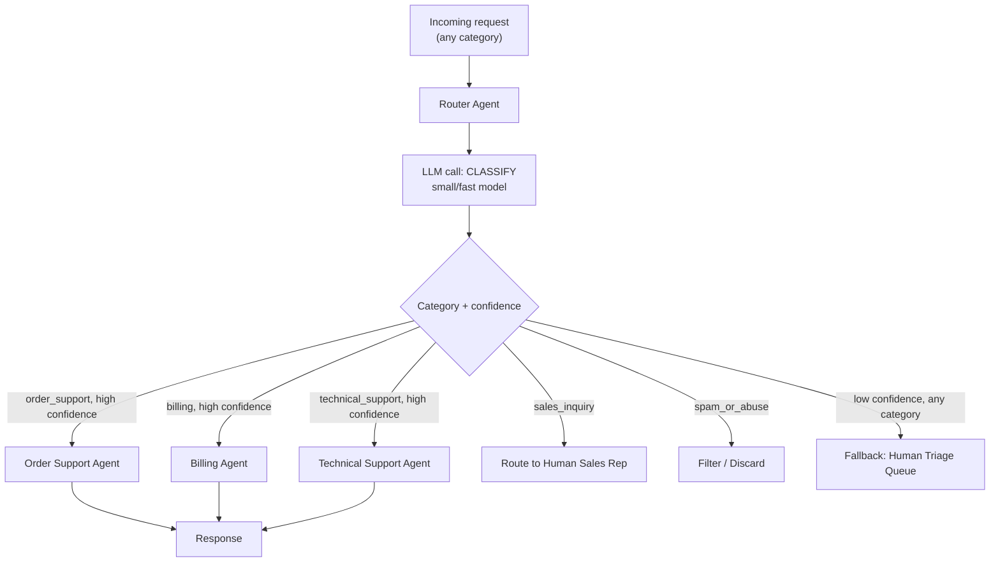

# Pattern 8: Router Agent

## 1. What is a Router Agent?

A **Router Agent** looks at an incoming request and decides *which specialized handler* should
process it, then hands off execution to that handler. It doesn't try to solve the request
itself — its only job is classification-and-dispatch: "this is a `billing` request → send it
to the billing agent," "this is a `technical_support` request → send it to the technical
agent." This is the structural pattern that every multi-agent system in this series (Supervisor,
Hierarchical, Multi-Agent System) builds on top of.

The router itself is usually a small, fast, cheap agent (often a lighter model than the
specialists it routes to) — its whole value is in getting requests to the *right* place
quickly, not in doing deep work itself.

## 2. What problem does it solves

As an agent's responsibilities grow, cramming everything into one giant prompt — "handle
billing questions, AND technical issues, AND account changes, AND sales inquiries" — causes
real problems:

- **Prompt bloat and interference.** Instructions for unrelated domains crowd each other out,
  and the model can blend rules that shouldn't apply together (e.g. a billing refund rule
  bleeding into a technical troubleshooting answer).
- **Wasted capability/cost.** A request that's purely a password reset doesn't need the same
  large model or the same tool access as a complex billing dispute — one-size-fits-all wastes
  compute on simple cases and under-serves complex ones.
- **Hard to maintain.** Updating the billing logic risks unintended side effects on unrelated
  technical-support behavior when it's all one prompt.

A Router Agent solves this by separating "figure out what kind of request this is" from
"handle it well" — letting each specialist agent stay focused, simpler to prompt, easier to
test, and independently improvable (including with Pattern 7's self-improvement loop, scoped
per specialist).

## 3. Realistic production example: Support Request Router

**The natural next step after Patterns 1-7**, which all assumed the ticket was already
"support triage" flavored. In reality, a company's single support inbox gets a mix of very
different request types, each needing a different specialized agent:

- `order_support` → the order-investigation/refund agents from Patterns 2-6.
- `billing` → a billing-specific agent (payment methods, invoices, subscription changes).
- `technical_support` → a product-troubleshooting agent with its own tools (diagnostics, KB
  search).
- `sales_inquiry` → routed straight to a human sales rep, no AI drafting at all.
- `spam_or_abuse` → filtered out immediately, never reaches any agent.

The Router Agent's whole job is: read the incoming message, classify it into exactly one of
these categories with a confidence score, and dispatch it — with a safe fallback for anything
ambiguous.

## 4. Architecture / Flow Diagram



## 5. Request-to-response flow, step by step

1. **Input arrives**: a raw message, category unknown.
2. **Classification call**: the router's only LLM call — a small, fast, low-temperature call
   that outputs a structured `RoutingDecision` (category + confidence + brief reasoning). This
   should be a cheap call by design; the router's value is speed and correctness of dispatch,
   not depth of understanding.
3. **Confidence check**: if confidence is below a threshold, the router **doesn't guess** — it
   sends the request to a human triage queue rather than risk sending an ambiguous request to
   the wrong specialist (which is often worse than a short delay for a human to look at it).
4. **Dispatch**: above threshold, the router calls the corresponding specialist handler
   (implemented here as a registry mapping category → handler function/agent).
5. **Specialist executes**: from this point on, the specialist agent (e.g. any of Patterns
   1-7's agents) owns the request completely — the router's job is done.
6. **Unregistered category handling**: if the model returns a category not in the registry
   (a real risk with any classifier), the router treats this as low-confidence and falls back
   to the human queue rather than crashing.
7. **Logging**: every routing decision is logged (category, confidence, and — crucially —
   whether a human later overrode the routing), which is exactly the kind of data Pattern 7's
   self-improvement loop could mine to improve the router's classification prompt over time.

## 6. Why this pattern fits (and when it doesn't)

**Fits well when:**
- Requests fall into a handful of genuinely distinct categories that benefit from separate
  prompts, tools, or models.
- You want to control cost by using a cheap model for the (frequent) routing decision and
  reserving expensive/capable models for the (less frequent, harder) specialist work.
- New categories will be added over time — a router with a pluggable handler registry scales
  cleanly; a single monolithic prompt does not.

**Doesn't fit when:**
- There's really only one type of request (no meaningful branching) — the router is pure
  overhead; use the relevant single agent pattern directly.
- Categories genuinely overlap or a request needs *multiple* specialists collaborating on the
  same response, not routed to just one → that's **Supervisor Agent** (Pattern 9), which
  coordinates several agents together rather than exclusively dispatching to one.
- The routing decision itself needs deep, multi-step reasoning (rare — routing is usually a
  fast classification task) — if that's really the case, reconsider whether "routing" is the
  right framing at all.

## 7. Production-quality implementation

```python
"""
Pattern 8: Router Agent
---------------------------
Classifies incoming support requests and dispatches to the right
specialist handler, with a safe human-fallback for low-confidence or
unrecognized categories.

Run prerequisites:
    ollama pull llama3.2:3b     # small/fast model, good fit for routing
    pip install -U langchain langchain-core langchain-ollama pydantic

Run:
    python router_agent.py
"""

from __future__ import annotations

import logging
import time
from enum import Enum
from typing import Callable, Optional

from langchain_core.messages import HumanMessage, SystemMessage
from langchain_core.output_parsers import PydanticOutputParser
from langchain_core.exceptions import OutputParserException
from langchain_ollama import ChatOllama
from pydantic import BaseModel, Field, ValidationError

logging.basicConfig(
    level=logging.INFO,
    format="%(asctime)s | %(levelname)s | %(name)s | %(message)s",
)
logger = logging.getLogger("router_agent")


# --------------------------------------------------------------------------
# Categories and routing decision schema
# --------------------------------------------------------------------------
class Category(str, Enum):
    ORDER_SUPPORT = "order_support"
    BILLING = "billing"
    TECHNICAL_SUPPORT = "technical_support"
    SALES_INQUIRY = "sales_inquiry"
    SPAM_OR_ABUSE = "spam_or_abuse"


class RoutingDecision(BaseModel):
    category: Category
    confidence: float = Field(ge=0.0, le=1.0)
    reasoning: str = Field(description="One short sentence explaining the classification")


# --------------------------------------------------------------------------
# Stand-in specialist handlers. In production these would be the full agents
# from Patterns 1-7 (or other teams' services); kept minimal here to keep
# this file focused on the routing mechanism itself.
# --------------------------------------------------------------------------
def handle_order_support(message: str) -> str:
    return f"[OrderSupportAgent] Investigating order-related request: {message[:60]}..."


def handle_billing(message: str) -> str:
    return f"[BillingAgent] Handling billing request: {message[:60]}..."


def handle_technical_support(message: str) -> str:
    return f"[TechnicalSupportAgent] Running diagnostics for: {message[:60]}..."


def handle_sales_inquiry(message: str) -> str:
    return f"[SalesRouting] Forwarded to human sales rep: {message[:60]}..."


def handle_spam_or_abuse(message: str) -> str:
    return "[SpamFilter] Message discarded, no further action."


def handle_human_fallback(message: str) -> str:
    return f"[HumanTriageQueue] Routed for manual review (low confidence): {message[:60]}..."


HANDLER_REGISTRY: dict[Category, Callable[[str], str]] = {
    Category.ORDER_SUPPORT: handle_order_support,
    Category.BILLING: handle_billing,
    Category.TECHNICAL_SUPPORT: handle_technical_support,
    Category.SALES_INQUIRY: handle_sales_inquiry,
    Category.SPAM_OR_ABUSE: handle_spam_or_abuse,
}


# --------------------------------------------------------------------------
# The Router Agent
# --------------------------------------------------------------------------
class SupportRouterAgent:
    """Classifies a request and dispatches it to the right specialist,
    falling back to a human queue on low confidence or unknown categories."""

    SYSTEM_PROMPT = """You are a fast, precise request router for a customer support inbox.

Classify the message into EXACTLY ONE of these categories:
- order_support: questions about an existing order's status, delivery, refunds, replacements.
- billing: payment methods, invoices, subscription charges, pricing disputes.
- technical_support: product not working, bugs, setup/configuration help.
- sales_inquiry: questions from a prospective or existing customer about buying something new.
- spam_or_abuse: unsolicited advertising, abusive language, clearly not a real support request.

Give a confidence score (0.0-1.0) for your classification. If the message is ambiguous or
could fit multiple categories, lower your confidence accordingly rather than guessing.

Respond with ONLY a JSON object matching this schema (no markdown fences, no extra text):
{format_instructions}
"""

    def __init__(
        self,
        model_name: str = "llama3.2:3b",
        temperature: float = 0.0,
        confidence_threshold: float = 0.6,
        max_retries: int = 2,
        handler_registry: Optional[dict] = None,
    ) -> None:
        self.confidence_threshold = confidence_threshold
        self.max_retries = max_retries
        self.handlers = handler_registry or HANDLER_REGISTRY
        self.parser = PydanticOutputParser(pydantic_object=RoutingDecision)
        self.llm = ChatOllama(model=model_name, temperature=temperature)

        self._system_message = SystemMessage(
            content=self.SYSTEM_PROMPT.format(
                format_instructions=self.parser.get_format_instructions()
            )
        )

    def classify(self, message: str) -> RoutingDecision:
        messages = [self._system_message, HumanMessage(content=message)]
        last_error: Optional[Exception] = None
        for attempt in range(1, self.max_retries + 2):
            try:
                response = self.llm.invoke(messages)
                return self.parser.parse(response.content)
            except (OutputParserException, ValidationError) as e:
                last_error = e
                logger.warning(f"classify_parse_failed attempt={attempt} error={e}")
                messages.append(HumanMessage(
                    content="That wasn't valid JSON matching the schema. Respond again "
                    "with ONLY the raw JSON object."
                ))
        raise RuntimeError(f"Failed to classify message after retries: {last_error}")

    def route(self, message: str) -> str:
        if not message.strip():
            raise ValueError("message must be non-empty")

        start = time.monotonic()
        decision = self.classify(message)
        elapsed_ms = (time.monotonic() - start) * 1000

        logger.info(
            f"routed category={decision.category} confidence={decision.confidence:.2f} "
            f"elapsed_ms={elapsed_ms:.0f} reasoning={decision.reasoning!r}"
        )

        if decision.confidence < self.confidence_threshold:
            logger.info(f"low_confidence_fallback threshold={self.confidence_threshold}")
            return handle_human_fallback(message)

        handler = self.handlers.get(decision.category)
        if handler is None:
            # Defensive: model returned a category with no registered handler
            logger.error(f"unregistered_category category={decision.category}")
            return handle_human_fallback(message)

        return handler(message)


if __name__ == "__main__":
    router = SupportRouterAgent(model_name="llama3.2:3b", confidence_threshold=0.6)

    sample_messages = [
        "Where is my order #48213? It hasn't arrived yet.",
        "I was charged twice on my last invoice, can you fix that?",
        "The app crashes every time I try to upload a photo.",
        "Do you offer a bulk discount if my company buys 50+ licenses?",
        "CONGRATULATIONS!! You've won a FREE prize, click here now!!!",
        "Hey, quick question about something.",  # deliberately ambiguous
    ]

    for msg in sample_messages:
        print("\n" + "=" * 70)
        print(f"MESSAGE: {msg}")
        result = router.route(msg)
        print(f"RESULT: {result}")
```

### Notes on the code

- **`temperature=0.0`** for the router — classification should be as deterministic as
  possible; unlike a specialist drafting prose, there's no benefit to variability here.
- **The confidence threshold is a first-class safety mechanism**, not an afterthought: routing
  an ambiguous message confidently to the wrong specialist is often worse than a short human
  triage delay, so low confidence explicitly and deliberately falls back rather than picking
  the "best guess" category.
- **`HANDLER_REGISTRY` is a plain dict**, making it trivial to add a new category (register a
  new handler function/agent) without touching the router's classification logic at all — this
  pluggability is the main structural benefit of the pattern.
- **Defensive handling of unregistered categories**: even though `Category` is an enum the
  parser validates against, the registry lookup still defensively falls back rather than
  assuming every enum value always has a handler wired up — a common source of production bugs
  when categories and handlers are maintained in different places.
- **A small, fast model (`llama3.2:3b`) is used deliberately** — this is the pattern's main
  cost-efficiency lever: pay for a cheap classification on every request, and only invoke a
  larger/more capable specialist model for the (correctly identified) subset of requests that
  actually need it.

### Versions used

- Python `3.11+`
- `langchain-core` `0.3.x`
- `langchain-ollama` `0.2.x`
- `pydantic` `2.x`
- Model: `llama3.2:3b` via local Ollama (small model, ideal for fast routing)

---

**Next: [Pattern 9 — Supervisor Agent](09-supervisor-agent.md)**, where instead of dispatching
a request to exactly *one* specialist, a coordinating agent orchestrates *multiple* specialist
agents working together toward a single combined answer.
