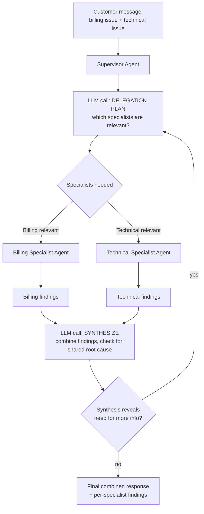

# Pattern 9: Supervisor Agent

## 1. What is a Supervisor Agent?

A **Supervisor Agent** coordinates multiple specialist agents toward a single combined
answer, deciding which specialists to call, in what order, and how to combine or reconcile
their outputs — rather than dispatching a request to exactly one specialist and being done
(that's the Router, Pattern 8). The supervisor itself typically does very little "real" work;
its job is orchestration: delegate, collect results, decide if more delegation is needed, and
synthesize a final response.

This is a step up in complexity from Router in one specific way: a Router's decision is
"which *one* handler," made once, upfront. A Supervisor's decision is "which specialist(s),
possibly several, possibly in sequence, with the results of one potentially informing whether
another is even needed" — an ongoing coordination loop, not a single dispatch.

## 2. What problem does it solves

Some real requests genuinely need more than one specialist's expertise to answer well, and
neither a single monolithic agent nor a single-destination Router handles that cleanly:

- A monolithic agent trying to be an expert in billing, technical diagnostics, *and* policy
  simultaneously suffers the same prompt-bloat problems described in Pattern 8, but now within
  a single request instead of across request types.
- A Router can only send the whole request to one place — but "my subscription billing seems
  wrong AND the feature I'm paying for is broken" genuinely needs both a billing specialist
  and a technical specialist, with their findings combined into one coherent reply.

A Supervisor Agent solves this by staying a thin coordination layer: it inspects the request,
decides which specialists are relevant, calls them (in parallel or in sequence, as needed),
and synthesizes their individual outputs into one final response — without ever trying to do
the specialist work itself.

## 3. Realistic production example: Combined Billing + Technical Issue Resolver

**Extending Pattern 8's specialists.** A common real support pattern: a customer reports what
sounds like two connected problems at once.

> "I upgraded to the Pro plan last week but I'm still being charged the old price, AND the
> Pro-only export feature I'm paying for just gives me an error every time I try to use it."

This needs: a **Billing Specialist** to check the actual charge/plan record, and a
**Technical Specialist** to check the reported feature error — and then a synthesis step that
combines both findings into one reply, noting if they're actually related (e.g. "you're being
charged the Pro price, but your account is still flagged as Basic internally, which is also
why the Pro feature is blocked" — a single root cause explaining both symptoms).

## 4. Architecture / Flow Diagram



## 5. Request-to-response flow, step by step

1. **Input arrives**: a message that may span multiple domains.
2. **Delegation planning call**: the supervisor's first LLM call decides *which* specialists
   are relevant to this specific request (not always all of them — a pure technical bug report
   shouldn't waste a billing specialist call) and produces a structured `DelegationPlan`.
3. **Specialist calls**: each relevant specialist is invoked with the customer's message plus
   any context the supervisor decided to pass along. Independent specialists (like billing and
   technical here, which don't depend on each other's findings) are called **in parallel** for
   latency — a key practical difference from a strictly sequential Planning Agent (Pattern 4).
4. **Collect findings**: each specialist returns a structured result specific to its domain
   (e.g. `BillingFindings`, `TechnicalFindings`).
5. **Synthesis call**: a final LLM call receives *all* specialist findings together and is
   asked specifically to look for connections between them (shared root cause) and produce one
   coherent customer-facing response — not just concatenate the specialists' outputs.
6. **Escalation check**: if synthesis reveals a gap (e.g. the technical specialist's finding
   raises a new billing question), the supervisor can loop back and delegate again — bounded by
   a max-round safety limit, same discipline as ReAct (Pattern 3) and Reflection (Pattern 5).
7. **Output**: one combined, synthesized response plus the individual specialist findings kept
   available for audit/debugging.

## 6. Why this pattern fits (and when it doesn't)

**Fits well when:**
- A meaningful fraction of requests genuinely need more than one specialist's expertise.
- Specialists can work independently (parallelizable) or in a short, bounded sequence.
- You want the option to *not* call every specialist for every request — the supervisor's
  delegation-planning step keeps this efficient rather than always fanning out to everyone.

**Doesn't fit when:**
- Requests almost always need exactly one specialist → Router (Pattern 8) is simpler and has
  less coordination overhead.
- Specialists genuinely need deep back-and-forth with each other, not just independent findings
  synthesized once at the end → look at **Multi-Agent System** (Pattern 12) or
  **Debate Pattern** (Pattern 13) for richer inter-agent interaction.
- There's a strict, known hierarchy where a top agent delegates to mid-level managers who each
  delegate further down → that's **Hierarchical Agent** (Pattern 11), a deeper structure than
  a flat supervisor-to-specialists layout.

## 7. Production-quality implementation

```python
"""
Pattern 9: Supervisor Agent
-------------------------------
Coordinates a Billing Specialist and a Technical Specialist in parallel,
then synthesizes their findings into one combined customer response.

Run prerequisites:
    ollama pull llama3.1:8b
    pip install -U langchain langchain-core langchain-ollama pydantic

Run:
    python supervisor_agent.py
"""

from __future__ import annotations

import json
import logging
import time
from concurrent.futures import ThreadPoolExecutor, as_completed
from typing import Optional

from langchain_core.messages import HumanMessage, SystemMessage
from langchain_core.output_parsers import PydanticOutputParser
from langchain_core.exceptions import OutputParserException
from langchain_ollama import ChatOllama
from pydantic import BaseModel, Field, ValidationError

logging.basicConfig(
    level=logging.INFO,
    format="%(asctime)s | %(levelname)s | %(name)s | %(message)s",
)
logger = logging.getLogger("supervisor_agent")


# --------------------------------------------------------------------------
# Simulated backend data for the two specialists
# --------------------------------------------------------------------------
_FAKE_ACCOUNT = {
    "jane.doe@example.com": {
        "billed_plan": "Pro", "billed_price": 49.00,
        "internal_plan_flag": "Basic",  # mismatch! root cause of both symptoms
    }
}
_FAKE_FEATURE_FLAGS = {
    "jane.doe@example.com": {"export_feature_enabled": False}  # blocked because flag says Basic
}


# --------------------------------------------------------------------------
# Structured schemas
# --------------------------------------------------------------------------
class DelegationPlan(BaseModel):
    needs_billing: bool
    needs_technical: bool
    reasoning: str


class BillingFindings(BaseModel):
    summary: str
    billed_plan: str
    billed_price: float
    discrepancy_found: bool


class TechnicalFindings(BaseModel):
    summary: str
    feature_enabled: bool
    likely_cause: str


class SynthesizedResponse(BaseModel):
    root_cause_summary: str = Field(
        description="Explain what's actually going on, noting if billing and technical "
        "findings share a root cause"
    )
    customer_reply: str = Field(description="Short, clear, empathetic reply to send the customer")
    requires_manual_fix: bool = Field(
        description="True if a human/engineer needs to manually correct account data"
    )


# --------------------------------------------------------------------------
# Specialist agents — simplified single-call agents (each could itself be
# any of Patterns 1-7; kept minimal here to keep focus on orchestration)
# --------------------------------------------------------------------------
class BillingSpecialistAgent:
    def __init__(self, llm: ChatOllama, max_retries: int = 2) -> None:
        self.llm = llm
        self.max_retries = max_retries
        self.parser = PydanticOutputParser(pydantic_object=BillingFindings)

    def investigate(self, customer_message: str, customer_email: str) -> BillingFindings:
        account = _FAKE_ACCOUNT.get(customer_email, {})
        context = json.dumps(account)
        system = (
            "You are a billing specialist. Given the customer's message and their real "
            "account billing data, summarize any billing issue and note if there's a "
            f"discrepancy. ACCOUNT DATA: {context}\n\n"
            f"Respond with ONLY JSON matching this schema:\n{self.parser.get_format_instructions()}"
        )
        return _invoke_structured(self.llm, system, customer_message, self.parser, self.max_retries)


class TechnicalSpecialistAgent:
    def __init__(self, llm: ChatOllama, max_retries: int = 2) -> None:
        self.llm = llm
        self.max_retries = max_retries
        self.parser = PydanticOutputParser(pydantic_object=TechnicalFindings)

    def investigate(self, customer_message: str, customer_email: str) -> TechnicalFindings:
        flags = _FAKE_FEATURE_FLAGS.get(customer_email, {})
        context = json.dumps(flags)
        system = (
            "You are a technical support specialist. Given the customer's message and their "
            "real feature-flag data, summarize the technical issue and its likely cause. "
            f"FEATURE FLAG DATA: {context}\n\n"
            f"Respond with ONLY JSON matching this schema:\n{self.parser.get_format_instructions()}"
        )
        return _invoke_structured(self.llm, system, customer_message, self.parser, self.max_retries)


def _invoke_structured(llm, system_content: str, user_content: str, parser, max_retries: int):
    messages = [SystemMessage(content=system_content), HumanMessage(content=user_content)]
    last_error: Optional[Exception] = None
    for attempt in range(1, max_retries + 2):
        try:
            response = llm.invoke(messages)
            return parser.parse(response.content)
        except (OutputParserException, ValidationError) as e:
            last_error = e
            logger.warning(f"structured_call_failed attempt={attempt} error={e}")
            messages.append(HumanMessage(
                content="That wasn't valid JSON matching the schema. Respond again with "
                "ONLY the raw JSON object."
            ))
    raise RuntimeError(f"Structured call failed after retries: {last_error}")


# --------------------------------------------------------------------------
# The Supervisor
# --------------------------------------------------------------------------
class SupportSupervisorAgent:
    """Delegates to relevant specialists (in parallel), then synthesizes
    their findings into one combined customer response."""

    DELEGATION_PROMPT = """You are a support supervisor deciding which specialists are needed
for this customer message.

Available specialists:
- billing: for anything about charges, plan/subscription price, invoices.
- technical: for anything about a feature/product not working as expected.

A message may need one, both, or (rarely) neither. Respond with ONLY a JSON object matching
this schema (no markdown fences, no extra text):
{format_instructions}
"""

    SYNTHESIS_PROMPT = """You are a support supervisor synthesizing specialist findings into
one reply for the customer.

Look for whether the findings share a ROOT CAUSE (e.g. a plan/flag mismatch causing both a
billing and a technical symptom) rather than treating them as unrelated. Be concrete — cite
the actual data from the findings, don't restate generic reassurances.

FINDINGS:
{findings_text}

Respond with ONLY a JSON object matching this schema (no markdown fences, no extra text):
{format_instructions}
"""

    def __init__(
        self,
        model_name: str = "llama3.1:8b",
        temperature: float = 0.2,
        max_retries: int = 2,
        max_rounds: int = 2,
    ) -> None:
        self.max_retries = max_retries
        self.max_rounds = max_rounds
        self.llm = ChatOllama(model=model_name, temperature=temperature)

        self.delegation_parser = PydanticOutputParser(pydantic_object=DelegationPlan)
        self.synthesis_parser = PydanticOutputParser(pydantic_object=SynthesizedResponse)

        self.billing_agent = BillingSpecialistAgent(self.llm, max_retries)
        self.technical_agent = TechnicalSpecialistAgent(self.llm, max_retries)

    def _plan_delegation(self, customer_message: str) -> DelegationPlan:
        system_content = self.DELEGATION_PROMPT.format(
            format_instructions=self.delegation_parser.get_format_instructions()
        )
        return _invoke_structured(
            self.llm, system_content, customer_message, self.delegation_parser, self.max_retries
        )

    def _synthesize(self, findings: dict) -> SynthesizedResponse:
        findings_text = json.dumps(findings, indent=2, default=lambda o: o.model_dump())
        system_content = self.SYNTHESIS_PROMPT.format(
            findings_text=findings_text,
            format_instructions=self.synthesis_parser.get_format_instructions(),
        )
        return _invoke_structured(
            self.llm, system_content, "Synthesize the findings above.",
            self.synthesis_parser, self.max_retries,
        )

    def resolve(self, customer_message: str, customer_email: str) -> SynthesizedResponse:
        plan = self._plan_delegation(customer_message)
        logger.info(f"delegation_plan billing={plan.needs_billing} "
                    f"technical={plan.needs_technical} reasoning={plan.reasoning!r}")

        findings: dict = {}

        # Run relevant specialists IN PARALLEL — they're independent of each other.
        with ThreadPoolExecutor(max_workers=2) as executor:
            futures = {}
            if plan.needs_billing:
                futures[executor.submit(
                    self.billing_agent.investigate, customer_message, customer_email
                )] = "billing"
            if plan.needs_technical:
                futures[executor.submit(
                    self.technical_agent.investigate, customer_message, customer_email
                )] = "technical"

            for future in as_completed(futures):
                specialist_name = futures[future]
                try:
                    findings[specialist_name] = future.result()
                    logger.info(f"specialist_completed name={specialist_name}")
                except Exception as e:
                    logger.error(f"specialist_failed name={specialist_name} error={e}")
                    findings[specialist_name] = {"error": str(e)}

        if not findings:
            # Neither specialist was needed — handle as a generic reply, no synthesis needed.
            return SynthesizedResponse(
                root_cause_summary="No specialist investigation was required.",
                customer_reply="Thanks for reaching out — could you share a bit more detail "
                "so we can help?",
                requires_manual_fix=False,
            )

        return self._synthesize(findings)


if __name__ == "__main__":
    supervisor = SupportSupervisorAgent(model_name="llama3.1:8b")

    message = (
        "I upgraded to the Pro plan last week but I'm still being charged the old price, "
        "AND the Pro-only export feature just gives me an error every time I try to use it."
    )
    email = "jane.doe@example.com"

    print("=" * 70)
    print(f"CUSTOMER MESSAGE: {message}")

    start = time.monotonic()
    result = supervisor.resolve(message, customer_email=email)
    elapsed = time.monotonic() - start

    print(f"\n--- SYNTHESIZED RESULT ({elapsed:.1f}s) ---")
    print(f"Root cause: {result.root_cause_summary}")
    print(f"Requires manual fix: {result.requires_manual_fix}")
    print(f"\nCustomer reply:\n{result.customer_reply}")
```

### Notes on the code

- **Delegation is a decision, not a default.** The supervisor explicitly decides *which*
  specialists are relevant via `DelegationPlan` rather than always calling both — avoiding
  wasted specialist calls on requests that only need one domain.
- **`ThreadPoolExecutor` runs independent specialists in parallel**, cutting latency roughly in
  half versus calling them sequentially — a genuine practical advantage over Pattern 4's
  strictly ordered plan execution, appropriate here because billing and technical findings
  don't depend on each other.
- **Per-specialist failure isolation**: `as_completed` combined with a try/except per future
  means one specialist failing (timeout, bad data) doesn't take down the other's result — the
  synthesis step receives an `{"error": ...}` entry for that specialist and can note the gap
  rather than crash the whole request.
- **The synthesis call is explicitly instructed to look for a shared root cause**, not just
  concatenate findings — this is what turns "two separate paragraphs" into the kind of
  genuinely useful combined answer that justifies the supervisor pattern's extra complexity
  over independently returning each specialist's result.
- **The "no specialists needed" path is handled explicitly** rather than left to synthesize an
  empty findings dict, which would otherwise produce a confusing or hallucinated response.

### Versions used

- Python `3.11+`
- `langchain-core` `0.3.x`
- `langchain-ollama` `0.2.x`
- `pydantic` `2.x`
- Model: `llama3.1:8b` via local Ollama

---

**Next: [Pattern 10 — Worker Agent](10-worker-agent.md)**, which looks at the specialist side
of this relationship in depth: what makes a good "worker" — an agent designed specifically to
be *called by* a coordinator like this Supervisor, rather than to interact with an end user
directly.
