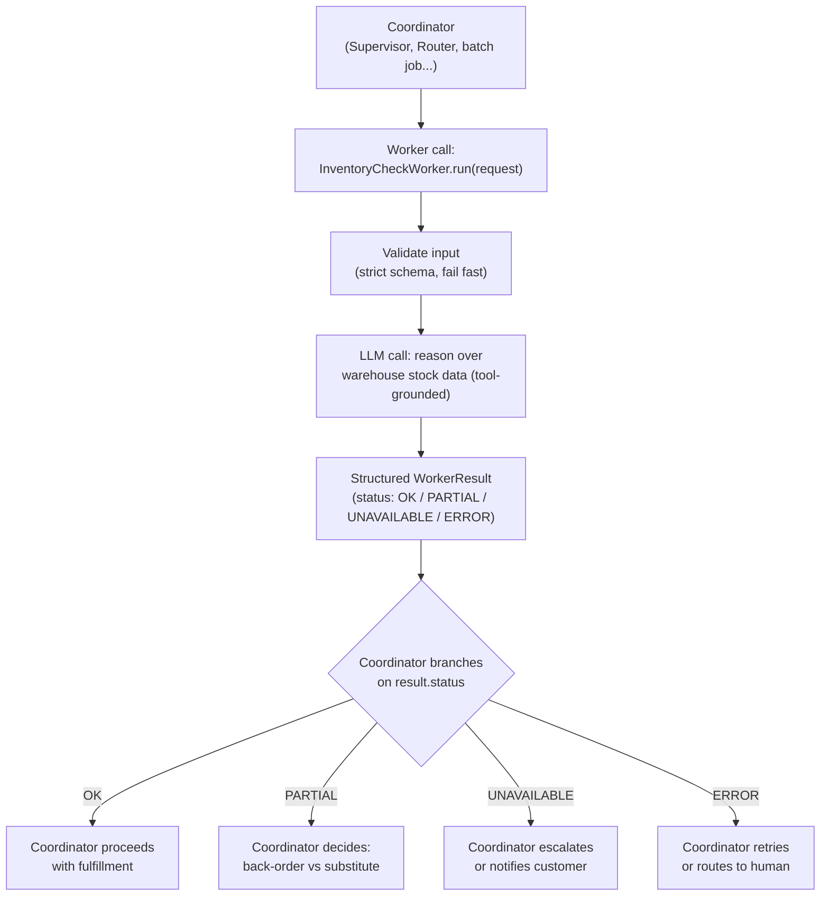

# Pattern 10: Worker Agent

## 1. What is a Worker Agent?

A **Worker Agent** is a specialist agent designed specifically to be *called by another
agent* (a Supervisor, a Router, an orchestrator) rather than to interact with an end user
directly. It has a narrow, well-defined job, a strict input/output contract meant for
machine-to-machine consumption (not conversational prose), and no responsibility for
user-facing concerns like tone or conversation flow — that belongs to whatever coordinates it.

We already *used* worker-shaped agents inside Pattern 9's `BillingSpecialistAgent` and
`TechnicalSpecialistAgent`. This pattern zooms in on what specifically makes an agent a good
"worker" as opposed to just a smaller version of a user-facing agent: idempotency, a
machine-readable contract, statelessness between calls, and predictable failure behavior that
a coordinator can handle programmatically.

## 2. What problem does it solves

It's tempting to reuse a user-facing agent (like Pattern 1's `SupportTriageAgent`) directly as
a "specialist" inside a Supervisor. This usually goes wrong in subtle ways:

- **User-facing agents optimize for conversational quality** (tone, warmth, phrasing) — none
  of which the coordinator needs or wants; it just needs data it can act on programmatically.
- **They often assume they're the last step**, producing a "final reply" shaped output, when a
  worker's output is actually an *intermediate* result the coordinator still needs to combine
  with others and reason about.
- **Retry and failure semantics differ.** A user-facing agent failing usually means "show an
  error to the user." A worker agent failing inside a larger orchestration needs to fail in a
  way the *coordinator* can specifically handle (skip this worker's contribution, retry it,
  escalate) — which requires a much more constrained, predictable failure contract.

A dedicated Worker Agent pattern solves this by designing the specialist from the start for
machine consumption: pure input → structured output, no conversational framing, explicit and
narrow scope, and failure modes that are easy for a coordinator to branch on.

## 3. Realistic production example: Inventory-Check Worker for an Order Fulfillment Pipeline

**A new, more clearly "backend" example** to highlight the pattern distinctly from Pattern 9's
already-worker-shaped specialists. An order fulfillment pipeline, when a customer requests a
replacement item, needs a fast, narrow worker that answers exactly one question well:
**"Given this item and quantity, can it be fulfilled, and from where?"** — nothing about
tone, nothing about the customer, nothing about refunds. Multiple coordinators might call this
same worker: the Supervisor from Pattern 9, a nightly batch reconciliation job, or a live
storefront "check availability" button. Because its contract is strict and its scope is
narrow, it can be reused across all of them without modification.

## 4. Architecture / Flow Diagram



## 5. Request-to-response flow, step by step

1. **Coordinator calls the worker** with a strict, minimal request object — no conversational
   text needed, just structured fields (`item_name`, `quantity_needed`, optionally
   `preferred_warehouse`).
2. **Input validation happens first, before any LLM call** — a worker should fail fast and
   cheaply on bad input rather than spend an LLM call discovering the request was malformed.
3. **The worker does its narrow job**: here, checking (simulated) multi-warehouse stock data
   and reasoning about whether the full quantity, a partial quantity, or nothing can be
   fulfilled, and from where.
4. **Output uses a `status` enum designed for branching**, not prose — `OK`, `PARTIAL`,
   `UNAVAILABLE`, or `ERROR` — specifically so a coordinator can write simple, reliable
   `if/elif` logic against it, exactly the kind of predictable contract a Supervisor needs to
   orchestrate multiple workers reliably.
5. **Errors are caught and turned into a structured `ERROR` status**, never allowed to raise an
   uncaught exception up into the coordinator — a worker that can crash its caller is a bad
   worker; the coordinator should always get *some* structured answer, even a failure one.
6. **No memory between calls.** Each invocation is fully self-contained (statelessness is
   discussed further in Pattern 26, Stateless Agent) — a worker shouldn't accumulate any state
   a coordinator isn't explicitly passing back in.
7. **The coordinator receives the structured result** and decides what to do next — the worker
   itself never decides "and therefore here's what should happen" beyond its own narrow scope.

## 6. Why this pattern fits (and when it doesn't)

**Fits well when:**
- The agent's only caller is other code/agents, never an end user directly.
- The job is narrow and well-defined enough to have a small, stable output contract.
- Multiple different coordinators might reuse the same capability (as in the example above).

**Doesn't fit when:**
- The agent needs to produce user-facing prose as its primary output — that's better modeled
  as one of the earlier, conversational patterns (Basic Agent, Reflection Agent).
  application code, not an agent at all — don't reach for an LLM-based worker when a
  deterministic function fully solves the problem (a lesson also visible in Pattern 6's
  deterministic arithmetic check).
- The task genuinely needs conversation-like back-and-forth with whatever's calling it —
  that points toward the ReAct-style loop or Agent Handoff (Pattern 17) instead of a
  single-shot worker call.

## 7. Production-quality implementation

```python
"""
Pattern 10: Worker Agent
----------------------------
A narrow, machine-callable Inventory-Check worker meant to be invoked by
coordinators (Supervisors, Routers, batch jobs) rather than end users.

Run prerequisites:
    ollama pull llama3.1:8b
    pip install -U langchain langchain-core langchain-ollama pydantic

Run:
    python worker_agent.py
"""

from __future__ import annotations

import json
import logging
import time
from enum import Enum
from typing import Optional

from langchain_core.messages import HumanMessage, SystemMessage
from langchain_core.output_parsers import PydanticOutputParser
from langchain_core.exceptions import OutputParserException
from langchain_ollama import ChatOllama
from pydantic import BaseModel, Field, ValidationError, field_validator

logging.basicConfig(
    level=logging.INFO,
    format="%(asctime)s | %(levelname)s | %(name)s | %(message)s",
)
logger = logging.getLogger("worker_agent")


# --------------------------------------------------------------------------
# Simulated multi-warehouse stock data
# --------------------------------------------------------------------------
_FAKE_WAREHOUSE_STOCK = {
    "laptop stand": {"east": 12, "west": 0, "central": 5},
    "wireless mouse": {"east": 0, "west": 0, "central": 0},
    "usb-c hub": {"east": 3, "west": 8, "central": 0},
}


# --------------------------------------------------------------------------
# Strict, minimal I/O contract — built for machine callers, not humans
# --------------------------------------------------------------------------
class InventoryCheckRequest(BaseModel):
    item_name: str
    quantity_needed: int = Field(gt=0)
    preferred_warehouse: Optional[str] = None

    @field_validator("item_name")
    @classmethod
    def item_name_not_blank(cls, v: str) -> str:
        if not v.strip():
            raise ValueError("item_name must not be blank")
        return v.strip().lower()


class FulfillmentStatus(str, Enum):
    OK = "OK"                    # full quantity available
    PARTIAL = "PARTIAL"          # some, but not all, quantity available
    UNAVAILABLE = "UNAVAILABLE"  # none available anywhere
    ERROR = "ERROR"              # worker failed to complete the check


class WorkerResult(BaseModel):
    status: FulfillmentStatus
    fulfillable_quantity: int = Field(ge=0)
    source_warehouse: Optional[str] = None
    notes: str = ""


# --------------------------------------------------------------------------
# The Worker Agent
# --------------------------------------------------------------------------
class InventoryCheckWorker:
    """A narrow worker: given an item + quantity, decides if/how it can be
    fulfilled from warehouse stock. Built to be called by coordinators, not
    users — no conversational framing, strict enum-based status output."""

    SYSTEM_PROMPT = """You check warehouse inventory to determine fulfillment status.

Given the requested item, quantity, and real warehouse stock data, decide:
- OK: the full requested quantity is available in a single warehouse.
- PARTIAL: some quantity is available (in one warehouse) but less than requested.
- UNAVAILABLE: zero stock across all warehouses.

Prefer the warehouse with the most stock if multiple could fulfill it. If a
preferred_warehouse was given and it alone has enough stock, use that one.

WAREHOUSE STOCK DATA:
{stock_data}

Respond with ONLY a JSON object matching this schema (no markdown fences, no extra text):
{format_instructions}
"""

    def __init__(self, model_name: str = "llama3.1:8b", temperature: float = 0.0, max_retries: int = 2) -> None:
        self.max_retries = max_retries
        self.parser = PydanticOutputParser(pydantic_object=WorkerResult)
        self.llm = ChatOllama(model=model_name, temperature=temperature)

    def run(self, request: InventoryCheckRequest) -> WorkerResult:
        """The sole entry point. Never raises to the caller — all failure
        modes are captured as a structured WorkerResult with status=ERROR,
        because a worker crashing its coordinator is a design failure."""

        # --- Validation happens before any LLM call: fail fast and cheap. ---
        # (request is already a validated InventoryCheckRequest by construction,
        #  but a defensive re-check protects against a coordinator passing a
        #  raw dict instead of the proper type.)
        try:
            if isinstance(request, dict):
                request = InventoryCheckRequest(**request)
        except ValidationError as e:
            logger.error(f"invalid_worker_input error={e}")
            return WorkerResult(status=FulfillmentStatus.ERROR, fulfillable_quantity=0,
                                 notes=f"Invalid input: {e}")

        stock = _FAKE_WAREHOUSE_STOCK.get(request.item_name)
        if stock is None:
            logger.warning(f"unknown_item item_name={request.item_name!r}")
            return WorkerResult(
                status=FulfillmentStatus.UNAVAILABLE, fulfillable_quantity=0,
                notes=f"No inventory record exists for '{request.item_name}'",
            )

        system_content = self.SYSTEM_PROMPT.format(
            stock_data=json.dumps(stock),
            format_instructions=self.parser.get_format_instructions(),
        )
        user_content = json.dumps({
            "item_name": request.item_name,
            "quantity_needed": request.quantity_needed,
            "preferred_warehouse": request.preferred_warehouse,
        })
        messages = [SystemMessage(content=system_content), HumanMessage(content=user_content)]

        last_error: Optional[Exception] = None
        for attempt in range(1, self.max_retries + 2):
            try:
                response = self.llm.invoke(messages)
                result = self.parser.parse(response.content)
                logger.info(f"worker_completed item={request.item_name} "
                            f"status={result.status} qty={result.fulfillable_quantity}")
                return result
            except (OutputParserException, ValidationError) as e:
                last_error = e
                logger.warning(f"worker_parse_failed attempt={attempt} error={e}")
                messages.append(HumanMessage(
                    content="That wasn't valid JSON matching the schema. Respond again "
                    "with ONLY the raw JSON object."
                ))
            except Exception as e:
                last_error = e
                logger.error(f"worker_llm_call_failed attempt={attempt} error={e}")

        # Every failure path returns a structured ERROR — never raises.
        return WorkerResult(
            status=FulfillmentStatus.ERROR, fulfillable_quantity=0,
            notes=f"Worker failed after {self.max_retries + 1} attempts: {last_error}",
        )


# --------------------------------------------------------------------------
# Example: a tiny coordinator branching cleanly on the worker's status enum
# --------------------------------------------------------------------------
def coordinator_handle_replacement_request(worker: InventoryCheckWorker, item: str, qty: int) -> str:
    result = worker.run(InventoryCheckRequest(item_name=item, quantity_needed=qty))

    if result.status == FulfillmentStatus.OK:
        return f"Replacement approved: {result.fulfillable_quantity}x {item} from {result.source_warehouse}."
    elif result.status == FulfillmentStatus.PARTIAL:
        return (f"Partial fulfillment only: {result.fulfillable_quantity}/{qty} available "
                f"from {result.source_warehouse}. Escalating for back-order decision.")
    elif result.status == FulfillmentStatus.UNAVAILABLE:
        return f"No stock available for {item} anywhere. Notifying customer of delay."
    else:  # ERROR
        return f"Inventory check failed ({result.notes}). Routing to human for manual check."


if __name__ == "__main__":
    worker = InventoryCheckWorker(model_name="llama3.1:8b")

    test_cases = [
        ("laptop stand", 3),   # available in east and central -> OK
        ("usb-c hub", 10),     # only 3+8=11 across warehouses but single-warehouse max is 8 -> PARTIAL
        ("wireless mouse", 1), # zero everywhere -> UNAVAILABLE
        ("bluetooth speaker", 1),  # unknown item -> UNAVAILABLE (no LLM call needed)
    ]

    for item, qty in test_cases:
        print("\n" + "=" * 70)
        print(f"REQUEST: item={item!r} qty={qty}")
        start = time.monotonic()
        outcome = coordinator_handle_replacement_request(worker, item, qty)
        elapsed = time.monotonic() - start
        print(f"[{elapsed:.1f}s] {outcome}")
```

### Notes on the code

- **`run()` never raises** — every failure path, including malformed input and exhausted LLM
  retries, is captured as a `WorkerResult` with `status=ERROR`. This is the single most
  important property that separates a worker from a user-facing agent: a coordinator managing
  several workers needs to keep functioning even when one of them fails, which is only possible
  if failures arrive as *data* it can branch on, not as exceptions that could crash the whole
  orchestration.
- **Validation happens before any LLM call.** Checking for a known item and validating the
  request shape first means bad input costs microseconds, not an LLM round-trip — an important
  cost/latency discipline for anything called frequently by other automated systems.
- **The `FulfillmentStatus` enum is designed for the caller, not the reader.** Compare this to
  Pattern 1's `TicketAnalysis`, which was designed to be read by a person reviewing a ticket —
  here the four-value enum exists specifically so `coordinator_handle_replacement_request` can
  write a clean `if/elif` chain with no ambiguity.
- **No memory, no session state.** Every call to `run()` is fully self-contained given its
  input — nothing is cached or remembered between calls inside the worker itself, which is what
  makes it safe for many different coordinators (or many concurrent requests) to call the same
  worker instance without stepping on each other.

### Versions used

- Python `3.11+`
- `langchain-core` `0.3.x`
- `langchain-ollama` `0.2.x`
- `pydantic` `2.x`
- Model: `llama3.1:8b` via local Ollama

---

**Next: [Pattern 11 — Hierarchical Agent](11-hierarchical-agent.md)**, where we stack these
supervisor/worker relationships into multiple levels — a top-level coordinator delegating to
mid-level managers, who each delegate further down to their own workers — for problems too
large for a single flat supervisor layer to coordinate well.
