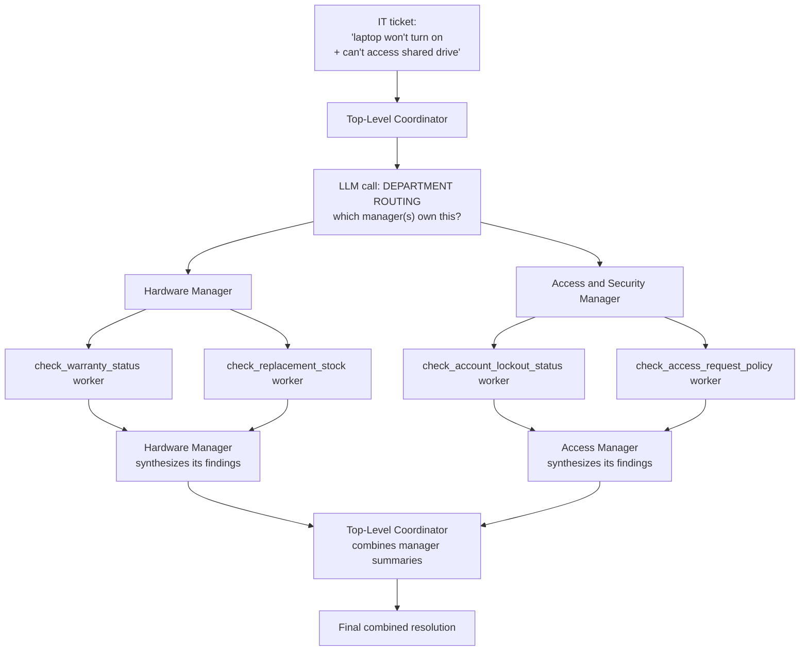

# Pattern 11: Hierarchical Agent

## 1. What is a Hierarchical Agent?

A **Hierarchical Agent** organizes multiple supervisor/worker relationships (Patterns 9 & 10)
into more than one level: a top-level coordinator delegates to mid-level managers, and each
manager delegates further down to its own workers, rather than one supervisor talking directly
to every worker (a flat structure). Each level only needs to understand the level directly
below it — the top-level coordinator doesn't need to know how a mid-level manager's workers
operate internally, only what that manager is responsible for and what it returns.

This mirrors how human organizations scale: a director doesn't personally manage every
individual contributor — they manage a few team leads, each of whom manages their own workers.
The same decomposition helps agent systems scale past what a single flat supervisor (Pattern 9)
can reasonably coordinate.

## 2. What problem does it solves

A flat Supervisor Agent (Pattern 9) works well when there are a handful of specialists. But as
the number of distinct capabilities grows — a dozen specialists, then two dozen — a single
supervisor coordinating all of them directly runs into real problems:

- **Delegation-planning complexity explodes.** Deciding "which of these 20 workers are
  relevant" in a single LLM call gets harder and less reliable as the option list grows —
  exactly the kind of prompt overload discussed in Pattern 8's motivation, now at the
  orchestration level instead of the classification level.
- **No natural grouping.** Real domains have sub-structure (e.g. "Technical Support" itself
  splits into "Mobile App Issues" and "Web App Issues," each needing its own workers) that a
  flat list doesn't represent.
- **Poor separation of ownership.** Different teams often own different domains in a real
  organization; a flat supervisor conflates all of that into one place, making it hard to
  update or scale one area without touching the whole system.

A Hierarchical Agent solves this by mirroring the natural grouping: each mid-level manager
owns a bounded sub-domain with its own small set of workers, and the top-level coordinator's
job stays simple — pick the right manager(s), not the right worker directly.

## 3. Realistic production example: Enterprise IT Helpdesk

**A new example showcasing genuine multi-level structure.** A large company's IT helpdesk
handles a wide range of requests that naturally split into sub-domains, each complex enough
to deserve its own manager:

- **Top-level Coordinator**: reads the incoming ticket, decides which department(s) own it —
  `Hardware`, `Software`, or `Access & Security`.
- **Hardware Manager**: owns workers for `check_warranty_status` and `check_replacement_stock`
  (reusing the Worker Agent discipline from Pattern 10).
- **Software Manager**: owns workers for `check_license_availability` and
  `check_known_issues`.
- **Access & Security Manager**: owns workers for `check_access_request_policy` and
  `check_account_lockout_status`.

A single ticket ("My laptop won't turn on and I also can't access the shared drive") might
route to *both* Hardware and Access & Security managers, each of which independently
coordinates its own workers and returns a summarized finding up to the top-level coordinator.

## 4. Architecture / Flow Diagram



## 5. Request-to-response flow, step by step

1. **Ticket arrives** at the top-level coordinator.
2. **Department routing call**: like Pattern 9's delegation plan, but one level higher — the
   coordinator decides which *manager(s)*, not which *workers*, are relevant. This keeps the
   coordinator's own decision small and reliable regardless of how many workers exist deep in
   the hierarchy.
3. **Each relevant manager is invoked independently** (in parallel, same rationale as
   Pattern 9) and receives the full ticket context.
4. **Within each manager**, the exact same supervisor pattern from Pattern 9 repeats *one
   level down*: the manager decides which of *its own* workers are relevant, calls them
   (parallel where independent), and synthesizes their results into a single
   `ManagerFinding` — this is the recursive structure that makes it "hierarchical": Pattern 9
   applied at every level.
5. **Manager findings bubble up** to the top-level coordinator, which only ever sees
   summarized findings, never individual worker output directly — this is the key
   encapsulation property: the top level's prompt never grows with the number of workers, only
   with the (much smaller, more stable) number of managers.
6. **Top-level synthesis**: the coordinator combines manager-level findings into one final
   response, same synthesis discipline as Pattern 9, just operating one level higher.
7. **Failure isolation holds at every level**: a worker failing is contained by its manager
   (Pattern 10's `ERROR` status discipline); a manager failing is contained by the top-level
   coordinator the same way — failures don't propagate upward as crashes, only as structured,
   handleable data.

## 6. Why this pattern fits (and when it doesn't)

**Fits well when:**
- There are enough distinct specialist capabilities that a flat supervisor's single
  delegation decision becomes unreliable or unwieldy.
- The domain has natural sub-groupings that map to real organizational or architectural
  boundaries (teams, subsystems).
- You want to scale/evolve one branch (e.g. add new Hardware workers) without touching the
  top-level coordinator or other branches at all.

**Doesn't fit when:**
- A handful of specialists cover everything — added hierarchy is pure overhead; use
  Supervisor Agent (Pattern 9) directly.
- The extra network/LLM round trips per level meaningfully hurt latency for a
  latency-sensitive use case, and the domain doesn't actually need the added structure.
- Sub-domains genuinely need to negotiate or exchange information with each other mid-task,
  not just report findings upward independently — that calls for **Multi-Agent System**
  (Pattern 12) or **Agent Handoff** (Pattern 17) instead of a strict tree.

## 7. Production-quality implementation

```python
"""
Pattern 11: Hierarchical Agent
----------------------------------
A two-level IT helpdesk: a top-level coordinator routes to department
managers (Hardware, Access & Security), each of which independently
coordinates its own workers, mirroring the Supervisor pattern at each level.

Run prerequisites:
    ollama pull llama3.1:8b
    pip install -U langchain langchain-core langchain-ollama pydantic

Run:
    python hierarchical_agent.py
"""

from __future__ import annotations

import json
import logging
import time
from concurrent.futures import ThreadPoolExecutor, as_completed
from enum import Enum
from typing import Optional

from langchain_core.messages import HumanMessage, SystemMessage
from langchain_core.output_parsers import PydanticOutputParser
from langchain_core.exceptions import OutputParserException
from langchain_ollama import ChatOllama
from pydantic import BaseModel, Field, ValidationError

logging.basicConfig(
    level=logging.INFO,
    format="%(asctime)s | %(levelname)s | %(name)s | %(message)s",
)
logger = logging.getLogger("hierarchical_agent")


# --------------------------------------------------------------------------
# Shared helper (same discipline as Pattern 9/10: structured call + retries)
# --------------------------------------------------------------------------
def invoke_structured(llm, system_content: str, user_content: str, parser, max_retries: int = 2):
    messages = [SystemMessage(content=system_content), HumanMessage(content=user_content)]
    last_error: Optional[Exception] = None
    for attempt in range(1, max_retries + 2):
        try:
            response = llm.invoke(messages)
            return parser.parse(response.content)
        except (OutputParserException, ValidationError) as e:
            last_error = e
            logger.warning(f"structured_call_failed attempt={attempt} error={e}")
            messages.append(HumanMessage(
                content="That wasn't valid JSON matching the schema. Respond again with "
                "ONLY the raw JSON object."
            ))
    raise RuntimeError(f"Structured call failed after retries: {last_error}")


# --------------------------------------------------------------------------
# Simulated backend data for the leaf-level workers
# --------------------------------------------------------------------------
_WARRANTY_DB = {"laptop-4471": {"in_warranty": True, "expires": "2027-03-01"}}
_STOCK_DB = {"laptop": 8, "monitor": 2}
_LOCKOUT_DB = {"jane.doe": {"locked": True, "reason": "too many failed logins"}}
_ACCESS_POLICY = {"shared_drive_finance": "requires manager approval"}


# --------------------------------------------------------------------------
# Leaf-level Worker Agents (Pattern 10 discipline: strict enum status,
# never raise, minimal machine-facing contract)
# --------------------------------------------------------------------------
class WorkerStatus(str, Enum):
    OK = "OK"
    ISSUE_FOUND = "ISSUE_FOUND"
    NOT_APPLICABLE = "NOT_APPLICABLE"
    ERROR = "ERROR"


class WorkerFinding(BaseModel):
    worker_name: str
    status: WorkerStatus
    detail: str


def worker_check_warranty_status(asset_tag: str) -> WorkerFinding:
    record = _WARRANTY_DB.get(asset_tag)
    if not record:
        return WorkerFinding(worker_name="check_warranty_status", status=WorkerStatus.NOT_APPLICABLE,
                              detail=f"No warranty record for asset {asset_tag}")
    status = WorkerStatus.OK if record["in_warranty"] else WorkerStatus.ISSUE_FOUND
    return WorkerFinding(worker_name="check_warranty_status", status=status,
                          detail=f"in_warranty={record['in_warranty']}, expires={record['expires']}")


def worker_check_replacement_stock(item: str) -> WorkerFinding:
    qty = _STOCK_DB.get(item.lower(), 0)
    status = WorkerStatus.OK if qty > 0 else WorkerStatus.ISSUE_FOUND
    return WorkerFinding(worker_name="check_replacement_stock", status=status, detail=f"stock_qty={qty}")


def worker_check_account_lockout(username: str) -> WorkerFinding:
    record = _LOCKOUT_DB.get(username)
    if not record:
        return WorkerFinding(worker_name="check_account_lockout_status", status=WorkerStatus.OK,
                              detail="No lockout record found; account appears unlocked")
    status = WorkerStatus.ISSUE_FOUND if record["locked"] else WorkerStatus.OK
    return WorkerFinding(worker_name="check_account_lockout_status", status=status,
                          detail=f"locked={record['locked']}, reason={record.get('reason')}")


def worker_check_access_policy(resource: str) -> WorkerFinding:
    policy = _ACCESS_POLICY.get(resource.lower().replace(" ", "_"))
    if not policy:
        return WorkerFinding(worker_name="check_access_request_policy", status=WorkerStatus.NOT_APPLICABLE,
                              detail=f"No specific policy found for '{resource}'")
    return WorkerFinding(worker_name="check_access_request_policy", status=WorkerStatus.ISSUE_FOUND,
                          detail=f"Policy: {policy}")


# --------------------------------------------------------------------------
# Mid-level Manager schema (each manager mirrors Pattern 9's Supervisor)
# --------------------------------------------------------------------------
class ManagerFinding(BaseModel):
    department: str
    summary: str
    worker_findings: list[WorkerFinding]
    needs_escalation: bool


class HardwareManager:
    """Owns hardware-related workers; mirrors Pattern 9's supervisor logic
    one level down the hierarchy."""

    SYNTHESIS_PROMPT = """You are the Hardware department manager summarizing findings from
your workers for the top-level IT coordinator. Be concise and factual.

WORKER FINDINGS:
{findings}

Respond with ONLY a JSON object matching this schema (no markdown fences, no extra text):
{format_instructions}
"""

    def __init__(self, llm: ChatOllama, max_retries: int = 2) -> None:
        self.llm = llm
        self.max_retries = max_retries
        self.parser = PydanticOutputParser(pydantic_object=ManagerFinding)

    def handle(self, ticket_text: str, asset_tag: str) -> ManagerFinding:
        findings = [
            worker_check_warranty_status(asset_tag),
            worker_check_replacement_stock("laptop"),
        ]
        findings_json = json.dumps([f.model_dump() for f in findings], indent=2)
        system_content = self.SYNTHESIS_PROMPT.format(
            findings=findings_json, format_instructions=self.parser.get_format_instructions()
        )
        result = invoke_structured(self.llm, system_content, ticket_text, self.parser, self.max_retries)
        result.worker_findings = findings  # keep exact structured findings, not model-retyped text
        result.department = "Hardware"
        return result


class AccessSecurityManager:
    """Owns access/security-related workers."""

    SYNTHESIS_PROMPT = """You are the Access & Security department manager summarizing
findings from your workers for the top-level IT coordinator. Be concise and factual.

WORKER FINDINGS:
{findings}

Respond with ONLY a JSON object matching this schema (no markdown fences, no extra text):
{format_instructions}
"""

    def __init__(self, llm: ChatOllama, max_retries: int = 2) -> None:
        self.llm = llm
        self.max_retries = max_retries
        self.parser = PydanticOutputParser(pydantic_object=ManagerFinding)

    def handle(self, ticket_text: str, username: str, resource: str) -> ManagerFinding:
        findings = [
            worker_check_account_lockout(username),
            worker_check_access_policy(resource),
        ]
        findings_json = json.dumps([f.model_dump() for f in findings], indent=2)
        system_content = self.SYNTHESIS_PROMPT.format(
            findings=findings_json, format_instructions=self.parser.get_format_instructions()
        )
        result = invoke_structured(self.llm, system_content, ticket_text, self.parser, self.max_retries)
        result.worker_findings = findings
        result.department = "Access & Security"
        return result


# --------------------------------------------------------------------------
# Top-level Coordinator
# --------------------------------------------------------------------------
class DepartmentRoutingPlan(BaseModel):
    needs_hardware: bool
    needs_access_security: bool
    reasoning: str


class FinalResolution(BaseModel):
    combined_summary: str
    escalate_to_human: bool
    department_findings: list[ManagerFinding]


class ITHelpdeskCoordinator:
    """Top-level coordinator: routes to department managers, collects their
    findings, and synthesizes a final resolution."""

    ROUTING_PROMPT = """You are the top-level IT helpdesk coordinator deciding which
department manager(s) should investigate this ticket.

Departments:
- hardware: physical device issues (won't turn on, broken screen, needs replacement).
- access_security: login/account lockouts, permission/access requests.

Respond with ONLY a JSON object matching this schema (no markdown fences, no extra text):
{format_instructions}
"""

    FINAL_SYNTHESIS_PROMPT = """Combine the department findings below into one final
resolution summary for this IT ticket. Flag escalate_to_human=true if any finding shows
ISSUE_FOUND that a manager can't resolve automatically (e.g. hardware replacement needed,
account lockout needs unlocking).

DEPARTMENT FINDINGS:
{findings}

Respond with ONLY a JSON object matching this schema (no markdown fences, no extra text):
{format_instructions}
"""

    def __init__(self, model_name: str = "llama3.1:8b", temperature: float = 0.1, max_retries: int = 2) -> None:
        self.max_retries = max_retries
        self.llm = ChatOllama(model=model_name, temperature=temperature)

        self.routing_parser = PydanticOutputParser(pydantic_object=DepartmentRoutingPlan)
        self.final_parser = PydanticOutputParser(pydantic_object=FinalResolution)

        self.hardware_manager = HardwareManager(self.llm, max_retries)
        self.access_manager = AccessSecurityManager(self.llm, max_retries)

    def resolve(self, ticket_text: str, asset_tag: str, username: str, resource: str) -> FinalResolution:
        system_content = self.ROUTING_PROMPT.format(
            format_instructions=self.routing_parser.get_format_instructions()
        )
        plan = invoke_structured(self.llm, system_content, ticket_text, self.routing_parser, self.max_retries)
        logger.info(f"department_routing hardware={plan.needs_hardware} "
                    f"access_security={plan.needs_access_security} reasoning={plan.reasoning!r}")

        manager_findings: list[ManagerFinding] = []
        with ThreadPoolExecutor(max_workers=2) as executor:
            futures = {}
            if plan.needs_hardware:
                futures[executor.submit(self.hardware_manager.handle, ticket_text, asset_tag)] = "hardware"
            if plan.needs_access_security:
                futures[executor.submit(
                    self.access_manager.handle, ticket_text, username, resource
                )] = "access_security"

            for future in as_completed(futures):
                dept = futures[future]
                try:
                    manager_findings.append(future.result())
                    logger.info(f"manager_completed department={dept}")
                except Exception as e:
                    logger.error(f"manager_failed department={dept} error={e}")
                    manager_findings.append(ManagerFinding(
                        department=dept, summary=f"Manager failed: {e}",
                        worker_findings=[], needs_escalation=True,
                    ))

        findings_json = json.dumps([m.model_dump() for m in manager_findings], indent=2)
        system_content = self.FINAL_SYNTHESIS_PROMPT.format(
            findings=findings_json, format_instructions=self.final_parser.get_format_instructions()
        )
        final = invoke_structured(self.llm, system_content, "Synthesize final resolution.",
                                   self.final_parser, self.max_retries)
        final.department_findings = manager_findings
        return final


if __name__ == "__main__":
    coordinator = ITHelpdeskCoordinator(model_name="llama3.1:8b")

    ticket = ("My laptop (asset tag laptop-4471) won't turn on at all, and separately "
              "I've been locked out of my account (username jane.doe) and also can't "
              "access the shared_drive_finance resource I need.")

    print("=" * 70)
    print(f"TICKET: {ticket}")

    start = time.monotonic()
    resolution = coordinator.resolve(
        ticket, asset_tag="laptop-4471", username="jane.doe", resource="shared_drive_finance"
    )
    elapsed = time.monotonic() - start

    print(f"\n--- FINAL RESOLUTION ({elapsed:.1f}s) ---")
    print(f"Summary: {resolution.combined_summary}")
    print(f"Escalate to human: {resolution.escalate_to_human}")
    for mf in resolution.department_findings:
        print(f"\n[{mf.department}] {mf.summary} (needs_escalation={mf.needs_escalation})")
        for wf in mf.worker_findings:
            print(f"   - {wf.worker_name}: {wf.status} — {wf.detail}")
```

### Notes on the code

- **The same `invoke_structured` helper and delegation-then-synthesize shape from Pattern 9
  repeats at two levels** — `HardwareManager`/`AccessSecurityManager` internally do exactly
  what `SupportSupervisorAgent` did, just scoped to their own workers; the
  `ITHelpdeskCoordinator` does it again one level up, scoped to managers instead of workers.
  This recursion is the actual definition of "hierarchical" here, not just a metaphor.
- **The top-level coordinator's prompt never sees individual worker output directly** — only
  each manager's synthesized `ManagerFinding`. This is what keeps the top-level prompt's size
  stable even as more workers are added deep inside a department; you could add ten more
  Hardware workers without the coordinator's routing prompt changing at all.
- **`result.worker_findings = findings` overwrites the model's own (re-typed) copy** with the
  exact structured objects computed in Python — the LLM is trusted to *summarize* worker
  findings in prose, never to be the source of truth for the findings' actual structured data,
  matching the "don't trust the model with data it didn't compute" discipline from Pattern 6.
- **Failure isolation is preserved at every level**: if a manager's `handle()` raises, the
  coordinator catches it and turns it into a synthetic `ManagerFinding` with
  `needs_escalation=True`, rather than letting one department's failure crash the whole ticket
  resolution — the same principle from Pattern 9, now demonstrated holding across two levels.

### Versions used

- Python `3.11+`
- `langchain-core` `0.3.x`
- `langchain-ollama` `0.2.x`
- `pydantic` `2.x`
- Model: `llama3.1:8b` via local Ollama

---

**Next: [Pattern 12 — Multi-Agent System](12-multi-agent-system.md)**, where we move beyond
strict tree-shaped delegation to agents that can communicate more flexibly with each other —
not just reporting findings upward, but exchanging information as peers.
