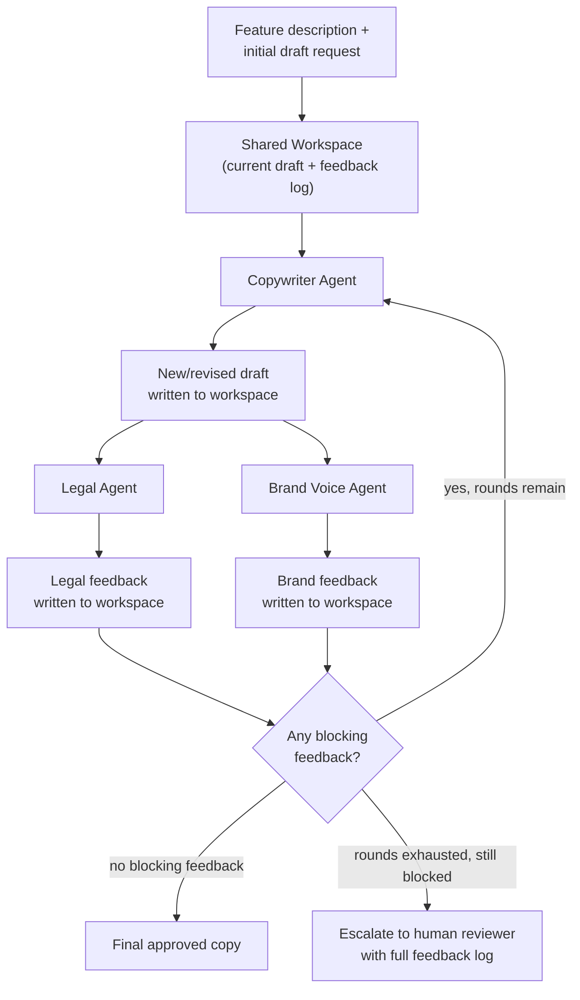

# Pattern 12: Multi-Agent System

## 1. What is a Multi-Agent System?

A **Multi-Agent System** is a set of distinct agents that communicate with each other more
flexibly than the strict tree structures of Supervisor (Pattern 9) or Hierarchical (Pattern 11)
agents — agents that can exchange information as peers, potentially in multiple rounds, with
no single agent holding total control over the others. Where a Supervisor *directs* workers and
only ever receives results back, a Multi-Agent System has agents that can each contribute
independent perspectives, react to what another agent said, and collectively converge on a
shared output — closer to a working group than a chain of command.

The distinguishing structural feature is: **information flows between peer agents, not just
up and down a hierarchy.** A shared "conversation" or "workspace" that multiple agents read
from and write to is a common way to implement this, rather than one agent explicitly calling
another as a function.

## 2. What problem does it solves

Supervisor and Hierarchical patterns work well when responsibilities are clean and
non-overlapping — a delegated task doesn't need the worker's output revisited by another
specialist. But some real problems genuinely need multiple perspectives interacting, not just
independently reported and combined once at the end:

- A **legal review** and a **business feasibility review** of the same contract clause often
  need to go back and forth — the legal agent's concern might change what the business agent
  considers acceptable, and vice versa — not just two separate reports stapled together.
- A **content-writing** agent and a **fact-checking** agent may need several rounds: draft,
  flag an issue, redraft around it, re-check — closer to a collaborative editing loop than a
  single supervisor→worker→done call.

A Multi-Agent System solves this by giving agents a shared space to contribute to and react to
each other's contributions across multiple rounds, converging on an output that reflects real
back-and-forth rather than independently-produced pieces merged once.

## 3. Realistic production example: Marketing Copy Review Panel

**A new example that specifically needs iterative peer interaction.** Before marketing copy
for a new feature ships, it needs input from three different perspectives that genuinely
interact with each other:

- **Copywriter Agent**: drafts and revises the marketing copy.
- **Legal/Compliance Agent**: flags claims that are unsubstantiated, overpromising, or need a
  disclaimer (e.g. "fastest on the market" needs data backing or must be softened).
- **Brand Voice Agent**: checks the copy matches brand tone guidelines, independent of legal
  concerns.

Unlike Pattern 9's billing+technical example (where the two specialists' findings were
independent and just combined once), here the Copywriter's *next draft* directly depends on
*both* other agents' feedback, and their feedback may itself need re-evaluating against a
revised draft. This is a genuine multi-round, peer-communication loop — the shared "workspace"
being the evolving draft plus a running feedback log all three agents can see.

## 4. Architecture / Flow Diagram



## 5. Request-to-response flow, step by step

1. **Setup**: a shared `Workspace` object holds the current draft and a running feedback log —
   this is the "peer communication channel" every agent reads from and writes to, replacing
   the direct function-call relationship a Supervisor has with its workers.
2. **Round starts**: the Copywriter Agent reads the workspace (current draft, if any, plus all
   feedback so far) and produces a new/revised draft, written back to the workspace.
3. **Peer review, in parallel**: the Legal Agent and Brand Voice Agent each independently read
   the *same* new draft and produce structured feedback (issues found, whether they're
   blocking) — both write their feedback to the shared workspace, visible to each other and to
   the Copywriter in the next round.
4. **Convergence check**: if neither agent raised blocking feedback, the loop ends
   successfully. If either did, and rounds remain, the loop continues — the Copywriter's next
   draft is explicitly informed by *both* agents' latest feedback, which is what makes this
   genuinely interactive rather than a one-shot combination.
5. **Bounded rounds**: same discipline as every multi-step pattern in this series (ReAct,
   Reflection, Supervisor) — a max-rounds limit prevents endless back-and-forth, with an honest
   escalation to a human reviewer (carrying the full feedback log for context) if consensus
   isn't reached in time.
6. **Output**: the final approved draft, or an escalation package with the complete
   round-by-round history — valuable both for the human reviewer and for auditing how the
   agents interacted.

## 6. Why this pattern fits (and when it doesn't)

**Fits well when:**
- Multiple perspectives need to genuinely inform each other's output, not just be reported
  independently and merged once.
- The task benefits from iterative refinement across several rounds, converging toward
  agreement rather than resolving in a single pass.
- No single agent should have unilateral authority to just override the others — the "peer"
  framing matters (contrast with Supervisor, where the supervisor's synthesis is final).

**Doesn't fit when:**
- Specialists' findings are genuinely independent and don't need to react to each other —
  Supervisor Agent (Pattern 9) is simpler and cheaper (one round, not several).
- There's a clear authority/ownership structure where one agent's decision should dominate —
  a strict hierarchy (Pattern 11) or a single decision-maker is more appropriate and avoids
  unnecessary back-and-forth.
- Latency matters a lot and the task doesn't truly need multiple rounds — this pattern's cost
  scales with rounds × agents-per-round, which adds up fast.

## 7. Production-quality implementation

```python
"""
Pattern 12: Multi-Agent System
-----------------------------------
A marketing copy review panel: Copywriter, Legal, and Brand Voice agents
iterating on a shared draft + feedback workspace across multiple rounds.

Run prerequisites:
    ollama pull llama3.1:8b
    pip install -U langchain langchain-core langchain-ollama pydantic

Run:
    python multi_agent_system.py
"""

from __future__ import annotations

import logging
import time
from concurrent.futures import ThreadPoolExecutor, as_completed
from dataclasses import dataclass, field
from typing import Optional

from langchain_core.messages import HumanMessage, SystemMessage
from langchain_core.output_parsers import PydanticOutputParser
from langchain_core.exceptions import OutputParserException
from langchain_ollama import ChatOllama
from pydantic import BaseModel, Field, ValidationError

logging.basicConfig(
    level=logging.INFO,
    format="%(asctime)s | %(levelname)s | %(name)s | %(message)s",
)
logger = logging.getLogger("multi_agent_system")


def invoke_structured(llm, system_content: str, user_content: str, parser, max_retries: int = 2):
    messages = [SystemMessage(content=system_content), HumanMessage(content=user_content)]
    last_error: Optional[Exception] = None
    for attempt in range(1, max_retries + 2):
        try:
            response = llm.invoke(messages)
            return parser.parse(response.content)
        except (OutputParserException, ValidationError) as e:
            last_error = e
            logger.warning(f"structured_call_failed attempt={attempt} error={e}")
            messages.append(HumanMessage(
                content="That wasn't valid JSON matching the schema. Respond again with "
                "ONLY the raw JSON object."
            ))
    raise RuntimeError(f"Structured call failed after retries: {last_error}")


# --------------------------------------------------------------------------
# Shared workspace — the peer-communication channel every agent reads/writes
# --------------------------------------------------------------------------
class Feedback(BaseModel):
    reviewer: str
    round_number: int
    issues: list[str]
    blocking: bool


@dataclass
class Workspace:
    feature_description: str
    current_draft: str = ""
    feedback_log: list[Feedback] = field(default_factory=list)

    def feedback_text(self) -> str:
        if not self.feedback_log:
            return "No feedback yet."
        return "\n".join(
            f"[Round {f.round_number} - {f.reviewer}] "
            f"{'BLOCKING' if f.blocking else 'non-blocking'}: {', '.join(f.issues) or 'no issues'}"
            for f in self.feedback_log
        )

    def latest_blocking_feedback(self) -> list[Feedback]:
        if not self.feedback_log:
            return []
        latest_round = max(f.round_number for f in self.feedback_log)
        return [f for f in self.feedback_log if f.round_number == latest_round and f.blocking]


# --------------------------------------------------------------------------
# Peer Agent 1: Copywriter
# --------------------------------------------------------------------------
class DraftOutput(BaseModel):
    draft_text: str


class CopywriterAgent:
    SYSTEM_PROMPT = """You are a marketing copywriter. Write short, punchy marketing copy
(2-3 sentences) for the given feature. If there is prior feedback, revise your previous draft
to directly address every BLOCKING issue raised — keep what wasn't criticized.

Respond with ONLY a JSON object matching this schema (no markdown fences, no extra text):
{format_instructions}
"""

    def __init__(self, llm: ChatOllama, max_retries: int = 2) -> None:
        self.llm = llm
        self.max_retries = max_retries
        self.parser = PydanticOutputParser(pydantic_object=DraftOutput)

    def write(self, workspace: Workspace) -> str:
        system_content = self.SYSTEM_PROMPT.format(
            format_instructions=self.parser.get_format_instructions()
        )
        user_content = (
            f"FEATURE: {workspace.feature_description}\n\n"
            f"CURRENT DRAFT: {workspace.current_draft or '(none yet — write the first draft)'}\n\n"
            f"FEEDBACK SO FAR:\n{workspace.feedback_text()}"
        )
        result = invoke_structured(self.llm, system_content, user_content, self.parser, self.max_retries)
        return result.draft_text


# --------------------------------------------------------------------------
# Peer Agent 2 & 3: Legal and Brand Voice reviewers (structurally identical
# shape, different rubric — demonstrating how easily new peers plug in)
# --------------------------------------------------------------------------
class ReviewResult(BaseModel):
    issues: list[str] = Field(description="Empty list if no issues found")
    blocking: bool = Field(description="True if the copy must not ship as-is")


class ReviewerAgent:
    def __init__(self, llm: ChatOllama, name: str, rubric: str, max_retries: int = 2) -> None:
        self.llm = llm
        self.name = name
        self.rubric = rubric
        self.max_retries = max_retries
        self.parser = PydanticOutputParser(pydantic_object=ReviewResult)

    def review(self, draft: str) -> ReviewResult:
        system_content = (
            f"You are the {self.name} reviewer for marketing copy. Your rubric:\n{self.rubric}\n\n"
            f"Respond with ONLY a JSON object matching this schema (no markdown fences, "
            f"no extra text):\n{self.parser.get_format_instructions()}"
        )
        return invoke_structured(self.llm, system_content, draft, self.parser, self.max_retries)


LEGAL_RUBRIC = (
    "Flag any unsubstantiated superlative or comparative claim (e.g. 'fastest', 'best', "
    "'#1') that isn't qualified or backed by data. These are BLOCKING. Flag missing required "
    "disclaimers as BLOCKING. Minor wording issues are non-blocking."
)

BRAND_RUBRIC = (
    "Our brand voice is confident but warm, never aggressive or hype-y ('revolutionary', "
    "'game-changing', excessive exclamation points). Flag tone mismatches. Only mark BLOCKING "
    "if the tone is a severe mismatch (e.g. aggressive or hype-y); minor tweaks are non-blocking."
)


# --------------------------------------------------------------------------
# The Multi-Agent System orchestration
# --------------------------------------------------------------------------
@dataclass
class PanelResult:
    final_draft: str
    approved: bool
    rounds_taken: int
    workspace: Workspace


class MarketingCopyReviewPanel:
    """Orchestrates Copywriter + Legal + Brand Voice as peers sharing a
    workspace, iterating until consensus (no blocking feedback) or a round
    limit is reached."""

    def __init__(self, model_name: str = "llama3.1:8b", temperature: float = 0.4,
                 max_rounds: int = 3, max_retries: int = 2) -> None:
        self.max_rounds = max_rounds
        llm = ChatOllama(model=model_name, temperature=temperature)

        self.copywriter = CopywriterAgent(llm, max_retries)
        self.legal_reviewer = ReviewerAgent(llm, "Legal/Compliance", LEGAL_RUBRIC, max_retries)
        self.brand_reviewer = ReviewerAgent(llm, "Brand Voice", BRAND_RUBRIC, max_retries)

    def run(self, feature_description: str) -> PanelResult:
        workspace = Workspace(feature_description=feature_description)

        for round_num in range(1, self.max_rounds + 1):
            # 1. Copywriter contributes (or revises) the shared draft
            workspace.current_draft = self.copywriter.write(workspace)
            logger.info(f"round={round_num} draft={workspace.current_draft!r}")

            # 2. Peer reviewers react to the SAME draft, in parallel
            with ThreadPoolExecutor(max_workers=2) as executor:
                futures = {
                    executor.submit(self.legal_reviewer.review, workspace.current_draft): "Legal",
                    executor.submit(self.brand_reviewer.review, workspace.current_draft): "Brand Voice",
                }
                for future in as_completed(futures):
                    reviewer_name = futures[future]
                    try:
                        result = future.result()
                        workspace.feedback_log.append(Feedback(
                            reviewer=reviewer_name, round_number=round_num,
                            issues=result.issues, blocking=result.blocking,
                        ))
                        logger.info(f"round={round_num} reviewer={reviewer_name} "
                                    f"blocking={result.blocking} issues={result.issues}")
                    except Exception as e:
                        logger.error(f"reviewer_failed reviewer={reviewer_name} error={e}")
                        workspace.feedback_log.append(Feedback(
                            reviewer=reviewer_name, round_number=round_num,
                            issues=[f"Reviewer failed: {e}"], blocking=True,
                        ))

            # 3. Convergence check
            blocking = workspace.latest_blocking_feedback()
            if not blocking:
                return PanelResult(final_draft=workspace.current_draft, approved=True,
                                    rounds_taken=round_num, workspace=workspace)

            logger.info(f"round={round_num} blocking_feedback_remains count={len(blocking)}")

        # Rounds exhausted without consensus — honest escalation, not a silent pass
        return PanelResult(final_draft=workspace.current_draft, approved=False,
                            rounds_taken=self.max_rounds, workspace=workspace)


if __name__ == "__main__":
    panel = MarketingCopyReviewPanel(model_name="llama3.1:8b", max_rounds=3)

    feature = (
        "A new export feature that lets users download their data as CSV, Excel, or PDF "
        "in one click, with no size limits."
    )

    print("=" * 70)
    print(f"FEATURE: {feature}")

    start = time.monotonic()
    result = panel.run(feature)
    elapsed = time.monotonic() - start

    print(f"\n--- ROUND-BY-ROUND FEEDBACK LOG ({elapsed:.1f}s, {result.rounds_taken} round(s)) ---")
    print(result.workspace.feedback_text())

    print(f"\n--- FINAL DRAFT (approved={result.approved}) ---")
    print(result.final_draft)

    if not result.approved:
        print("\n[ESCALATED] Consensus not reached within round limit — routing to human reviewer "
              "with full feedback log above.")
```

### Notes on the code

- **`Workspace` is the shared peer-communication channel** — every agent reads the same
  `current_draft` and `feedback_log`, and writes back to it. This is structurally different
  from Pattern 9's Supervisor, where the supervisor calls each specialist as an isolated
  function and specialists never see each other's output; here, reviewers see the same draft
  as each other, and the Copywriter sees *all* prior feedback, not just a supervisor's summary
  of it.
- **Reviewers are structurally identical (`ReviewerAgent`) with different rubrics** —
  demonstrating how cheaply a new peer (e.g. an "SEO Reviewer" or "Accessibility Reviewer")
  could be added: write a rubric, instantiate `ReviewerAgent`, add it to the parallel review
  step. No orchestration logic needs to change.
- **Convergence is based on the *latest* round's blocking feedback only**
  (`latest_blocking_feedback`), not the full history — otherwise a single early-round issue
  that's since been fixed would incorrectly block forever.
- **Escalation on round-limit exhaustion is honest**, not silent — `approved=False` is returned
  with the full feedback log attached, mirroring the same "never fake success" discipline seen
  in Pattern 5's Reflection Agent (`needs_human_review`) and Pattern 9's failure isolation.
- **Peer reviews run in parallel per round** (same `ThreadPoolExecutor` technique as Pattern 9)
  since Legal and Brand Voice don't need to see each other's feedback within the same round —
  only across rounds, via the shared workspace the Copywriter reads next.

### Versions used

- Python `3.11+`
- `langchain-core` `0.3.x`
- `langchain-ollama` `0.2.x`
- `pydantic` `2.x`
- Model: `llama3.1:8b` via local Ollama

---

**Next: [Pattern 13 — Debate Pattern](13-debate-pattern.md)**, which sharpens this peer
structure into something more adversarial and structured: two (or more) agents argue opposing
sides of a question specifically to stress-test a decision, with a judge agent resolving the
final answer.
