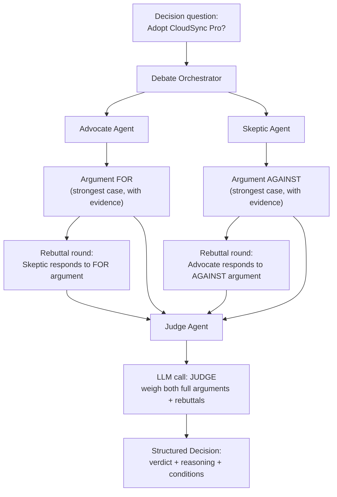

# Pattern 13: Debate Pattern

## 1. What is the Debate Pattern?

The **Debate Pattern** has two (or more) agents argue *opposing* sides of a specific question,
followed by a separate **judge agent** that weighs both arguments and renders a final decision.
Unlike Pattern 12's Multi-Agent System, where peers collaborate toward a shared draft they all
want to succeed, debate agents are deliberately adversarial — one is assigned to argue "yes,"
another "no," each trying to make the strongest possible case for their assigned side, even if
that's not what they'd "personally" conclude. The judge never argues; it only evaluates.

This structured adversarial setup is specifically designed to **stress-test a decision** by
forcing consideration of the strongest counter-arguments, rather than accepting the first
plausible-sounding reasoning a single agent produces.

## 2. What problem does it solves

A single agent (even a Self-Critique agent, Pattern 6) reasoning toward a decision has a
built-in weakness: it tends to follow one train of thought and can miss strong
counter-arguments it simply didn't generate, especially for judgment calls where reasonable
people could disagree. This is a genuinely different failure mode from Pattern 6's target
(arithmetic/logical errors in one chain of reasoning) — here the risk is **one-sided reasoning
that's individually valid but incomplete**, because nothing forced the model to construct the
strongest opposing case.

- A vendor-approval decision might look fine from a "does this vendor's proposal meet our
  needs" angle but miss a real risk that only surfaces when someone is specifically tasked
  with *arguing against* approval.
- A "should we grant this policy exception" decision benefits enormously from someone
  explicitly building the best case for "no," even if the eventual answer is "yes" — the
  reasoning becomes far more defensible once it's survived a real counter-argument.

The Debate Pattern solves this by making the counter-argument a required, dedicated step
(the "con" agent), then having an impartial judge weigh both fully-developed sides —
producing a more defensible outcome than a single pass of reasoning.

## 3. Realistic production example: Vendor Contract Risk Review

**A new example well-suited to genuine adversarial framing.** Before signing a new SaaS
vendor contract, procurement wants a documented pro/con analysis, not just "looks fine to me."

> Proposal: Adopt "CloudSync Pro" as the company's file-sync vendor, replacing the current
> provider, at a 15% lower annual cost.

- **Advocate Agent**: builds the strongest case *for* adopting CloudSync Pro (cost savings,
  feature parity, migration ease).
- **Skeptic Agent**: builds the strongest case *against* it (data residency concerns, contract
  lock-in terms, support SLA gaps) — this agent's job is specifically to find real risks, not
  to be contrarian for its own sake.
- **Judge Agent**: reads both fully-developed arguments (not just a summary) and renders a
  structured decision — approve, reject, or approve-with-conditions — with reasoning that
  explicitly engages both sides.

## 4. Architecture / Flow Diagram



## 5. Request-to-response flow, step by step

1. **Input**: a specific decision question, framed so it genuinely has two sides.
2. **Opening arguments, in parallel**: the Advocate and Skeptic agents each independently
   build their strongest case, with a system prompt explicitly assigning them their side
   ("your job is to make the best possible case FOR/AGAINST, regardless of your own
   assessment") — this explicit role assignment is what makes the argument genuinely
   adversarial rather than just "another agent's opinion."
3. **Rebuttal round**: each agent reads the *other's* opening argument and produces a targeted
   rebuttal — this is what pushes past surface-level arguments into addressing the actual
   strongest counter-points, closer to how real structured debate works.
4. **Judge call**: a separate agent — critically, one that was never assigned a side — reads
   both full arguments and both rebuttals, and renders a structured verdict. The judge is
   explicitly instructed to engage with specific points from both sides in its reasoning, not
   just declare a winner.
5. **Structured decision output**: a verdict (`approve` / `reject` / `approve_with_conditions`),
   the judge's reasoning, and — if conditional — the specific conditions that would need to be
   met, giving procurement (or whichever human owns the final call) a defensible, documented
   basis for the decision.
6. **Full transcript retained**: every argument and rebuttal is kept, not just the final
   verdict — essential for audit trails on higher-stakes decisions, and useful input for
   Pattern 7's self-improvement loop if the judge's calls are later reviewed and corrected.

## 6. Why this pattern fits (and when it doesn't)

**Fits well when:**
- The decision genuinely has two defensible sides, and a one-sided analysis risks missing real
  counter-arguments (contract review, policy exceptions, architecture trade-off decisions).
- You need a documented, defensible reasoning trail for a decision, not just an outcome.
- There's enough at stake to justify the extra cost of multiple structured argument rounds
  plus a judge call.

**Doesn't fit when:**
- The question doesn't really have two sides — forcing an artificial "con" argument for a
  clearly one-sided decision just wastes calls and can produce a misleadingly persuasive but
  ultimately meritless counter-argument.
- You need collaborative refinement toward one shared output, not a pro/con weighing of a
  binary-ish decision — Multi-Agent System (Pattern 12) fits that better.
- Low-stakes, high-volume decisions where the extra rigor doesn't pay for itself — reserve
  Debate for decisions where being wrong is genuinely costly.

## 7. Production-quality implementation

```python
"""
Pattern 13: Debate Pattern
-------------------------------
An Advocate and a Skeptic agent argue opposing sides of a vendor-adoption
decision, followed by rebuttals and a judge agent rendering a structured
verdict.

Run prerequisites:
    ollama pull llama3.1:8b
    pip install -U langchain langchain-core langchain-ollama pydantic

Run:
    python debate_pattern.py
"""

from __future__ import annotations

import logging
import time
from concurrent.futures import ThreadPoolExecutor, as_completed
from enum import Enum
from typing import Optional

from langchain_core.messages import HumanMessage, SystemMessage
from langchain_core.output_parsers import PydanticOutputParser
from langchain_core.exceptions import OutputParserException
from langchain_ollama import ChatOllama
from pydantic import BaseModel, Field, ValidationError

logging.basicConfig(
    level=logging.INFO,
    format="%(asctime)s | %(levelname)s | %(name)s | %(message)s",
)
logger = logging.getLogger("debate_pattern")


def invoke_structured(llm, system_content: str, user_content: str, parser, max_retries: int = 2):
    messages = [SystemMessage(content=system_content), HumanMessage(content=user_content)]
    last_error: Optional[Exception] = None
    for attempt in range(1, max_retries + 2):
        try:
            response = llm.invoke(messages)
            return parser.parse(response.content)
        except (OutputParserException, ValidationError) as e:
            last_error = e
            logger.warning(f"structured_call_failed attempt={attempt} error={e}")
            messages.append(HumanMessage(
                content="That wasn't valid JSON matching the schema. Respond again with "
                "ONLY the raw JSON object."
            ))
    raise RuntimeError(f"Structured call failed after retries: {last_error}")


# --------------------------------------------------------------------------
# Structured schemas
# --------------------------------------------------------------------------
class Argument(BaseModel):
    position: str
    key_points: list[str] = Field(description="3-5 concrete, specific points, not generic statements")
    evidence_cited: list[str] = Field(description="Specific facts/figures from the provided background")


class Rebuttal(BaseModel):
    responds_to: str
    counter_points: list[str]


class Verdict(str, Enum):
    APPROVE = "approve"
    REJECT = "reject"
    APPROVE_WITH_CONDITIONS = "approve_with_conditions"


class JudgeDecision(BaseModel):
    verdict: Verdict
    reasoning: str = Field(description="Must explicitly engage with specific points from BOTH sides")
    conditions: list[str] = Field(
        default_factory=list,
        description="Specific conditions required if verdict is approve_with_conditions, else empty",
    )


from dataclasses import dataclass


@dataclass
class DebateTranscript:
    question: str
    background: str
    for_argument: Argument
    against_argument: Argument
    for_rebuttal: Rebuttal
    against_rebuttal: Rebuttal
    decision: JudgeDecision


# --------------------------------------------------------------------------
# Debater agent — reused for both sides, parameterized by an assigned stance
# --------------------------------------------------------------------------
class DebaterAgent:
    ARGUMENT_PROMPT = """You are participating in a structured decision debate. Your assigned
position is: {stance}

Your job is to build the STRONGEST possible case for your assigned position, using only facts
from the background provided — even if you personally might lean the other way. Do not be
wishy-washy or hedge; make the best case your position allows, backed by specific evidence.

BACKGROUND:
{background}

Respond with ONLY a JSON object matching this schema (no markdown fences, no extra text):
{format_instructions}
"""

    REBUTTAL_PROMPT = """You are debating position: {stance}

The opposing side just made this argument:
{opposing_argument}

Write a targeted rebuttal: address their STRONGEST points specifically, using the background
facts. Don't just restate your original argument — directly engage with what they said.

BACKGROUND:
{background}

Respond with ONLY a JSON object matching this schema (no markdown fences, no extra text):
{format_instructions}
"""

    def __init__(self, llm: ChatOllama, stance: str, max_retries: int = 2) -> None:
        self.llm = llm
        self.stance = stance
        self.max_retries = max_retries
        self.arg_parser = PydanticOutputParser(pydantic_object=Argument)
        self.rebuttal_parser = PydanticOutputParser(pydantic_object=Rebuttal)

    def make_argument(self, background: str) -> Argument:
        system_content = self.ARGUMENT_PROMPT.format(
            stance=self.stance, background=background,
            format_instructions=self.arg_parser.get_format_instructions(),
        )
        return invoke_structured(self.llm, system_content, "Make your argument.",
                                  self.arg_parser, self.max_retries)

    def make_rebuttal(self, background: str, opposing_argument: Argument) -> Rebuttal:
        system_content = self.REBUTTAL_PROMPT.format(
            stance=self.stance,
            opposing_argument=opposing_argument.model_dump_json(indent=2),
            background=background,
            format_instructions=self.rebuttal_parser.get_format_instructions(),
        )
        return invoke_structured(self.llm, system_content, "Make your rebuttal.",
                                  self.rebuttal_parser, self.max_retries)


# --------------------------------------------------------------------------
# Judge agent — never assigned a side, only evaluates
# --------------------------------------------------------------------------
class JudgeAgent:
    JUDGE_PROMPT = """You are an impartial judge evaluating a structured debate on this
question: {question}

Weigh BOTH full arguments and BOTH rebuttals below. Your reasoning MUST explicitly reference
specific points from each side, not just declare a winner. Choose approve_with_conditions if
the case for approval is strong but specific risks need mitigation first.

FOR ARGUMENT:
{for_argument}

FOR REBUTTAL (responding to AGAINST):
{for_rebuttal}

AGAINST ARGUMENT:
{against_argument}

AGAINST REBUTTAL (responding to FOR):
{against_rebuttal}

Respond with ONLY a JSON object matching this schema (no markdown fences, no extra text):
{format_instructions}
"""

    def __init__(self, llm: ChatOllama, max_retries: int = 2) -> None:
        self.llm = llm
        self.max_retries = max_retries
        self.parser = PydanticOutputParser(pydantic_object=JudgeDecision)

    def decide(self, question: str, for_arg: Argument, for_reb: Rebuttal,
               against_arg: Argument, against_reb: Rebuttal) -> JudgeDecision:
        system_content = self.JUDGE_PROMPT.format(
            question=question,
            for_argument=for_arg.model_dump_json(indent=2),
            for_rebuttal=for_reb.model_dump_json(indent=2),
            against_argument=against_arg.model_dump_json(indent=2),
            against_rebuttal=against_reb.model_dump_json(indent=2),
            format_instructions=self.parser.get_format_instructions(),
        )
        return invoke_structured(self.llm, system_content, "Render your verdict.",
                                  self.parser, self.max_retries)


# --------------------------------------------------------------------------
# Orchestration
# --------------------------------------------------------------------------
class DebateOrchestrator:
    """Runs a full opening-arguments -> rebuttals -> judge verdict debate."""

    def __init__(self, model_name: str = "llama3.1:8b", temperature: float = 0.4, max_retries: int = 2) -> None:
        llm = ChatOllama(model=model_name, temperature=temperature)
        self.advocate = DebaterAgent(llm, stance="FOR adopting the proposal", max_retries=max_retries)
        self.skeptic = DebaterAgent(llm, stance="AGAINST adopting the proposal", max_retries=max_retries)
        self.judge = JudgeAgent(llm, max_retries=max_retries)

    def run(self, question: str, background: str) -> DebateTranscript:
        # 1. Opening arguments, in parallel — independent of each other
        with ThreadPoolExecutor(max_workers=2) as executor:
            futures = {
                executor.submit(self.advocate.make_argument, background): "for",
                executor.submit(self.skeptic.make_argument, background): "against",
            }
            arguments = {}
            for future in as_completed(futures):
                side = futures[future]
                arguments[side] = future.result()
                logger.info(f"opening_argument_complete side={side}")

        for_argument = arguments["for"]
        against_argument = arguments["against"]

        # 2. Rebuttals, in parallel — each reads the OTHER's opening argument
        with ThreadPoolExecutor(max_workers=2) as executor:
            futures = {
                executor.submit(self.advocate.make_rebuttal, background, against_argument): "for",
                executor.submit(self.skeptic.make_rebuttal, background, for_argument): "against",
            }
            rebuttals = {}
            for future in as_completed(futures):
                side = futures[future]
                rebuttals[side] = future.result()
                logger.info(f"rebuttal_complete side={side}")

        for_rebuttal = rebuttals["for"]
        against_rebuttal = rebuttals["against"]

        # 3. Judge weighs everything
        decision = self.judge.decide(
            question, for_argument, for_rebuttal, against_argument, against_rebuttal
        )
        logger.info(f"verdict={decision.verdict} conditions={decision.conditions}")

        return DebateTranscript(
            question=question, background=background,
            for_argument=for_argument, against_argument=against_argument,
            for_rebuttal=for_rebuttal, against_rebuttal=against_rebuttal,
            decision=decision,
        )


if __name__ == "__main__":
    orchestrator = DebateOrchestrator(model_name="llama3.1:8b")

    question = "Should we adopt CloudSync Pro as our file-sync vendor, replacing our current provider?"
    background = """
Proposal: CloudSync Pro, a file-sync SaaS vendor, offering 15% lower annual cost than our
current provider. Key facts:
- Feature parity with current provider on core sync functionality.
- Contract term: 3-year lock-in, no early termination clause.
- Data residency: servers located in a single region (not multi-region like current provider).
- Support SLA: 24-hour response time (current provider offers 4-hour).
- Migration estimated at 2 weeks of engineering time.
- Current provider's contract is up for renewal in 60 days.
"""

    print("=" * 70)
    print(f"QUESTION: {question}")

    start = time.monotonic()
    transcript = orchestrator.run(question, background)
    elapsed = time.monotonic() - start

    print(f"\n--- FOR ARGUMENT ---")
    for point in transcript.for_argument.key_points:
        print(f"  - {point}")

    print(f"\n--- AGAINST ARGUMENT ---")
    for point in transcript.against_argument.key_points:
        print(f"  - {point}")

    print(f"\n--- FOR REBUTTAL ---")
    for point in transcript.for_rebuttal.counter_points:
        print(f"  - {point}")

    print(f"\n--- AGAINST REBUTTAL ---")
    for point in transcript.against_rebuttal.counter_points:
        print(f"  - {point}")

    print(f"\n--- JUDGE VERDICT ({elapsed:.1f}s) ---")
    print(f"Verdict: {transcript.decision.verdict}")
    print(f"Reasoning: {transcript.decision.reasoning}")
    if transcript.decision.conditions:
        print("Conditions:")
        for c in transcript.decision.conditions:
            print(f"  - {c}")
```

### Notes on the code

- **`DebaterAgent` is a single reusable class parameterized by `stance`**, instantiated twice
  (Advocate, Skeptic) — the adversarial framing lives entirely in the prompt's assigned
  position, not in separate code paths, keeping both sides genuinely symmetric in how
  rigorously they're expected to argue.
- **The judge never sees a "which side is right" hint** — only the full arguments and
  rebuttals, and its prompt explicitly requires reasoning that engages both sides by name,
  preventing a lazy "the first argument sounded more confident" verdict.
- **Rebuttals read the *opposing* side's opening argument**, not their own — this is what
  forces genuine engagement with the strongest counter-points rather than each side just
  restating their original case twice.
- **Opening arguments run in parallel (independent), but rebuttals correctly depend on both
  opening arguments being done first** — the orchestration explicitly waits for both `for` and
  `against` arguments to complete before either rebuttal call starts, since each rebuttal needs
  the *other* side's finished argument as input.
- **The full transcript (`DebateTranscript`) is retained**, not just the verdict — critical for
  presenting a defensible decision to whoever owns the actual sign-off, and valuable audit data
  for later review.

### Versions used

- Python `3.11+`
- `langchain-core` `0.3.x`
- `langchain-ollama` `0.2.x`
- `pydantic` `2.x`
- Model: `llama3.1:8b` via local Ollama

---

**Next: [Pattern 14 — Sequential Agent](14-sequential-agent.md)**, stepping back from
multi-agent coordination to a simpler but important structural pattern: a fixed pipeline of
steps that must run in strict order, each depending on the previous step's output.
