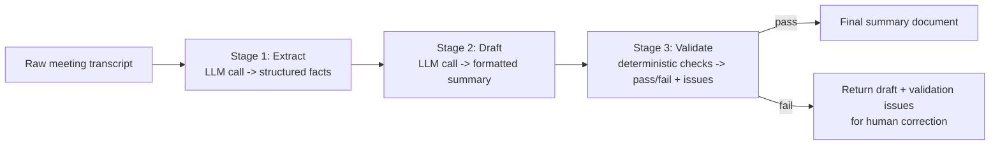

# Pattern 14: Sequential Agent

## 1. What is a Sequential Agent?

A **Sequential Agent** runs a fixed pipeline of steps in strict, predetermined order, where
each step's output becomes the next step's input. There's no branching decision about *which*
steps to run (that's Router, Pattern 8) and no dynamic re-planning mid-execution (that's
ReAct, Pattern 3, or Planning Agent's replan step, Pattern 4) — the sequence itself is known
and fixed in advance; only the *content* flowing through each stage varies per request.

This is the simplest possible multi-step structure: `Step A -> Step B -> Step C`, always in
that order, every time. It's worth treating as its own explicit pattern because it's extremely
common in production and deliberately simpler than every adaptive pattern covered so far —
recognizing when a fixed pipeline is genuinely sufficient (and not reaching for something more
dynamic than the problem needs) is itself an important design skill.

## 2. What problem does it solves

Many real tasks decompose naturally into ordered stages, and forcing that fixed order into a
single monolithic prompt causes the same problems described throughout this series (prompt
overload, hard-to-debug failures, no way to inspect intermediate results):

- A content pipeline might always need: extract key facts → draft based on facts → check
  draft length/format compliance — in that exact order, every time.
- Trying to get a single LLM call to do all three in one shot conflates very different kinds
  of work (extraction, generation, formatting/validation) into one prompt, making it harder to
  get any single stage right, and impossible to unit-test each stage independently.

A Sequential Agent solves this by making each stage its own discrete, independently testable
step with a clear input/output contract — while keeping the *orchestration* itself dead simple
(no LLM call decides "what's next," because the answer never changes).

## 3. Realistic production example: Meeting Notes → Action Items Pipeline

**A new example that's a textbook fit for a fixed pipeline.** Given raw meeting transcript
text, the company wants a consistent three-stage process, always run in the same order:

1. **Extract Stage**: pull out structured facts from the raw transcript — decisions made,
   action items mentioned, deadlines stated.
2. **Draft Stage**: turn those structured facts into a clean, formatted summary document with
   a "Decisions," "Action Items," and "Deadlines" section.
3. **Validate Stage**: check the drafted summary against a formatting checklist (every action
   item has an owner, every deadline is a real date, no section is empty if the extract stage
   found relevant facts) — deterministic checks, not another LLM call, since these are
   mechanically verifiable.

Each stage's output is exactly what the next stage needs — no branching, no re-ordering, ever.

## 4. Architecture / Flow Diagram



## 5. Request-to-response flow, step by step

1. **Input**: raw transcript text enters the pipeline at Stage 1, always.
2. **Stage 1 (Extract)**: an LLM call with a narrow, single-purpose prompt pulls structured
   facts (decisions, action items, deadlines) into a strict schema. This stage's only job is
   extraction — no drafting, no formatting decisions.
3. **Stage 2 (Draft)**: a *separate* LLM call receives Stage 1's structured facts (not the raw
   transcript again) and produces a formatted summary document. Working from structured facts
   rather than raw text keeps this stage focused purely on presentation, not re-extraction.
4. **Stage 3 (Validate)**: this stage is deliberately **not an LLM call** — it's plain Python
   checking mechanically verifiable properties (every action item has a named owner, every
   deadline parses as a real date, sections aren't empty when they shouldn't be). This mirrors
   the "prefer deterministic checks over LLM checks wherever possible" principle from Pattern
   6, applied here to formatting rather than arithmetic.
5. **Branch on validation** (the pipeline's only branch, and it's not a *routing* decision —
   it's a pass/fail gate): if validation passes, the summary is finalized; if it fails, the
   draft and the specific issues are returned together so a human can quickly fix just the
   flagged problems rather than redo the whole thing.
6. **Each stage is independently callable and testable** — you can unit test Stage 1's
   extraction quality with fixed transcripts and expected facts, entirely separately from
   Stage 2's formatting quality, which is a major practical advantage of decomposing a fixed
   pipeline into discrete stages instead of one large prompt.

## 6. Why this pattern fits (and when it doesn't)

**Fits well when:**
- The stage order is genuinely fixed and known ahead of time — no request-specific decision
  about what order or which steps to run.
- Different stages benefit from different treatment (one stage suits an LLM call, another is
  purely mechanical and shouldn't use one at all).
- You want each stage to be independently testable and debuggable.

**Doesn't fit when:**
- The right next step actually depends on what happened in a previous step, in a way that
  isn't just "pass/fail" — that adaptiveness needs ReAct (Pattern 3) or a Planning Agent's
  replan step (Pattern 4).
- Steps could genuinely run independently of each other (no real ordering dependency) — running
  them in sequence when they don't need to be sequential just adds unnecessary latency; use
  **Parallel Agent** (Pattern 15) instead.
- There's real branching logic about *which* stages apply to a given request — that's Router
  (Pattern 8), not Sequential.

## 7. Production-quality implementation

```python
"""
Pattern 14: Sequential Agent
---------------------------------
A fixed three-stage pipeline: Extract facts from a meeting transcript,
Draft a formatted summary, Validate it deterministically.

Run prerequisites:
    ollama pull llama3.1:8b
    pip install -U langchain langchain-core langchain-ollama pydantic

Run:
    python sequential_agent.py
"""

from __future__ import annotations

import logging
import re
import time
from datetime import datetime
from typing import Optional

from langchain_core.messages import HumanMessage, SystemMessage
from langchain_core.output_parsers import PydanticOutputParser
from langchain_core.exceptions import OutputParserException
from langchain_ollama import ChatOllama
from pydantic import BaseModel, Field, ValidationError

logging.basicConfig(
    level=logging.INFO,
    format="%(asctime)s | %(levelname)s | %(name)s | %(message)s",
)
logger = logging.getLogger("sequential_agent")


def invoke_structured(llm, system_content: str, user_content: str, parser, max_retries: int = 2):
    messages = [SystemMessage(content=system_content), HumanMessage(content=user_content)]
    last_error: Optional[Exception] = None
    for attempt in range(1, max_retries + 2):
        try:
            response = llm.invoke(messages)
            return parser.parse(response.content)
        except (OutputParserException, ValidationError) as e:
            last_error = e
            logger.warning(f"structured_call_failed attempt={attempt} error={e}")
            messages.append(HumanMessage(
                content="That wasn't valid JSON matching the schema. Respond again with "
                "ONLY the raw JSON object."
            ))
    raise RuntimeError(f"Structured call failed after retries: {last_error}")


# --------------------------------------------------------------------------
# Stage 1: Extract — structured schema for facts pulled from the transcript
# --------------------------------------------------------------------------
class ActionItem(BaseModel):
    description: str
    owner: Optional[str] = Field(default=None, description="Name of the person responsible, null if unclear")
    deadline: Optional[str] = Field(default=None, description="Deadline as YYYY-MM-DD if stated, else null")


class ExtractedFacts(BaseModel):
    decisions: list[str]
    action_items: list[ActionItem]


class ExtractStage:
    SYSTEM_PROMPT = """Extract structured facts from this meeting transcript: decisions made,
and action items (each with an owner and deadline if explicitly stated — use null if not
stated, never guess).

Respond with ONLY a JSON object matching this schema (no markdown fences, no extra text):
{format_instructions}
"""

    def __init__(self, llm: ChatOllama, max_retries: int = 2) -> None:
        self.llm = llm
        self.max_retries = max_retries
        self.parser = PydanticOutputParser(pydantic_object=ExtractedFacts)

    def run(self, transcript: str) -> ExtractedFacts:
        system_content = self.SYSTEM_PROMPT.format(
            format_instructions=self.parser.get_format_instructions()
        )
        result = invoke_structured(self.llm, system_content, transcript, self.parser, self.max_retries)
        logger.info(f"stage=extract decisions={len(result.decisions)} "
                    f"action_items={len(result.action_items)}")
        return result


# --------------------------------------------------------------------------
# Stage 2: Draft — formatted summary built from Stage 1's structured output
# --------------------------------------------------------------------------
class DraftedSummary(BaseModel):
    summary_markdown: str


class DraftStage:
    SYSTEM_PROMPT = """Turn these extracted meeting facts into a clean Markdown summary
document with exactly three sections in this order: "## Decisions", "## Action Items",
"## Deadlines". Under Action Items, list each with its owner (write "Unassigned" if none).
Under Deadlines, list only items that have a deadline, formatted as "- <description>: <date>".
If a section has no relevant facts, write "None." under that heading rather than omitting it.

FACTS:
{facts}

Respond with ONLY a JSON object matching this schema (no markdown fences, no extra text):
{format_instructions}
"""

    def __init__(self, llm: ChatOllama, max_retries: int = 2) -> None:
        self.llm = llm
        self.max_retries = max_retries
        self.parser = PydanticOutputParser(pydantic_object=DraftedSummary)

    def run(self, facts: ExtractedFacts) -> DraftedSummary:
        system_content = self.SYSTEM_PROMPT.format(
            facts=facts.model_dump_json(indent=2),
            format_instructions=self.parser.get_format_instructions(),
        )
        result = invoke_structured(self.llm, system_content, "Draft the summary.",
                                    self.parser, self.max_retries)
        logger.info(f"stage=draft summary_length={len(result.summary_markdown)}")
        return result


# --------------------------------------------------------------------------
# Stage 3: Validate — deterministic checks, NO LLM call needed
# --------------------------------------------------------------------------
class ValidationResult(BaseModel):
    passed: bool
    issues: list[str]


class ValidateStage:
    """Pure Python validation — mechanically verifiable properties don't
    need (and shouldn't use) an LLM call."""

    REQUIRED_SECTIONS = ["## Decisions", "## Action Items", "## Deadlines"]
    DATE_PATTERN = re.compile(r"\d{4}-\d{2}-\d{2}")

    def run(self, facts: ExtractedFacts, drafted: DraftedSummary) -> ValidationResult:
        issues: list[str] = []
        text = drafted.summary_markdown

        for section in self.REQUIRED_SECTIONS:
            if section not in text:
                issues.append(f"Missing required section: {section}")

        for item in facts.action_items:
            if item.owner and item.owner not in text:
                issues.append(f"Action item owner '{item.owner}' not found in drafted summary")

        for item in facts.action_items:
            if item.deadline:
                if not self._is_valid_date(item.deadline):
                    issues.append(f"Action item deadline '{item.deadline}' is not a valid YYYY-MM-DD date")
                elif item.deadline not in text:
                    issues.append(f"Deadline '{item.deadline}' from facts not reflected in drafted summary")

        passed = len(issues) == 0
        logger.info(f"stage=validate passed={passed} issue_count={len(issues)}")
        return ValidationResult(passed=passed, issues=issues)

    @staticmethod
    def _is_valid_date(date_str: str) -> bool:
        try:
            datetime.strptime(date_str, "%Y-%m-%d")
            return True
        except ValueError:
            return False


# --------------------------------------------------------------------------
# The Sequential pipeline orchestrator — deliberately simple: no branching
# logic decides step order, because the order never changes.
# --------------------------------------------------------------------------
class PipelineResult(BaseModel):
    facts: ExtractedFacts
    drafted_summary: str
    validation: ValidationResult


class MeetingNotesPipeline:
    """Fixed sequential pipeline: Extract -> Draft -> Validate, always in
    that order."""

    def __init__(self, model_name: str = "llama3.1:8b", temperature: float = 0.1, max_retries: int = 2) -> None:
        llm = ChatOllama(model=model_name, temperature=temperature)
        self.extract_stage = ExtractStage(llm, max_retries)
        self.draft_stage = DraftStage(llm, max_retries)
        self.validate_stage = ValidateStage()

    def run(self, transcript: str) -> PipelineResult:
        if not transcript.strip():
            raise ValueError("transcript must be non-empty")

        facts = self.extract_stage.run(transcript)
        drafted = self.draft_stage.run(facts)
        validation = self.validate_stage.run(facts, drafted)

        return PipelineResult(
            facts=facts, drafted_summary=drafted.summary_markdown, validation=validation
        )


if __name__ == "__main__":
    pipeline = MeetingNotesPipeline(model_name="llama3.1:8b")

    transcript = """
Alex: Okay, let's wrap up. First, we decided to go with the React Native rewrite instead of
staying native on both platforms.
Priya: Right, and I'll own getting the technical spec written up. I can have that done by
2026-08-28.
Alex: Great. We also decided to postpone the Android widget feature until next quarter.
Sam: I'll follow up with the design team about the new onboarding flow mockups — no hard
deadline yet, just need to get moving on it.
Alex: Perfect, sounds like we're aligned. Thanks everyone.
"""

    print("=" * 70)
    print("TRANSCRIPT:")
    print(transcript.strip())

    start = time.monotonic()
    result = pipeline.run(transcript)
    elapsed = time.monotonic() - start

    print(f"\n--- EXTRACTED FACTS ({elapsed:.1f}s) ---")
    print(result.facts.model_dump_json(indent=2))

    print("\n--- DRAFTED SUMMARY ---")
    print(result.drafted_summary)

    print(f"\n--- VALIDATION (passed={result.validation.passed}) ---")
    for issue in result.validation.issues:
        print(f"  - {issue}")
    if result.validation.passed:
        print("  No issues found.")
```

### Notes on the code

- **The pipeline order is hardcoded in `MeetingNotesPipeline.run()`** — `extract_stage.run()`
  always precedes `draft_stage.run()`, which always precedes `validate_stage.run()`. There's
  no LLM call anywhere deciding "what's next" because that decision never varies; this is what
  makes Sequential fundamentally simpler to reason about (and cheaper) than ReAct or Planning.
- **Stage 2 works from Stage 1's structured facts, not the raw transcript again** — each
  stage's input is exactly the previous stage's output, keeping each stage narrowly scoped to
  one kind of work (extraction vs. formatting) rather than re-deriving context every step.
- **Stage 3 is plain Python with zero LLM calls.** Checking for required section headers,
  verifying an owner name appears in the text, and validating date formats are all mechanically
  checkable — using an LLM for this would be slower, costlier, and less reliable than the
  regex/string checks shown, directly echoing Pattern 6's "prefer deterministic checks over
  LLM checks wherever the check is actually deterministic" principle.
- **Each stage class (`ExtractStage`, `DraftStage`, `ValidateStage`) is independently
  testable** — you could write a unit test that feeds `ExtractStage.run()` a fixed transcript
  and asserts on the exact facts extracted, with zero dependency on Stage 2 or 3 ever running,
  a major practical benefit of decomposing a fixed pipeline into discrete classes.
- **Validation failure returns data, not an exception** — matching the "never crash the
  caller with something structured is expected to catch" discipline from Pattern 10's Worker
  Agent, applied here to a pipeline stage instead of a coordinator-facing worker.

### Versions used

- Python `3.11+`
- `langchain-core` `0.3.x`
- `langchain-ollama` `0.2.x`
- `pydantic` `2.x`
- Model: `llama3.1:8b` via local Ollama

---

**Next: [Pattern 15 — Parallel Agent](15-parallel-agent.md)**, covering the complementary
case explicitly flagged above: steps that have no ordering dependency on each other and should
run concurrently rather than one after another.
