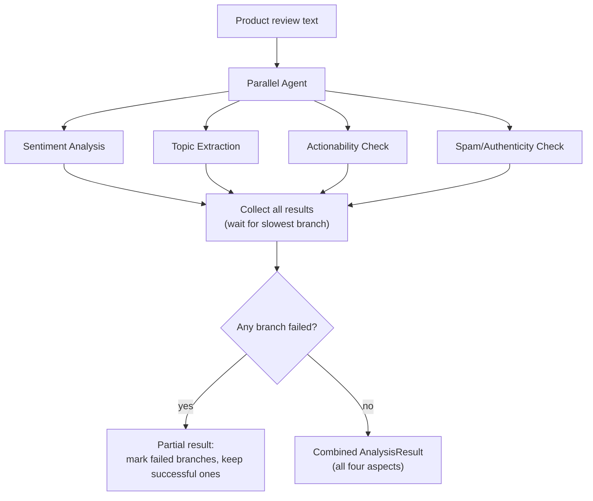

# Pattern 15: Parallel Agent

## 1. What is a Parallel Agent?

A **Parallel Agent** runs multiple independent steps concurrently rather than one after
another, because those steps don't depend on each other's output — only the *combination* of
their results matters, not the order they finish in. We've actually already used this
mechanism inside Patterns 9, 11, 12, and 13 (`ThreadPoolExecutor` running independent
specialist/reviewer/debater calls at the same time); this pattern is the dedicated, standalone
treatment of *when* and *how* to parallelize LLM calls correctly and safely.

The core requirement for parallelization is **independence**: each parallel branch must be
computable from the shared input alone, without needing any other branch's result. The moment
step B needs step A's output, you're back to Sequential (Pattern 14), not Parallel.

## 2. What problem does it solves

Running independent steps one after another wastes real time for no benefit — if analyzing a
document's tone doesn't depend on extracting its key facts, doing them sequentially just adds
their latencies together for nothing. As the number of independent analyses grows, this
adds up fast:

- A **multi-perspective document review** — checking grammar, checking factual claims,
  checking tone, checking length — run sequentially might take 4x a single call's latency for
  no reason, since none of these checks need each other's results.
- A **fan-out data-gathering task** — summarizing five different product reviews
  independently — run one at a time when they could all be in flight simultaneously.

A Parallel Agent solves this by explicitly identifying which steps are truly independent and
running exactly those concurrently, cutting wall-clock latency roughly to the slowest single
branch instead of the sum of all branches — while still handling the real complications that
come with concurrency: partial failures, result aggregation, and knowing when *not* to
parallelize.

## 3. Realistic production example: Multi-Aspect Product Review Analyzer

**A new example designed to be a clean, unambiguous case for parallelism** — no ordering
dependency between any of the analyses. Given a single customer product review, run four
independent analyses simultaneously:

1. **Sentiment analysis** — positive/negative/mixed, with intensity.
2. **Topic extraction** — which product aspects are mentioned (price, quality, shipping,
   support).
3. **Actionability check** — does this review contain something the product team should act
   on (a bug report, a feature request)?
4. **Spam/authenticity check** — does this look like a genuine review or spam/fake content?

None of these four analyses need any of the others' results — they're all independently
derived from the same input review text — making this a textbook case for running all four
concurrently and combining the results once everything completes.

## 4. Architecture / Flow Diagram



## 5. Request-to-response flow, step by step

1. **Input**: a single review text, the shared input every branch reads independently.
2. **Fan-out**: four LLM calls are dispatched concurrently via a thread pool — each is a small,
   focused, single-purpose call (mirroring the Worker Agent discipline from Pattern 10: narrow
   scope, strict output contract).
3. **Wait for completion**: the orchestrator waits for all branches to finish (or fail) — total
   wall-clock time is roughly the *slowest* single branch's latency, not the sum of all four,
   which is the entire point of parallelizing.
4. **Per-branch failure isolation**: exactly like Pattern 9's specialist handling, each
   branch's failure is caught independently and doesn't crash the others — a spam-check timeout
   shouldn't prevent sentiment and topic results from still being returned.
5. **Aggregation**: successful results are combined into one `AnalysisResult`; failed branches
   are explicitly marked (not silently dropped), so callers know exactly which aspects of the
   analysis are missing and why.
6. **No LLM call decides the fan-out structure** — unlike Router (Pattern 8) or Supervisor
   (Pattern 9), which use an LLM call to *decide* what to run, here the four branches to run
   are fixed and known ahead of time (all four analyses always apply to every review); the only
   dynamic part is each branch's *content*, not *which* branches exist.

## 6. Why this pattern fits (and when it doesn't)

**Fits well when:**
- Multiple analyses/sub-tasks are genuinely independent of each other's output.
- Latency matters and the branches are numerous or slow enough that running them concurrently
  produces a meaningful speedup.
- Partial results are still useful — one branch failing shouldn't block the value of the
  others.

**Doesn't fit when:**
- A step's input actually depends on a previous step's output — that's Sequential (Pattern
  14), and trying to parallelize it will just produce wrong or missing data.
- There's only one or two lightweight branches — the overhead of setting up concurrent
  execution isn't worth it for negligible latency savings.
- Downstream logic genuinely needs *all* branches to succeed together as a single atomic unit
  (no useful "partial" result) — then failure handling should treat the whole operation as
  failed rather than returning a partial `AnalysisResult`, which is a design choice to make
  explicitly rather than default into.

## 7. Production-quality implementation

```python
"""
Pattern 15: Parallel Agent
-------------------------------
Four independent analyses of a single product review — sentiment, topics,
actionability, and spam/authenticity — run concurrently and combined.

Run prerequisites:
    ollama pull llama3.1:8b
    pip install -U langchain langchain-core langchain-ollama pydantic

Run:
    python parallel_agent.py
"""

from __future__ import annotations

import logging
import time
from concurrent.futures import ThreadPoolExecutor, as_completed
from enum import Enum
from typing import Optional

from langchain_core.messages import HumanMessage, SystemMessage
from langchain_core.output_parsers import PydanticOutputParser
from langchain_core.exceptions import OutputParserException
from langchain_ollama import ChatOllama
from pydantic import BaseModel, Field, ValidationError

logging.basicConfig(
    level=logging.INFO,
    format="%(asctime)s | %(levelname)s | %(name)s | %(message)s",
)
logger = logging.getLogger("parallel_agent")


def invoke_structured(llm, system_content: str, user_content: str, parser, max_retries: int = 2):
    messages = [SystemMessage(content=system_content), HumanMessage(content=user_content)]
    last_error: Optional[Exception] = None
    for attempt in range(1, max_retries + 2):
        try:
            response = llm.invoke(messages)
            return parser.parse(response.content)
        except (OutputParserException, ValidationError) as e:
            last_error = e
            logger.warning(f"structured_call_failed attempt={attempt} error={e}")
            messages.append(HumanMessage(
                content="That wasn't valid JSON matching the schema. Respond again with "
                "ONLY the raw JSON object."
            ))
    raise RuntimeError(f"Structured call failed after retries: {last_error}")


# --------------------------------------------------------------------------
# Four independent, narrow analysis schemas (Worker Agent discipline: small,
# single-purpose, strict contracts)
# --------------------------------------------------------------------------
class Sentiment(str, Enum):
    POSITIVE = "positive"
    NEGATIVE = "negative"
    MIXED = "mixed"


class SentimentResult(BaseModel):
    sentiment: Sentiment
    intensity: float = Field(ge=0.0, le=1.0)


class TopicsResult(BaseModel):
    topics: list[str] = Field(description="Product aspects mentioned, e.g. 'price', 'shipping'")


class ActionabilityResult(BaseModel):
    actionable: bool
    action_type: Optional[str] = Field(default=None, description="'bug_report', 'feature_request', or null")
    detail: str


class AuthenticityResult(BaseModel):
    looks_genuine: bool
    reason: str


# --------------------------------------------------------------------------
# Each branch is a tiny, single-purpose function — matching Worker Agent's
# discipline of narrow scope and a strict output contract.
# --------------------------------------------------------------------------
def analyze_sentiment(llm, review_text: str, max_retries: int) -> SentimentResult:
    parser = PydanticOutputParser(pydantic_object=SentimentResult)
    system = (
        "Classify the sentiment of this product review and its intensity (0=mild, 1=extreme).\n"
        f"Respond with ONLY JSON matching this schema:\n{parser.get_format_instructions()}"
    )
    return invoke_structured(llm, system, review_text, parser, max_retries)


def analyze_topics(llm, review_text: str, max_retries: int) -> TopicsResult:
    parser = PydanticOutputParser(pydantic_object=TopicsResult)
    system = (
        "Extract which product aspects (price, quality, shipping, support, ease of use, etc.) "
        "are mentioned in this review.\n"
        f"Respond with ONLY JSON matching this schema:\n{parser.get_format_instructions()}"
    )
    return invoke_structured(llm, system, review_text, parser, max_retries)


def analyze_actionability(llm, review_text: str, max_retries: int) -> ActionabilityResult:
    parser = PydanticOutputParser(pydantic_object=ActionabilityResult)
    system = (
        "Determine if this review contains something the product team should act on "
        "(a bug report or feature request). If not, actionable=false and action_type=null.\n"
        f"Respond with ONLY JSON matching this schema:\n{parser.get_format_instructions()}"
    )
    return invoke_structured(llm, system, review_text, parser, max_retries)


def analyze_authenticity(llm, review_text: str, max_retries: int) -> AuthenticityResult:
    parser = PydanticOutputParser(pydantic_object=AuthenticityResult)
    system = (
        "Assess if this looks like a genuine customer review or spam/fake/promotional content.\n"
        f"Respond with ONLY JSON matching this schema:\n{parser.get_format_instructions()}"
    )
    return invoke_structured(llm, system, review_text, parser, max_retries)


# --------------------------------------------------------------------------
# Aggregated result — explicitly tracks which branches failed, never
# silently drops a failure
# --------------------------------------------------------------------------
class AnalysisResult(BaseModel):
    sentiment: Optional[SentimentResult] = None
    topics: Optional[TopicsResult] = None
    actionability: Optional[ActionabilityResult] = None
    authenticity: Optional[AuthenticityResult] = None
    failed_branches: list[str] = Field(default_factory=list)


class ParallelReviewAnalyzer:
    """Runs four independent review analyses concurrently and aggregates
    the results, isolating any single branch's failure from the others."""

    BRANCHES = {
        "sentiment": analyze_sentiment,
        "topics": analyze_topics,
        "actionability": analyze_actionability,
        "authenticity": analyze_authenticity,
    }

    def __init__(self, model_name: str = "llama3.1:8b", temperature: float = 0.1, max_retries: int = 2) -> None:
        self.llm = ChatOllama(model=model_name, temperature=temperature)
        self.max_retries = max_retries

    def analyze(self, review_text: str) -> AnalysisResult:
        if not review_text.strip():
            raise ValueError("review_text must be non-empty")

        result = AnalysisResult()

        with ThreadPoolExecutor(max_workers=len(self.BRANCHES)) as executor:
            futures = {
                executor.submit(fn, self.llm, review_text, self.max_retries): branch_name
                for branch_name, fn in self.BRANCHES.items()
            }

            for future in as_completed(futures):
                branch_name = futures[future]
                try:
                    branch_result = future.result()
                    setattr(result, branch_name, branch_result)
                    logger.info(f"branch_completed name={branch_name}")
                except Exception as e:
                    logger.error(f"branch_failed name={branch_name} error={e}")
                    result.failed_branches.append(branch_name)

        return result


if __name__ == "__main__":
    analyzer = ParallelReviewAnalyzer(model_name="llama3.1:8b")

    review = (
        "I really wanted to love this blender but it started leaking from the base after "
        "just two weeks of light use. Customer support was slow to respond (took 4 days), "
        "though when they did reply they were helpful. For the price, I expected better "
        "build quality. It would be great if they added a warranty registration reminder "
        "in the box, I almost missed the window to file a claim."
    )

    print("=" * 70)
    print(f"REVIEW: {review}")

    start = time.monotonic()
    result = analyzer.analyze(review)
    elapsed = time.monotonic() - start

    print(f"\n--- PARALLEL ANALYSIS RESULT ({elapsed:.1f}s wall-clock) ---")
    if result.sentiment:
        print(f"Sentiment: {result.sentiment.sentiment} (intensity={result.sentiment.intensity})")
    if result.topics:
        print(f"Topics: {', '.join(result.topics.topics)}")
    if result.actionability:
        print(f"Actionable: {result.actionability.actionable} "
              f"({result.actionability.action_type}) — {result.actionability.detail}")
    if result.authenticity:
        print(f"Looks genuine: {result.authenticity.looks_genuine} — {result.authenticity.reason}")
    if result.failed_branches:
        print(f"\nFAILED BRANCHES (excluded from result above): {result.failed_branches}")
```

### Notes on the code

- **`ThreadPoolExecutor(max_workers=len(self.BRANCHES))`** submits all four analyses at once;
  `as_completed` yields each as it finishes, so the orchestrator processes results as soon as
  they're ready rather than waiting in submission order — total wall-clock time is bounded by
  the slowest branch, not the sum of all four.
- **`setattr(result, branch_name, branch_result)`** combined with the `BRANCHES` dict keyed by
  the same names as `AnalysisResult`'s fields keeps the branch list and the aggregation logic
  in sync — adding a fifth analysis is one new function plus one new dict entry, with zero
  changes needed to the concurrency/aggregation code itself.
- **`failed_branches` makes partial failure visible and explicit**, never silent — a caller
  checking `result.sentiment is None` alone couldn't distinguish "this review had no sentiment"
  (impossible, but illustrates the ambiguity) from "the sentiment branch failed"; the explicit
  list resolves that ambiguity directly.
- **Every branch function has an identical, narrow signature**
  (`fn(llm, review_text, max_retries) -> SomeResult`) — this uniformity is what makes them
  trivially interchangeable in the `BRANCHES` dict and easy to submit generically inside the
  loop, rather than needing bespoke handling per branch.
- **This is genuinely different from Pattern 9's parallel specialist calls** in one key way:
  here, *all four* branches always run for *every* input (no delegation-planning LLM call
  decides which apply) — because unlike Pattern 9's billing/technical split, all four analyses
  are always relevant to any review. Contrast this with Pattern 9, where an LLM decides *which*
  specialists are even needed before parallelizing across the relevant ones.

### Versions used

- Python `3.11+`
- `langchain-core` `0.3.x`
- `langchain-ollama` `0.2.x`
- `pydantic` `2.x`
- Model: `llama3.1:8b` via local Ollama

---

**Next: [Pattern 16 — Human-in-the-Loop Agent](16-human-in-the-loop-agent.md)**, formalizing
a mechanism we've used informally in several earlier patterns (Planning's approval gate,
Self-Improving's rule approval) into its own dedicated pattern: how to pause an agent
mid-execution for real human input, and resume cleanly afterward.
