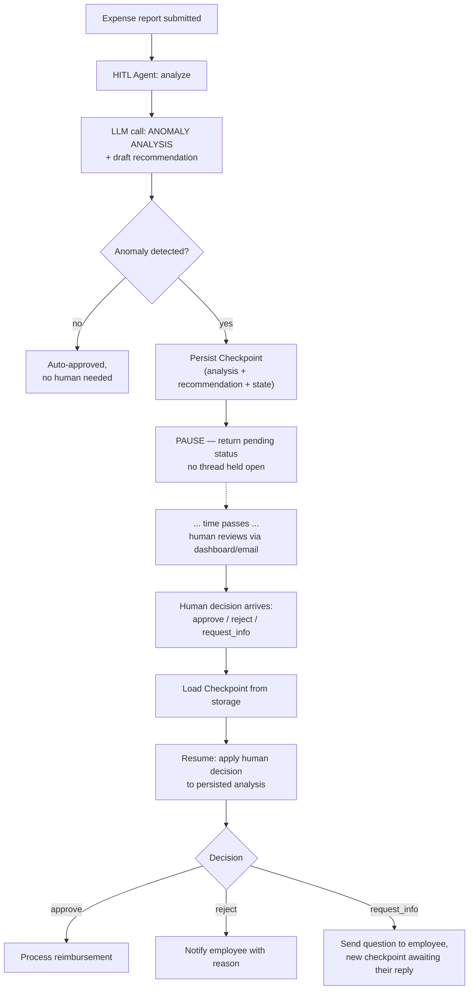

# Pattern 16: Human-in-the-Loop Agent

## 1. What is a Human-in-the-Loop Agent?

A **Human-in-the-Loop (HITL) Agent** pauses its own execution at a defined checkpoint, waits
for real human input (approval, correction, or additional information), and then resumes
using that input — rather than running start-to-finish autonomously. We've used this
informally already: Pattern 4's Planning Agent gated execution behind `approve=True`, and
Pattern 7's Self-Improving Agent required `approve_and_apply()` before a rule went live. This
pattern formalizes the *mechanism itself*: how to actually pause, persist enough state to
resume correctly, and hand control back cleanly — as a reusable capability rather than a
one-off `if approve:` check baked into a single agent.

The key engineering challenge HITL adds beyond "just add an approval flag" is **state
persistence across a pause that could last seconds or days**: the agent's in-progress context
has to survive being paused, potentially across process restarts, until a human acts.

## 2. What problem does it solves

Full autonomy is the wrong default for anything with real consequences, legal exposure, or
enough ambiguity that a human's judgment materially improves the outcome — a concern raised
throughout this series (Planning Agent's approval gate, Self-Improving's rule review). But
naively bolting on "wait for approval" tends to create real engineering problems:

- **Blocking a thread/process while waiting for a human** doesn't scale — a human might take
  minutes or days to respond, and you can't hold a server thread open that whole time.
- **Losing context across the pause.** If the agent's state isn't properly persisted, resuming
  after a human responds means re-deriving everything from scratch, or worse, silently losing
  important context gathered before the pause.
- **Unclear resumption semantics.** What exactly does "approve" resume *with*? Does a
  "reject" restart the whole task, or hand back for revision with feedback? Ad hoc
  implementations tend to handle this inconsistently.

A dedicated HITL pattern solves this with an explicit **pause/resume state machine**: the
agent's state is serialized at the checkpoint, the process can end entirely, and a separate
resumption call later reconstructs exactly where things left off using the persisted state
plus the human's decision.

## 3. Realistic production example: Expense Report Anomaly Approval

**A new example designed to show a real pause/resume lifecycle**, not just an in-memory
`approve=True` flag. An automated expense-report reviewer flags anomalies (amount far above
category average, missing receipt, duplicate-looking submission) and drafts a recommended
action (approve, reject, request more info) — but for any flagged anomaly, a human finance
reviewer must make the actual call, and that review might not happen for hours. The agent:

1. Analyzes the expense and, if anomalous, produces a `PendingReview` — its analysis, a
   recommendation, and a **persisted checkpoint** — then genuinely stops; no thread is held
   open.
2. Some time later (a separate request, possibly a different process entirely), a human's
   decision arrives and the agent **resumes** from the persisted checkpoint, using the human's
   decision to determine the final outcome and produce the appropriate follow-up action.

## 4. Architecture / Flow Diagram



## 5. Request-to-response flow, step by step

1. **Submission**: an expense report comes in; the agent runs its analysis immediately (no
   human needed yet for this part).
2. **Analysis call**: an LLM call examines the expense against category norms and flags
   anomalies, producing a structured `AnomalyAnalysis` with a draft recommendation.
3. **Auto-approve path**: if nothing anomalous is found, the agent completes immediately —
   HITL only kicks in when it's actually warranted, not for every request (over-using human
   review defeats the purpose of automation).
4. **Checkpoint & pause**: for anomalous expenses, the agent's current state — the analysis,
   the draft recommendation, and any identifiers needed to resume — is **persisted** (here, a
   simple file-backed store standing in for a real database/queue) and a `pending_human_review`
   status is returned immediately. Critically, **no thread or process stays alive waiting** —
   this is what makes it genuinely scalable to human response times measured in hours or days.
5. **The gap**: time passes. The human reviewer sees the pending item (via whatever real
   interface — dashboard, email with approve/reject links, Slack message) completely decoupled
   from the original request that created the checkpoint.
6. **Resumption**: when the human's decision arrives (a *separate* API call/event, potentially
   handled by an entirely different process instance), the agent **loads the persisted
   checkpoint** and combines it with the human's decision to determine the final outcome.
7. **Branch on decision**: `approve` → trigger reimbursement; `reject` → notify the employee
   with the reason; `request_info` → send a question back to the employee and create a *new*
   checkpoint awaiting their reply, showing that pause/resume can chain across multiple
   human-facing steps, not just a single approve/reject gate.

## 6. Why this pattern fits (and when it doesn't)

**Fits well when:**
- Decisions have real consequences (financial, legal, safety) where human judgment materially
  reduces risk.
- The wait for human input could be long (minutes to days) — anything requiring the process to
  stay alive that whole time is impractical.
- You need a clear audit trail of what was recommended vs. what a human actually decided.

**Doesn't fit when:**
- The task is low-stakes and reversible enough that full automation is the better trade-off —
  requiring human review on every trivial expense would create an unsustainable review queue
  and defeats the purpose of automating the routine cases.
- The "human" input is really needed synchronously within seconds as part of a live
  conversation — that's closer to a normal conversational turn, not a pause/resume checkpoint.
- There's no real persistence layer available and the pause is always short and in-process —
  a simpler in-memory `approve=True` flag (as used informally in Pattern 4) may be sufficient
  for a system where the whole flow really does complete in one request/response cycle.

## 7. Production-quality implementation

```python
"""
Pattern 16: Human-in-the-Loop Agent
----------------------------------------
An expense-anomaly reviewer that persists a checkpoint and genuinely pauses
(no blocked thread) when human review is needed, then resumes from that
checkpoint once a decision arrives — potentially in an entirely separate
process invocation.

Run prerequisites:
    ollama pull llama3.1:8b
    pip install -U langchain langchain-core langchain-ollama pydantic

Run:
    python human_in_the_loop_agent.py
"""

from __future__ import annotations

import json
import logging
import time
import uuid
from enum import Enum
from pathlib import Path
from typing import Optional

from langchain_core.messages import HumanMessage, SystemMessage
from langchain_core.output_parsers import PydanticOutputParser
from langchain_core.exceptions import OutputParserException
from langchain_ollama import ChatOllama
from pydantic import BaseModel, Field, ValidationError

logging.basicConfig(
    level=logging.INFO,
    format="%(asctime)s | %(levelname)s | %(name)s | %(message)s",
)
logger = logging.getLogger("hitl_agent")


def invoke_structured(llm, system_content: str, user_content: str, parser, max_retries: int = 2):
    messages = [SystemMessage(content=system_content), HumanMessage(content=user_content)]
    last_error: Optional[Exception] = None
    for attempt in range(1, max_retries + 2):
        try:
            response = llm.invoke(messages)
            return parser.parse(response.content)
        except (OutputParserException, ValidationError) as e:
            last_error = e
            logger.warning(f"structured_call_failed attempt={attempt} error={e}")
            messages.append(HumanMessage(
                content="That wasn't valid JSON matching the schema. Respond again with "
                "ONLY the raw JSON object."
            ))
    raise RuntimeError(f"Structured call failed after retries: {last_error}")


# --------------------------------------------------------------------------
# Checkpoint store — file-backed here to demonstrate REAL persistence across
# a pause (survives process restart); a production system would use a real
# database or durable queue instead.
# --------------------------------------------------------------------------
class CheckpointStore:
    def __init__(self, directory: str = "hitl_checkpoints") -> None:
        self.dir = Path(directory)
        self.dir.mkdir(exist_ok=True)

    def save(self, checkpoint_id: str, data: dict) -> None:
        path = self.dir / f"{checkpoint_id}.json"
        path.write_text(json.dumps(data, indent=2))
        logger.info(f"checkpoint_saved id={checkpoint_id}")

    def load(self, checkpoint_id: str) -> dict:
        path = self.dir / f"{checkpoint_id}.json"
        if not path.exists():
            raise KeyError(f"No checkpoint found with id {checkpoint_id}")
        return json.loads(path.read_text())

    def delete(self, checkpoint_id: str) -> None:
        path = self.dir / f"{checkpoint_id}.json"
        path.unlink(missing_ok=True)


# --------------------------------------------------------------------------
# Structured schemas
# --------------------------------------------------------------------------
class Recommendation(str, Enum):
    APPROVE = "approve"
    REJECT = "reject"
    REQUEST_INFO = "request_info"


class AnomalyAnalysis(BaseModel):
    is_anomalous: bool
    anomaly_reasons: list[str]
    draft_recommendation: Recommendation
    draft_reasoning: str


class HumanDecision(BaseModel):
    decision: Recommendation
    reviewer_note: Optional[str] = None


class ExpenseOutcome(BaseModel):
    status: str  # "auto_approved", "pending_human_review", "resolved"
    checkpoint_id: Optional[str] = None
    final_decision: Optional[Recommendation] = None
    message: str


# --------------------------------------------------------------------------
# The Human-in-the-Loop Agent
# --------------------------------------------------------------------------
class ExpenseReviewAgent:
    """Analyzes expenses, auto-approving normal ones and pausing (via a
    persisted checkpoint) for anomalous ones until a human decides."""

    ANALYSIS_PROMPT = """You are reviewing an employee expense submission for anomalies.

Category average for reference: {category_average}
This submission: {expense_details}

Flag as anomalous if: amount is more than 2x the category average, receipt is missing for an
amount over $75, or the description suggests a possible duplicate submission. If none of
these apply, is_anomalous=false.

Respond with ONLY a JSON object matching this schema (no markdown fences, no extra text):
{format_instructions}
"""

    def __init__(self, model_name: str = "llama3.1:8b", temperature: float = 0.1,
                 max_retries: int = 2, checkpoint_store: Optional[CheckpointStore] = None) -> None:
        self.llm = ChatOllama(model=model_name, temperature=temperature)
        self.max_retries = max_retries
        self.parser = PydanticOutputParser(pydantic_object=AnomalyAnalysis)
        self.store = checkpoint_store or CheckpointStore()

    # ---- Entry point: analyze and either auto-approve or pause ----
    def submit_expense(self, expense_details: str, category_average: float, has_receipt: bool) -> ExpenseOutcome:
        system_content = self.ANALYSIS_PROMPT.format(
            category_average=f"${category_average:.2f}",
            expense_details=f"{expense_details} | receipt_provided={has_receipt}",
            format_instructions=self.parser.get_format_instructions(),
        )
        analysis = invoke_structured(self.llm, system_content, "Analyze this expense.",
                                      self.parser, self.max_retries)
        logger.info(f"analysis_complete is_anomalous={analysis.is_anomalous}")

        if not analysis.is_anomalous:
            return ExpenseOutcome(
                status="auto_approved",
                final_decision=Recommendation.APPROVE,
                message="No anomalies detected; auto-approved without human review.",
            )

        # --- PAUSE: persist a checkpoint and return immediately. No thread
        # is held open waiting — this function call ends here. ---
        checkpoint_id = str(uuid.uuid4())
        self.store.save(checkpoint_id, {
            "expense_details": expense_details,
            "analysis": analysis.model_dump(),
        })

        return ExpenseOutcome(
            status="pending_human_review",
            checkpoint_id=checkpoint_id,
            message=(
                f"Anomaly detected ({', '.join(analysis.anomaly_reasons)}). "
                f"Draft recommendation: {analysis.draft_recommendation}. "
                "Awaiting human decision."
            ),
        )

    # ---- Resumption: called later, possibly from a totally different
    # process, once a human decision has arrived. ----
    def resume_with_human_decision(self, checkpoint_id: str, human_decision: HumanDecision) -> ExpenseOutcome:
        try:
            checkpoint = self.store.load(checkpoint_id)
        except KeyError as e:
            logger.error(f"resume_failed checkpoint_id={checkpoint_id} error={e}")
            return ExpenseOutcome(
                status="resolved", checkpoint_id=checkpoint_id,
                message=f"Could not resume: {e}",
            )

        analysis = AnomalyAnalysis(**checkpoint["analysis"])
        logger.info(f"resuming checkpoint_id={checkpoint_id} "
                    f"draft_was={analysis.draft_recommendation} human_says={human_decision.decision}")

        if human_decision.decision == Recommendation.APPROVE:
            message = "Human approved despite flagged anomaly; processing reimbursement."
        elif human_decision.decision == Recommendation.REJECT:
            reason = human_decision.reviewer_note or "no reason given"
            message = f"Human rejected the expense. Notifying employee. Reason: {reason}"
        else:  # REQUEST_INFO
            question = human_decision.reviewer_note or "Please provide more detail on this expense."
            # In a real system, this would create a NEW checkpoint awaiting the
            # employee's reply, chaining another pause -> resume cycle.
            new_checkpoint_id = str(uuid.uuid4())
            self.store.save(new_checkpoint_id, {
                "expense_details": checkpoint["expense_details"],
                "analysis": checkpoint["analysis"],
                "awaiting": "employee_reply",
                "question": question,
            })
            self.store.delete(checkpoint_id)
            return ExpenseOutcome(
                status="pending_human_review", checkpoint_id=new_checkpoint_id,
                message=f"Requested more info from employee: {question!r}",
            )

        self.store.delete(checkpoint_id)  # checkpoint no longer needed once resolved
        return ExpenseOutcome(
            status="resolved", checkpoint_id=checkpoint_id,
            final_decision=human_decision.decision, message=message,
        )


if __name__ == "__main__":
    store = CheckpointStore(directory="demo_hitl_checkpoints")
    agent = ExpenseReviewAgent(model_name="llama3.1:8b", checkpoint_store=store)

    print("=" * 70)
    print("--- SUBMISSION 1: normal expense, expect auto-approval ---")
    outcome1 = agent.submit_expense(
        expense_details="Team lunch, $45, restaurant receipt attached",
        category_average=50.0, has_receipt=True,
    )
    print(f"Status: {outcome1.status} | {outcome1.message}")

    print("\n--- SUBMISSION 2: anomalous expense, expect pause ---")
    start = time.monotonic()
    outcome2 = agent.submit_expense(
        expense_details="Client dinner, $480, no receipt provided",
        category_average=60.0, has_receipt=False,
    )
    elapsed = time.monotonic() - start
    print(f"[{elapsed:.1f}s] Status: {outcome2.status} | {outcome2.message}")
    print(f"Checkpoint ID (would be shown to the reviewer): {outcome2.checkpoint_id}")

    # --- Simulate real time passing and a human deciding, in what could be
    # an entirely separate process/request ---
    print("\n... (simulating a human reviewer acting on this hours later, in a separate call) ...\n")

    print("--- RESUMPTION: human decides to request more info ---")
    outcome3 = agent.resume_with_human_decision(
        outcome2.checkpoint_id,
        HumanDecision(decision=Recommendation.REQUEST_INFO,
                      reviewer_note="Can you clarify why no receipt was submitted for this amount?"),
    )
    print(f"Status: {outcome3.status} | {outcome3.message}")
    print(f"New checkpoint ID (awaiting employee's reply): {outcome3.checkpoint_id}")
```

### Notes on the code

- **`submit_expense()` genuinely returns and ends** when a checkpoint is needed — there's no
  `while not approved: sleep()` loop or blocked thread anywhere. The function call is over;
  the next interaction is a completely separate call (`resume_with_human_decision`), which is
  the core engineering property that makes this pattern scale to real human response times.
- **`CheckpointStore` is file-backed specifically to demonstrate real persistence** — the
  checkpoint would survive the Python process itself restarting, unlike an in-memory `dict`
  or a flag on a live object, which is essential once "waiting for a human" might span hours
  or a server redeploy.
- **`resume_with_human_decision` takes only a `checkpoint_id` and the human's decision** — it
  doesn't need any of the original request's in-memory state, because everything necessary was
  serialized into the checkpoint. This is what allows resumption to happen from a different
  process, a different server, or even a different day.
- **The `request_info` branch demonstrates chaining**: it doesn't resolve the original
  checkpoint outright — it deletes it and creates a *new* one awaiting the employee's reply,
  showing that pause/resume isn't limited to a single approve/reject gate; it can model a
  longer-running back-and-forth as a sequence of checkpoints.
- **Checkpoints are deleted once resolved** (`self.store.delete(checkpoint_id)`) — a small but
  important production detail: a real implementation would likely archive rather than delete
  for audit purposes, but the principle of not leaving stale, actionable checkpoints lying
  around indefinitely still applies.

### Versions used

- Python `3.11+`
- `langchain-core` `0.3.x`
- `langchain-ollama` `0.2.x`
- `pydantic` `2.x`
- Model: `llama3.1:8b` via local Ollama

---

**Next: [Pattern 17 — Agent Handoff](17-agent-handoff.md)**, where instead of pausing for a
human, one agent transfers an in-progress conversation or task to a *different agent*
mid-flight — carrying context forward cleanly, the way a support call gets transferred between
departments without the customer repeating themselves.
